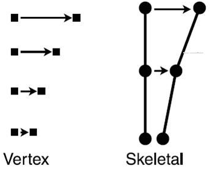
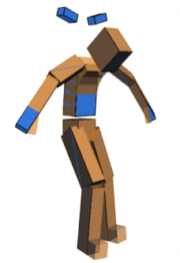
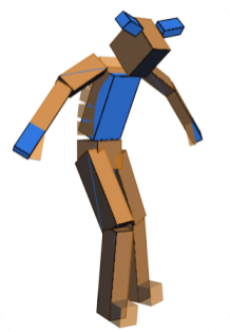
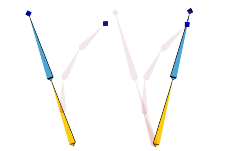
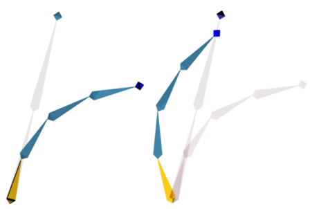
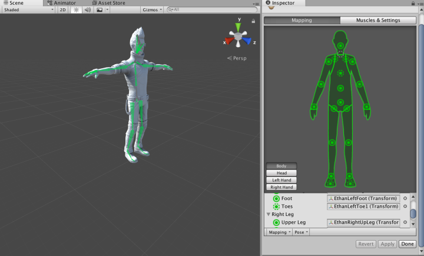
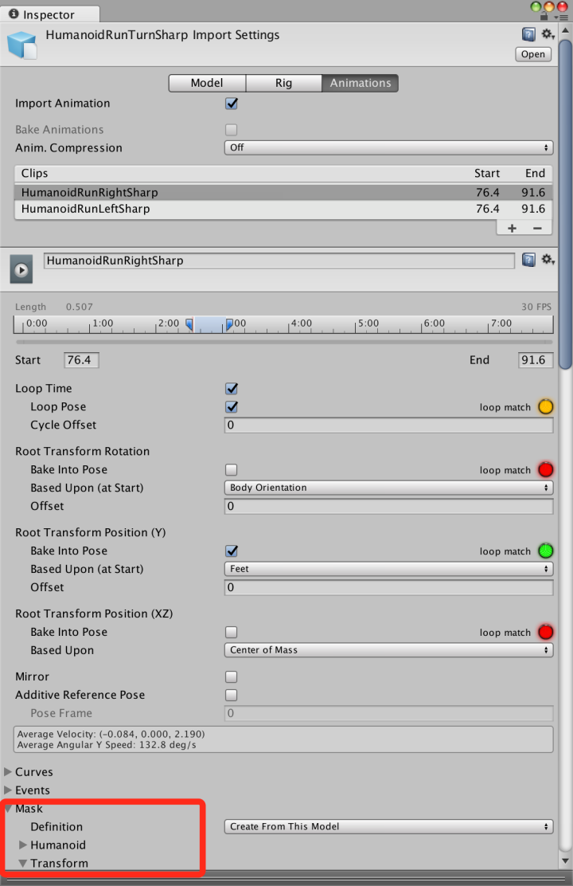
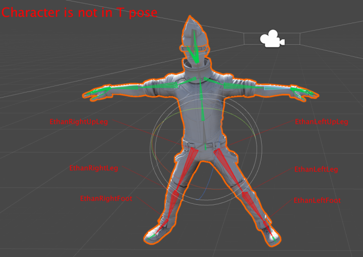

# 动画重定向技术分析

新的手游项目使用Unity引擎，动画部分要使用[重定向技术](https://link.zhihu.com/?target=https%3A//docs.unity3d.com/Manual/Retargeting.html)来实现动画复用。之前在大公司工作的时候对这块了解比较深入，读过Havok引擎在这部分的实现源码，也基于自己的理解在公司自研的手游引擎中实现了一个简化的版本。本文从原理层面分析一下Animation  Retargeting技术的实现方式，然后落回到Unity引擎中，记录一下我们使用Retargeting的时候遇到的问题和解决方法。

## 1. 什么是动画重定向

动画重定向，即Animation Retargeting，是一种动画复用的技术，直观上，你可以把它的作用想象成周星驰电影《西游-降魔篇》里的“听话符”——“我做什么，你就跟我做什么”。

这里给出一个非官方的定义：

> Retargeting is just the process of “copying” the animation from one skeleton to the other.

简单来说，重定向技术就是一种在将动画数据从一个骨架拷贝到另外一个骨架的过程，只是这个所谓的“拷贝”过程，没有Ctrl+C、Ctrl+V这么简单，其实现的方式，也会影响到动画应用到另外一个骨架之后的效果。

## 2. 为什要使用动画重定向

动画重定向技术在很多地方已经得到很广泛的应用，比如目前3A级主机游戏常用的动作捕捉技术就是基于这个原理来实现的——将真实人物   的动作通过图像识别等技术生成动画信息应用到虚拟的角色身上，保存成动画数据。还有Max和Maya这样的建模工具中，也都已经集成了这一技术，用来方便美术把一个动作文件复用到其他骨架上。

那什么样的游戏开发需要这样的技术呢？我们可以假想如果要开发类似《街霸》这样的3D格斗游戏，其中有几十个不同体型姿态各异的角色，战斗过程中会有很多抓技和投技的动作表现，对于这一类型的技能，不同角色的受击动作应该是一致的。

如果使用最常规的制作方法，需要对每一个角色制作攻击动作对应的受击动画，或者需要限制策划设计的受击表现在使用固定姿势、挂接、特效等方式可以实现的范围内。而不甘平庸的策划同学往往需要更加复杂的受击表现，常规的制作方法带来的问题有如下三个方面：

a) 美术工作量较大。 如果有n个不同角色的骨架，有m个需要特殊表现的技能，那么只考虑受击动画就需要m*n个，这个数量级通常会在几千个动作的级别。美术需要制作、导出这些动画文件，需要非常大的工作量。

b)  动画维护困难。  想象下，策划设计了一个需要特殊动作表现的技能，美术加班加点制作出了所有英雄的受击动画，第二天黑着眼圈来上班，策划同学满脸讪笑地走过来说——“哎呀，你看，这个受击动作的第15帧有点不自然，力量感不够强，要你不优化一下？”……每一处修改都需要美术手动同步到其他动作文件上，重新调整导出，这一过程太过费时费力。

c) 游戏发布打包文件过大。 动画文件多必然带来这一问题，尤其是在手游中，包体大小通常是安卓渠道发行的一个需要考虑的重要指标。

而动画重定向技术就是一种时间换空间的思路，在运行时将一套动画根据预计算好的骨骼差异信息，得到目标模型骨架上可以适用的动画数据，就可以生成目标角色的受击动画效果。这种方式既可以减少美术的工作量，又可以增加游戏对策划需求和修改的灵活度，将需要维护和打包的动画数量从m*n这样的平方级别降低到m个。当然，软件工程中“没有银弹”的定律在这里依旧生效，重定向之后的动画可能由于体型差异等问题在某些情况下无法完全满足策划或者美术的要求，这就需要一些额外的方法或者重新制作部分动画来进行弥补，这部分放在后面进行详述。

## 3. 基本原理

写到这里，其实之前有一点没有说明的是动画重定向技术主要是针对骨骼动画的方案，由骨骼来描述动作信息，用蒙皮来表示模型网格与骨骼之间的关系从而得到模型最终的样子。对于这块不熟悉的读者可以自己查阅一下相关的资料。

动画重定向的过程主要是针对骨骼信息，对于蒙皮过程没有任何影响。而动画信息，可以理解为每一帧中所有骨骼数据信息的集合，更加形象地理解，动画就是每一帧为模型制作一个Pose（姿势），在每帧之间的姿势可以通过差值获得。

为了更加清楚地描述动画重定向地原理，我们截取某一帧的姿势来进行分析——在解决了每一帧的姿势重定向之后，整个动画的重定向也就是在每一帧都进行姿势的重定向即可。

假设有两个模型，他们的骨架分别是A和B，我们拥有A骨架对应的动画数据，想把这个动画数据应用在B骨架上。直接应用是否可以？当A骨架和B骨架完全一样的时候，直接应用是可以的，但通常动画重定向要处理的是骨架不太一样的情况。这些不一样的情况有很多种，比如：
a) 骨骼数量不一致；
b) 骨骼父子关系不一致；
c) 骨骼名称不一致；
d) 骨骼本身的长度等数据不一致。

对于前几种不一致情况的处理，我们在基本原理的部分先不进行分析，对于骨骼数量一致、骨骼父子关系也相同这样最为简单的情况下，我们来看一下动画重定向的基本方式。

先明确在这种情况下，直接应用A的动画数据到B上会存在的问题。想象一下，A是一个身高为1.8m左右的大人骨架，而B是一个身高为1.5m左右小孩骨架，A的动画信息记录的骨骼位置（Position）、旋转（Rotation）和缩放（Scale）信息都是针对于大人的，比如经过最终的计算，在Idle动画中的某一帧姿势中，模型空间下A的Head这根骨骼可能在距离地面1.7m这样的位置，而同样的动作让一个小孩B来做，也把Head骨骼放置在1.7m的位置，蒙皮之后的结果会非常奇怪，出现拉伸等问题，因为B的身高整个才是1.5m。

为了解决这个问题，或者说一个正确的动画重定向过程，是基于所谓的参考姿势（Reference   Pose）的。通常情况下，会把T-Pose作为参考姿势。引入参考姿势之后，动画数据不再直接应用到目标骨架上，而是把动画姿势与参考姿势的差异应用到目标骨架上。a1是A骨架的参考姿势，b1是B骨架的参考姿势，动画中某一帧的姿势是a2，我们想得到的结果是b2，我们认为，a2与参考姿势a1的差异应当和b2与其对应的参考姿势b1的差异相同，即：

> a2 - a1 = b2 - b1

我们可以得到计算过程为：

> b2 = a2 - a1 + b1 = a2 + (b1 - a1)

这其中，a1和b1的数据是在游戏发布时就确定的，因此可以进行预先计算好b1-a1的值。要知道这里的加法和减法要转换为每根骨骼的PRS计算，因此还是有不少CPU消耗的。下图给出了使用一个简单整数代替骨骼的PRS数据来模拟动画重定向的计算过程。

从上图可以看出，在Setup阶段，可以计算出b1-a1的值，然后运行时只需要根据动画数据这个diff值就可以得到最终想要的动画效果。这里需要说明的是，在Havok引擎的实现中，会根据a1和b1两个参考姿势中每根骨骼相对于父骨骼的Position计算出骨骼的长度，比如a1中Head骨骼的长度为1.0，b1中Head骨骼的长度为1.5，计算diff的结果时会把这两个值的比例应用到scale部分，即会给scale  * 1.5，来保证最终映射出来骨骼位置的合理性。这部分的实现太过细节，其实只需要做这部分实现的人理解即可，有兴趣的朋友可以留言讨论。

在引擎实现方面，Havok引擎使用了单独的mapping文件来存储b1-a1的数据，并且这部分数据具有一定的可定制性；在我自己后来的实现中，采用的方式是加载模型文件时检查该模型是否需要动画重定向，如果需要则计算一份对应的diff信息放在内存中。两种实现方案的区别不大，只是时间和空间的互换，后者是在需求比较确定，减少美术工作量的考量下选择的实现方式。

总之，基于参考姿势的动画重定向计算，不但可以保证大部分情况下可以有良好的动画效果，而且可以保留目标骨架的一些基本姿势特征，比如驼背、八字脚等，应用得到的话是可以让重定向之后的动画也有这些特种。

## 4. 骨骼映射

前面的基本原理只解决了骨骼长度等数据不一致的情况下的动画重定向问题，在骨骼数量、名称甚至父子关系等都不一致的情况下，该如何处理呢？

对于手游应用者来说，答案很简单——尽量不要出现上述的这些情况。虽然有各种技术方案可以一定程度上处理和解决上述问题，但目前工程方面并没有非常完美的效果，而且可能在性能、制作流程复杂度上导致一些问题。

> 应用动画重定向技术的原则应当是——在项目初期，做好技术预研，确定使用方法，制定从骨骼结构到骨骼名称等相关的美术规范。在中后期引入这一技术的应用，在美术制作不规范的情况下，可能会有较大的额外工作量。

这里，针对不同的问题，给出一些解决方案的思路，某些技术细节实现不进行详细的说明。

### 4.1 骨骼名称不一致

在项目开发中，处于进度的考虑，往往会把不同角色模型和动画的制作外包给不同的外包商，他们对于骨骼的命名可能会不同，比如常见的Biped  Head和Bip001 Head。对于CS骨骼，由于在3DS  Max中通常美术只会添加不同的前缀，因此可以通过去除前缀的方式进行模糊匹配来做骨骼映射；Unity的做法细节不清楚，但是感觉会根据整个骨架的父子关系和结构来进行映射关系的计算；而对于Bone骨骼，在没有预先定义好类似最大化骨骼这样规范的情况下，非常难通过程序来判断映射关系，可以提供可视化编辑的功能来让美术自己定义他们之间的映射关系。

### 4.2 骨骼数量不一致

我们之前讨论的映射关系，都是一根骨骼对应一根骨骼的简单映射方式。在骨骼数量不一致的又可以分为两种情况来讨论：

1. 在非CS骨骼或者不重要的部分存在多余的骨骼。如果动画文件的骨架中存在多余骨骼，通常的做法是把这些骨骼忽略掉，而如果目标骨架上存在多余的骨骼，即有些骨骼原始动画中并不存在，这其实没有办法为他生成动画，只需要保证其保留在原始姿势的local   space当中，即让其跟着父骨骼移动。比如身上的飘带，如果原始动画中没有，在不使用布料系统等物理方案的情况下，只能让其按照参考姿势中的样子，“僵硬”地跟随角色移动。

2. 在重要的位置存在骨骼不一致。一个常见的例子是胸部的脊柱，不同的角色可能脊柱骨骼数量不同，从2根到4、5根都很常见。这种情况下，简单的一根骨骼映射到一根骨骼就无法做到很好的效果，如下图所示（使用Havok文档中的例子）：

   

我们想让蓝色小人变到黄色小人当前的姿势，蓝色小人胸部只有一根骨骼，而黄色小人有5根，那么让这一根骨骼使用黄色小人那5根骨骼中的任何一根结果都不理想，可能会出现如下图所示的这种结果：

这种结果最后渲染出来可能是一个头向前倾斜，但是背依然挺直的角色，它的脖子处的蒙皮被拉得很长。这不是我们想要的效果，如果使用链式映射，可以做到如下图所示的这种较好的结果：

注意，这里同时修复了头顶上的两根骨骼没有跟随父骨骼移动的问题。

链式映射要做的就是将多根骨骼组成的骨链A和另外一个骨骼中多根骨骼组成的骨链B进行映射，做到整条B骨链的样子和A骨链的样子相近。
那么链式映射的基本原理就是：首先对齐起始链骨骼，然后再保持骨链原有样子的条件下，尽量对齐他们的结束骨骼。下图给出了一个简单的示例：

上图把两根骨骼形成的骨骼链接映射到四根骨骼形成的姿势上面。

上图把四根骨骼形成的骨骼链接映射到两根骨骼形成的姿势上面。
那么如何对齐结束骨骼呢？这里只简单描述Havok引擎中的计算方法，首先算出从骨链的开始骨骼到结束骨骼的向量，比如A1，B1，然后将这两个向量规范化，计算可以将B1转到A1最小旋转，这个旋转使用四元数表示，描述了一个和两个向量都垂直的轴外加一个旋转角度Theta值。这个四元数的计算过程可以使用向量的点积、叉积和半角正玄公式、二倍角正玄公式得到，避免了三角函数计算这种很耗的计算过程。下图给出了一个简单的计算过程，可以看出其使用向量计算来进行效率上的优化。

4.3 骨骼父子关系不一致

当两套骨骼的父子关系都不一致的情况下，其实很难得到正确的映射，简单的不一致可能可以容忍，但是可以想象，把一个人形骨骼的动画映射给四足动物甚至蜘蛛这样的八脚动物，是一件非常难做的事情。

也因为这样的原因，目前大范围应用的动画重定向，基本还是在人形骨骼上，当然，用相同的算法，把四足的战马动画映射到不同的体型的战马上，也是可以的，基本的原则是骨架尽量具有更多的相似性，重定向的效果也就会更好。

## 5. Unity引擎中的应用

在了解了基本原理之后，我们来看一下动画重定向技术在工程中的应用。笔者之前使用Havok引擎和实现自研引擎中的相应功能有较多的应用经验，但是Unity引擎还是摸索了一下才找到正确的使用方法，[官方文档](https://link.zhihu.com/?target=https%3A//docs.unity3d.com/Manual/Retargeting.html)给出了一个简单的应用过程和效果截图，但这个文档讲述的过程比较简单，一些注意事项也没有说得很清楚。

### 5.1 基本使用方法

首先，Unity引擎中动画重定向的实现不是一个直观的方法，而是封装在了Humanoid类型的动画系统里面，也就是必须是人形的骨架、使用Humanoid才可以使用它。Unity没有像前文描述的基本原理那样去定义两套骨架之间的映射关系，而是自己在内部定义一套骨架模板，所有的Avatar骨骼都必须映射到这套模板上才可以由同一个Animator来驱动产生Retargeting之后的动画效果。

在导入一个模型文件之后，要在这里设置每根骨骼的映射关系，这个映射关系默认会自动建立一套，可以根据需要进行调整，也可以保存和导入配置好的映射关系。

预览一个重定向之后的动画的效果我没找到非常方便的办法，只能把模型放到Scene中，设置同一个Animator来观察，在动画文件的预览窗口，如果拖拽另外一个模型文件到其中，并不能预览到正确的效果，这跟我之前预想的不太一样。这里简单说明一下整个设置过程，假设我们想让一个female的模型复用一个male的动画：
a) 导入male的模型，设置动画类型为Humanoid，设置好Avatar上的骨骼映射关系；
b) 导入male的动画文件，设置其类型为Humanoid，讲其Avatar设置为male的avatar；
c) 使用male的动画制作一个Animator；
d) 导入female的模型文件，设置动画类型为Humanoid，同样设置好Avatar上的骨骼映射关系；
e) 可以拖拽一个模型文件到Scene中，然后把它的Animator设置为之前male的动画制作的Animator，即可看到Retargeting之后的效果了。

这一过程比较简单，Unity引擎为用户隐藏了非常多的实现细节，让用户在进行尽量少的配置的情况下使用动画重定向功能。

### 5.2 遇到的问题记录

在使用过程中，我们遇到了一些问题。
a) 第一个是角色的武器或者飘带在使用Humanoid类型的动画系统之后不会移动了，或者移动的位置有了很大的偏差。这时候可以在动画文件的属性设置里，查看Mask下的Transform选项，里面可能存在没有被勾选的骨骼。

我们目前的做法是把Transform下的所有骨骼对象都勾选上。

b)   第二个是角色的武器在动作中出现了乱飘的问题，与手部无法紧密地绑定在一起。这是由于我们最初为了方便美术制作武器的动作，把其父骨骼设置给了盆骨这样一根相对稳定的骨骼，但是经过Retargeting计算之后，由于角色身材不同产生了一些偏差导致了这一问题。最终我们还是把武器骨骼的父骨骼设置为手部的骨骼，才解决了这一问题。

c)   某些角色在重定向之后的动画中表现为脚不贴地，和地面之间有缝隙，原始动画中没有这一问题。如果你理解了动画重定向的原理，那么当原始动画没有问题，而重定向之后的动画存在问题，有两种可能——一种是重定向算法存在问题，另外一种是参考姿势存在问题。我们在没有代码授权的前提下无法查看和修改Unity引擎的重定向实现代码，而且Retargeting功能已经发布了这么久，理论上大部分的Bug都应该已经修复了。。。在Avatar的Configuration界面中，除了设置骨骼的映射关系之外，还可以设置T-Pos的姿势，这里我们可以对参考姿势做微调，如下图所示：

注意，Unity定义了一个基本的T-Pos姿势范围，当调整的结果超出范围的时候，会出现红色的提示字样。我们的问题是目标角色的脚步骨骼在参考姿势中没有贴地，导致了重定向之后的问题。当你发现重定向之后的动画有些骨骼的姿势很奇怪，或者想让你的目标角色有一些自己的特有个性(比如外八字脚之类的。。。)的时候，可以在这个界面进行调整。

### 5.3 性能消耗

通过前面的原理分析可以看出，即使在有预计算的情况下，与普通的动画计算，Retargeting的过程还是有一定的CPU消耗的，但是这与通常会造成CPU瓶颈的蒙皮、渲染指令提交等相比，其实消耗并不算大。由于Unity与Retargeting相关的还制作了肌肉控制的功能，我担心这部分会有额外的性能消耗，还专门拜托朋友帮忙询问了Unity大中华区的技术人员，得到的答复是——Humanoid形式的动画系统相对于Generic形式的动画系统虽然有一部分额外的性能消耗，但是Unity内部做了比较好的优化，差别不是很大，因此可以放心使用。我们由于必须使用Retargeting的功能，因此也没有对几套动画系统进行非常详尽的性能对照测试，但从以往游戏开发的经验来看，动画重定向这块通常不会在后期的性能Profile过程中被揪出来要求优化。

总是，虽然动画重定向这套东西已经很熟悉了，但是在Unity中的应用，我们还是摸索的新兵，目前也只是项目的初期，遇到的问题不是很多，如果有朋友有相关的经验可以介绍和分享，还望不吝赐教。

## 6. 其他

如果你去搜Animation Retargeting相关的论文，会发现学术界有很多更加深入的研究，但是很多算法都不适用于当前的游戏开发。而对于差别非常大的骨架，其实也没有必要非要去用重定向的技术，可能美术单独制作动画资源效果会更好。
在之前搜集资料的过程中，读到一篇关于《spore》游戏的论文，觉得比较有意思，[《Real-time Motion Retargeting to Highly Varied User-Created Morphologies》](https://link.zhihu.com/?target=http%3A//slim.chrishecker.com/images/c/cb/Sporeanim-siggraph08.pdf)。有兴趣的可以去读一下，《孢子》这款游戏使用的实时动画系统中就有Animation Retargeting技术的应用，结合IK（反向运动学）技术，实现了游戏中自定制角色的动画表现，效果非常不错，玩过的朋友可能会有印象。

## 7. 结语

动画重定向系统就像很多的游戏引擎组件一样，是一个可能从外部看上去似乎很深奥复杂的功能，但是深入其实现原理，却发现其实非常简单。然而，要把这样一个功能封装成一个易用性很强的引擎模块，让用户可以在不理解原理的情况下去轻松地使用它，却又需要解决很多实际问题，开发各种编辑工具。把一项技术，应用到实际的游戏开发中，就需要这样一个由难入易，再由易到难的过程，这也是做科学研究与做实际工程的区别之一吧。

希望本文可以给需要用到动画重定向技术的朋友以帮助，也欢迎更多的朋友进行讨论和分享。对于游戏开发这样一项工作来说，永远都有学习不完的知识和技术，而技术的积累和沉淀，是把游戏做得更好的有力保障

2017年2月2日，于山东菏泽家中