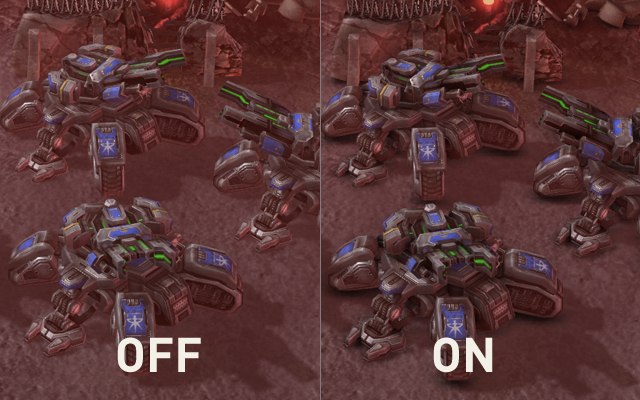
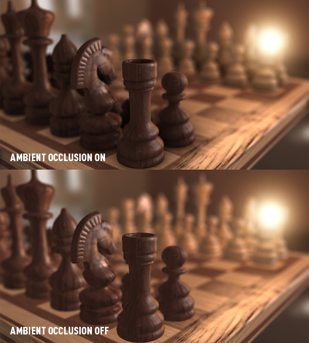

# 五、环境光遮蔽（Ambient Occlusion）

## 

## 【章节概览】

在某种意义上，这篇文章属于环境光遮蔽的启蒙式文章。

环境光遮蔽（Ambient Occlusion），简称AO，是一种用于计算场景中每个点对环境光照的曝光程度的一种着色渲染技术。

本章讲到了如何使用有效的实时环境光遮蔽技术，对物体遮蔽信息及环境进行预处理，综合这些因素给物体创建逼真的光照和阴影。

[
](https://github.com/QianMo/Game-Programmer-Study-Notes/blob/master/Content/%E3%80%8AGPUGems1%E3%80%8B%E5%85%A8%E4%B9%A6%E6%8F%90%E7%82%BC%E6%80%BB%E7%BB%93/media/40edd773a01ff958638b09b69399c75d.png)

图 有无环境光遮蔽的对比

[
](https://github.com/QianMo/Game-Programmer-Study-Notes/blob/master/Content/%E3%80%8AGPUGems1%E3%80%8B%E5%85%A8%E4%B9%A6%E6%8F%90%E7%82%BC%E6%80%BB%E7%BB%93/media/55b2c13bbaece3723db27b76cc5d793e.png)

图 有无环境光遮蔽的对比

## 

## 【核心内容提炼】

5.1 概述

首先，本文中讲到，环境光遮蔽（Ambient Occlusion）一般而言有两种理解：

1）将环境光遮蔽视为“智能”的环境光项，其在模型表面的变化取决于在每点可见多少外部环境。

2）将环境光遮蔽视为一个漫反射项，其能有效地支持复杂分布的入射光线。

文中将考虑上述的第二种解释。

其基本思路是，假如预处理一个模型，计算它上面每个点可以看到多少外部环境，可以相反地计算有多少环境被模型的其他部分遮挡，然后在渲染时使用这个信息计算漫反射着色项的值。其结果是模型上的裂缝变暗，而模型的暴露部分会接收更多的光线，因此更明亮。这种效果实质上比使用标准的着色模型更逼真。

另外，这个方法可以扩展为使用环境光作为照明源，用代表各个方向入射光的环境贴图没来决定物体上每个点光的颜色。为了这个特性，除了记录在点上可以看到多少外部环境之外，也记录大部分可以光从哪个方向到达。这两个量有效地定义了从外面进入场景的未被遮挡的方向圆锥体，可以一起用来做为来自环境贴图的极端模糊的查询，模拟着色点上来自感兴趣的方向圆锥体的全部入射照度。

5.2 预处理步骤（The Preprocessing Step）

给定一个任意的着色模型，环境光遮蔽算法需要知道模型上每点的两个信息：

（1）该点的“可到达度（accessibility）”- 即该点上方半球的哪一部分未被模型的其他部分遮挡;

（2）未被遮挡的入射光的平均方向。

通过下图在平面上说明这两个概念。给定在表面上的点P，其法线为N， P点上半球的2/3被场景中其他几何体遮挡，半球另外的1/3不被遮挡。入射光的平均方向用B表示，其在法线N的右侧。大致来说，在P点的入射光的平均颜色，可以通过求围绕B矢量的未遮挡入射光的圆锥体的平均值得到。

[
](https://github.com/QianMo/Game-Programmer-Study-Notes/blob/master/Content/%E3%80%8AGPUGems1%E3%80%8B%E5%85%A8%E4%B9%A6%E6%8F%90%E7%82%BC%E6%80%BB%E7%BB%93/media/a2d2867bc9c4d8ef88ab6fa4d2b8edec.jpg)

图 可到达度和平均方向的计算

下面贴出的伪代码显示了我们的基本方法。在每个三角形的中心，我们产生一组以表面法线为中心的半球形光线，跟踪每道光线进入场景，记录哪些光线与模型相交，标志不能从环境接收的光线，以及不被遮挡的光线。接着我们计算不被遮挡的光线的平均方向，这给出了入射光平均方向的近似值。（当然，我们计算的方向实际上可能会被遮挡，但我们选择忽略不计这个问题。）

Example 17-1 计算环境光遮蔽量的基本算法伪代码 （Basic Algorithm for Computing Ambient Occlusion Quantities）

```
For each triangle {

	Compute center of triangle
	
	Generate set of rays over the hemisphere there
	
	Vector avgUnoccluded = Vector(0, 0, 0);
	
	int numUnoccluded = 0;
	
	For each ray {
	
		If (ray doesn't intersect anything) {
		
			avgUnoccluded += ray.direction;
			
			++numUnoccluded;
		
		}

	}

	avgUnoccluded = normalize(avgUnoccluded);
	
	accessibility = numUnoccluded / numRays;

}
```

生成这些光线的简单方法是使用拒绝采样法（rejection sampling）：检测在x，y和z为-1到1区间的3D立方体中随机生成的光线，并拒绝不在单位半球中与法线相关的光线。

能通过这次检测的光线方向可视分布理想的光线方向。列表17-2的伪代码表示出了此方法的实现思路。

当然，也可以用更复杂的蒙特卡洛（Monte Carlo）采样法来得到更好的样本方向的分布。

Example 17-2 使用拒绝采样法计算随机方向的算法伪代码（Algorithm for Computing Random Directions with Rejection Sampling）

```
while (true) {

	x = RandomFloat(-1, 1); // random float between -1 and 1
	
	y = RandomFloat(-1, 1);
	
	z = RandomFloat(-1, 1);
	
	if (x * x + y * y + z * z > 1) continue; // ignore ones outside unit
	
	// sphere
	
	if (dot(Vector(x, y, z), N) < 0) continue; // ignore "down" dirs
	
	return normalize(Vector(x, y, z)); // success!

}
```

另外，用图形硬件代替光线追踪软件，有可能加速遮挡信息的计算。

### 

### 5.3 使用环境光遮蔽贴图进行渲染（Rendering with Ambient Occlusion Maps）

使用环境光遮蔽贴图进行着色的基本思想是： 可以直接在着色点处使用之前已计算好的，有多少光线能到达表面的，优质的近似值信息。

影响这个数值的两个因素是：

（1）在此点上方半球的哪个部分不被点和环境贴图之间的几何体遮挡。

（2）沿着这些方向的入射光是什么。

下图显示了两种不同的情况。在左图中，只能看到着色点上面的一小部分分享，由方向矢量B和围绕它的方向圆锥体所表示，该点的可到达度非常低。而在右图中，沿着更大范围的方向有更多的光线到达给定点。

[
](https://github.com/QianMo/Game-Programmer-Study-Notes/blob/master/Content/%E3%80%8AGPUGems1%E3%80%8B%E5%85%A8%E4%B9%A6%E6%8F%90%E7%82%BC%E6%80%BB%E7%BB%93/media/5c503c8789a7c83da26fcf30a9274004.jpg)

图 不同量的可见度的近似（左图：由于附近的几何体的遮挡比较严重，这点得到的照度较小；右图：沿着更宽方向的圆锥体，更大量的光能到达这点，照度较左图更大）

在预处理中计算的可访问性值告诉我们哪一部分半球可以看到环境贴图，而可见方向的平均值给出一个近似方向，围绕它计算入射光。虽然这个方向可能指向一个实际被遮挡的方向（例如，如果半球的两个独立区域未被遮挡，但其余的部分被遮挡，平均方向可能在这两者之间），但在实践中其通常运行良好。

[
](https://github.com/QianMo/Game-Programmer-Study-Notes/blob/master/Content/%E3%80%8AGPUGems1%E3%80%8B%E5%85%A8%E4%B9%A6%E6%8F%90%E7%82%BC%E6%80%BB%E7%BB%93/media/04726bc725a4925858ee0ec280f7796f.jpg)

图 使用可到达度信息和环境贴图渲染的光照场景

[
](https://github.com/QianMo/Game-Programmer-Study-Notes/blob/master/Content/%E3%80%8AGPUGems1%E3%80%8B%E5%85%A8%E4%B9%A6%E6%8F%90%E7%82%BC%E6%80%BB%E7%BB%93/media/1abca2e51d8271166f3dfb2d038028df.jpg)

图 基于此项技术渲染出的对比图

另外需要注意，实时环境光遮蔽的常用廉价方案是预先计算网格表面几个位置的平均可见性值，存储于贴图中，然后将这些值在运行时与图形硬件提供的未遮挡光照相乘。

## 

## 【核心要点总结】

给定一个任意的着色模型，环境光遮蔽算法需要知道模型上每点的两个信息：

1）该点的可到达度（accessibility）。

2）未被遮挡的入射光的平均方向。

文中提出的环境光遮蔽方法，总结起来有三个要点：

- 采用了多种在实践中运行良好的近似方法。
- 主要为预处理操作，将相对昂贵的计算事先准备好，且仅计算在渲染时进行快速着色所需的正确信息。
- 预处理不依赖于光照环境贴图，因此可以轻松使用场景中的动态照明。

## 

## 【本章配套源代码汇总表】

Example 17-1 计算环境光遮蔽量的基本算法伪代码（Basic Algorithm for Computing Ambient Occlusion Quantities）

Example 17-2 使用拒绝采样法计算随机方向的算法伪代码（Algorithm for Computing Random Directions with Rejection Sampling）

Example 17-3 使用可到达度和环境映射进行着色的片元Shader（Fragment Shader for Shading with Accessibility Values and an Environment Map）

Example 17-4 latlong( )函数的定义（The latlong() Function Definition）

Example 17-5 computeBlur( )函数的定义（The computeBlur() Function Definition）

## 

## 【关键词提炼】

环境光遮蔽（Ambient Occlusion）

拒绝采样（Rejection Sampling）

环境光遮蔽贴图（Ambient Occlusion Maps）
