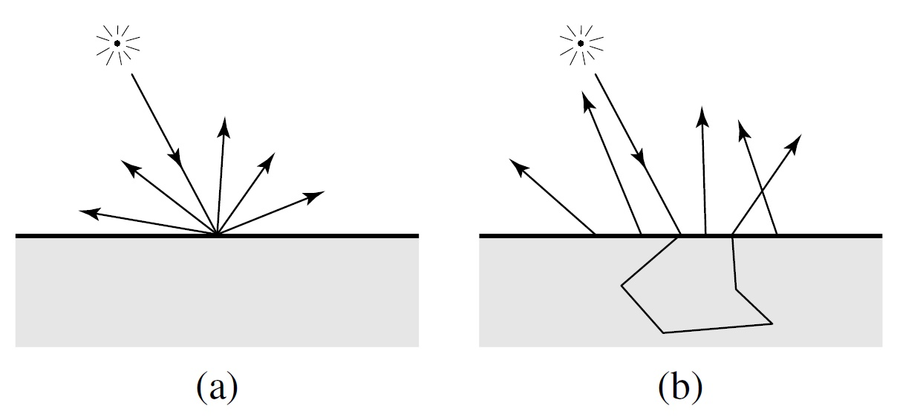
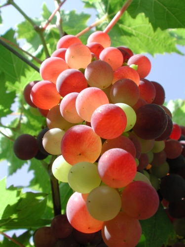
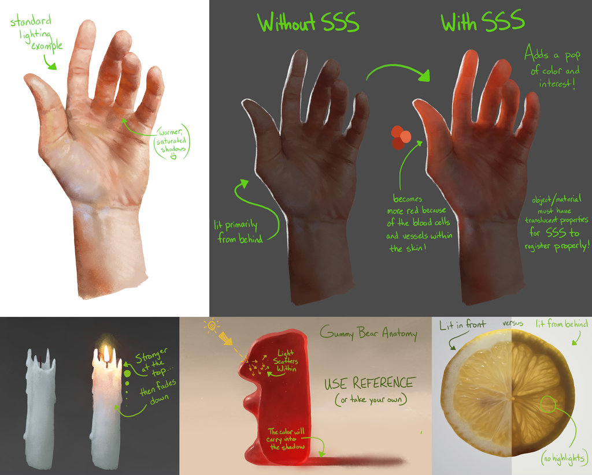
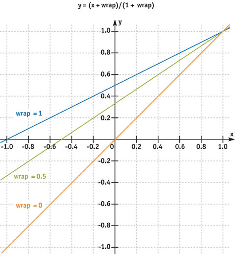
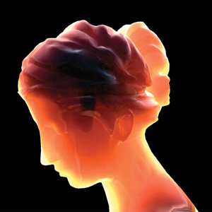

## 【章节概览】

次表面散射（Subsurface Scattering），简称SSS，或3S，是光射入非金属材质后在内部发生散射，最后射出物体并进入视野中产生的现象，即光从表面进入物体经过内部散射，然后又通过物体表面的其他顶点出射的光线传递过程。

[
](https://github.com/QianMo/Game-Programmer-Study-Notes/blob/master/Content/%E3%80%8AGPUGems1%E3%80%8B%E5%85%A8%E4%B9%A6%E6%8F%90%E7%82%BC%E6%80%BB%E7%BB%93/media/99b219a60f13be87fb1d5c3a5f5c2640.jpg)

图 次表面散射原理图示

[
](https://github.com/QianMo/Game-Programmer-Study-Notes/blob/master/Content/%E3%80%8AGPUGems1%E3%80%8B%E5%85%A8%E4%B9%A6%E6%8F%90%E7%82%BC%E6%80%BB%E7%BB%93/media/5a62505ea6f9a07ed45da02a56293531.jpg)

图 真实环境中的次表面散射

要产生使人信服的皮肤和其他半透明材质的渲染效果，次表面散射（Subsurface Scattering）的渲染效果十分重要。

[
](https://github.com/QianMo/Game-Programmer-Study-Notes/blob/master/Content/%E3%80%8AGPUGems1%E3%80%8B%E5%85%A8%E4%B9%A6%E6%8F%90%E7%82%BC%E6%80%BB%E7%BB%93/media/1a4894b4e922183b08800bf9c0bba975.jpg)

图 有无次表面散射的渲染对比图（左图：使用次表面散射 | 右图：无次表面散射）

另外需要提出，在《神秘海域4》中皮肤的渲染效果，很令人惊艳。当然，《神秘海域4》中令人惊艳的，远远不止皮肤的渲染。

[
](https://github.com/QianMo/Game-Programmer-Study-Notes/blob/master/Content/%E3%80%8AGPUGems1%E3%80%8B%E5%85%A8%E4%B9%A6%E6%8F%90%E7%82%BC%E6%80%BB%E7%BB%93/media/62306aa5c58927d62f1c41d7602dabe7.jpg)

图 基于次表面散射的皮肤渲染 @《神秘海域4》

本章即描述了次表面散射的几种实时近似方法，关于皮肤的渲染，也关于近似地去模拟透明材质的几种不同方法。

## 

## 【核心内容提炼】

### 

### 4.1 次表面散射的视觉特性（The Visual Effects of Subsurface Scattering）

要重现出任何视觉效果，经常的做法是考察这种效果的图像，并把可视的外观分解为其组成要素。在观察半透明物体的相片和图像时，能注意到如下几点，即次表面散射（Subsurface Scattering）的视觉特性：

1、首先，次表面散射往往使照明的整体效果变得柔和。

2、一个区域的光线往往渗透到表面的周围区域，而小的表面细节变得看不清了。

3、光线传入物体越深，就衰减和散射得越严重。

4、对于皮肤来说，在照亮区到阴影区的衔接处，散射往往会引起微弱的倾向于红色的颜色偏移。这是由于光线照亮表皮并进入皮肤，接着被皮下血管和组织散射和吸收，然后从阴影部分离开。且散射在皮肤薄的部位更加明显，比如鼻孔和耳朵周围。

[
](https://github.com/QianMo/Game-Programmer-Study-Notes/blob/master/Content/%E3%80%8AGPUGems1%E3%80%8B%E5%85%A8%E4%B9%A6%E6%8F%90%E7%82%BC%E6%80%BB%E7%BB%93/media/1c3686db3992f649486186984097ab07.jpg)

图 次表面散射原理图示

### 

### 4.2 简单的散射近似（Simple Scattering Approximations）

近似散射的比较简单技巧是环绕照明（Warp Lighting）。正常情况下，当表面的法线对于光源方向垂直的时候，Lambert漫反射提供的照明度是0。而环绕光照修改漫反射函数，使得光照环绕在物体的周围，越过那些正常时会变黑变暗的点。这减少了漫反射光照明的对比度，从而减少了环境光和所要求的填充光的量。环绕光照是对Oren-Nayar光照模型的一个粗糙的近似。原模型力图更精确地模拟粗糙的不光滑表面（Nayar and Oren 1995）。

下图和代码片段显示了如何将漫反射光照函数进行改造，使其包含环绕效果。

其中，wrap变量为环绕值，是一个范围为0到1之间的浮点数，用于控制光照环绕物体周围距离。

[
](https://github.com/QianMo/Game-Programmer-Study-Notes/blob/master/Content/%E3%80%8AGPUGems1%E3%80%8B%E5%85%A8%E4%B9%A6%E6%8F%90%E7%82%BC%E6%80%BB%E7%BB%93/media/5b090360792e221b034be0c913e5520c.jpg)

图 环绕光照函数的图表

```
float diffuse = max(0, dot(L, N));

float wrap_diffuse = max(0, (dot(L, N) + wrap) / (1 + wrap));
```

为了在片元函数程序中的计算可以更加高效，上述函数可以直接编码到纹理中，用光线矢量和法线的点积为索引。

而在照明度接近0时，可以显示出那种倾向于红的微小颜色漂移，这是模拟皮肤散射的一种廉价方法。而这种偏向于红色的微小颜色漂移，也可以直接加入到此纹理中。

另外也可以在此纹理的alpha通道中加入镜面反射高光光照的功率（power）函数。可以在示例代码Example 16-1中的FX代码展示了如何使用这种技术。对比的图示如下。

[
](https://github.com/QianMo/Game-Programmer-Study-Notes/blob/master/Content/%E3%80%8AGPUGems1%E3%80%8B%E5%85%A8%E4%B9%A6%E6%8F%90%E7%82%BC%E6%80%BB%E7%BB%93/media/8e182c0fd90d8b0be6d988bc0b7eea25.png)

图 （a）没有环绕光照的球体 （b）有环绕光照明的球体 （c）有环绕光照明和颜色漂移的球体

Example 16-1 摘录纳入了环绕照明的皮肤Shader效果的代码（Excerpt from the Skin Shader Effect Incorporating Wrap Lighting）

```
// 为皮肤着色生成2D查找表（Generate 2D lookup table for skin shading）

float4 GenerateSkinLUT(float2 P : POSITION) : COLOR

{

    float wrap = 0.2;

    float scatterWidth = 0.3;

    float4 scatterColor = float4(0.15, 0.0, 0.0, 1.0);

    float shininess = 40.0;

    float NdotL = P.x * 2 - 1; // remap from [0, 1] to [-1, 1]

    float NdotH = P.y * 2 - 1;

    float NdotL_wrap = (NdotL + wrap) / (1 + wrap); // wrap lighting

    float diffuse = max(NdotL_wrap, 0.0);

    // 在从明到暗的转换中添加颜色色调（add color tint at transition from light to
	dark）

    float scatter = smoothstep(0.0, scatterWidth, NdotL_wrap) *

    smoothstep(scatterWidth * 2.0, scatterWidth,

         NdotL_wrap);

    float specular = pow(NdotH, shininess);

    if (NdotL_wrap <= 0) specular = 0;

    float4 C;

    C.rgb = diffuse + scatter * scatterColor;

    C.a = specular;

    return C;

}

// 使用查找表着色皮肤（Shade skin using lookup table）

half3 ShadeSkin(sampler2D skinLUT,
	
	half3 N,
	
	half3 L,
	
	half3 H,
	
	half3 diffuseColor,
	
	half3 specularColor) : COLOR

{
	
	half2 s;
	
	s.x = dot(N, L);
	
	s.y = dot(N, H);
	
	half4 light = tex2D(skinLUT, s * 0.5 + 0.5);
	
	return diffuseColor * light.rgb + specularColor * light.a;

}
```

### 

### 4.3 使用深度贴图模拟吸收（Simulating Absorption Using Depth Maps）

吸收（Absorption）是模拟半透明材质的最重要特性之一。光线在物质中传播得越远，它被散射和吸收得就越厉害。为了模拟这种效果，我们需要测量光在物质中传播的距离。而估算这个距离可以使用深度贴图（Depth Maps）技术[Hery 2002]，此技术非常类似于阴影贴图(Shadow Mapping)，而且可用于实时渲染。

[
](https://github.com/QianMo/Game-Programmer-Study-Notes/blob/master/Content/%E3%80%8AGPUGems1%E3%80%8B%E5%85%A8%E4%B9%A6%E6%8F%90%E7%82%BC%E6%80%BB%E7%BB%93/media/047d2bbfa6ee469f8aeaf51e2fc8d8e7.jpg)

图 使用深度贴图计算光在物体中的传播的距离

深度贴图（Depth Maps）技术的思路是：

在第一个通道（first pass）中，我们从光源的视点处渲染场景，存储从光源到某个纹理的距离。然后使用标准的投射纹理贴图（standard projective texture mapping），将该图像投射回场景。在渲染通道（rendering pass）中，给定一个需要着色的点，我们可以查询这个纹理，来获得从光线进入表面的点（d_i）到光源间距离，通过从光线到光线离开表面的距离（d_o）里减去这个值，我们便可以获得光线转过物体内部距离长度的一个估计值（S）。如上图。

原文中详细分析了此方法的实现过程，也附带了完整的Shader源码，具体细节可以查看原文，这里因为篇幅原因就不展开了。

[
](https://github.com/QianMo/Game-Programmer-Study-Notes/blob/master/Content/%E3%80%8AGPUGems1%E3%80%8B%E5%85%A8%E4%B9%A6%E6%8F%90%E7%82%BC%E6%80%BB%E7%BB%93/media/993d2fe5db403d1fda14bc6b34de7707.png)

图 使用深度贴图去近似散射，物体上薄的部位传输更多的光

也有一些更高端的模型试图更精确地模拟介质内散射的累积效应。

一种模型是单次散射近似（Single Scattering Approximation），其假设光在材质中只反弹一次，沿着材质内的折射光线，可以计算有多少光子会朝向摄像机散射。当光击中一个粒子的时候，光散射方向的分布用相位函数来描述。而考虑入射点和出射点的菲涅尔效应也很重要。

另一种模型，是近似漫反射（Diffusion Approximation），其用来模拟高散射介质（如皮肤）的多次散射效果。

### 

### 4.4 纹理空间的漫反射（Texture-Space Diffusion）

次表面散射最明显的视觉特征之一是模糊的光照效果。其实，3D美术时常在屏幕空间中效仿这个现象，通过在Photoshop中执行Gaussian模糊，然后把模糊图像少量地覆盖在原始图像上，这种“辉光”技术使光照变得柔和。

而在纹理空间中模拟漫反射[Borshukov and Lewis 2003]，即纹理空间漫反射（Texture-Space Diffusion）是可能的，我们可以用顶点程序展开物体的网格，程序使用纹理坐标UV作为顶点的屏幕位置。程序简单地把[0，1]范围的纹理坐标重映射为[-1，1]的规范化的坐标。

另外，为了模拟吸收和散射与波长的相关的事实，可以对每个彩色通道分为地改变滤波权重。

[
](https://github.com/QianMo/Game-Programmer-Study-Notes/blob/master/Content/%E3%80%8AGPUGems1%E3%80%8B%E5%85%A8%E4%B9%A6%E6%8F%90%E7%82%BC%E6%80%BB%E7%BB%93/media/76bbfaf81bb4cb06992cbcf3c6e9e8b8.png)

图 （a）原始模型 （b）应用了纹理空间漫反射照明的模型，光照变得柔和

[
](https://github.com/QianMo/Game-Programmer-Study-Notes/blob/master/Content/%E3%80%8AGPUGems1%E3%80%8B%E5%85%A8%E4%B9%A6%E6%8F%90%E7%82%BC%E6%80%BB%E7%BB%93/media/d55a3dfa3021ee2bd2b55226425336d8.jpg)

图 基于纹理空间漫反射照明的效果

同样，原文中详细分析了此方法的实现过程，也附带了完整的Shader源码，具体细节可以查看原文，这里因为篇幅原因就不展开了。

再附几张基于次表面散射的皮肤渲染效果图，结束这一节。

[
](https://github.com/QianMo/Game-Programmer-Study-Notes/blob/master/Content/%E3%80%8AGPUGems1%E3%80%8B%E5%85%A8%E4%B9%A6%E6%8F%90%E7%82%BC%E6%80%BB%E7%BB%93/media/833078cc9e0f84f92200760ece973265.jpg)

图 基于次表面散射的皮肤渲染

[
](https://github.com/QianMo/Game-Programmer-Study-Notes/blob/master/Content/%E3%80%8AGPUGems1%E3%80%8B%E5%85%A8%E4%B9%A6%E6%8F%90%E7%82%BC%E6%80%BB%E7%BB%93/media/788fa8515f8f75e2e7ebc3895c6ef222.png)

图 基于次表面散射的皮肤渲染 @Unreal Engine 4

[
](https://github.com/QianMo/Game-Programmer-Study-Notes/blob/master/Content/%E3%80%8AGPUGems1%E3%80%8B%E5%85%A8%E4%B9%A6%E6%8F%90%E7%82%BC%E6%80%BB%E7%BB%93/media/d80656c686f1468e8f8c756d739eaada.jpg)

图 基于次表面散射的皮肤渲染 @《神秘海域4》

[
](https://github.com/QianMo/Game-Programmer-Study-Notes/blob/master/Content/%E3%80%8AGPUGems1%E3%80%8B%E5%85%A8%E4%B9%A6%E6%8F%90%E7%82%BC%E6%80%BB%E7%BB%93/media/b4bd512d5067f2981cdff2f780efd503.jpg)

图 基于次表面散射的皮肤渲染 @《神秘海域4》

## 

## 【核心要点总结】

文中提出的次表面散射的实时近似方法，总结起来有三个要点：

1） 基于环绕照明（Warp Lighting）的简单散射近似，Oren-Nayar光照模型。

2） 使用深度贴图来模拟半透明材质的最重要特性之一——吸收（Absorption）。

3）基于纹理空间中的漫反射模拟（Texture-Space Diffusion），来模拟次表面散射最明显的视觉特征之一——模糊的光照效果。

## 

## 【本章配套源代码汇总表】

Example 16-1 摘录纳入了环绕照明的皮肤Shader效果的代码（Excerpt from the Skin Shader Effect Incorporating Wrap Lighting）

Example 16-2 深度Pass的顶点Shader代码（The Vertex Program for the Depth Pass）

Example 16-3　深度Pass的片元Shader代码（The Fragment Program for the Depth Pass）

Example 16-4　使用深度贴图来计算穿透深度的片元Shader代码（The Fragment Program Function for Calculating Penetration Depth Using Depth Map）

Example 16-5　用于展开模型和执行漫反射光照的顶点Shader代码（A Vertex Program to Unwrap a Model and Perform Diffuse Lighting）

Example 16-6 用于漫反射模糊的顶点Shader代码（The Vertex Program for Diffusion Blur）

Example 16-7 用于漫反射模糊的片元Shader代码（The Fragment Program for Diffusion Blur）

## 

## 【关键词提炼】

皮肤渲染（Skin Rendering）

次表面散射（Subsurface Scattering）

纹理空间漫反射（Texture-Space Diffusion）

环绕照明（Warp Lighting）

深度映射（Depth Maps）
