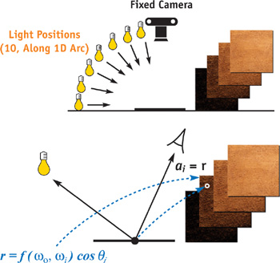

# 近似的双向纹理函数（Approximate Bidirectional Texture Functions）

## 

## 【章节概览】

本章介绍的内容关于如何较容易地采集和渲染的真实材质，如布料、羊毛和皮革等的技术。这些材质难以用早先的技术渲染，它们基本来与兼得的纹理映射。本章的目标是在采集上花费少量的努力，在渲染上花费少量的技术，但是仍然达到真实的外观。

## 

## 【核心要点】

本章介绍了一种可以只用少量图像就进行采集和渲染空间变化的复杂材质的方法。这种经验的方法并不是采集真实的BRDF，而是仅仅展示了细微表面的结构如何引起照明的改变：且BRDF在随后使用。而使用这项技术的实时渲染可以容易地实现。

本文的方法以Kautz等在2004年的工作为基础。根据观测，在某种情况下，表面的材质可以通过少许图像采集，产生的结果类似于完整的双向纹理函数（Bidirectional Texture Functions,BTF）所达到的。用这个近似的BTF渲染总共只需1对一个简单的着色模型求值，并执行一个对体纹理的查询即可。渲染在图形硬件上很容易达到实时的帧速率，并在多种材质上都达到了引人注目的结果。

图  采集的方法概览。上图：裁剪光的方向不同，视点固定正交的图像，产生一些着色图。下图：对于每张图像，计算平均反射出的辐出度（即平均亮度）。在渲染时，通过一些用户定义的照明模型计算（如Phong）计算r值，并使用该值根据平均亮度，逐片段地查找进入图像栈。最后，用光源的亮度缩放这个值。

图 羊毛毛衣（a）基于完整的BTF完成（b）基于本文方法。

（a）图是用完整的BTF完成的（6500个图像，用主元分析（Principle Components Analysis, PCA）压缩成16个成分）。右图是用本章的技术做的。看得出来主要的差别在一些入射角上。

## 

## 【关键词】

服饰的渲染（Clothing Rendering）

双向纹理函数（Bidirectional Texture Functions，BTF）
