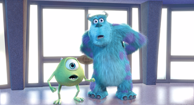
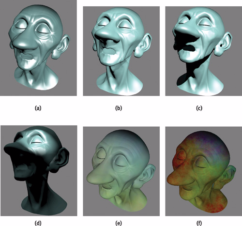

# 电影级光照（Cinematic Lighting）

## 

## 【章节概览】

本章中介绍了一个的简化的uberlight（可理解为“全能光照”）实现，此光照shader根据Ronen Barzel(1997,1999)提出的照明模型编写而成。而该模型的超集已由Pixar动画开发，并应用于《玩具总动员》、《怪物公司》、《海底总动员》等一系列的迪士尼电影中。

本章所对该光照模型的尝试，旨在提供一套全面的光照控制参数，以涵盖灯光美术师日常使用的大部分效果。

[
](https://github.com/QianMo/Game-Programmer-Study-Notes/blob/master/Content/%E3%80%8AGPUGems1%E3%80%8B%E5%85%A8%E4%B9%A6%E6%8F%90%E7%82%BC%E6%80%BB%E7%BB%93/media/4f66cfe65ba506676cdde671bf7da6da.png)

图 《怪物公司》 中cookies对窗户效果的贡献

## 

## 【核心要点】

首先，该章中呈现的Shader只模拟光照场景光源的形成和控制，不包括如何模拟表面细节和光反射行为的复杂性。

大体上，用于电影产品的照明模型会进行两种操作，类似于显示在这里的伪代码：

```
color illuminationModel()

{

    Computer the surface characteristic

    For each light

    {

		Evaluate the light source （评估光源）

		Compute the surface response（计算表面响应）

    }

}
```

首先，通过这些方式计算表面着色信息：运行各种纹理查找（texture lookups），在网格上插值（interpolating values over the mesh），计算程序模式（computing procedural patterns）等。然后在照明物体的每个光源上循环，计算出它的贡献。我们通过对每个光线计算光的颜色，然后计算表面对照明的响应来进行上述操作。

原文中给出了一个Shader源代码，该Shader用于计算塑料（plastic）材质在只有一个光源贡献的反射模型。，可以很容易将它扩展为更通用的多光源和更多表面的解决方案。

该Shader为美术师提供了各个方面的照明控制：选择（指定物体是否响应接受光照），颜色，形状，阴影和纹理，而阴影选项中包括明暗度、色调、反射、阴影贴图、阴影模糊等参数。

下面两幅图说明了uberlight 的使用效果。照明来自Pixar短片“Geri's Game”中的人物头部。

[
](https://github.com/QianMo/Game-Programmer-Study-Notes/blob/master/Content/%E3%80%8AGPUGems1%E3%80%8B%E5%85%A8%E4%B9%A6%E6%8F%90%E7%82%BC%E6%80%BB%E7%BB%93/media/a78bfaa0fe79b7be546cebed07799194.png)

图 （a）Geri 由一个光源照明；（b）改变光的权重，修改反射高光对比度；（c）改变阴影颜色，加强阴影；（d）改变谷仓形状（类似窗户一样的遮挡物），创建更戏剧化的姿态；（e）使用一块模糊的纹理cookie，丰富图像；（f）夸大透射的cookie的对比，创建像外星人一样的效果

[
](https://github.com/QianMo/Game-Programmer-Study-Notes/blob/master/Content/%E3%80%8AGPUGems1%E3%80%8B%E5%85%A8%E4%B9%A6%E6%8F%90%E7%82%BC%E6%80%BB%E7%BB%93/media/efab0e56de0f5ff7bec800a5c0517d9b.png)

（a）常态 （b）黑色电影（noir）的高反差 （c）柔和的光线

## 

## 【本章配套源代码汇总表】

10-1. The Vertex Program for an Uberlight-Like Shader

10-2. The Fragment Program for an Uberlight-Like Shader

## 

## 【关键词提炼】

电影级光照（Cinematic Lighting）

全能型光照（Uberlight）

照明模型（Lighting Model）

储存于本地的光照数据（Light Cookies）
