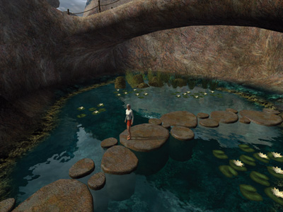
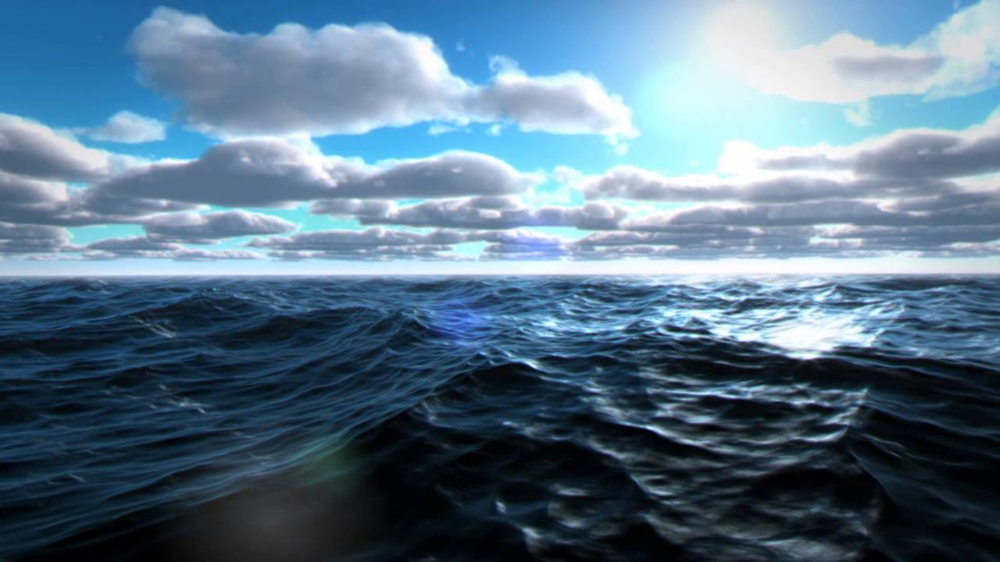
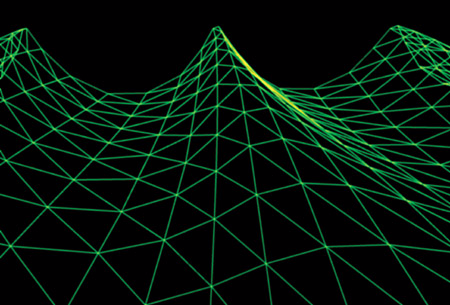
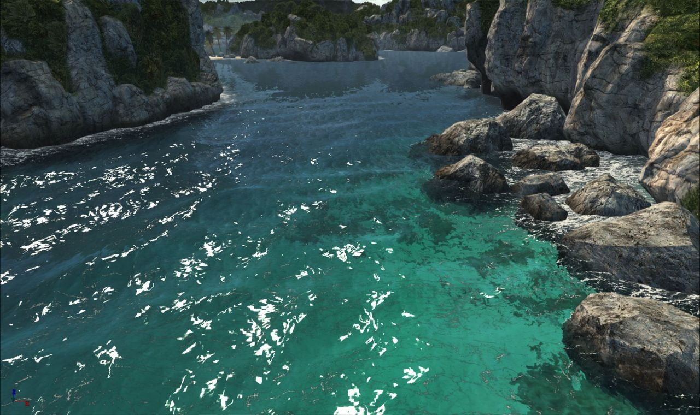

# 一、 用物理模型进行高效的水模拟（Effective Water Simulation from Physical Models）

## 

## 【内容概览】

本章介绍了在GPU中模拟和渲染大型水体的一些方法，并且提出了改进反射的一些有用技巧。

文章由计算简单的正弦函数之和来对水面进行近似模拟开始，逐步扩展到更复杂的函数如Gerstner波，也扩展到像素着色器。主要思路是使用周期波的加和，来创建动态的平铺（tiling）凹凸贴图，从而获得优质的水面细节。

这章也集中解释了水体渲染与模拟系统中常用参数的物理意义，说明了用正弦波之和等方法来近似水面的要点。

图 基于文中水体技术渲染的Uru:Ages Beyond Myst中的场景

## 

## 【核心内容提炼】

### 

### 1.1 背景与范围

《GPU Gems 1》出版于2004年，在这几年间，实时渲染技术渐渐从离线渲染领域中分离，自成一派。

而《GPU Gems 1》中收录的这篇文章问世期间时，快速傅里叶变换（Fast Fourier Transform，FFT）库已经能用于顶点和像素着色器中。同时，运行于GPU上的水体模拟的模型也得到了改进。Isidoro等人在2002年提出了在一个顶点着色器中加和4个正弦波以计算水面的高度和方位的思路。另外，Laeuchi在2002年也发表了一个使用3个Gerstner波计算水面高度的着色器。

图 基于快速傅里叶变换的水体渲染

### 

### 1.2 水体渲染的思路

文中对水体渲染的思路，运行了两个表面模拟：一个用于表面网格的几何波动，另一个是网格上法线图的扰动。这两个模拟本质上是相同的。而水面高度由简单的周期波叠加表示。

正弦函数叠加后得到了一个连续的函数，这个函数描述了水面上所有点的高度和方向。在处理顶点时，基于每个顶点的水平位置对函数取样，使得网格细分形成连续水面。在几何分辨率之下，将该技术继续应用于纹理空间。通过对近似正弦叠加的法线取样，用简单像素着色器渲染到渲染目标纹理（render target texture），从而产生表面的法线图。对每帧渲染法线图，允许有限数量的正弦波组相互独立地运动，这大大提高了渲染的逼真度。

而直接叠加正弦波产生的波浪有太多的“簸荡（roll）”，而真实的波峰比较尖，波谷比较宽。事实证明，正弦函数有一个简单的变体，可以很好地控制这个效果。

#### 

#### 1.2.1 波的选择

对于每个波的组成，有如下几个参数需要选择：

- 波长Wavelength (L)：世界空间中波峰到波峰之间的距离。波长L与角频率ω的关系为 ω=2π/L。
- 振幅Amplitude (A)：从水平面到波峰的高度。
- 速度Speed (S)：每秒种波峰移动的距离。为了方便，把速度表示成相位常数 φ=S x 2π/L。
- 方向Direction (D)：垂直于波峰沿波前进方向的水平矢量。

波的状态定义为水平位置（x，y）和时间（t）的函数：

图 单个波函数的参数

而包括所有的波i的总表面是：

为了提供场景动力学的变量，我们将在约束中随机产生这些波的参数，随着时间的变化，我们会不断将某个波淡出，然后再以一组不同的参数将其淡入。且此过程的这些参数是相关联的，必须仔细地产生一套完整的参数组，才能使各个波以可信的方式进行组合。

#### 

#### 1.2.2 法线与切线

因为我们的表面有定义明确的函数，所以可以直接计算任意给定点处的曲面方向，而不是依赖于有限差分技术。

副法线（Binormal）B和正切矢量T分别是x和y方向上的偏导数。 对于2D水平面中的任意点（x，y），表面上的三维位置P为：

求副法线（Binormal）B方向，即对上式对x方向求偏导。而求正切矢量T方向，即对上式对y方向求偏导。

而法线N由副法线B和切线T的叉积给出：

### 

### 1.3 波的几何特征

首先文中将几何波限制为4个，因为添加更多的波并不能增加新的概念，只不过增加更多相同的顶点Shader处理指令和常数而已。

**1.3.1 方向波或圆形波的选择**

需要对下图所示的方向波或圆形波进行选择。

图 方向波和圆形波

对于两种类型的波，视觉特性和复杂性都是由干涉条纹引起的。

方向波需要的顶点shader处理指令较少，但是究竟选择何种波需要取决于模拟的场景。对于大的水体，方向波往往更好，因为它们是风吹动产生的波较好的模型。对于较小的池塘的水，产生波的原因不是由于风，而是诸如例如瀑布，水中的鱼，圆形波则更好一些。对于方向波，波的方向是在风向的一定范围内任意绘制的；对于圆形波，波中心是在某些限定的范围内任意绘制的。

#### 

#### 1.3.2 Gerstner波

正弦波看起来圆滑，用于渲染平静的，田园诗般的池塘很合适。而对于粗犷的海洋，需要形成较尖的浪头和较宽的浪槽，则可以选择Gerstner波。

Gerstner波早在计算机图形学出现之前就已经被研发了出来，用于物理学基础上为海水建模。Gerstner波可以提供一些表面的微妙运动，虽然不是很明显但是却很可信（具体可以见[Tessendorf 2001]）。

另外，Gerstner波有一种经常被忽略的性质：它将顶点朝着每个浪头顶部移动，从而形成更尖锐的波峰。因为波峰是我们水表面上最锐利的（即最高频率，最主要）特征，所以我们正希望顶点可以集中在此处。

图 Gerstner波

图 基于Gerstner渲染出的水面 @Unreal Engine 4

#### 

#### 1.3.3 波长等参数的选择

波长等参数的选择方法：

- 波长的选择，要点是不要追求波在真实世界中的分布，而是要使用现在的少数几个波达到最大效果。对波长相似的波进行叠加可以突显水面的活力。于是文中选择中等的波长，然后从它的1/2至两倍之间产生任意波长。
- 波的速度，通过波长，基于公式即可计算得出。
- 振幅方面，主要是在Shader中指定一个系数，由美术同学对波长指定对应的合适振幅。
- 波的方向，运动方向与其他参数完全独立，因此可以自由选择。

### 

### 1.4 波的纹理特征

加和到纹理中的波也像上文说到的顶点一样需要参数化，但是其具有不同的约束条件。首先，在纹理中得到宽频谱更为重要。其次，在纹理中更容易形成不像天然波纹的图案。第三，对给定波长只有某些波方向能保证全部纹理的平铺（tiling）。也就是说，不像在世界空间中仅仅需要注意距离，在纹素（texel）中要注意所有的量。

文中的思路是在2到4个通道中，使用15个频率和方位不同的波进行处理。虽然4个通道听起来有点多，但是它们是进行256 x 256分辨率的渲染目标纹理的处理，而不是处理主帧的帧缓冲。实际上，生成法线贴图的填充率所造成的影响小到可以忽略不计。

### 

### 1.5 关于深度

首先，把在顶点上的水深度作为一个输入参数，这样，在着色器碰到岸边这样的微妙区域时，便可以自动进行校正。

因为水的高度需要计算，所以顶点位置的z分量就没什么用了。虽然我们可以利用这点来压缩顶点的数据量，但是选择把水深度编码在z分量中，是一个更好的选择。

更确切地说，就是把水体底部的高度放在顶点的z分量中，作为常数带入水的高度表中，这样通过相减，即可得到水深度。而同样，这里假定了一个恒定高度的水位表（constant-height water table）。

我们也使用水深度来控制水的不透明度、反射强度和几何波振幅。简单来说，即水浅的地方颜色浅，水深的地方颜色深。有了适当的水深度，也就可以去光的传播效果进行更完善的建模。

图 真实感水体渲染效果图 @Unreal Engine 4

## 

## 【核心要点总结】

文中提出的水体渲染方法，总结起来有三个要点：

1）使用周期波（正弦波、Gerstner波）的加和

2）创建动态的平铺（tiling）贴图

3）使用凹凸环境映射（Bump-Environment Mapping）

【本章配套源代码汇总表】

文中并没有贴图相关代码，但原书配套CD提供了完整的源代码和项目工程，具体代码和工程可以查看：

<https://github.com/QianMo/GPU-Gems-Book-Source-Code/tree/master/GPU-Gems-1-CD-Content/Natural_Effects/Water_Simulation>

## 

## 【关键词提炼】

水的模拟（Water Simulation）

水的渲染（Water Rendering）

正弦函数近似加和（Sum of Sines Approximation）

Gerstner波（Gerstner Waves）

凹凸环境映射（Bump Environment Mapping）
