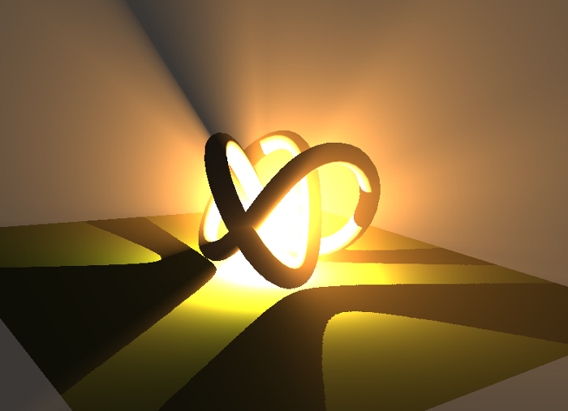

# 高效的阴影体渲染（Efficient Shadow Volume Rendering）

## 

## 【章节概览】

这章全面讲述了用于实时阴影渲染中常见两种流派之一的阴影体（Shadow Volumes）技术，又称模板阴影（Stencil Shadows）技术，重点是得到正确的角度的情形，减少几何图形和填充率的消耗。

## 

## 【核心要点】

当时id software的《Doom 3》就是采用阴影体（Shadow Volumes）技术来对阴影进行的渲染。具体思想是在模板（stencil）缓冲标记阴影的像素，把像素分为阴影或照明两种类型，接着调节负责光照的像素程序，使阴影像素的照明贡献度为0。

阴影体技术可以为点光源、聚光灯和方向光源创建清晰的、逐像素进度的阴影。单个物体可以被多个光源照亮，而且光有任意颜色和衰减度。阴影从三角形网格投射到深度缓冲区上。这意味着被遮挡的物体，可以是带有深度缓冲区的网格、公告板、粒子系统或预先渲染的场景。

较其他运算相比，阴影体可以更好地处理许多制作困难的阴影场景，如一个插在万圣节南瓜灯内部的光源。

图 阴影体技术可以很好胜任的渲染场景

阴影体的缺点是对那些没能正确表达自身形状的网格的阴影表达效果并不理想。如一些带透明区域的公告板，粒子系统，或带alpha粗糙度的纹理网格（如一片树叶）。这些投影体基于他们的真实网格产生阴影，阴影与物体的真实形状并不匹配。而阴影体的另一个缺点是对带裂缝的网格支持不太好。文中也表示，当时阴影体运行的理想场景是顶部俯视。

图 模型上的裂缝会让影子穿过空气漏出来

总之，这篇文章对McGuire等人2003年提出的方法进行了很好的描述、分析与实践。而在这篇文章发出之后的若干年，阴影体技术得到了各种进一步地优化与改进。

## 

## 【本章配套源代码汇总表】

Example 9-1 程序结构伪代码（Program Structure Pseudocode）

Example 9-2 glFrustum风格的无限投影矩阵（An Infinite Projection Matrix in the Style of glFrustum）

Example 9-3 用于从示例光源中“挤”出 w＝0顶点的顶点着色器代码（A Vertex Shader for Extruding w = 0 Vertices Away from the Example Light）

Example 9-4 （The markShadows Method）

Example 9-5 findBackfaces方法（The findBackfaces Method）

Example 9-6 renderShadowCaps方法（The renderShadowCaps Method）

Example 9-7 renderShadowSides方法（The renderShadowSides Method）

## 

## 【关键词提炼】

阴影渲染（Shadow Rendering）

阴影体（Shadow Volume）/ 模板阴影（Stencil Shadows）

多通道渲染（Multipass Rendering）
