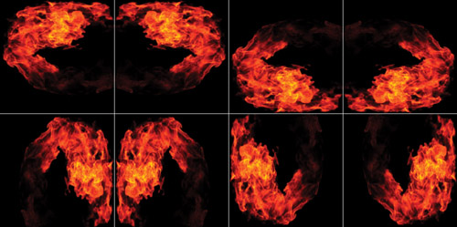

# Vulcan Demo中的火焰渲染（Fire in the "Vulcan" Demo）

## 

## 【章节概览】

这章讲述了GeForce FX 5900上市时的Demo “Vulcan”中的火焰渲染技术。其中的技术并非真正的物理模拟，而是对当时的工业标准电影《指环王》的离线技术的跟进。通过文中改进，突破了光栅化大量粒子时操作性能的限制，产生了真实可信的火焰图像。

图 基于本章方法实现的"Vulcan" Demo的截图

## 

## 【核心要点】

首先文章尝试了两个方案：

完全程序化的火焰（ fully procedural flames）和屏幕空间基于变形的二维火焰（screen-space 2D distortion-based flames.），经过试验都未达预期。

于是改采用视频纹理精灵（video-textured sprites ），最终达到预期，并实现出了逼真的火焰，且占用很少的GPU资源。

图 用于创建火焰效果的连续镜头

其中，烟的生成使用粒子系统创建一个烟雾生成器。而所需的光照可以采用不同的技术达到，如光线投射。

图 程序式地产生烟

而火焰和烟的混合，比较常规地使用相加混合（additive blending）。

关于使火焰增加多样性，文中使用了水平和垂直翻转（沿着u和v轴）。而使用任意旋转可以更加具表现力。

图 由自定义纹理坐标生成的变体

## 

## 【本章配套源代码汇总表】

Example 6-1. 最终的实现Shader代码（The Final Shader）

## 

## 【关键词提炼】

火焰渲染（Fire Rndering）

完全程序化的火焰（fully procedural flames）

屏幕空间基于变形的二维火焰（screen-space 2D distortion-based flames）

视频纹理精灵（video-textured sprites ）
