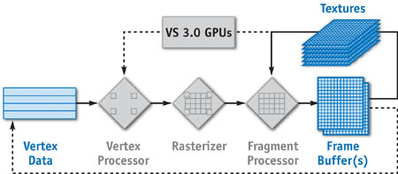

# GPU通用计算：流式编程与存储体系（General-Purpose Computation on GPU）

## 

## 【内容概览】

本节是原书中第IV部分”Part IV: General-Purpose Computation on GPUS: A Primer”的精华提炼版。

## 

## 【核心内容提炼】

### 

### 2.1 流式计算（Stream Computation）

首先，CPU不适合用于许多高性能应用程序的部分原因是其采用了串行编程模型(serial programming model)，无法在应用程序中利用并行性（parallelism）和通信模式（communication patterns）。而GPU采用了流式编程模型（stream programming model），本节中将讲到该模式允许高效计算和通信的方式来构造程序[Kapasi et al. 2003]，且它是今天GPU编程的基础。

#### 

#### 2.2.1 流式编程模型

在流式编程模型中，所有数据都表现为流（stream）。我们把流定义为具有相同数据类型的数据有序集。数据类型可以是简单的（整数或浮点数流）或复杂的（点或三角形或变换矩阵流）。流可以是任意长度，如果流很长（流中有上百或者更多的元素），那么流上的操作效率将很高。流上允许的操作包括复制，从中导出子流，用一个单独的索引流索引入，以及用核在其上执行计算。

**核（kernel）**操作整个流，获取一个或多个流作为输入并产生一个或多个流作为输出。核的定义特征是它操作多个流上所有元素而不是单个元素。对核最典型的用途是对输入流的每个元素用函数进行求值（“映射（map）”操作）。例如，变换核可以将一个点组成的流（a stream of points）中的每个元素投影到一个不同的坐标系中。其他常见的核操作，包括扩展expansions（为每个输入元件产生一个以上的输出元素），缩减reductions（把一个以下元素合并为单个输出元素）以及过滤filters（输出元素的一个子集）。

**核的输出**仅可能是该核输入的函数，并且在核之内，对流元素的计算从不依赖于在其他元素上的计算。这些制约有两个主要好处。首先，当写核（或编译）时，核执行所需要的数据完全已知。因此，当他们的输入元素和中间计算数据储存在局部或是仔细控制的全局引用时，核可以非常高效。其次，在一个核之内对不同的流元素需要独立计算，这运行把看起来像串行核计算的内容映射到数据并行的硬件。

在流式编程模型中，通过把多个核串联在一起来构建应用程序。例如，在流式编程模型中实现图形流水线需要写一个顶点程序核、三角形汇编核、剪切核等，然后把一个核的输出连接到下一个核的输入。下图显示了整个图形流水线是怎样映射到流式模型的。这个模型明确了核之间的通信，利用了图形流水线固有的核之间的数据局部性。

图 将图形流水线映射成流式模型（Stream Model） 【图形流水线的流式化，把所有数据表达成流（由箭头表明），所有计算表达成核（由框表明）。图形流水线中的用户可以编程和不可编程阶段都可以表达成核。】

图形流水线在几方面都很好地匹配了流式模型。图形流水线传统上被构造为多个计算阶段，由阶段之间的数据流连接。这个结构近似于流式编程模型的流和核的抽象。图形流水线中阶段之间的数据流是高度局部化的，一个阶段产生的数据立刻被下一个阶段所消耗；在流式编程模型中，流在核之间的穿行也显现出相似的行为。而且在流水线的各个阶段所调用的计算在不同的图元之间一般是一致的，使这些阶段很容易映射成核。

### 

### 2.2 GPU存储器模型

#### 

#### 2.2.1 存储器体系结构

下图演示了CPU和GPU的存储器体系结构。GPU的存储器系统结构。GPU的存取器建立了现代计算机存储器体系结构的一个分支。GPU与CPU类似，有它自己的cache和寄存器来加速计算中的数据访问。然而，GPU自己的主存储器也有它自己的存储器空间——这意味着在程序运行之间，程序员必须明确地把数据复制入GPU存储器。这个输入传统上是许多应用程序的一个瓶颈，但是新的PCI Express总线标准可能使存储器在CPU和GPU之间共享在不远的将来变得更为可行。

图 CPU和GPU的存储器体系结构

#### 

#### 2.3.2 GPU与CPU元素类比

这一小节将传统的CPU计算概念和它们对应的GPU概念上做一些非常简单的类比总结，以方便更好的理解GPU的概念：

- 流：GPU纹理 = CPU数组 (Streams: GPU Textures = CPU Arrays)
- 核：GPU片段程序 = CPU“内循环” (Kernels: GPU Fragment Programs = CPU "Inner Loops")
- 渲染到纹理 = 反馈 (Render-to-Texture = Feedback)
- 几何体光栅化 = 计算的调用 ( Geometry Rasterization = Computation Invocation)
- 纹理坐标 = 计算的域 (Texture Coordinates = Computational Domain)
- 顶点坐标 = 计算的范围 (Vertex Coordinates = Computational Range)

#### 

#### 2.2.3 GPU流类型

与CPU存储器不同，GPU的存储器有一些用法的限制，而且只能通过抽象的图形编程接口来访问。每个这样的抽象可以想象成不同的流类型，各个流类型有它自己的访问规则集。GPU程序员可以看到这样的3种流类型是顶点流、帧缓冲区流和纹理流。第四种流类型是片段流，在GPU里产生并非完全消耗，下图演示了一个现代GPU的流水线，3个用户可以访问的流，以及在流水线中它们可以被用到的地点。

图 现代GPU中的流【GPU程序员可以直接访问顶点、帧缓冲和纹理。片段流由光栅器产生，并被片段处理器消耗。它们为片段程序的输入流，但完全是在GPU内部建立和消耗的，所以对程序员来说是不能直接访问的。】

##### 

##### 1.顶点流（Vertex Streams）

顶点流通过图形API的顶点缓冲区指定。这些流保存了顶点位置和多种逐顶点属性。这些属性传统上用作纹理坐标、颜色、法线等，但它们可以用于顶点程序的任意输入流数据。

在一开始，顶点程序不允许随机索引它们的输入顶点。在《GPU Gems 2》出版的时候，顶点流的更新还只能通过把数据从CPU传到GPU来完成。GPU不允许写入顶点流。而当时的的API增强已经使GPU可以对顶点流进行写入。这是通过“复制到顶点缓冲区”或“渲染到顶点缓冲区”来完成的。其中，在前一种技术，“复制到顶点缓冲区”中，渲染结果将从帧缓冲区被复制到顶点缓冲区；而在后一种技术“渲染到顶点缓冲区”中，渲染结果直接写入顶点缓冲区。而当时增加的GPU可写顶点流技术，使GPU首次可以把来自流水线末端的结果，直接接入流水线的起始。

##### 

##### 2.片段流（Fragment Streams）

片段流由光栅器产生，并被片段处理器消耗。它们是片段程序的输入流，但是因为它们完全是在图形处理器内部建立和消耗，所以它们对程序员来说是不能直接访问的。片段流的值包括来自顶点处理器的所有插值输出：位置、颜色、纹理坐标等。因为有了逐顶点的流属性，传统上使用纹理坐标的逐片段值现在可以使用任何片段程序需要的流值。

需要注意的是，片段程序不能随机访问片段流。因为允许对片段流随机访问，会在片段流之间产生依赖，因此打破了编程模型的数据并行保证。而如果某算法有对片段流进行随机访问的要求，这个流必须首先被保存到存储器，并转换为一个纹理流（texture stream）。

##### 

##### 3.帧缓冲区流（Frame-Buffer Streams）

帧缓冲区的流由片段处理器写入。其传统上被用作容纳要显示到屏幕的像素。然而，流式GPU计算帧缓冲区来容纳中间计算阶段的结果。除此之外，现代的GPU可以同时写入多个帧缓冲区表面（即多个RGBA缓冲区）。

片段或顶点程序都不能随机地访问帧缓冲区的流。然而，CPU通过图形API可以直接对其进行读写。通过允许渲染pass直接写入任意一种类型的流，当时的API已经开始模糊帧缓冲区、顶点缓冲区和纹理的区别。

##### 

##### 4.纹理流（Texture Streams）

纹理是唯一一种可以被片段程序和Vertex Shader 3.0 GPU顶点程序随机访问的GPU存储器。如果程序员需要随意地索引入一个顶点、片段或帧缓冲区流，其必须首先将它转换成一个纹理。纹理可以被CPU或GPU读取和写入。GPU通过直接渲染到纹理而非帧缓冲区，或把数据从帧缓冲区复制到纹理存储器来写入纹理。

纹理被声明为1D、2D或3D流，并分别为1D、2D或3D地址寻址。一个纹理也可以声明为一个立方图（cubemap），可以被看做6个2D纹理的数组。

#### 

#### 2.2.4 GPU核的存储器访问

顶点和片段程序是现代GPU的两架马车。

顶点程序在顶点流（vertex stream）元素上操作，并将输出送到光栅器（rasterizer）。

片段程序在片段流（fragment streams）上操作，并把输出写入帧缓冲区（frame buffers）。

这些程序的能力由它们能执行的运算操作和它们能访问的存储器所定义。GPU核中可用的多种运算操作接近于在CPU上可用的操作，然而有很多的存储器访问限制。如同先前描述的，大部分这些限制是为了保证GPU必须的并行性以维持它们的速度优势。然而，其他的限制是进化中的GPU体系结构造成的，有不少已经在目前得到解决。

另一个访问模式是：指针流（pointer streams）[Purcell et al. 2002]。指针流源于可以使用任意输入流作为纹理读取地址的能力。下图演示了指针流是简单的流，其值是内存地址。如果从纹理读取指针流，则这种能力称为依赖纹理（dependent texturing）。

图 用纹理实现指针流
