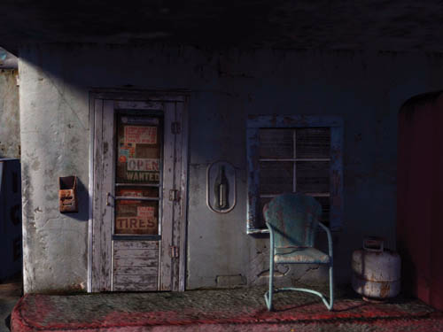
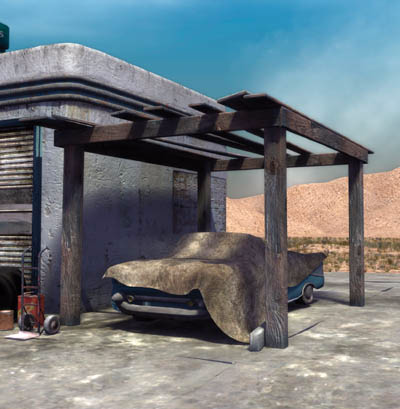

# 十六、使用遮挡区间映射产生模糊的阴影（Generating Soft Shadows Using Occlusion Interval Maps）

## 

## 【章节概览】

这章介绍了一种渲染软阴影的技术，称为遮挡区间映射（Occlusion Interval Maps），能够正确地在静态场景中渲染出光源沿着预定路径移动时产生的模糊阴影。之所以叫遮挡区间映射，是因为此算法使用纹理贴图来存储这种光源可见、而本身被遮挡的区间。

## 

## 【核心要点】

对于需现实的加油站的Demo，文章一开始本打算使用一种预计算的可见度技术，例如球谐光照（Spherical Harmonic Lighting [Sloan et al. 2002]）来实现，但可惜的是无法达到目的，因为球谐光照适用的是非常低频的光照，不适用于像太阳那样小面积的光源。所以后来才开发出遮挡区间映射这种新的预计算可见度的技术，它能够支持实时太阳照射的软阴影。通过把问题简化为在固定轨道上的线性光源来达到目的。

需要注意，遮挡区间映射（Occlusion Interval Maps）技术有一些局限性，只对沿固定轨道传播的单条光线的静态场景适用。这意味着它对人物和其他动态物体的阴影无效。但是其适用于静态户外场景中的阴影渲染。并且此技术因为遮挡区间映射对每个通道需要8位的进度，纹理压缩将导致视觉效果失真。因此，必须禁用纹理压缩，从而增加了纹理用量。

使用遮挡区间映射（Occlusion Interval Maps）技术，通过损失一定运行性能来获得在静态场景上实时运行的软阴影算法。遮挡区间映射（Occlusion Interval Maps）可以用作静态光照贴图的替代品，从而实现动态效果，可以得到从日出到日落光照明变化的动态效果。如下图。

图 加油站入口

注意加油站墙上的阴影在图形的左上方有清楚的边界，但是它朝着右下方变得模糊而柔软。这种相联系的清晰和模糊的变化是真实感软阴影的重要性质，而这是由遮挡区间映射得到的。

图 汽车上方的木板在篷布上形成的阴影

上图中汽车篷布上的木板形成了复杂的阴影。这对算法来说是最坏的情况。这些木头条使得篷布上的遮挡区间映射必须存储在5个不同的纹理中，对于场景中的大多数物体，4个纹理就足以取得所有的阴影。

## 

## 【本章配套源代码汇总表】

Example 13-1使用遮挡区间映射计算软阴影的实现函数（Function for Computing Soft Shadows Using Occlusion Interval Maps）

## 

## 【关键词提炼】

阴影渲染（Shadow Rendering）

软阴影（Soft Shadows ）

遮挡区间映射（Occlusion Interval Maps）
