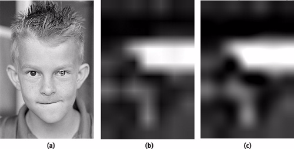

# 高品质的图像滤波（High-Quality Filtering）

## 

## 【章节概览】

这章描述了图像滤波和可以用于任意尺寸图像的效果，并将各种不同的滤波器核心（kernel），在分析计算后应用于各式2D和3D反走样问题中。

## 

## 【核心要点】

GPU可以提供一些快速滤波的访问纹理的方法，但是仅限于几种类型的纹理过滤，并不是对每种纹素格式都适用。若我们自己建立自己的图像滤波方法，可以得到更好的质量和灵活性，但需要了解硬件和程序滤波之间存在的质量和速率的矛盾。

对滤波图像所考虑的内容也同样适用于3D渲染，尤其是把模型纹理化（光栅化）的时候，即把3D数据（和潜在的纹理信息）转换为一个新的2D图像的时候。

而混合过滤方法（Hybrid filtering approaches）可以提供一个最佳的中间路径，即借助硬件纹理单元解析的着色。

GPU着色程序不同于CPU的主要之处在于：一般来说，CPU数学操作比纹理访问更快。在像RenderMan这样的着色语言中，texture()是最费时的操作之一，而在GPU中的情形恰恰相反。

图像滤波（ image filtering）的目的很简单：对于给定的输入图像A，我们想要创建新的图像B，把源图像A变换到目标图像B的操作就是图像滤波。最一般的变换是调整图像的大小、锐化、变化颜色，以及模糊图像等操作。

源像素的模式，以及它们对图像B像素的相对共享，就称为滤波的核心（filter kernel）。而把核心御用到源图像的过程叫做卷积（convolution）：即使用特殊的核心卷积源图像A的像素，创建新图像B的像素。

如果核心只是把像素简单地进行平均，我们称这个模型为盒式滤波器（box filter），因为模型是一个简单的长方形（所有像素都在盒中）。每个采样的纹素（即，从纹理来的一个像素）的权重相等。盒式滤波器很容易构造，运行速度快，是GPU中硬件驱动过的一种滤波核心。

如果我们正好使用小的核心，可以把它作为参数直接代入Shader，下图显示的样本代码执行 3 x 3的滤波运算，对编入索引的纹素和其临近单元，赋予W00到W22的加权值，先求加权和，然后除以预计算的总和值（Sum）把它们重规范化。

图 中心在W11的3x3滤波核心的像素布局

我们可以自己定义各种核心，如可以基于两个常数的3 x 3核心做边缘检测，后文也接着讲到了双线性滤波核心（Bilinear Kernel），双立方滤波核心（Bicubic Filter Kernel），屏幕对齐的核心（Screen-Aligned Kernels）等内容。

双线性和双立方滤波的效果。（题外话：不知道为什么，看这个小男孩，莫名觉得长得像冠希哥……）

(a)原始图像，注意眼睛上方的长方形。(b)用线性滤波把矩形的子图像区域放大32倍；(c)用双立方滤波把相同的区域放大32倍。

## 

## 【本章配套源代码汇总表】

Example 24-1. 读取九个纹素来计算一个加权和的着色器代码（Reading Nine Texels to Calculate a Weighted Sum）

Example 24-2. 将九个纹素减少到三个的着色器代码（Nine Texel Accesses Reduced to Three）

Example 24-3. 使用点积，紧凑书写示例24-2中的代码（As in Listing 24-2, Compactly Written Using Dot Products）

Example 24-4. 最紧凑的形式，使用预先合并的float4权重（The Most Compact Form, Using Pre-Coalesced float4 Weights）

Example 24-5. 边缘检测像素着色器代码（Edge Detection Pixel Shader）

Example 24-6. 使用灰度辅助纹理的边缘检测着色器代码（The Edge Detection Shader Written to Use Grayscale Helper Textures）

Example 24-7. 用于生成浮点内核纹理的OpenGL C ++代码（OpenGL C++ Code for Generating a Floating-Point Kernel Texture）

Example 24-8. 使用内核纹理作为Cg函数（Using the Kernel Texture as a Cg Function）

Example 24-9. 过滤四行纹素，然后将结果过滤为列（Filtering Four Texel Rows, Then Filtering the Results as a Column）

Example 24-10. 原生条纹函数（Naive Stripe Function）

Example 24-11. 基于条纹覆盖量返回灰度值的条纹函数（Stripe Function that Returns Grayscale Values Based on the Amount of Stripe Coverage）

Example 24-12. 简单的像素着色器来应用我们的滤波条纹函数（Simple Pixel Shader to Apply Our Filtered Stripe Function）

Example 24-13. 使用条纹纹理进行简单的条带化（Using a Stripe Texture for Simple Striping）

Example 24-14. 用亮度控制条纹函数的平衡（Using Luminance to Control the Balance of the Stripe Function）

Example 24-15 HLSL .fx指令产生变条纹纹理（HLSL .fx Instructions to Generate Variable Stripe Texture）

Example 24-16 在像素着色器中应用可变条纹纹理（Applying Variable Stripe Texture in a Pixel Shader）

## 

## 【关键词提炼】

高品质图像滤波（High-Quality Filtering）

边缘检测（Edge Detection）

双线性滤波（Bilinear Filtering）

双三次滤波（Bicubic Filtering）

三次滤波（Cubic Filtering）
