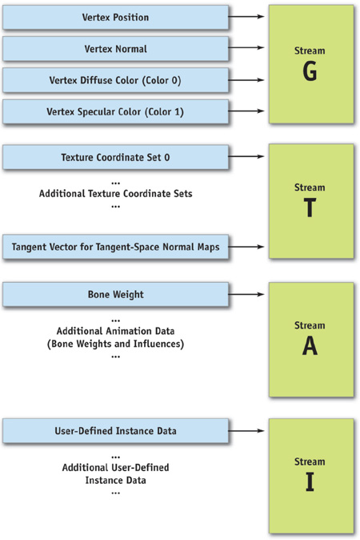
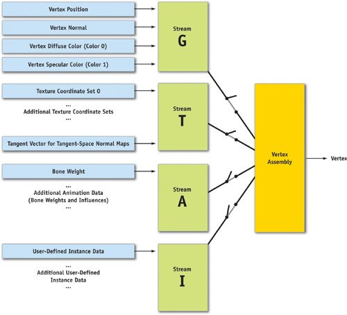

# 用多流来优化资源管理（Optimizing Resource Management with Multistreaming）

## 

## 【章节概览】

现代实时图形应用程序最困难的问题之一是必须处理庞大的数据。复杂的场景结合多通道的渲染，渲染起来往往会较为昂贵。

首先，多流（Multistreaming）技术由微软在DirectX 8.0中引入。而这章介绍了一种用多流来优化资源管理的解决方案，可以用来处理庞大的数据，且在每个通道中只传输当前需要的顶点分量。

## 

## 【核心要点】

这章介绍了当前的应用程序如何克服由于场景中几何体数据的增加所引起的问题。文中的讨论基于一个使应用程序对数据有更多控制的灵活模型—多流（Multistreaming），

这个方案联合了两项强大的技术，已经在名为Gothic III的引擎中实现：一些顶点缓冲区通过多流联合，而且所有顶点缓冲区都由一个优化的资源管理器控制。

此方法的好处是：带宽有时可能受限于系统内存和GPU之间的总线，因为传输了重复或多余的数据，而现在此方法为数据有效地控制了带宽。

图 顶点流的四种类型

G – 用于几何体数据的顶点流。包含顶点位置、法线和(多个)顶点颜色。

T – 用于纹理映射数据顶点流。包含纹理坐标系和附加数据，如正切空间法线映射的正切向量。

A – 用于动画数据的顶点流。包含动画数据，如骨骼权重和相关因素。

I – 用于实例数据的顶点流。 包含顶点流频率实例数据。

而这四种流的子集结合起来可以处理不同的任务，如下图。

图 组合当前需要的流

- 渲染没有动画的网格

可能的流组合： G或者G+T

- 渲染有动画的网格

可能的流组合： G+A或者G+T+A

- 渲染实例的网格（可选包含动画）

可能的流组合：G+I或G+T+I（可选：G+A+I或G+T+A+I）

- 渲染纯的Z通道(可选有或者没有实例，可选有或没有动画)

可能的流组合 G（可选 ：G+A 或 G+I 或 G+A+I）

原文中对上述的思路用DirectX 9.0c进行了实现。

## 

## 【关键词】

资源管理（Resource Management）

多流（Multistreaming）

顶点流（Vertex stream）
