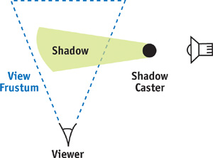

# 逐像素光照的可见性管理（Managing Visibility for Per-Pixel Lighting）

## 

## 【章节概览】

这章讲到了可见性在逐像素渲染光照场景中的作用，也考虑如何使用可见性减少必须渲染的批次数量，从而改善性能。

## 

## 【核心要点】

如下伪代码说明在一个场景中必须渲染的批次数：

```
For each visible object

  For each pass in the ambient shader

    For each visible batch in the object

      Render batch

For each visible light

  For each visible shadow caster

    For each pass in the shadow shader

      For each shadow batch in the object

        Render batch

  For each lit visible object

    For each pass in the light shader

      For each visible batch in the object

        Render batch
```

正如伪代码所述，为了减少批次数，可以进行一些与非可见性相关的优化。最应该优化的是渲染每个光照所必须的通道数。批次数随通道数线性增加，因此，我们应该最小化受限于CPU的游戏通道数。

我们可以使用可见性来减少批数。其中，为了减少批次，各个部分（可见部分、光源部分、光照部分、阴影部分）的集合分开讨论并生成。

可见性不仅能有效改善CPU的性能，也同样可以改善GPU的性能。对模板体执行逐像素光照时，填充率的消耗（模板体的填充或多次渲染大的物体）很快就变成了瓶颈，但可以使用剪切矩形（scissor rectangle）限制显卡渲染的面积，解决此问题。

逐像素的照明需要大量的批次数和极高的填充率，所以要减少渲染的物体数和它们影响的屏幕面积。而使用这章中介绍的标准可见性算法和技术，可以充分改善运行性能。

[
](https://github.com/QianMo/Game-Programmer-Study-Notes/blob/master/Content/%E3%80%8AGPUGems1%E3%80%8B%E5%85%A8%E4%B9%A6%E6%8F%90%E7%82%BC%E6%80%BB%E7%BB%93/media/fc2c00c1db06777ab92c1c859f037e96.jpg)

图 不在可见集合中的对象可能会影响渲染场景

## 

## 【本章配套源代码汇总表】

Example 15-1 说明一个场景中必须渲染的批次数量的伪代码（pseudocode illustrates the number of batches that must be rendered in a scene）.

Example 15-2：快速生成凸包的伪代码（pseudocode for quickly generate the convex hull）

## 

## 【关键词提炼】

逐像素光照（Per-Pixel Lighting）

可见性管理（Managing Visib1ility）

性能优化（Performance Optimization）

批次（Batch）
