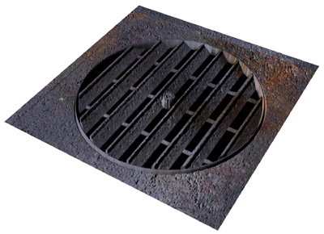

# 使用距离函数的逐像素位移贴图（Per-Pixel Displacement Mapping with Distance Functions）

## 

## 【章节概览】

距离贴图（distance map）是一种在像素着色器中给对象添加小范围位移映射的技术。这章中详细介绍了使用距离函数的逐像素位移贴图（Per-Pixel Displacement Mapping with Distance Functions）技术。

## 

## 【核心要点】

这章中提出了距离贴图（Distance Mapping）/距离函数（Distance Functions）的概念，是一种基于隐式曲面光线追踪的位移映射快速迭代技术（a fast iterative technique for displacement mapping based on ray tracing of implicit surfaces）。实际表明，距离函数中包含的信息，允许我们在光线远离表面时前进更大的距离，并保证不会跨得太远以至于在渲染的几何体上产生缝隙。实现的结果非常高效：会在很少的迭代次数内收敛。

文中将位移贴图（Displacement Mapping）作为光线追踪问题来处理，首先从基础表面上的纹理坐标开始，然后计算观察光线与移动表面相交处的纹理坐标。 为此，文中预先计算了一个三维距离贴图，该贴图给出了空间点和位移表面之间距离的度量。距离贴图为我们提供了与光线快速相交所需的所有信息。 最终，算法在保持实时性能的同时显着增加了场景的感知几何复杂度。

图 使用文中所讨论的位移贴图方法渲染出的滤栅。

## 

## 【关键词】

距离贴图（Distance Mapping）

距离函数（Distance Functions）

位移贴图（Displacement Mapping）
