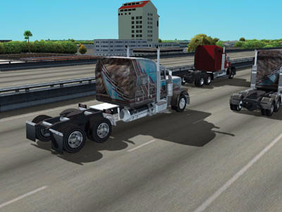

# 透视阴影贴图（Perspective Shadow Maps: Care and Feeding）

## 

## 【章节概览】

透视阴影贴图（Perspective Shadow Maps, PSMs）是由Stamminger和Drettakis在SIGGRAPH 2002上提出的一种阴影贴图（Shadow Maps）流派的方法。

透视投影贴图方法的基本思想是，为了减少或消除阴影贴图的失真走样，对投射到大像素区域的物体取最大的阴影贴图纹素密度。

这章提出了一种优化透视阴影贴图（Perspective Shadow Maps）方法的新思路，对其三种缺陷都一一进行了改进。

## 

## 【核心要点】

这章首先讲到动态阴影的创建，目前主要有两个算法流派：

- 阴影体（shadow volumes）/模板阴影（stencil shadows）
- 阴影贴图（Shadow Maps）

阴影体和阴影贴图算法之间的不同之处在于，是涉及到物体空间（object space）还是图像空间（image space）。

- 阴影体（Shadow Volumes）是物体空间（Object  Space）的阴影算法，通过创建表示阴影遮挡的多边形结构来工作，这意味着我们始终具像素精确但较“硬”的阴影。此方法无法处理没有多边形结构的对象，比如经过alpha测试修改的几何图形或经过位移映射的几何体（displacement mapped geometry）。此外，绘制阴影体需要大量的填充率，这使得很难将它们用于密集场景中的每个对象上，特别是在存在多个灯光时。
- 阴影贴图（Shadow Maps）是图像空间（Image  Space）的阴影算法，它可以处理任何物体（如果能够渲染一个物体，就能得到它的阴影），但是存在走样（aliasing，锯齿）的问题。走样时常发生在有较宽或全方位光源的大场景中。问题在于阴影映射中使用的投影变换会改变阴影贴图像素的大小，因此摄像机附近的纹理像素变得非常大。因此，我们必须使用巨大的阴影贴图（四倍于屏幕分辨率或更高）来实现更高的质量。尽管如此，阴影贴图在复杂场景中却比阴影体要快得多。

透视阴影贴图（Perspective Shadow Maps, PSMs）是由Stamminger和Drettakis在SIGGRAPH 2002上提出的一种阴影贴图（Shadow Maps）流派的方法，通过使用在投射后空间（post-projective  space）中的阴影贴图来去除其中的走样，而在投射后空间中，所有近处的物体都比远处的大。不幸的是，使用原始算法很困难，因为只有要某些情况下才能正常工作。

以下是透视阴影映射算法的三个主要问题和解决方案：

1、当光源在摄像机后面的时候，有一个虚拟的摄像机锥体。若在锥体内保持所有潜在的阴影投射体，阴影质量就会变得很差。

解决方案：是对光源矩阵使用特别的投射变换，因为投射后空间可以使用某些在通常空的世界空间中不能做的投射技巧。它使我们可以建立特殊的投射矩阵，可以看做“比无限远更远”。

2、光源在摄像机空间中的位置对阴影质量影响很大，对于垂直的方向光，完全没有走样问题，但是当光源朝向摄像机并迎面靠近它时，阴影映射走样就很严重。

解决方案：把整个单位立方体保持在一个阴影贴图纹理中，对于遇到的问题，有两个办法，每个办法仅解决问题的一部分：单位立方体裁剪法，把光源摄像机对准单位立方体的必要部分；立方体映射法，使用多个纹理来存储深度信息。

3、最初的文章没有讨论过偏置（bias）问题。偏置是随透视阴影贴图而带来的问题，因为纹素的面积以不均匀方式分布，这意味着偏置不再是常量，而是与纹素的位置有关。

解决方案：使用在世界空间中的偏置（而且不再分析双投射矩阵的结果），然后把这个世界空间偏置转换到投射后空间。

图 得到的阴影实时渲染结果（多边形10w ~ 50w个，分辨率1600x1200）。

## 

## 【本章配套源代码汇总表】

Example 14-1计算立方体阴影纹理坐标（Shader Code for Computing Cube Map Texture Coordinates）

Example 14-2在顶点Shader中计算偏置（Calculating Bias in a Vertex Shader）

Example 14-3 紧邻百分比过滤的顶点Shader伪代码（Vertex Shader Pseudocode for PCF）

Example 14-4 用于紧邻百分比过滤的像素Shader伪代码（Pixel Shader Pseudocode for PCF）

## 

## 【关键词提炼】

阴影渲染（Shadow Rendering）

阴影贴图（Shadow Maps）

透视阴影映射（Perspective Shadow Maps，PSMs）

紧邻百分比过滤（percentage-closer filtering ，PCF）

单位立方体裁剪法（Unit Cube Clipping）
