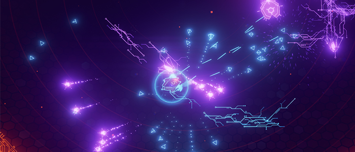
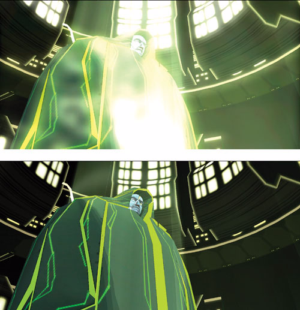
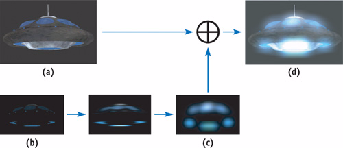
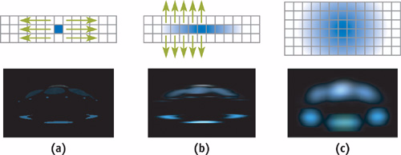
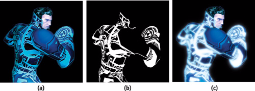
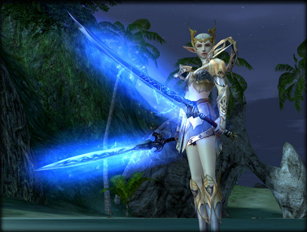
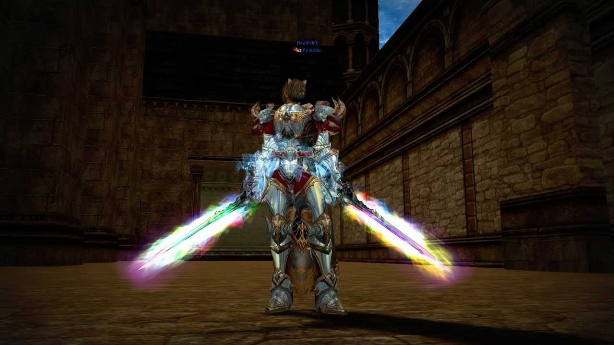

# 六、实时辉光（Real-Time Glow）

## 

## 【章节概览】

这章讲到2D光照效果中的辉光（Glow）和光晕（Halo），展示了如何通过图像处理方法完全地改善画面及3D人物的渲染感官。

图 游戏中的Glow结合Bloom，得到出色的画面效果

图 Unreal Engine的logo，即是采用了Glow效果

## 

## 【核心内容提炼】

光源的辉光（Glow）和光晕（Halo）是自然界导出可见的现象，他们提供了亮度和气氛强烈的视觉信息。

图 给强化后的武器加上Glow效果，该武器显得更加强力 @TERA

图 强化武器的Glow效果的演变 @Lineage II

图 Glow效果 @Unreal Engine 4

在观看计算机图形、胶片和印刷品时，到达眼睛的光强度是有限的，因此，辨别光源强度的唯一方法是通过它们周围产生的辉光（Glow）和光晕（Halo），具体可以参考[Nakamae et al. 1990]。这些辉光可以再现强烈光线的视觉效果，并使观察者感知非常明亮的光源。即使物体周围的微妙光晕也会让人觉得它比没有光辉的物体更亮。

在日常生活中，这些发光和光晕是由大气中或我们眼中的光散射引起的（Spencer 1995）。 使用现代图形硬件，可以通过几个简单的渲染操作来再现这些效果。 这使得我们可以使用明亮而有趣的物体来填满实时渲染的场景，物体会显得更为逼真或更具表现力，并且这是克服图形渲染中传统的低动态范围图形过于平庸的优雅手段之一。

图 有辉光和没有辉光的一个Tron 2.0中的角色对比

有几种方法可以创建场景中的辉光。对于小的类似的点，可以把一个平滑的“辉光”纹理应用到公告牌几何体上，而让公告板几何体在屏幕范围内跟随物体运动。

对于大的辉光源或复杂的辉光形状，要创建辉光，最好对2D场景的渲染进行后处理。这章重点讲到了后处理的实时辉光处理方法。如下图。

图 场景实时辉光的步骤

（a）正常地渲染场景 （b）涂抹所渲染的辉光源，以产生（c）中的一个辉光纹理，将其加到正常的场景画面中，以产生（d）中最终的辉光效果。

渲染后处理辉光的步骤：

Step 1、辉光的指定和渲染（Specifying and Rendering the Sources of Glow）

Step 2、模糊辉光源（Blurring the Glow Sources）

Step 3、适配分步卷积（Adapting the Separable Convolution）

Step 4、在GPU上进行卷积（Convolution on the GPU）

图 有效地创建模糊的两步分解法

上图展示了如何有效地创建模糊的两步分解法：首先，在一根轴上模糊于（a）中的辉光源的点，产生（b）中所示的中间结果，然后在另一个轴上模糊这个结果，产生显示在（c）中的最终模糊。

图 有辉光和无辉光的Tron 2.0中的英雄 Jet

（a）用标准方法渲染3D模型 （b）为一个由美术同学创建的辉光源纹理的渲染，目的是指定辉光面积的图案和强度（c）为将辉光应用到标准的渲染结果后，得到的富有表现力的英雄角色效果。

另外，在辉光中使用的这个卷积和模糊方法还可以用于多种其他效果。它能用来计算景深效果的不同聚焦度，景深的信息可以用来控制模糊度。它也能用来模糊投影的纹理阴影的边缘，并且累积深度阴影映射的接近百分比过滤（percentage-closer filtering ）结果。

而大面积的卷积能被应用于一个环境映射，以创建一个近似的辐照度映射，从而得到更逼真的场景照明（Ramamoorthi和Hanrahan 2001有相关论述）。用大面积的卷积也可以实现许多非真实感渲染技术和其他的特别效果。其中包括镀着霜的玻璃、模拟衍射的透镜摇曳，以及渲染皮肤时用的近似次表面散射。

大片的模糊和卷积能有效地在多种图像硬件上实时地计算，而处理和创建这些效果的代码可以容易地封装成几个C++类或一个小库。

总之，屏幕辉光是一种很赞的效果，能够容易地扩展到几乎每一种情形，并且变化多端，通过其还够延伸创建出很多其他的效果。最终的效果虽然细微但却有张力，值得在各种游戏中采用。

图 Glow效果 @Unreal Engine 4

图 有了Glow效果的武器，显得更强力

## 

## 【核心要点总结】

渲染后处理辉光的步骤：

Step 1、辉光的指定和渲染（Specifying and Rendering the Sources of Glow）

Step 2、模糊辉光源（Blurring the Glow Sources）

Step 3、适配分步卷积（Adapting the Separable Convolution）

Step 4、在GPU上进行卷积（Convolution on the GPU）

## 

## 【本章配套源代码汇总表】

Example 21-1.设置抽样八个邻居的纹理坐标的Direct3D顶点着色器代码（Direct3D Vertex Shader to Set Texture Coordinates for Sampling Eight Neighbors）

Example 21-2. 相加八个加权纹理样本的Direct3D像素着色器代码（Direct3D Pixel Shader to Sum Eight Weighted Texture Samples）

Example 21-3. 建立邻域采样的Direct3D顶点着色器代码（Direct3D Vertex Shader Program to Establish Neighbor Sampling）

Example 21-4. 建立邻域采样的Direct3D像素着色器代码（Direct3D Pixel Shader Program to Sum Four Weighted Texture Samples）

## 

## 【关键词提炼】

实时辉光（Real-Time Glow）

光晕（Halo）

后处理（Post-Processing）

图像处理（Image Processing）
