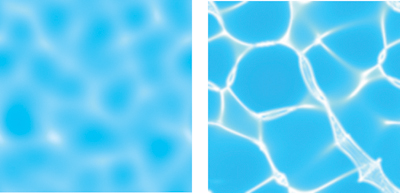
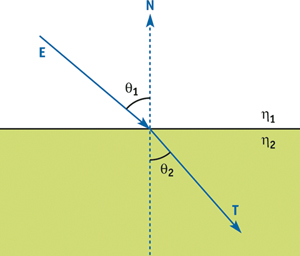

# 水焦散的渲染 （Rendering Water Caustics）

## 

## 【章节概览】

这一章介绍了一种从美学角度出发（aesthetics-driven）来实时渲染水中焦散的方法。

[
](https://github.com/QianMo/Game-Programmer-Study-Notes/blob/master/Content/%E3%80%8AGPUGems1%E3%80%8B%E5%85%A8%E4%B9%A6%E6%8F%90%E7%82%BC%E6%80%BB%E7%BB%93/media/1bf6407eb4ca155cdf34acf9ae08fbcb.png)

图 水的焦散效果

## 

## 【核心要点】

水的焦散（Water Caustics）的定义：光从弯曲的表面反射或者折射，只聚焦在受光面的某些区域，于是就是产生焦散的现象。

[
](https://github.com/QianMo/Game-Programmer-Study-Notes/blob/master/Content/%E3%80%8AGPUGems1%E3%80%8B%E5%85%A8%E4%B9%A6%E6%8F%90%E7%82%BC%E6%80%BB%E7%BB%93/media/dbf31636dde49cc423a1b39afd64b7fc.jpg)

图 折射的计算（入射光线（E）从介质η_1进入介质η_2，发生折射，产生折射光线（T））

首先，从模拟的观点出发，焦散其实可以通过正向或逆向光线追踪计算。

正向光线追踪中，要追踪从光线射出并穿过场景的光线，累计其在不断地区的贡献。

而逆向光线追踪，则以相反的过程工作，从海底开始，按照与入射相反的顺序逆向根据光线，计算给定点的所有入射光线总和。

而该文章中，前一节介绍了逆向蒙特卡洛光线追踪的一个简化，并大胆假设一些光线对焦散有贡献，并只计算到达海底光线的一个子集，因此，该方法计算消耗非常少，却产生了尽管在物理上不正确但是非常逼真的焦散图样和效果。由于整个效果看起来非常令人信服，尤其是图像质量，使得这个方法非常值得实现。文中用HLSL和OpenGL都进行了实现，并按照惯例，提供了源码。

该算法的伪代码如下：

```
1.  Paint the ocean floor.

2.  For each vertex in the fine mesh:

    1.  Send a vertical ray.

    2.  Collide the ray with the ocean's mesh.

    3.  Compute the refracted ray using Snell's Law in reverse.

    4.  Use the refracted ray to compute texture coordinates for the "Sun" map.

    5.  Apply texture coordinates to vertices in the finer mesh.

3.  Render the ocean surface.
```

## 

## 【本章配套源代码汇总表】

Example 2-1. 关于波函数、波函数的梯度以及线平面截距方程的代码示例，（Code Sample for the Wave Function, the Gradient of the Wave Function, and the Line-Plane Intercept Equation）

Example 2-2. 最终渲染通道代码示例，展示了依赖纹理读取操作 （Code Sample for the Final Render Pass, Showing the Dependent Texture Read Operations）

## 

## 【关键词提炼】

水焦散渲染（Rendering Water Caustics）

逆向蒙特卡洛光线追踪（backward Monte Carlo ray tracing）

折射（Refraction）
