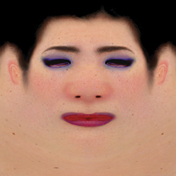
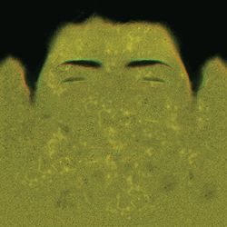
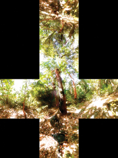
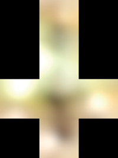
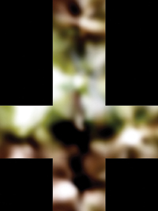

# 二、Dawn Demo中的皮肤渲染（Skin in the Dawn Demo）

## 

## 十年技术变迁： NVIDIA Dawn Demo

最初的Dawn Demo由NVIDIA于2002年发布，而十年之后的2012年，NVIDIA新发布了“A New Dawn”技术Demo。

图 A New Dawn Demo截图

以下是一张新老Demo的对比效果图。

图 Dawn Demo (2002年)

图 A New Dawn Demo （2012年）

图 技术指标的对比

## 

## 【章节概览】

这章详细介绍了NVIDIA出品的Dawn Dmoe中对精灵人物的着色技术，主要是皮肤的着色技巧。在当时（2002年）NVIDIA创造的此demo的品质，已经成为照片级真实感渲染和实时渲染的代表。

图 Dawn Demo截图

## 

## 【核心内容提炼】

### 

### 2.1 关于皮肤着色

基于多种原因，在计算机图形中模拟皮肤十分困难。在当时，即使是在电影中用高端产品模拟出来的仿真角色，通常也经不起近距离的观察。因为，人类可以从中获得大量非语言来表达的信息，如重心的移动，走动的特别习惯，面部的表情，甚至有些人的皮肤泛红等等。

虽然很少有人能理解像“次表面散射（Subsurface Scattering）”、“轮廓照明（Rim Lighting）”这些词汇，但是当把它们渲染错了的时候，几乎任何人都可以指出来。而且除了着色问题外，有时人们会因为皮肤渲染的问题，说皮肤看起来像是塑料做的。

### 

### 2.2 皮肤如何对光进行响应

皮肤不像大多数在计算机渲染中建模的表面，因为它是由半透明的表皮、真皮和皮下组织等数层构成的。这可以用次表面散射来模拟。这种现象很普遍，当在太阳面前向上举起手，就能看到穿过皮肤的桔红色的光。

图 次表面散射-穿过皮肤的桔红色的光

皮肤下的散射在所有的角度上显现皮肤形态，使它具有了柔软的、与众不同的特征。

在这之前有一些小组尝试使用多层纹理贴图来模仿皮肤的复杂性，但一般而言，这个方法比较难管理，美术同学很难通过预想，混合出最终符合预期的效果。

相反，文中使用单张彩色贴图，通过着色程序来增加色彩的变化。

图 Dawn头部的前半边的漫反射贴图

另外，皮肤具有一些极细微的变化，会影响其反射特性。这对皮肤外观有微妙的影响，特别是当光线直接与相机位置相反时，皮肤的表现则是存在边缘（Edge）与轮廓光照（Rim Lighting）,这时，需要皮肤轮廓边缘的光照，或给皮肤边缘加上光晕。

真正的皮肤具有一些细微的特征，比如汗毛和毛孔能捕捉光线。尽管这些细节用于显式地建模是太不明显了，但我们还是希望得到一个合适、整体更逼真的皮肤渲染外观。在特写时，可以增加凹凸贴图，提供一些额外的细节，特别是一些小的皱纹。但需要注意，我们想要的是柔软的皮肤外观，而不是光闪闪的油腻的塑料。另外，凹凸贴图通常只需静距离特写时才可见。

我们可以通过建模来近似这两个着色属性，建模可以是基于表面法线的简单公式，或者是基于光线或视线矢量的简单公式。

通过认识，我们可以将上述两种渲染特性（次表面散射和边缘光照），建模为基于表面法线和照明或观察向量的简单公式，从而近似出两种着色属性。尤其是沿着Dawn的轮廓边缘，对她身后的光线取样，按照观察向量的索引，让“穿过”Dawn的光与她的基础皮肤色调混合，从而创建次表面散射和边缘光照的着色效果。尤其是背景图中更加明亮的区域。如下图。

图 Dawn的头部前面的切线空间法线贴图（凹凸贴图）

### 

### 2.3 场景的照明

Dawn Demo中场景的照明使用了基于图像的光照（Image Based Lighting , IBL），创建高动态范围(High-Dynamic Range，HDR）)的全景，使用环境映射贴图（Environment Maps）进行场景的照明。

图 立方体环境反射贴图

漫反射环境贴图（Diffuse Environment Map）也是一个立方体映射贴图，它使用网格表面的法线作为索引。每个像素存储了相应法线与入射光夹角的余弦加权平均值。

图 漫反射环境贴图（Diffuse Environment Map）

镜面高光环境贴图（specular environment map）同样也是一个立方体映射贴图，使用反射矢量作为索引（类似于立方体映射）。把此镜面高光环境贴图基于粗糙因子进行模糊，目的是模拟对任何表面任何给定点上的法线的改变。

图 镜面高光环境贴图（Specular Environment Map）

存在的问题是，漫反射环境贴图（Diffuse Environment Map）和镜面高光环境贴图（Specular Environment Map）考虑了来自环境的入射光，但不包含由物体引起的阴影。

要解决这个问题，可以生成一个遮挡项，用来近似表达在每个顶点上半球辐射光中，有多大比率场景中其他物体所遮挡。

### 

### 2.4 实现

Dawn Demo中，毫无悬念地使用顶点着色器和像素着色器进行光照处理，顶点shader的主要功能是将坐标转换到投影空间，并执行那些不能在像素着色器中执行的数学运算。

采用单通道（one-pass）的光照解决方案，不需要另外其他的通道渲染，或alpha混合来创建皮肤表面。

文中提供了完整的顶点Shader和像素Shader的源代码，这里因为篇幅原因不再赘述，具体可以参考原文（PS:上文有贴出Web版的英文全书原文的链接）。

## 

## 【核心要点总结】

文中采用的皮肤渲染方法，总结起来有三个要点：

1）基于图像的光照（Image Based Lighting ,IBL），采用高动态范围（High-Dynamic-Range , HDR）光照环境映射贴图

2）次表面散射（Subsurface Scattering）

3）对皮肤边缘加上光晕，即轮廓照明/边缘光照（Rim Lighting）

## 

## 【本章配套源代码汇总表】

Example 3-1. 从CPU应用程序接收的每个顶点数据示例代码（The Per-Vertex Data Received from the CPU Application）

Example 3-2. 输出顶点的数据结构示例代码（The Data Structure of the Output Vertices）

Example 3-3. Dawn脸部的皮肤渲染顶点着色器示例代码（A Sample Vertex Shader for Dawn's Face）

Example 3-4. Dawn脸部的皮肤渲染片元着色器代码（The Fragment Shader for Dawn's Face）

## 

## 【关键词提炼】

皮肤渲染（Skin Rendering）

次表面散射（Subsurface Scattering）

轮廓照明（Rim Lighting）

基于图像的光照（Image Based Lighting ,IBL）

高动态范围（High-Dynamic-Range, HDR）

环境映射贴图（Environment Maps）
