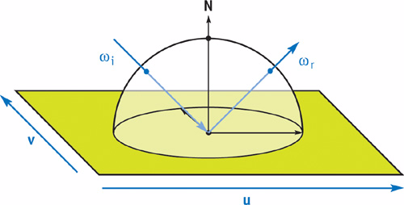

# 空间BRDF（Spatial BRDFs）

## 

## 【章节概览】

这章主要先聊到了空间双向反射分布函数（SBRDF），接着文章讨论了压缩SBRDF表达式，以及由离散光或环境贴图所照明的SBRDF的渲染方法。

## 

## 【核心要点】

SBRDF是纹理贴图和双向反射分布函数（BRDF）的组合。纹理贴图存储了反射或其他的属性，它们沿着2D表面上的空间变化，而BRDF存储的是表面上单个点的反射，包括从入射角到出射角的全部分布。

图 SBRDF的定义域

SBRDF对标准点光源或方向光源照明的SBRDF表面，文中直接贴图了Shader源码，具体可以参考原文。

SBRDF除了可以用点光源或方向光源照明之外，还可以用环境贴图中所有方向的入射光进行照明。关键是在渲染前用BRDF的一部分卷积环境贴图。对于大多数的BRDF表达式，必须分别处理各个不同的BRDF。但因为一个SBRDF可能有上百万个不同的BRDF，所以这样做不可能。这篇文章采取的的做法是，简单地用一个Phong叶片卷积环境贴图，叶片可以选择不同的镜面指数，如n=0、1、4、16、64、256、这些贴图能存储在不同级别的立方体mipmap中。随后，SBRDF纹素的n值就指细节层次(LOD)，用于在立方体贴图中采样适当mipmap级别。

图 用蓝色的油漆和铝BRDF得到的SBRDF渲染效果

## 

## 【本章配套源代码汇总表】

Example 18-1. 用于离散光源的SBRDF片元Shader（An SBRDF Fragment Shader for Discrete Lights）

Example 18-2. 使用Phong Lobe来描述环境地图的伪代码（Pseudocode for Convolving an Environment Map with a Phong Lobe）

Example 18-3. 用于环境贴图的SBRDF片元Shader（An SBRDF Fragment Shader for Environment Maps）

## 

## 【关键词提炼】

双向反射分布函数（BRDF）

空间双向反射分布函数（SBRDF）

离散光（Discrete Lights）

环境贴图（Environment Maps）
