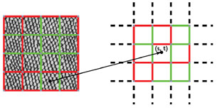

# 基于贴面的纹理映射（Tile-Based Texture Mapping）

## 

## 【章节概览】

这章介绍了一个基于贴面的纹理映射（Tile-Based Texture Mapping）系统，用来从一组贴面生成一个大的虚拟纹理。

## 

## 【核心要点】

使用纹理贴面（Texture Tiling）可以解决纹理过大来带的磁盘空间、系统存储。图像存储瓶颈等各种问题。

如下图，如果有重复的贴面组成的大墙壁或地板，显然不需要存储所有的贴面。相反，可以只存储一个贴面，然后在墙上重复它。对于更复杂的模式，可以把墙壁或地板切成较小的多边形，并对每个多边形应用不同的纹理贴片或纹理坐标变换。这种方法的有点是在理论上可以达到无限的压缩率，因为可以从少量贴面产生出一个任意打的输出。缺点是，应用程序代码和数据比较复杂。

图 基于贴面的纹理。左图：给定以小组输入纹理贴图（左），系统在不需要存储整个纹理的情况下可以提供大的虚拟纹理图（右），这种方法支持本地硬件纹理过滤，而且不需要修改应用程序的几何体或纹理坐标。

图 基于贴图的纹理映射的概览。左图：打包的输入贴面。右：输入的虚拟纹理。给定一个纹理请求（s，t），先确定请求的是哪个贴面，然后算法从输入贴面中获取相应的纹素。

## 

## 【关键词】

纹理映射（Texture Mapping）

基于贴面的纹理映射（Tile-Based Texture Mapping）

纹理贴面（Texture Tiling）
