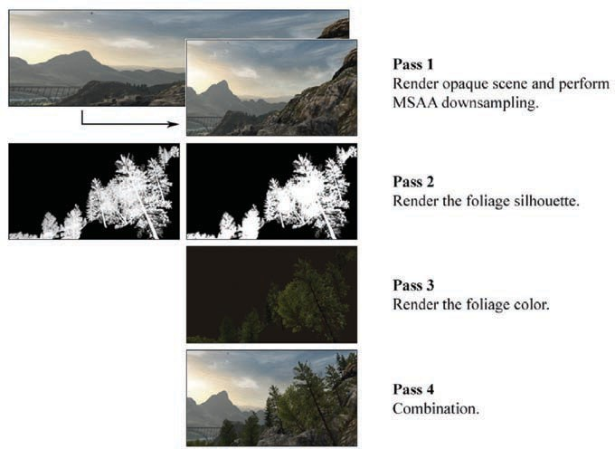

## 后处理Alpha混合 | Alpha Blending as a Post-Process

在这篇文章中提出了一种新的Alpha混合技术，屏幕空间Alpha遮罩（ Screen-Space Alpha Mask ,简称SSAM）。该技术首次运用于赛车游戏《Pure》中。《Pure》发行于2008年夏天，登陆平台为Xbox360,PS3和PC。

[
](https://github.com/QianMo/Game-Programmer-Study-Notes/blob/master/Content/%E3%80%8AGPUPro1%E3%80%8B%E5%85%A8%E4%B9%A6%E6%8F%90%E7%82%BC%E6%80%BB%E7%BB%93/media/c4768e8edcdf14450dab6a5ae65e4af7.jpg)

图 《Pure》中的场景（tone mapping & bloom效果）

在《Pure》的开发过程中，明显地需要大量的alpha混合（alpha blending）操作。但是众所周知，传统的计算机图形学的难题之一，就是正确地进行alpha混合操作，并且往往在性能和视觉质量之间，经常很难权衡。

实际上，由于不愿意承担性能上的风险，一些游戏会完全去避免使用alpha混合。有关alpha混合渲染所带来的问题的全面介绍，可以参考[Thibieroz 08]，以及[Porter and Duff 84]。

在这篇文章中，提出了一种新颖的（跨平台）解决方案，用于树叶的alpha混合，这种解决方案可以提高各种alpha测试级渲染的质量，为它们提供真正的alpha混合效果。

文中设计的解决方案——屏幕空间Alpha遮罩（Screen-Space Alpha Mask ,简称SSAM），是一种采用渲染技术实现的多通道方法，如下图。无需任何深度排序或几何分割。

在《Pure》中使用的SSAM技术对环境的整体视觉质量有着深远的影响。 效果呈现出柔和自然的外观，无需牺牲画面中的任何细节。

[
](https://github.com/QianMo/Game-Programmer-Study-Notes/blob/master/Content/%E3%80%8AGPUPro1%E3%80%8B%E5%85%A8%E4%B9%A6%E6%8F%90%E7%82%BC%E6%80%BB%E7%BB%93/media/b9a8f6f5dec7856785493ee8b0db28a2.jpg)

图 SSAM的技术思路图示

此解决方案可以产生与alpha混合相同的结果，同时使用alpha测试技术正确解决每个像素的内部重叠（和深度交集）。

文中使用全屏幕后处理高效地执行延迟alpha混合（deferred alpha blending），类似于将帧混合操作设置为ADD的帧缓冲混合;源和目标参数分别设置为SRCALPHA和INVSRCALPHA。

混合输入被渲染成三个单独的渲染目标（render targets），然后绑定到纹理采样器（texture samplers），由最终的组合后处理像素着色器引用。

在内存资源方面，至少需要三个屏幕分辨率的渲染目标，其中的两个至少具有三个颜色的通道（rtOpaque & rtFoliage），而另一个至少有两个通道（rtMask）和一个深度缓冲区（rtDepth） 。

下面列举一些SSAM的优点和缺点。

SSAM的优点：

- 树叶边缘与周围环境平滑融合。
- 使用alpha测试技术，在每像素的基础上对内部重叠和相互穿透的图元进行排序。
- 该效果使用简单，低成本的渲染技术实现，不需要任何几何排序或拆分（只需要原始调度顺序的一致性）。
- 无论场景复杂度和overdraw如何，最终的混合操作都是以线性成本（每像素一次）来执行运算。
- 该效果与能渲染管线中的其他alpha混合阶段（如粒子等）完美集成。
- 与其他优化（如将光照移到顶点着色器）以及优化每个通道的着色器等方法结合使用时，总体性能可能会高于基于MSAA（MultiSampling Anti-Aliasing，多重采样抗锯齿）的技术。

SSAM的缺点：

- 需要额外的渲染Pass的开销。
- 内存要求更高，因为需要存储三张图像。
- 该技术不能用于对大量半透明，玻璃状的表面进行排序（或横跨大部分屏幕的模糊alpha梯度），可能会产生失真。

### 

### 7.1 核心实现Shader代码

最终后处理合成的像素着色器实现代码：

```
sampler2D rtMask : register (s0);
sampler2D rtOpaque : register (s1);
sampler2D rtFoliage : register (s2);
half maskLerp : register (c0); // 0.85h
half4 main(float2 texCoord : TEXCOORD0) : COLOR
{
    half4 maskPixel = tex2D ( rtMask , texCoord );
    half4 opaquePixel = tex2D ( rtOpaque , texCoord );
    half4 foliagePixel = tex2D (rtFoliage , texCoord );
    half mask = lerp(maskPixel .x , maskPixel .w, maskLerp );
    return lerp(opaquePixel , foliagePixel , mask * mask);
}
```
