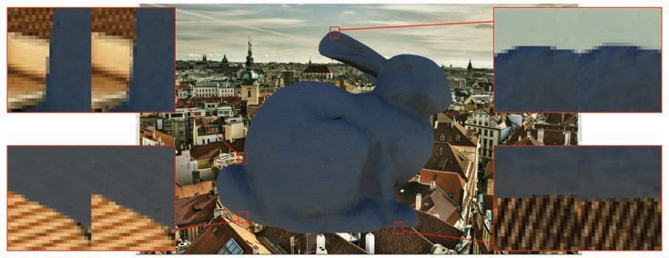

## 基于后处理的边缘抗锯齿 | Edge Anti-aliasing by Post-Processing

抗锯齿是高质量渲染的关键之一。例如，高质量的CG优先考虑抗锯齿的质量，而用于打印和品宣的游戏截图通常会采用人为高水平的超级采样来提高图像质量。

硬件多采样抗锯齿（Multi-Sampled Anti-Aliasing ，MSAA) [Kirkland 99]支持的是实现抗锯齿的标准方法，但是它是实现高质量抗锯齿的一种非常昂贵的方式，并且对抗锯齿与后处理效果提供的帮助甚微。

本章介绍了一种通过选择性像素混合对边缘进行抗锯齿的新方法。其仅需要MSAA所需空间的一小部分，并且与后处理效果相兼容。此抗锯齿方法的执行分为两个阶段。

首先，图像是没有任何多采样（multisampling）方法或超采样（super-sampling）方法的作用下渲染的。作为关于邻近边缘轮廓的近似细小的渲染提示被写出到帧缓冲区。然后应用后处理的pass，该通道使用这些细小的渲染提示来更新边缘像素，以提供抗锯齿。而在延迟效果（deferred  effects）之后应用后处理（post-process），表示它们会接收边缘消除锯齿。

这种方法的核心部分为像素着色器提供了一种计算最近轮廓边缘位置的高效方法。这种技术也可以应用于阴影贴图放大，并提供了保持锐利边缘的放大方法。

下图显示了该方法的实际应用。

图 本章中的抗锯齿方法的效果图特写

图 复杂背景的抗锯齿效果演示。每个放大部分的左侧为4 MSAA的抗锯齿效果。右侧为本章方法（edge-blur render，边缘模糊抗锯齿）
