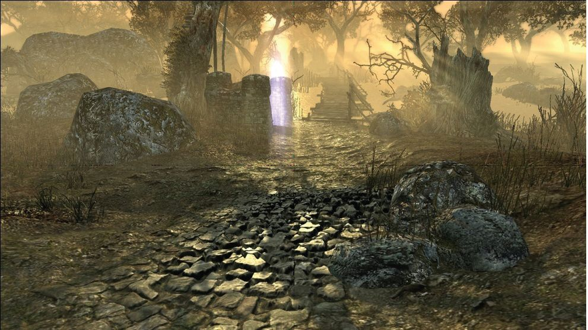
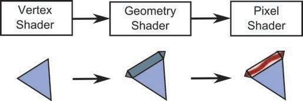
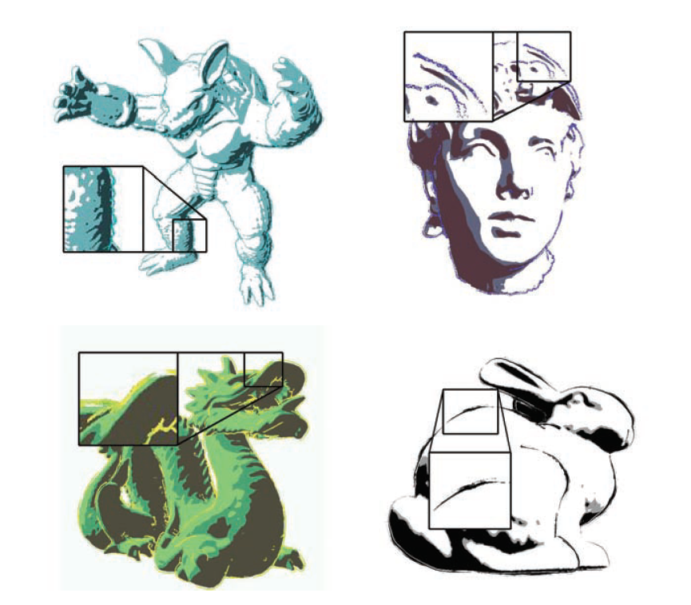
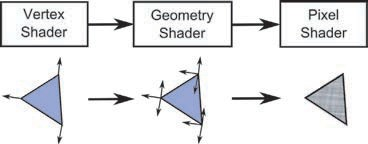

## 基于高度混合的四叉树位移贴图 | Quadtree Displacement Mapping with Height Blending

这章中，介绍了当前表面渲染（surface rendering）技术的概述和相关比较，主要涉及在如下几种方法：

- Relief Mapping | 浮雕贴图
- Cone step mapping (CSM) | 锥步映射
- Relaxed cone step mapping (RCSM) | 宽松锥步映射
- Parallax Occlusion Mapping(POM) | 视差遮蔽贴图
- Quadtree Displacement Mapping（QDM）| 四叉树位移贴图

内容方面，文章围绕表面渲染技术，分别介绍了光线追踪与表面渲染、四叉树位移映射（Quadtree Displacement  Mapping）、自阴影（Self-Shadowing）、环境光遮蔽（Ambient Occlusion）、表面混合（Surface  Blending）几个部分。为了获得最高的质量/性能/内存使用率，文章建议在特定情况下使用视差映射，软阴影，环境遮挡和表面混合方法的组合。

此外，文中还提出了具有高度混合的四叉树位移贴图。对于使用复杂，高分辨率高度场的超高质量表面，该方法明显会更高效。此外，使用引入的四叉树结构提出了高效的表面混合，软阴影，环境遮挡和自动LOD方案的解决方案。在实践中，此技术倾向于以较少的迭代和纹理样本产生更高质量的结果。

[
](https://github.com/QianMo/Game-Programmer-Study-Notes/blob/master/Content/%E3%80%8AGPUPro1%E3%80%8B%E5%85%A8%E4%B9%A6%E6%8F%90%E7%82%BC%E6%80%BB%E7%BB%93/media/1a7051ace54640bd566a5d8f23a49358.jpg)

图 Parallax Occlusion Mapping(POM) 视差遮蔽贴图和Quadtree Displacement  Mapping（QDM）四叉树位移贴图和的渲染质量比较。其中，左图为POM；右图为QDM。深度尺寸分别为：1.0,1.5,5.0。可以发现，在深度尺寸1.5以上时，使用POM（左图）会看到失真。

[
](https://github.com/QianMo/Game-Programmer-Study-Notes/blob/master/Content/%E3%80%8AGPUPro1%E3%80%8B%E5%85%A8%E4%B9%A6%E6%8F%90%E7%82%BC%E6%80%BB%E7%BB%93/media/bb6c02aaed96d06830e23ab69e47f9e9.jpg)

[
](https://github.com/QianMo/Game-Programmer-Study-Notes/blob/master/Content/%E3%80%8AGPUPro1%E3%80%8B%E5%85%A8%E4%B9%A6%E6%8F%90%E7%82%BC%E6%80%BB%E7%BB%93/media/8c4e3cc814ab179df6bb1f64d47b8838.jpg)

图 表面混合质量比较。上图：浮雕贴图（Relief Mapping），下图：带高度混合的视差遮蔽贴图（POM with height blending）

### 

### 5.1 核心实现Shader代码

以下为视差遮蔽贴图（Parallax Occlusion Mapping，POM）核心代码：

```
float Size = 1.0 / LinearSearchSteps;
float Depth = 1.0;
int StepIndex = 0;
float CurrD = 0.0;
float PrevD = 1.0;
float2 p1 = 0.0;
float2 p2 = 0.0;

while (StepIndex < LinearSearchSteps)
{
    Depth -= Size; // move the ray
    float4 TCoord = float2 (p+(v*Depth )); // new sampling pos
    CurrD = tex2D (texSMP , TCoord ).a; //new height
    if (CurrD > Depth ) // check for intersection
    {
        p1 = float2 (Depth , CurrD );
        p2 = float2 (Depth + Size , PrevD ); // store last step
        StepIndex = LinearSearchSteps; // break the loop
    }
    StepIndex ++;
    PrevD = CurrD ;
}

// Linear approximation using current and last step
// instead of binary search , opposed to relief mapping .
float d2 = p2.x - p2.y;
float d1 = p1.x - p1.y;

return (p1.x * d2 - p2.x * d1) / (d2 - d1);
```

四叉树位移贴图（Quadtree Displacement Mapping  ，QDM）使用mipmap结构来表示密集的四叉树，在高度场的基准平面上方存储最大高度。QDM会在在交叉区域使用细化搜索，以便在需要时找到准确的解决方案。以下为四叉树位移贴图（QDM）搜索的核心代码：

```
const int MaxLevel = MaxMipLvl ;
const int NodeCount = pow (2.0, MaxLevel );
const float HalfTexel = 1.0 / NodeCount / 2.0;
float d;
float3 p2 = p;
int Level = MaxLevel ;

//We calculate ray movement vector in inter -cell numbers .
int2 DirSign = sign(v.xy);

// Main loop
while (Level >= 0)
{
    //We get current cell minimum plane using tex2Dlod .
    d = tex2Dlod (HeightTexture , float4 (p2.xy , 0.0 , Level )). w;
    //If we are not blocked by the cell we move the ray .
    if (d > p2.z)
    {
        //We calculate predictive new ray position .
        float3 tmpP2 = p + v * d;

        //We compute current and predictive position .
        // Calculations are performed in cell integer numbers .
        int NodeCount = pow (2, (MaxLevel - Level ));
        int4 NodeID = int4((p2.xy , tmpP2 .xy) * NodeCount );

        //We test if both positions are still in the same cell.
        //If not , we have to move the ray to nearest cell boundary .
        if (NodeID .x != NodeID .z || NodeID .y != NodeID .w)
        {
            //We compute the distance to current cell boundary .
            //We perform the calculations in continuous space .
            float2 a = (p2.xy - p.xy);
            float2 p3 = (NodeID .xy + DirSign) / NodeCount ;
            float2 b = (p3.xy - p.xy);

            //We are choosing the nearest cell
            //by choosing smaller distance .
            float2 dNC = abs (p2.z * b / a);
            d = min (d, min (dNC .x, dNC .y));

            // During cell crossing we ascend in hierarchy .
            Level +=2;

            // Predictive refinement
            tmpP2 = p + v * d;
        }

        //Final ray movement
        p2 = tmpP2 ;
    }
    
    // Default descent in hierarchy
    // nullified by ascend in case of cell crossing
    Level --;
}
return p2;
```

这章也引入了一种表面混合的新方法，能更自然地适合表面混合，并且保证了更快的收敛。

文中建议使用高度信息作为额外的混合系数，从而为混合区域和更自然的外观添加更多种类，具体实现代码如下：

```
float4 FinalH ;
float4 f1 , f2 , f3 , f4;

//Get surface sample .
f1 = tex2D(Tex0Sampler ,TEXUV .xy).rgba;

//Get height weight .
FinalH .a = 1.0 - f1.a;
f2 = tex2D(Tex1Sampler ,TEXUV .xy).rgba;
FinalH .b = 1.0 - f2.a;
f3 = tex2D(Tex2Sampler ,TEXUV .xy).rgba;
FinalH .g = 1.0 - f3.a;
f4 = tex2D(Tex3Sampler ,TEXUV .xy).rgba;
FinalH .r = 1.0 - f4.a;

// Modify height weights by blend weights .
//Per -vertex blend weights stored in IN.AlphaBlends
FinalH *= IN.AlphaBlends ;

// Normalize .
float Blend = dot (FinalH , 1.0) + epsilon ;
FinalH /= Blend ;

//Get final blend .
FinalTex = FinalH .a * f1 + FinalH .b * f2 + FinalH .g * f3 + FinalH .r * f4;
```

在每个交叉点搜索（intersection search）步骤中，使用新的混合运算符重建高度场轮廓，实现代码如下所示：

```
d = tex2D (HeightTexture ,p.xy).xyzw;
b = tex2D (BlendTexture ,p.xy). xyzw;
d *= b;
d = max (d.x ,max (d.y,max (d.z,d.w)));
```

## 

## 六、使用几何着色器的NPR效果 | NPR Effects Using the Geometry Shader

本章的内容关于非真实感渲染（Non-photorrealistic rendering ，NPR）。在这章中，介绍了一组利用GPU几何着色器流水线阶段实现的技术。

具体来说，文章展示了如何利用几何着色器来在单通道中渲染对象及其轮廓，并对铅笔素描效果进行了模拟。

单通道方法通常使用某种预计算来将邻接信息存储到顶点中[Card and Mitchell 02]，或者使用几何着色器 [Doss 08]，因为可能涉及到查询邻接信息。这些算法在单个渲染过程中生成轮廓，但对象本身仍需要第一个几何通道。

### 

### 6.1 轮廓渲染（Silhouette Rendering）

轮廓渲染是大多数NPR效果的基本元素，因为它在物体形状的理解中起着重要作用。在本节中，提出了一种在单个渲染过程中检测，生成和纹理化模型的新方法。

轮廓渲染（Silhouette rendering）技术中， 两大类算法需要实时提取轮廓：

- 基于阴影体积的方法（shadow volume-based approaches）
- 非真实感渲染（non-photorealistic rendering）

而从文献中，可以提取两种不同的方法：

- 对象空间算法（object-space algorithms）
- 图像空间算法（image-space algorithms）

但是，大多数现代算法都在图像空间（image space）或混合空间（hybrid space）中工作。本章中主要介绍基于GPU的算法。GPU辅助算法可以使用多个渲染通道或单个渲染通道来计算轮廓。

为了一步完成整个轮廓渲染的过程，将会使用到几何着色器（geometry shader）。因为几何着色阶段允许三角形操作，能获取相邻三角形的信息，以及为几何体生成新的三角形。

轮廓渲染过程在流水线的不同阶段执行以下步骤：

- 顶点着色器（Vertex shader）。 顶点以通常的方式转换到相机空间。
- 几何着色器（Geometry shader）。 在该阶段中，通过使用当前三角形及其邻接的信息来检测属于轮廓的边缘，并生成相应的几何体。
- 像素着色器（Pixel shader）。 对于每个栅格化片段，生成其纹理坐标，并根据从纹理获得的颜色对像素进行着色。

[
](https://github.com/QianMo/Game-Programmer-Study-Notes/blob/master/Content/%E3%80%8AGPUPro1%E3%80%8B%E5%85%A8%E4%B9%A6%E6%8F%90%E7%82%BC%E6%80%BB%E7%BB%93/media/6065d242b5fb94811659827213e1d145.jpg)

图 管线概述：顶点着色器（左）变换传入几何体的顶点坐标;第二步（几何着色器）为对象的轮廓生成新几何体。最后，像素着色器生成正确的纹理坐标。

几何着色器轮廓检测代码如下：

```
[maxvertexcount (21)]
void main( triangleadj VERTEXin input [6],
inout TriangleStream <VERTEXout > TriStream )
{
    // Calculate the triangle normal and view direction .
    float3 normalTrian = getNormal ( input [0].Pos .xyz ,
        input [2].Pos .xyz , input [4].Pos .xyz );
    float3 viewDirect = normalize (-input [0].Pos .xyz
        - input [2]. Pos .xyz - input [4].Pos .xyz );

    //If the triangle is frontfacing
    [branch ]if(dot (normalTrian ,viewDirect ) > 0.0f)
    {
        [loop]for (uint i = 0; i < 6; i+=2)
        {
            // Calculate the normal for this triangle .
            float auxIndex = (i+2)%6;
            float3 auxNormal = getNormal ( input [i].Pos .xyz ,
                input[i+1].Pos .xyz , input[auxIndex ].Pos .xyz );
            float3 auxDirect = normalize (- input[i].Pos .xyz
                - input [i+1].Pos .xyz - input[auxIndex ].Pos .xyz );

            //If the triangle is backfacing
            [branch ]if(dot (auxNormal ,auxDirect) <= 0.0f)
            {
                // Here we have a silhouette edge.
            }
        }
    }
}
```

几何着色器轮廓生成代码如下：

```
// Transform the positions to screen space .
float4 transPos1 = mul (input [i].Pos ,projMatrix );
transPos1 = transPos1 /transPos1 .w;
float4 transPos2 = mul (input [auxIndex ].Pos ,projMatrix );
transPos2 = transPos2 /transPos2 .w;

// Calculate the edge direction in screen space .
float2 edgeDirection = normalize (transPos2 .xy - transPos1 .xy);

// Calculate the extrude vector in screen space .
float4 extrudeDirection = float4 (normalize (
float2 (-edgeDirection.y ,edgeDirection.x)) ,0.0f ,0.0f);

// Calculate the extrude vector along the vertex
// normal in screen space.
float4 normExtrude1 = mul (input [i].Pos + input [i]. Normal
,projMatrix );
normExtrude1 = normExtrude1 / normExtrude1.w;
normExtrude1 = normExtrude1 - transPos1 ;
normExtrude1 = float4 (normalize (normExtrude1.xy),0.0f ,0.0f);
float4 normExtrude2 = mul (input [auxIndex ].Pos
+ input [auxIndex ].Normal ,projMatrix );
normExtrude2 = normExtrude2 / normExtrude2.w;
normExtrude2 = normExtrude2 - transPos2 ;
normExtrude2 = float4 (normalize (normExtrude2.xy),0.0f ,0.0f);

// Scale the extrude directions with the edge size.
normExtrude1 = normExtrude1 * edgeSize ;
normExtrude2 = normExtrude2 * edgeSize ;
extrudeDirection = extrudeDirection * edgeSize ;

// Calculate the extruded vertices .
float4 normVertex1 = transPos1 + normExtrude1;
float4 extruVertex1 = transPos1 + extrudeDirection;
float4 normVertex2 = transPos2 + normExtrude2;
float4 extruVertex2 = transPos2 + extrudeDirection;

// Create the output polygons .
VERTEXout outVert ;
outVert .Pos = float4 (normVertex1 .xyz ,1.0f);
TriStream .Append (outVert );
outVert .Pos = float4 (extruVertex1.xyz ,1.0f);
TriStream .Append (outVert );
outVert .Pos = float4 (transPos1 .xyz ,1.0f);
TriStream .Append (outVert );
outVert .Pos = float4 (extruVertex2.xyz ,1.0f);
TriStream .Append (outVert );
outVert .Pos = float4 (transPos2 .xyz ,1.0f);
TriStream .Append (outVert );
outVert .Pos = float4 (normVertex2 .xyz ,1.0f);
TriStream .Append (outVert );
TriStream .RestartStrip();
```

在像素着色器中轮廓纹理映射的实现代码：

```
float4 main(PIXELin inPut ):SV_Target
{
    // Initial texture coordinate .
    float2 coord = float2 (0.0f,inPut.UV.z);

    // Vector from the projected center bounding box to
    //the location .
    float2 vect = inPut .UV.xy - aabbPos ;

    // Calculate the polar coordinate .
    float angle = atan(vect.y/vect.x);
    angle = (vect.x < 0.0 f)? angle+PI:
    (vect.y < 0.0f)?angle +(2* PI): angle ;

    // Assign the angle plus distance to the u texture coordinate .
    coord .x = ((angle /(2* PI)) + (length (vect)* lengthPer ))* scale;

    //Get the texture color .
    float4 col = texureDiff .Sample (samLinear ,coord );

    // Alpha test.
    if(col .a < 0.1 f)
    discard ;
    
    // Return color .
    return col ;
}
```

[
](https://github.com/QianMo/Game-Programmer-Study-Notes/blob/master/Content/%E3%80%8AGPUPro1%E3%80%8B%E5%85%A8%E4%B9%A6%E6%8F%90%E7%82%BC%E6%80%BB%E7%BB%93/media/9961590888343ce5f500bc4dbcf7b442.png)

图 轮廓渲染算法的运行效果图，轮廓剪影的实时生成和纹理化。

完整的实现Shader源码可见： <https://github.com/QianMo/GPU-Pro-Books-Source-Code/blob/master/GPU-Pro-1/03_Rendering%20Techniques/02_NPReffectsusingtheGeometryShader/NPRGS/NPRGS/Silhouette.fx>

### 

### 6.2 铅笔素描渲染（Pencil Rendering）

基于Lee等人[Lee et al. 06]铅笔渲染思路可以概括如下。

首先，计算每个顶点处的最小曲率（curvature）。然后，三角形和其曲率值作为每个顶点的纹理坐标传入管线。 为了对三角形的内部进行着色，顶点处的曲率用于在屏幕空间中旋转铅笔纹理。该铅笔纹理会在屏幕空间中进行三次旋转，每个曲率一次，旋转后的结果进行混合结合。不同色调的多个纹理，存储在纹理阵列中，同时进行使用。最终，根据光照情况在其中选择出正确的一个。

[
](https://github.com/QianMo/Game-Programmer-Study-Notes/blob/master/Content/%E3%80%8AGPUPro1%E3%80%8B%E5%85%A8%E4%B9%A6%E6%8F%90%E7%82%BC%E6%80%BB%E7%BB%93/media/fa42018d66709fbd9879f1ca334d987c.jpg)

图 管线概述：顶点着色器将顶点转换为屏幕空间;几何着色器将三角形的顶点曲率分配给三个顶点。最后，像素着色器生成三个曲率的纹理坐标并计算最终颜色。

可以通过以下方式使用GPU管线实现此算法：

- 顶点着色器（Vertex shader）。 顶点转换为屏幕坐标。顶点曲率也被变换，只有x和y分量作为二维向量传递。
- 几何着色器（Geometry shader）。 将曲率值作为纹理坐标分配给每个顶点。
- 像素着色器（Pixel shader）。 计算最终颜色。

几何着色器的实现代码如下：

```
[maxvertexcount (3)]
void main( triangle VERTEXin input [3],
inout TriangleStream <VERTEXout > TriStream )
{
    // Assign triangle curvatures to the three vertices .
    VERTEXout outVert ;
    outVert .Pos = input [0].Pos ;
    outVert .norm = input [0]. norm;
    outVert .curv1 = input [0]. curv;
    outVert .curv2 = input [1]. curv;
    outVert .curv3 = input [2]. curv;
    TriStream .Append (outVert );
    outVert .Pos = input [1].Pos ;
    outVert .norm = input [1]. norm;
    outVert .curv1 = input [0]. curv;
    outVert .curv2 = input [1]. curv;
    outVert .curv3 = input [2]. curv;
    TriStream .Append (outVert );
    outVert .Pos = input [2].Pos ;
    outVert .norm = input [2]. norm;
    outVert .curv1 = input [0]. curv;
    outVert .curv2 = input [1]. curv;
    outVert .curv3 = input [2]. curv;
    TriStream .Append (outVert );
    TriStream . RestartStrip();
}
```

像素着色器的实现代码如下：

```
float4 main(PIXELin inPut ):SV_Target
{
    float2 xdir = float2 (1.0f ,0.0f);
    float2x2 rotMat ;
    // Calculate the pixel coordinates .
    float2 uv = float2 (inPut .Pos .x/width ,inPut .Pos .y/height );

    // Calculate the rotated coordinates .
    float2 uvDir = normalize (inPut .curv1 );
    float angle = atan(uvDir .y/uvDir.x);
    angle = (uvDir .x < 0.0 f)? angle +PI:
    (uvDir .y < 0.0f)? angle +(2* PI): angle ;
    float cosVal = cos (angle );
    float sinVal = sin (angle );
    rotMat [0][0] = cosVal ;
    rotMat [1][0] = -sinVal ;
    rotMat [0][1] = sinVal ;
    rotMat [1][1] = cosVal ;
    float2 uv1 = mul (uv ,rotMat );

    uvDir = normalize (inPut.curv2 );
    angle = atan(uvDir .y/uvDir.x);
    angle = (uvDir .x < 0.0 f)? angle +PI:
    (uvDir .y < 0.0f)? angle +(2* PI): angle ;
    cosVal = cos (angle );
    sinVal = sin (angle );
    rotMat [0][0] = cosVal ;
    rotMat [1][0] = -sinVal ;
    rotMat [0][1] = sinVal ;
    rotMat [1][1] = cosVal ;
    float2 uv2 = mul (uv ,rotMat );

    uvDir = normalize (inPut .curv3 );
    angle = atan(uvDir.y/uvDir.x);
    angle = (uvDir .x < 0.0 f)? angle +PI:
    (uvDir .y < 0.0f)?angle +(2* PI): angle ;
    cosVal = cos (angle );
    sinVal = sin (angle );
    rotMat [0][0] = cosVal ;
    rotMat [1][0] = -sinVal ;
    rotMat [0][1] = sinVal ;
    rotMat [1][1] = cosVal ;
    float2 uv3 = mul (uv ,rotMat );

    // Calculate the light incident at this pixel.
    float percen = 1.0f - max (dot (normalize (inPut .norm),
    lightDir ) ,0.0);

    // Combine the three colors .
    float4 color = (texPencil .Sample (samLinear ,uv1 )*0.333 f)
    +( texPencil .Sample (samLinear ,uv2 )*0.333 f)
    +( texPencil .Sample (samLinear ,uv3 )*0.333 f);

    // Calculate the final color .
    percen = (percen *S) + O;
    color .xyz = pow (color .xyz ,float3 (percen ,percen ,percen ));
    return color;
}
```

最终的渲染效果：

[
](https://github.com/QianMo/Game-Programmer-Study-Notes/blob/master/Content/%E3%80%8AGPUPro1%E3%80%8B%E5%85%A8%E4%B9%A6%E6%8F%90%E7%82%BC%E6%80%BB%E7%BB%93/media/007e69cbd0da96706c4a163a201f3c44.png)

图 铅笔渲染效果图

完整的实现Shader源码可见： <https://github.com/QianMo/GPU-Pro-Books-Source-Code/blob/master/GPU-Pro-1/03_Rendering%20Techniques/02_NPReffectsusingtheGeometryShader/NPRGS/NPRGS/Pencil.fx>
