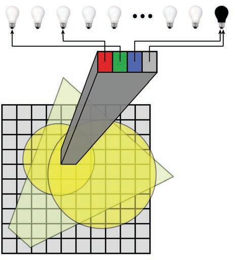

## 《正当防卫2》中的大世界制作经验与教训 | Making it Large, Beautiful, Fast,and Consistent: Lessons Learned

《正当防卫2（Just Cause 2）》是Avalanche Studios为PC，Xbox 360和PLAYSTATION 3开发的沙盒游戏。游戏的主要风格是大世界，主要视觉特征是具有巨大渲染范围的巨型景观，森林、城市、沙漠、丛林各种环境不同的气候，以及昼夜循环技术。

[
](https://github.com/QianMo/Game-Programmer-Study-Notes/blob/master/Content/%E3%80%8AGPUPro1%E3%80%8B%E5%85%A8%E4%B9%A6%E6%8F%90%E7%82%BC%E6%80%BB%E7%BB%93/media/11c915b42785aed12338cf882463210f.jpg)

图 《正当防卫2》封面

对于多动态光源的渲染，《正当防卫2》没有使用延迟渲染，而是提出了一种称作光源索引（Light indexing）的方案，该方案可以使用前向渲染渲染大量动态光源，而无需多个pass，或增加draw calls。

### 

### 3.1 光照索引 Light indexing

光照索引（Light indexing）技术的核心思路是：通过RGBA8格式128 x 128的索引纹理将光照信息提供给着色器。

将该纹理映射到摄像机位置周围的XZ平面中，并进行点采样。 每个纹素都映射在一个4m x 4m的区域，并持有四个该正方形相关的光源索引。这意味着我们覆盖了512m × 512m的区域，且动态光源处于活动状态。

活动光源存储在单独的列表中，可以是着色器常量，也可以是一维纹理，具体取决于平台。虽然使用8位通道可以索引多达256个光源，但我们将其限制为64个，以便将光源信息拟合到着色器常量中。每个光源都有两个恒定的寄存器，保存位置（position），倒数平方半径（reciprocal  squared radius）和颜色（color）这三个参数。

[
](https://github.com/QianMo/Game-Programmer-Study-Notes/blob/master/Content/%E3%80%8AGPUPro1%E3%80%8B%E5%85%A8%E4%B9%A6%E6%8F%90%E7%82%BC%E6%80%BB%E7%BB%93/media/cb588c524267abdeafc0de518613af95.png)

表 光源常量

此外，还有一个额外的“禁用（disabled）”光源槽位，其所有这些都设置为零。那么总寄存器计数会达到130。当使用一维纹理时，禁用的光源用边框颜色（border  color）编码替代。  位置和倒数平方半径以RGBA16F格式存储，颜色以RGBA8格式存储。为了保持精度，位置存储在相对于纹理中心的局部空间中。

光源索引纹理在CPU上由全局光源列表生成。一开始，其位置被放置在使得纹理区域被充分利用的位置，最终以尽可能小的空间，放置在摄像机之后。

在启用并落入索引纹理区域内的光源中，根据优先级，屏幕上的近似大小以及其他因素来选择最相关的光源。每个光源都插入其所覆盖的纹素的可用通道中。如果纹理像素被四个以上的光源覆盖，则需要丢弃此光源。

如果在插入时纹理像素已满，程序将根据图块中的最大衰减系数检查入射光源是否应替换任何现有的光源，以减少掉光源的视觉误差。这些误差可能导致图块边框周围的光照不连续性。通常这些误差很小，但当四处移动时可能非常明显。而为了避免这个问题，可以将索引纹理对齐到纹素大小的坐标中。在实践中，光源的丢弃非常少见，通常很难发现。

[
](https://github.com/QianMo/Game-Programmer-Study-Notes/blob/master/Content/%E3%80%8AGPUPro1%E3%80%8B%E5%85%A8%E4%B9%A6%E6%8F%90%E7%82%BC%E6%80%BB%E7%BB%93/media/bdb0097479d27279d7402dade7dfe206.jpg)

图 轴对齐世界空间中的光照索引。 放置纹理使得尽可能多的区域在视锥体内。 图示的4m x 4m区域由两个由R和G通道索引的光源相交。 未使用的插槽表示禁用的光源。

### 

### 3.2 阴影系统 Shadowing System

阴影方面，《正当防卫2》中采用级联阴影映射（cascaded shadow mapping）。并对高性能PC提供软阴影（Soft  shadows）选项。虽然在任何情况下都不是物理上的准确，但算法确实会产生真正的软阴影，而不仅仅是在许多游戏中使用的恒定半径模糊阴影。

[
](https://github.com/QianMo/Game-Programmer-Study-Notes/blob/master/Content/%E3%80%8AGPUPro1%E3%80%8B%E5%85%A8%E4%B9%A6%E6%8F%90%E7%82%BC%E6%80%BB%E7%BB%93/media/5b80d8287950dd63abd4d51c0e28b170.jpg)

图 《正当防卫2》中的软阴影。注意树底部的锐利阴影逐渐变得柔和，以及注意，树叶投下了非常柔和的阴影。

此软阴影算法的步骤如下：

1、在阴影贴图中搜索遮挡物的邻域。

2、投射阴影的样本计为遮挡物。

3、将遮挡物中的中心样本的平均深度差用作第二个pass中的采样半径，并且在该半径内取多个标准PCF样本并取平均值。

4、为了隐藏有限数量的样本失真，采样图案以从屏幕位置产生的伪随机角度进行旋转。

实现Shader代码如下：

```
// Setup rotation matrix
float3 rot0 = float3(rot.xy, shadow_coord.x);
float3 rot1 = float3(float2(-1, 1) * rot.yx, shadow_coord.y);
float z = shadow_coord.z * BlurFactor;

// Find average occluder distances .
// Only shadowing samples are taken into account .
[unroll] for (int i = 0; i<SHADOW_SAMPLES; i++)
{
    coord.x = dot(rot0 , offsets[i]);
    coord.y = dot(rot1 , offsets[i]);
    float depth = ShadowMap.Sample(ShadowDepthFilter, coord).r;
    de.x = saturate(z - depth* BlurFactor);
    de.y = (de.x > 0.0);
    dd += de;
}

// Compute blur radius
float radius = dd.x / dd.y + BlurBias;
rot0.xy *= radius ;
rot1.xy *= radius ;

// Sample shadow with radius
[unroll] for (int k = 0; k<SHADOW_SAMPLES; k++)
{
    coord.x = dot(rot0 , offsets[k]);
    coord.y = dot(rot1 , offsets[k]);
    shadow += ShadowMap.SampleCmpLevelZero(
    ShadowComparisonFilter, coord, shadow_coord.z).r;
}
```

### 

### 3.3 环境光遮蔽 Ambient Occlusion

对于环境遮挡（AO），使用了三种不同的技术：

- 美术师生成的AO（artist-generated AO）
- 遮挡体（Occlusion Volumes）
- SSAO [Kajalin 09]

其中，美术师生成的环境光遮蔽用于静态模型，由材质属性纹理中的AO通道组成。此外，美术师有时会在关键点放置环境遮挡几何。对于动态对象，使用遮挡体（OcclusionVolumes）在底层几何体上投射遮挡阴影，主要是角色和车辆下的地面。而SSAO是PC版本的可选设置，里面使用了一种从深度缓冲导出切线空间的方案。

其中，SSAO从深度缓冲区导出切线空间的实现Shader代码如下：

```
// Center sample
float center = Depth . Sample ( Filter , In. TexCoord . xy ). r;

// Horizontal and vertical neighbors
float  x0  =  Depth.Sample ( Filter , In. TexCoord .xy , int2 (-1 , 0)). r; 
float  x1  =  Depth.Sample ( Filter , In. TexCoord .xy , int2 ( 1 , 0)). r; 
float  y0  =  Depth.Sample ( Filter , In. TexCoord .xy , int2 ( 0 , 1)). r; 
float  y1  =  Depth.Sample ( Filter , In. TexCoord .xy , int2 ( 0 , -1)). r;

// Sample another step as well for edge detection
float ex0 = Depth . Sample ( Filter , In. TexCoord , int2 (-2 , 0)). r; 
float ex1 = Depth . Sample ( Filter , In. TexCoord , int2 ( 2 , 0)). r; 
float ey0 = Depth . Sample ( Filter , In. TexCoord , int2 ( 0 , 2)). r; 
float ey1 = Depth . Sample ( Filter , In. TexCoord , int2 ( 0 , -2)). r;

// Linear depths
float lin_depth = LinearizeDepth ( center , DepthParams . xy ); 
float lin_depth_x0  =  LinearizeDepth (x0 , DepthParams .xy ); 
float lin_depth_x1  =  LinearizeDepth (x1 , DepthParams . xy ); 
float lin_depth_y0  =  LinearizeDepth (y0 , DepthParams . xy ); 
float lin_depth_y1  =  LinearizeDepth (y1 , DepthParams . xy );

//   Local   position   ( WorldPos   -   EyePosition ) float3 pos = In. Dir * lin_depth ;
float3 pos_x0 = In. DirX0 * lin_depth_x0 ; 
float3 pos_x1 = In. DirX1 * lin_depth_x1 ; 
float3 pos_y0 = In. DirY0 * lin_depth_y0 ; 
float3 pos_y1 = In. DirY1 * lin_depth_y1 ;

//   Compute   depth   differences    in   screespace    X   and   Y float dx0 = 2.0 f * x0 - center - ex0 ;
float dx1 = 2.0 f * x1 - center - ex1 ; 
float dy0 = 2.0 f * y0 - center - ey0 ; 
float  dy1  =  2.0 f  *  y1  -  center  -  ey1 ;

// Select the direction that has the straightest
// slope and compute the tangent vectors float3 tanX , tanY ;
if ( abs ( dx0 ) < abs ( dx1 )) 
    tanX = pos - pos_x0 ;
else
    tanX = pos_x1 - pos ;

if ( abs ( dy0 ) < abs ( dy1 )) 
    tanY = pos - pos_y0 ;
else
    tanY = pos_y1 - pos ;

tanX = normalize ( tanX ); tanY = normalize ( tanY );
float3 normal = normalize ( cross ( tanX , tanY ));
```

### 

### 3.4 其他内容

这一章的其他内容包括：

- 角色阴影（Character Shadows）
- 软粒子（Soft Particles）
- 抖动错误：处理浮点精度（The Jitter Bug: Dealing with Floating-Point Precision）
- 着色器常量管理（Shader constant management）
- 伽马校正和sRGB混合相关问题
- 云层渲染优化（Cloud Rendering Optimization）
- 粒子修剪（Particle Trimming）
- 内存优化（Memory Optimizations）

由于篇幅所限，这些内容无法展开讲解。感兴趣的朋友，不妨可以找到原书对应部分进行阅读。

## 

## 四、《矿工战争》中的可破坏体积地形 | Destructible Volumetric Terrain

这篇文章中，主要讲到了游戏《矿工战争（Miner Wars）》中基于体素（voxel）的可破坏体积地形技术。

《矿工战争（Miner Wars）》游戏的主要特征是多维度地形的即时破坏，并且引擎依赖预先计算的数据。 每个地形变化都会实时计算，消耗尽可能少的内存并且没有明显的延迟。

[
](https://github.com/QianMo/Game-Programmer-Study-Notes/blob/master/Content/%E3%80%8AGPUPro1%E3%80%8B%E5%85%A8%E4%B9%A6%E6%8F%90%E7%82%BC%E6%80%BB%E7%BB%93/media/dd3cc4def672a0a802fd71a30a451544.jpg)

图 《矿工战争》游戏截图

在游戏的实现中，体素是具有以米为单位的实际尺寸的三维像素。 每个体素都保存有关其密度的信息 – 是否全空，是否全满，或介于空和满之间，而体素的材质类型用于贴图，破坏以及游戏逻辑中。

文中将体素贴图（voxel map）定义为一组体素（例如，256 x 512 x 256）的集合。每个体素贴图包含体素的数据单元（data cells），以及包含静态顶点缓冲区和三角形索引的渲染单元（render cells）。

《矿工战争》的引擎不会直接渲染体素，相反，是将体素多边形化，在渲染或检测碰撞之前将其转换为三角形。使用标准的行进立方体（Marching Cubes , MC）算法 [“Marching”09]进行多边形化。

[
](https://github.com/QianMo/Game-Programmer-Study-Notes/blob/master/Content/%E3%80%8AGPUPro1%E3%80%8B%E5%85%A8%E4%B9%A6%E6%8F%90%E7%82%BC%E6%80%BB%E7%BB%93/media/image25.jpg)

图 一艘采矿船用炸药进行隧道的挖掘

[
](https://github.com/QianMo/Game-Programmer-Study-Notes/blob/master/Content/%E3%80%8AGPUPro1%E3%80%8B%E5%85%A8%E4%B9%A6%E6%8F%90%E7%82%BC%E6%80%BB%E7%BB%93/media/81d4b415ed7177c48d10b7516144d870.png)

图 具有表示体素边界的虚线的体素图。 此图描绘了4 x 4个体素;

图中的小十字代表体素内的网格点; 实线代表三维模型。
