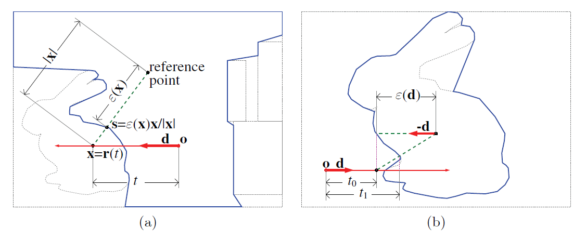

## 基于几何替代物技术的实时多级光线追踪 | Real-Time Multi-Bounce Ray-Tracing with Geometry Impostors

在实时应用中渲染反射和折射物体或它们的焦散（caustics）是一个具有挑战性的问题。其需要非局部着色，这对于光栅化渲染管线来说比较复杂，其中片段着色器只能使用局部插值顶点数据和纹理来查找曲面点的颜色。

物体的反射、折射和其焦散效果通常需要光线跟踪进行渲染，但光线跟踪通常不具备与光栅化渲染相同的性能。

而通常，使用基于纹理的特殊tricks可以将光线跟踪效果加入到实时场景中。这些技术通常假设场景中只有一个反射或折射物体，并且仅考虑一次或两次反射光就足够了。在这章中，遵循了类似的实践原理，但是除去这些限制，以便能够渲染布满玻璃碎片的完整棋盘，甚至折射物体浸没在动画液体中等场景。

这章中扩展了先前基于环境距离替代物技术（environment distance impostors）的近似光线追踪技术，以便在当时硬件条件的限制下，实时渲染具有多个反射和折射物体的场景。

有两个关键的思路。

首先，文章改为使用距离替代物（distance impostor）方法，不将内部光线（internal  rays）与封闭的环境几何体相交，而是将外部光线（external  rays）与物体相交。另外，这章展示了如何高效地追踪二次反射和折射光线，还研究了可以适应相同的任务的其他类型的几何替代物技术 –  如几何图像（geometry images）[Carr et al. 06]和高度场（height fields）[Oliveira et  al. 00, Policarpo et al. 05]。

第二个思路是静态和动态对象的分离。经典的距离替代物（distance  impostors）技术可以用于静态环境，只需要在每一帧中更新移动对象的环境替代物（environment  impostors）。通过搜索几何替代物（geometry impostors）可以找到穿过移动物体的光路。

图（a）环境距离替代物技术（environment distance impostor）（b）具有搜索投影前两步策略的物体距离替代物（Object distance impostor）

 图 左：整个测试场景。 右：使用高度图替代物进行双折射。

这章中扩展了先前基于环境距离替代物技术（environment distance impostors）的近似光线追踪技术，以便在当时硬件条件的限制下，实时渲染具有多个反射和折射物体的场景。

当然，随着技术的发展，2018年已经有了RTX技术，实时光线追踪已经不在话下。以下便是一个能展现实时光线追踪魅力的NVIDIA RTX Demo：

<https://www.youtube.com/watch?v=KJRZTkttgLw>
