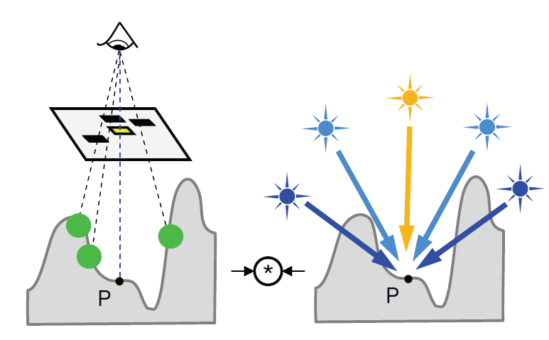
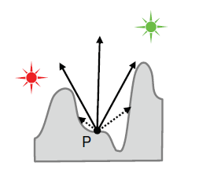
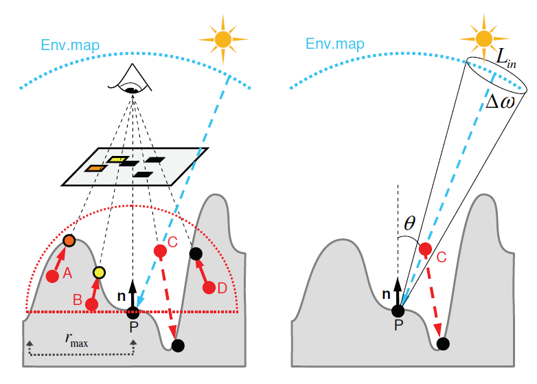
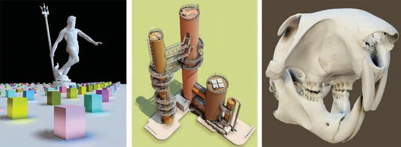

## 屏幕空间定向环境光遮蔽 Screen-Space Directional Occlusion （SSDO）

环境光遮蔽（AO）是全局光照的一种近似，由于其良好的视觉质量和简单的实现[Landis 02]，其常常用于电影和游戏中。环境光遮蔽的基本思想是预先计算网格表面几个位置的平均可见性值。然后这些值在运行时与图形硬件提供的未遮挡光照相乘。

环境光遮蔽的一个缺点是它仅适用于静态场景。如果为每个顶点或纹理元素预先计算了可见性值，则在网格变形时这些值将无效。

动态场景的一些初步想法有[Bunnell 06]和[Hoberock and Jia07]通过用层次圆盘（hierarchy of  discs）近似几何体的思路。处理动态场景的最简单方法是根据帧缓冲区中的信息计算环境光遮蔽，即所谓的屏幕空间环境光遮蔽（SSAO）。这里深度缓冲区用于在运行时计算平均可见度值而不是预先计算。这章内容发表期间的GPU算力已足以实时计算SSAO。此外，该方法不需要场景的任何特殊几何的表现，因为仅使用到帧缓冲器中的信息来计算遮蔽值。甚至不需要使用由多边形组成的三维模型，因为我们可以从产生深度缓冲区的任何渲染计算遮挡。

[
](https://github.com/QianMo/Game-Programmer-Study-Notes/blob/master/Content/%E3%80%8AGPUPro1%E3%80%8B%E5%85%A8%E4%B9%A6%E6%8F%90%E7%82%BC%E6%80%BB%E7%BB%93/media/379bd1804f56e7f478afd38f52fe2652.png) 图 屏幕空间环境光遮蔽（SSAO）：对于帧缓冲器中的每个像素，检查一组相邻像素，并将一个极小的球状物体放置在相应的三维位置。为每个球体计算遮蔽值，并将所有这些值累积到一个环境遮蔽值中。最后，该值乘以来自所有方向的未被遮蔽的光照。

环境光遮蔽通常显示空腔暗化（darkening of cavities）和接触阴影（contact  shadows），但忽略入射光的所有方向信息。发生这种情况是因为只有几何体用于计算环境光遮蔽，而忽略了实际光照。典型的问题情况如下图所示：在方向变化的入射光的情况下，环境光遮蔽将显示错误的颜色。因此，该章将SSAO扩展到称之为屏幕空间定向遮挡（SSDO）的更真实光照技术。

由于循环遍历片段程序中的许多相邻像素，因此可以为每个像素计算单独的可见性值，而不是将所有信息折叠为单个AO值。因此，基本思想是使用来自每个方向的入射光的可见性信息，并仅从可见方向照射，从而产生定向的光照。

为对SSDO的数据做进一步描述，假设有一个深度帧缓冲区，其中包含每像素的位置，法线和反射率值。

[
](https://github.com/QianMo/Game-Programmer-Study-Notes/blob/master/Content/%E3%80%8AGPUPro1%E3%80%8B%E5%85%A8%E4%B9%A6%E6%8F%90%E7%82%BC%E6%80%BB%E7%BB%93/media/c32e665b609fc1b1ceb2b413aac865e4.png)

图 环境光遮蔽的典型问题示例。由于红色光源被遮挡而绿色光源照亮了点P，我们希望在这里看到一个绿色的阴影。但环境遮挡首先计算来自所有方向的光照，因此点P最初为黄色，然后通过某个平均遮挡值进行缩放，从而产生了不正确的棕色。

本章提出的SSDO算法具体可以总结如下：

- 首先，在像素的三维点周围放置一个半球，该半球沿着表面法线定向。该半球的半径r_max是用户参数，其用于决定搜索阻挡物的本地邻域的大小。
- 然后，将一些三维采样点均匀分布在半球内部。同样，采样点数N是用于时间质量平衡的用户参数。
- 接着，测试每个采样方向的光照是否被阻挡或可见。因此，我们将每个采样点反投影到深度帧缓冲区。在像素位置，可以读取表面上的三维位置，并将每个点移动到表面上。如果采样点朝向观察者移动，则它最初位于表面下方并且被分类为被遮挡。如果它远离观察者，它最初在表面上方并且被分类为可见。

在下图的示例中，点A，B和D在表面下方并被分类为遮挡物。只有样本C可见，因为它在表面上方。因此，仅从方向C计算光照。

[
](https://github.com/QianMo/Game-Programmer-Study-Notes/blob/master/Content/%E3%80%8AGPUPro1%E3%80%8B%E5%85%A8%E4%B9%A6%E6%8F%90%E7%82%BC%E6%80%BB%E7%BB%93/media/1418d17ef805f2f67c126551e1fba78f.png)

图  SSDO屏幕空间定向环境光遮蔽。左图：为了计算点P处的方向遮挡，在半球中创建一些均匀分布的采样点，并将它们反投影到深度帧缓冲区中。（最初）在表面下方的每个点被视为遮挡物。  右图：仅从可见点计算光照。在这里，假设每个采样方向的立体角，并使用模糊环境贴图传入光亮度。

[
](https://github.com/QianMo/Game-Programmer-Study-Notes/blob/master/Content/%E3%80%8AGPUPro1%E3%80%8B%E5%85%A8%E4%B9%A6%E6%8F%90%E7%82%BC%E6%80%BB%E7%BB%93/media/e62828ddc53abaa4b53577695ee5b483.jpg)

图 屏幕空间定向环境光遮蔽（Screen-Space Directional Occlusion，SSDO）效果图

### 

### 10.1 核心实现Shader代码

#### 

#### 10.1.1 屏幕空间定向环境光遮蔽SSDO 的Shader源码

```
// Read position and normal of the pixel from deep framebuffer .
vec4 position = texelFetch2D(positionTexture ,
ivec2 ( gl_FragCoord.xy), 0);
vec3 normal = texelFetch2D(normalTexture ,
ivec2( gl_FragCoord.xy), 0);

// Skip pixels without geometry .
if(position .a > 0.0) {
    vec3 directRadianceSum = vec3 (0.0);
    vec3 occluderRadianceSum = vec3 (0.0);
    vec3 ambientRadianceSum = vec3 (0.0);
    float ambientOcclusion = 0.0;

    // Compute a matrix that transform from the unit hemisphere .
    // along z = -1 to the local frame along this normal
    mat3 localMatrix = computeTripodMatrix(normal );

    // Compute the index of the current pattern .
    // We use one out of patternSize * patternSize
    // pre -defined unit hemisphere patterns (seedTexture ).
    // The i’th pixel in every sub -rectangle uses always
    // the same i’th sub -pattern .
    int patternIndex = int (gl_FragCoord.x) % patternSize +
    (int ( gl_FragCoord.y) % patternSize) *
    patternSize ;

    // Loop over all samples from the current pattern .
    for (int i = 0; i < sampleCount ; i++) {

        // Get the i’th sample direction from the row at
        // patternIndex and transfrom it to local space .
        vec3 sample = localMatrix * texelFetch2D(seedTexture ,
        ivec2(i, patternIndex), 0). rgb ;
        vec3 normalizedSample = normalize (sample );

        // Go sample -radius steps along the sample direction ,
        // starting at the current pixel world space location .
        vec4 worldSampleOccluderPosition = position +
        sampleRadius * vec4(sample .x, sample .y , sample .z, 0);

        // Project this world occluder position in the current
        // eye space using the modelview -projection matrix .
        // Due to the deferred shading , the standard OpenGL
        // matrix can not be used.
        vec4 occluderSamplePosition = (projectionMatrix *
        modelviewMatrix) * worldSampleOccluderPosition ;

        // Compute the pixel position of the occluder :
        // Do a division by w first (perspective projection ),
        // then scale /bias by 0.5 to transform [-1,1] -> [0 ,1].
        // Finally scale by the texure resolution .
        vec2 occluderTexCoord = textureSize2D(positionTexture ,0)
        * (vec2 (0.5) + 0.5 * ( occluderSamplePosition .xy /
        occluderSamplePosition .w));

        // Read the occluder position and the occluder normal
        // at the occluder texture coordinate .
        vec4 occluderPosition = texelFetch2D(positionTexture ,
        ivec2 (occluderTexCoord), 0);
        vec3 occluderNormal = texelFetch2D(normalTexture ,
        ivec2 (occluderTexCoord), 0);
        float depth = (modelviewMatrix *
        worldSampleOccluderPosition ).z;

        // Compute depth of corresponding (proj.) pixel position .
        float sampleDepth = (modelviewMatrix *
        occluderPosition).z + depthBias ;

        // Ignore samples that move more than a
        // certain distance due to the projection
        // (typically singularity is set to hemisphere radius ).
        float distanceTerm = abs (depth - sampleDepth) <
        singularity ? 1.0 : 0.0;

        // Compute visibility when sample moves towards viewer .
        // We look along the -z axis , so sampleDepth is
        // larger than depth in this case.
        float visibility = 1.0 - strength *
        (sampleDepth > depth ? 1.0 : 0.0) * distanceTerm;

        // Geometric term of the current pixel towards the
        // current sample direction
        float receiverGeometricTerm = max (0.0,
        dot (normalizedSample , normal ));

        // Compute spherical coordinates (theta , phi )
        // of current sample direction .
        float theta = acos(normalizedSample.y);
        float phi = atan( normalizedSample.z ,normalizedSample.x);
        if (phi < 0) phi += 2*PI;

        // Get environment radiance of this direction from
        // blurred lat /long environment map .
        vec3 senderRadiance = texture2D (envmapTexture ,
        vec2( phi / (2.0* PI), 1.0 - theta / PI ) ).rgb ;

        // Compute radiance as the usual triple product
        // of visibility , radiance , and BRDF.
        // For practical reasons , we post -multiply
        // with the diffuse reflectance color.
        vec3 radiance = visibility * receiverGeometricTerm *
        senderRadiance;

        // Accumulate the radiance from all samples .
        directRadianceSum += radiance ;
        // Indirect light can be computed here
        // (see Indirect Light Listing )
        // The sum of the indirect light is stored
        // in occluderRadianceSum
    }

    // In case of a large value of -strength , the summed
    // radiance can become negative , so we clamp to zero here.
    directRadianceSum = max (vec3(0), directRadianceSum);
    occluderRadianceSum = max (vec3 (0), occluderRadianceSum );

    // Add direct and indirect radiance .
    vec3 radianceSum = directRadianceSum + occluderRadianceSum;

    // Multiply by solid angle and output result .
    radianceSum *= 2.0 * PI / sampleCount ;
    gl_FragColor = vec4(radianceSum , 1.0);
    } else {

    // In case we came across an invalid deferred pixel
    gl_FragColor = vec4 (0.0);
}
```

#### 

#### 10.1.2 SSDO间接光计算Shader实现代码

间接光计算的源代码。 此时，从SSDO计算中已知像素位置和遮挡物位置/纹理坐标。这段代码可以包含在上述SSDO实现代码的循环结尾处。

```
// Read the (sender ) radiance of the occluder .
vec3 directRadiance = texelFetch2D(directRadianceTexture ,
ivec2( occluderTexCoord), 0);

// At this point we already know the occluder position and
// normal from the SSDO computation . Now we compute the distance
// vector between sender and receiver .
vec3 delta = position .xyz - occluderPosition.xyz ;
vec3 normalizedDelta = normalize (delta );

// Compute the geometric term (the formfactor ).
float unclampedBounceGeometricTerm =
max (0.0, dot (normalizedDelta , -normal )) *
max (0.0, dot (normalizedDelta , occluderNormal)) /
dot (delta , delta );

// Clamp geometric term to avoid problems with close occluders .
float bounceGeometricTerm = min (unclampedBounceGeometricTerm ,
bounceSingularity);

// Compute the radiance at the receiver .
vec3 occluderRadiance = bounceStrength * directRadiance *
bounceGeometricTerm ;

// Finally , add the indirect light to the sum of indirect light .
occluderRadianceSum += occluderRadiance;
```
