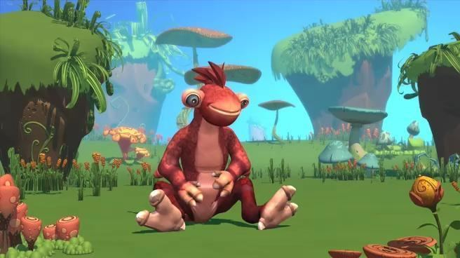
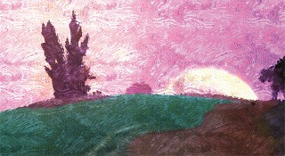
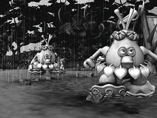
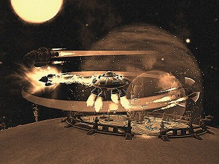

## 《孢子（Spore）》中的风格化渲染 | Stylized Rendering in Spore

《孢子（Spore）》是一款非常有创意的游戏。在游戏《孢子（Spore）》中，使用了可编程过滤链系统（scriptable filter  chain system）在运行时对帧进行处理，以实现游戏整体独特的风格化渲染。（注，在本文中，filter按语境，译为滤波或者过滤）。

[
](https://github.com/QianMo/Game-Programmer-Study-Notes/blob/master/Content/%E3%80%8AGPUPro1%E3%80%8B%E5%85%A8%E4%B9%A6%E6%8F%90%E7%82%BC%E6%80%BB%E7%BB%93/media/620848421a07229f820409740714677c.jpg)

图 《孢子》封面图

[
](https://github.com/QianMo/Game-Programmer-Study-Notes/blob/master/Content/%E3%80%8AGPUPro1%E3%80%8B%E5%85%A8%E4%B9%A6%E6%8F%90%E7%82%BC%E6%80%BB%E7%BB%93/media/3a9aa2f3ef677c1efe33fe4ca8307e33.jpg)

图 《孢子》中的风格化渲染

过滤器链（filter chain）可以看作一系列按顺序应用的参数化的图像处理（image processing）着色器，即后处理链。《孢子》中的每一帧都使用此系统进行处理和合成。 除了《孢子》标准的艺术导向的视觉风格外，开发人员还创建了一组特有的滤波器，为游戏产生截然不同的视觉风格。而在这章中，作者讲到了一些在开发《孢子》时生成的视觉样式，并分享了关于《孢子》过滤器链系统的设计和实现的细节。

诸如模糊（blur），边缘检测（edge detection）等图像处理技术的GPU实现在图像处理领域较为常见。《孢子》的开发目标是构建一个具有此类过滤器的调色系统，美术师可以利用这些过滤器来创作不同的视觉样式。 下图显示了该系统在渲染管线中如何进行放置。

[
](https://github.com/QianMo/Game-Programmer-Study-Notes/blob/master/Content/%E3%80%8AGPUPro1%E3%80%8B%E5%85%A8%E4%B9%A6%E6%8F%90%E7%82%BC%E6%80%BB%E7%BB%93/media/38e267d74e73bc8bc3639a7b9fe48458.jpg)

图 过滤器链系统总览

[
](https://github.com/QianMo/Game-Programmer-Study-Notes/blob/master/Content/%E3%80%8AGPUPro1%E3%80%8B%E5%85%A8%E4%B9%A6%E6%8F%90%E7%82%BC%E6%80%BB%E7%BB%93/media/35cfe05da7330c1802b4cf2bdfb1935e.jpg)

图 《孢子》中以油画方式进行渲染的飞机

下图显示了《孢子》中细胞阶段的过滤器链如何使用由渲染管线的其他阶段生成的多个输入纹理，并形成最终的合成帧。

[
](https://github.com/QianMo/Game-Programmer-Study-Notes/blob/master/Content/%E3%80%8AGPUPro1%E3%80%8B%E5%85%A8%E4%B9%A6%E6%8F%90%E7%82%BC%E6%80%BB%E7%BB%93/media/550c7bbdfa3b0092d0d739aa418c6392.jpg)

图 《孢子》中细胞阶段游戏流体环境的复杂过滤器链

### 

### 1.1 后处理过滤链系统的实现要点

过滤链系统实现的方面，分为两个要点：

- 动态参数（Dynamic parameters）
- 自定义过滤器（Custom filters）

#### 

#### 1.1.1 动态参数（Dynamic parameters）

《孢子》中的动态环境需要调用按帧变化参数。所以，游戏中添加了可以通过任何过滤器访问的每帧更新的全局参数。例如，使用相机高度和当日时间作为行星大气过滤器的变化参数，如下图。

而在其他情况下，游戏需要在给定过滤器的两组不同参数值之间平滑插值。例如，每当天气系统开始下雨时，全局着色过滤器的颜色就会转换为阴天的灰色。在系统中也添加了支持游戏控制插值的参数，也添加了可以平滑改变滤波器强度的衰减器（fader）。

[
](https://github.com/QianMo/Game-Programmer-Study-Notes/blob/master/Content/%E3%80%8AGPUPro1%E3%80%8B%E5%85%A8%E4%B9%A6%E6%8F%90%E7%82%BC%E6%80%BB%E7%BB%93/media/fe557549ec3c7e0251042e8c6de65d56.jpg)

图 按当日时间驱动的颜色过滤器。这种经过彩色压缩的输出会进行模糊并以bloom的方式添加到场景中

#### 

#### 1.1.2 自定义过滤器（Custom filters）

过滤链系统的一个重要补充是自定义过滤器，可以将其着色器指定为参数。这意味着程序员可以通过向现有构建添加新着色器来轻松添加新的图像技术。此外，程序员可以通过将多个过滤器折叠到一个实现相同视觉效果的自定义过滤器中来优化艺术家生成的过滤器链。

### 

### 1.2 五种屏幕后处理Shader的实现思路

接着，介绍五种《孢子》中比较有意思的后处理效果。

#### 

#### 1.2.1 油画后处理效果 Oil Paint Filter

对于油画过滤器（Oil Paint Filter），首先渲染画笔描边的法线贴图，用于对传入的场景进行扭曲。 然后使用相同的法线贴图结合三个光源照亮图像空间中的笔触（Brush stroke）。 而笔触可以通过带状的粒子特效驱动，使过滤效果变得动态，并且在时间上更加连贯。

[
](https://github.com/QianMo/Game-Programmer-Study-Notes/blob/master/Content/%E3%80%8AGPUPro1%E3%80%8B%E5%85%A8%E4%B9%A6%E6%8F%90%E7%82%BC%E6%80%BB%E7%BB%93/media/c8625692aaef6f4020e93d430f6e2c1b.jpg)

图 《孢子》中的油画后处理效果

用于油画效果的像素着色器核心代码如下：

```
# Oil Paint Effect
# kDistortionScale 0.01, kBrighten 2.0
# kNormalScales (1.5, 2.5, 1.6)
# Get the normal map and bring normals into [-1,1] range
half4 pNormalMap = tex2D ( normalMap , fragIn .uv0 );
half3 nMapNormal = 2 * pNormalMap .rgb - half3( 1, 1, 1 );


# Distort the UVs using normals ( Dependent Texture Read!)
half4 pIn = tex2D (sceneTex ,
saturate (uv - nMapNormal .xy * kDistortionScale) );


# Generate the image space lit scene
half3 fakeTangN = nMapNormal .rbg * kNormalScales;
fakeTangN = normalize (fakeTangN );

# Do this for 3 lights and sum , choose different directions
# and colors for the lights
half NDotL = saturate (dot (kLightDir , fakeTangN ));
half3 normalMappingComponent = NDotL * kLightColor ;

# Combine distorted scene with lit scene
OUT .color .rgb = pIn .rgb * normalMappingComponent * kBrighten ;
```

#### 

#### 1.2.2 水彩画后处理效果 Watercolor Filter

对于水彩画过滤器（watercolor filter）。首先，使用传入场景的简易Sobel边缘检测版本与原始场景相乘。 然后使用平滑滤波器（smoothing filter）的四个pass对结果进行平滑，且该平滑滤波器从四周的taps中找到每个pass的最亮值。 接着，基于边缘检测的轮廓添加一些在平滑过程中丢失的精确度。 具体核心代码如下，而offset和scales是可调的参数，允许我们改变绘制涂抹笔触的大小。

[
](https://github.com/QianMo/Game-Programmer-Study-Notes/blob/master/Content/%E3%80%8AGPUPro1%E3%80%8B%E5%85%A8%E4%B9%A6%E6%8F%90%E7%82%BC%E6%80%BB%E7%BB%93/media/49cf56255f1f35c49c3bb4e0b719b8fa.jpg)

图 《孢子》中的水彩后处理效果

《孢子》中的水彩后处理效果像素着色器代码如下：

```
# Water Color Smoothing
# kScaleX = 0.5, kScaleY = 0.5
# offsetX1 = 1.5 * kScaleX offsetY1 = 1.5 * kScaleX
# offsetX2 = 0.5 * kScaleX offsetY2 = 0.5 * kScaleY

# Get the taps
tap0 = tex2D (sceneTex , uv + float2 (-offsetX1 ,-offsetY1 ));
tap1 = tex2D (sceneTex , uv + float2 (-offsetX2 ,-offsetY2 ));
tap2 = tex2D (sceneTex , uv + float2 (offsetX2 , offsetY2 ));
tap3 = tex2D (sceneTex , uv + float2 (offsetX1 , offsetY1 ));

# Find highest value for each channel from all four taps
ret0 = step(tap1 , tap0 );
ret1 = step(tap3 , tap2 );
tapwin1 = tap0* ret0 + tap1 * (1.0 - ret0);
tapwin2 = tap2* ret1 + tap3 * (1.0 - ret1);
ret = step(tapwin2 , tapwin1 );
OUT .color .rgb = tapwin1 * ret + (1.0 -ret) * tapwin2 ;
```

#### 

#### 1.2.3 8位后处理效果 8-Bit Filter

[
](https://github.com/QianMo/Game-Programmer-Study-Notes/blob/master/Content/%E3%80%8AGPUPro1%E3%80%8B%E5%85%A8%E4%B9%A6%E6%8F%90%E7%82%BC%E6%80%BB%E7%BB%93/media/4cd49abf4519cebc88ce3c40e7aa1b40.jpg)

图 8-Bit Filter

要创建一个8位滤波器（8-Bit Filter），可以使用像素着色器中的round函数，并通过点采样绘制到游戏分辨率大小1/4的低分辨率缓冲区中。 这是一个非常简单的效果，使游戏看起来像一个旧式8位游戏。

《孢子》中8-bit后处理效果的像素着色器代码如下：

```
# 8 Bit Filter
# kNumBits : values between 8 and 20 look good
half4 source = tex2D (sourceTex , fragIn .uv0 );
OUT .color .rgb = round (source .rgb * kNumBits) / kNumBits ;
```

#### 

#### 1.2.4 黑色电影后处理效果 Film Noir Filter

在创建黑色电影后处理效果时，首先将传入的场景转换为黑白。 然后进行缩放和偏移。添加一些噪声，雨水颗粒效果是很好的画龙点睛。

[
](https://github.com/QianMo/Game-Programmer-Study-Notes/blob/master/Content/%E3%80%8AGPUPro1%E3%80%8B%E5%85%A8%E4%B9%A6%E6%8F%90%E7%82%BC%E6%80%BB%E7%BB%93/media/e3b9349a1ba9e4b4bf7abfcbc9df0e60.png)

图 《孢子》中黑色电影后处理效果

《孢子》中黑色电影后处理像素着色器代码如下，其中，kNoiseTile可用于调整粒度，而kBias和kScale用作线性对比度拉伸的参数：

```
# Film Noir filter
# kNoiseTile is 4.0
# kBias is 0.15, kScale is 1.5
# kNoiseScale is 0.12
pIn = tex2D (sourceTex , uv);
pNoise = tex2D (noiseTex , uv * kNoiseTile) ;

# Standard desaturation
converter = half3 (0.23 , 0.66, 0.11);
bwColor = dot (pIn .rgb , converter );

# Scale and bias
stretched = saturate (bwColor - kBias) * kScale ;

# Add
OUT .color .rgb = stretched + pNoise * kNoiseScale ;
```

#### 

#### 1.2.5 旧电影后处理效果 Old Film Filter

对于旧电影后处理效果，可以采用简单的棕褐色着色与锐化滤波器（sharpen filter）相结合。 且可以使用粒子效果进行划痕和渐晕的处理。

[
](https://github.com/QianMo/Game-Programmer-Study-Notes/blob/master/Content/%E3%80%8AGPUPro1%E3%80%8B%E5%85%A8%E4%B9%A6%E6%8F%90%E7%82%BC%E6%80%BB%E7%BB%93/media/92e02f49298b69da103f846bc388116f.jpg)

图 旧电影后处理效果

《孢子》中旧电影后处理效果像素着色器代码如下：

```
# Old Film Filter
# offsetX and offsetY are 2 pixels . With such wide taps , we
# get that weird sharpness that old photos have.
# kNoiseTile is 5.0, kNoiseScale is 0.18
# kSepiaRGB is (0.8, 0.5, 0.3)
# Get the scene and noise textures
float4 sourceColor = tex2D (sourceTex , uv);
float4 noiseColor = tex2D (noiseTex , uv * kNoiseTile );

# sharpen filter
tap0 = tex2D (sceneTex , uv + float2 (0, -offsetY ));
tap1 = tex2D (sceneTex , uv + float2 (0, offsetY ));
tap2 = tex2D (sceneTex , uv + float2 (-offsetX , 0));
tap3 = tex2D (sceneTex , uv + float2 (offsetX , 0));
sourceColor = 5 * sourceColor - (tap0 + tap1 + tap2 + tap3 );

# Sepia colorize
float4 converter = float4 (0.23 , 0.66, 0.11, 0);
float bwColor = dot (sourceColor , converter );
float3 sepia = kSepiaRGB * bwColor ;

# Add noise
OUT .color = sepia * kTintScale + noiseColor * kNoiseScale ;
```

关于《孢子》更多的风格化渲染的教程，可以在这里找到：

<http://www.spore.com/comm/tutorials>
