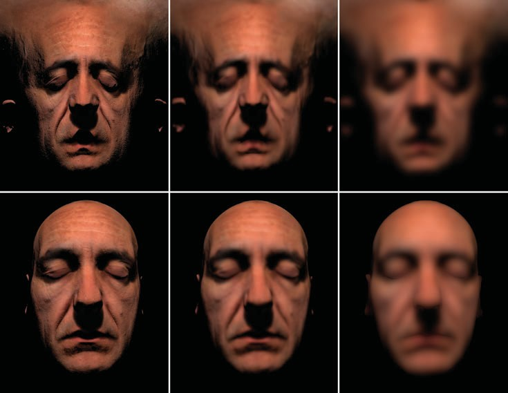
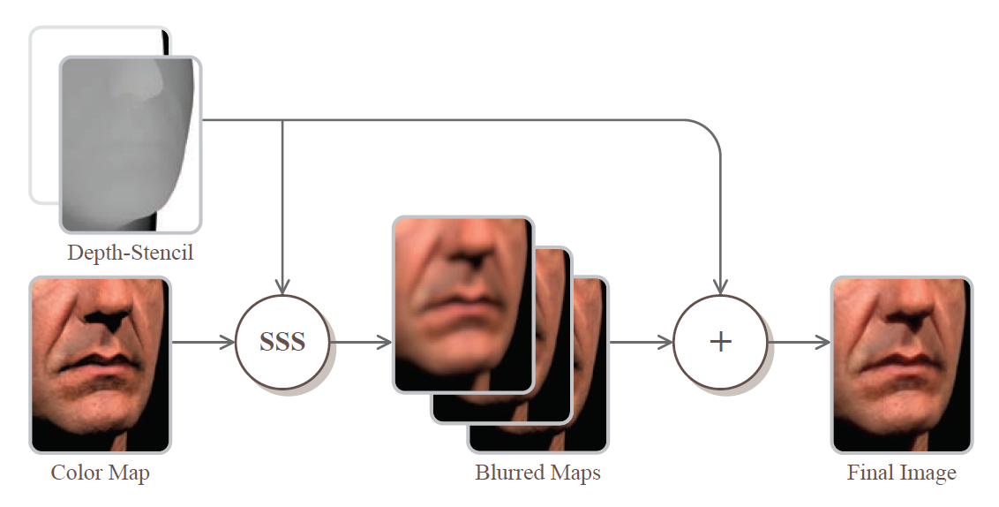

## 屏幕空间次表面散射 | Screen-Space Subsurface Scattering

这章提出了一种能够以后处理的方式，将渲染帧的深度-模板和颜色缓冲区作为输入，来模拟屏幕空间中的次表面散射的算法。此算法开创了皮肤渲染领域的基于屏幕空间的新流派。其具有非常简单的实现，在性能，通用性和质量之间取得了很好的平衡。

[
](https://github.com/QianMo/Game-Programmer-Study-Notes/blob/master/Content/%E3%80%8AGPUPro1%E3%80%8B%E5%85%A8%E4%B9%A6%E6%8F%90%E7%82%BC%E6%80%BB%E7%BB%93/media/b3fed4591cc69b98184b1b5f8b0a4104.jpg)

图 在纹理空间中执行模糊处理，如当前的实时次表面散射算法（上图）所做的那样，直接在屏幕空间完成模糊（下图）

该算法转换了从纹理到屏幕空间的扩散近似的计算思路。主要思想并不是计算辐照度图并将其与扩散剖面进行卷积，而是将卷积直接应用于最终渲染图像。下显示了此算法的核心思想。

[
](https://github.com/QianMo/Game-Programmer-Study-Notes/blob/master/Content/%E3%80%8AGPUPro1%E3%80%8B%E5%85%A8%E4%B9%A6%E6%8F%90%E7%82%BC%E6%80%BB%E7%BB%93/media/30099c1363ddb9474a7d78f54bd25ac3.png)

图 屏幕空间次表面散射流程图

需要注意的是，要在屏幕空间中执行此工作，需要输入渲染该帧的深度模板和颜色缓冲区。

[
](https://github.com/QianMo/Game-Programmer-Study-Notes/blob/master/Content/%E3%80%8AGPUPro1%E3%80%8B%E5%85%A8%E4%B9%A6%E6%8F%90%E7%82%BC%E6%80%BB%E7%BB%93/media/8b3a9dd264b68e76d4d9421a8b83a214.png)

图 屏幕空间次表面散射示例。与纹理空间方法不同，屏幕空间的方法可以很好地适应场景中的对象数量（上图）。在不考虑次表面散射的情况下进行渲染会导致石头般的外观（左下图）;次表面散射技术用于创建更柔和的外观，更能好地代表次表面散射效果（右下图）。

本章提出的次表面散射算法当物体处于中等距离时，提供了与Hable等人的方法[Hable et  al.09]类似的性能，并且随着物体数量的增加能更好地胜任工作。且此方法更好地推广到其他材质。在特写镜头中，其确实需要用一些性能去换取更好的质量，但它能够保持原来d'Eon方法的肉感（fleshiness）[d’Eon  and Luebke 07]。但是，在这些特写镜头中，玩家很可能会密切关注角色的脸部，因此值得花费额外的资源来为角色的皮肤提供更好的渲染质量。

### 

### 18.1 核心实现Shader代码

进行水平高斯模糊的像素着色器代码：

```
float width ;
float sssLevel , correction , maxdd;
float2 pixelSize ;
Texture2D colorTex , depthTex ;

float4 BlurPS (PassV2P input) : SV_TARGET {
    float w[7] = { 0.006 , 0.061 , 0.242 , 0.382 ,
    0.242 , 0.061 , 0.006 };

    float depth = depthTex .Sample (PointSampler ,
    input .texcoord ).r;
    float2 s_x = sssLevel / (depth + correction *
    min (abs (ddx (depth )), maxdd ));
    float2 finalWidth = s_x * width * pixelSize *
    float2 (1.0, 0.0);
    float2 offset = input .texcoord - finalWidth ;
    float4 color = float4 (0.0, 0.0, 0.0, 1.0);

    for (int i = 0; i < 7; i++) {
        float3 tap = colorTex .Sample (LinearSampler , offset ).rgb ;
        color .rgb += w[i] * tap ;
        offset += finalWidth / 3.0;
    }

    return color ;
}
```
