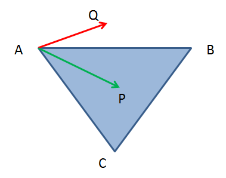

## [断点是否在三角形内](https://www.cnblogs.com/graphics/archive/2010/08/05/1793393.html) 		

**本文只是翻译和整理，原文在此http://www.blackpawn.com/texts/pointinpoly/default.html**

# 概述

给定三角形ABC和一点P(x,y,z)，判断点P是否在ABC内。这是游戏设计中一个常见的问题。需要注意的是，这里假定点和三角形位于同一个平面内。

本文介绍三种不同的方法，由浅入深

# 一 内角和法

连接点P和三角形的三个顶点得到三条线段PA，PB和PC，求出这三条线段与三角形各边的夹角，如果所有夹角之和为180度，那么点P在三角形内，否则不在，此法直观，但效率低下。


# 二 同向法

假设点P位于三角形内，会有这样一个规律，当我们沿着ABCA的方向在三条边上行走时，你会发现点P始终位于边AB，BC和CA的右侧。我们就利用这一点，但是如何判断一个点在线段的左侧还是右侧呢？我们可以从另一个角度来思考，当选定线段AB时，点C位于AB的右侧，同理选定BC时，点A位于BC的右侧，最后选定CA时，点B位于CA的右侧，所以当选择某一条边时，我们只需验证点P与该边所对的点在同一侧即可。问题又来了，如何判断两个点在某条线段的同一侧呢？可以通过叉积来实现，连接PA，将PA和AB做叉积，再将CA和AB做叉积，如果两个叉积的结果方向一致，那么两个点在同一测。判断两个向量的是否同向可以用点积实现，如果点积大于0，则两向量夹角是锐角，否则是钝角。

 


代码如下，为了实现程序功能，添加了一个Vector3类，该类表示三维空间中的一个向量。

[](javascript:void(0);)

```
// 3D vector
class Vector3
{
public:
    Vector3(float fx, float fy, float fz)
        :x(fx), y(fy), z(fz)
    {
    }

    // Subtract
    Vector3 operator - (const Vector3& v) const
    {
        return Vector3(x - v.x, y - v.y, z - v.z) ;
    }

    // Dot product
    float Dot(const Vector3& v) const
    {
        return x * v.x + y * v.y + z * v.z ;
    }

    // Cross product
    Vector3 Cross(const Vector3& v) const
    {
        return Vector3(
            y * v.z - z * v.y,
            z * v.x - x * v.z,
            x * v.y - y * v.x ) ;
    }

public:
    float x, y, z ;
};

// Determine whether two vectors v1 and v2 point to the same direction
// v1 = Cross(AB, AC)
// v2 = Cross(AB, AP)
bool SameSide(Vector3 A, Vector3 B, Vector3 C, Vector3 P)
{
    Vector3 AB = B - A ;
    Vector3 AC = C - A ;
    Vector3 AP = P - A ;

    Vector3 v1 = AB.Cross(AC) ;
    Vector3 v2 = AB.Cross(AP) ;

    // v1 and v2 should point to the same direction
    return v1.Dot(v2) >= 0 ;
}

// Same side method
// Determine whether point P in triangle ABC
bool PointinTriangle1(Vector3 A, Vector3 B, Vector3 C, Vector3 P)
{
    return SameSide(A, B, C, P) &&
        SameSide(B, C, A, P) &&
        SameSide(C, A, B, P) ;
}
```

[](javascript:void(0);)

# 三 重心法

上面这个方法简单易懂，速度也快，下面这个方法速度更快，只是稍微多了一点数学而已

三角形的三个点在同一个平面上，如果选中其中一个点，其他两个点不过是相对该点的位移而已，比如选择点A作为起点，那么点B相当于在AB方向移动一段距离得到，而点C相当于在AC方向移动一段距离得到。


所以对于平面内任意一点，都可以由如下方程来表示

P = A +  u * (C – A) + v * (B - A) // 方程1

如果系数u或v为负值，那么相当于朝相反的方向移动，即BA或CA方向。那么如果想让P位于三角形ABC内部，u和v必须满足什么条件呢？有如下三个条件

u >= 0

v >= 0

u + v <= 1

几个边界情况，当u = 0且v = 0时，就是点A，当u = 0,v = 1时，就是点B，而当u = 1, v = 0时，就是点C

整理方程1得到P – A = u(C - A) + v(B - A)

令v0 = C – A, v1 = B – A, v2 = P – A，则v2 = u * v0 + v * v1，现在是一个方程，两个未知数，无法解出u和v，将等式两边分别点乘v0和v1的到两个等式

(v2) • v0 = (u * v0 + v * v1) • v0

(v2) • v1 = (u * v0 + v * v1) • v1

注意到这里u和v是数，而v0，v1和v2是向量，所以可以将点积展开得到下面的式子。

v2 • v0 = u * (v0 • v0) + v * (v1 • v0)  // 式1

v2 • v1 = u * (v0 • v1) + v * (v1• v1)   // 式2

解这个方程得到

u = ((v1•v1)(v2•v0)-(v1•v0)(v2•v1)) / ((v0•v0)(v1•v1) - (v0•v1)(v1•v0))

v = ((v0•v0)(v2•v1)-(v0•v1)(v2•v0)) / ((v0•v0)(v1•v1) - (v0•v1)(v1•v0))

是时候上代码了，这段代码同样用到上面的Vector3类

[](javascript:void(0);)

```
// Determine whether point P in triangle ABC
bool PointinTriangle(Vector3 A, Vector3 B, Vector3 C, Vector3 P)
{
    Vector3 v0 = C - A ;
    Vector3 v1 = B - A ;
    Vector3 v2 = P - A ;

    float dot00 = v0.Dot(v0) ;
    float dot01 = v0.Dot(v1) ;
    float dot02 = v0.Dot(v2) ;
    float dot11 = v1.Dot(v1) ;
    float dot12 = v1.Dot(v2) ;

    float inverDeno = 1 / (dot00 * dot11 - dot01 * dot01) ;

    float u = (dot11 * dot02 - dot01 * dot12) * inverDeno ;
    if (u < 0 || u > 1) // if u out of range, return directly
    {
        return false ;
    }

    float v = (dot00 * dot12 - dot01 * dot02) * inverDeno ;
    if (v < 0 || v > 1) // if v out of range, return directly
    {
        return false ;
    }

    return u + v <= 1 ;
}
```

[](javascript:void(0);)

关于重心坐标

<http://mathworld.wolfram.com/BarycentricCoordinates.html> 

Happy coding!

==The End==
