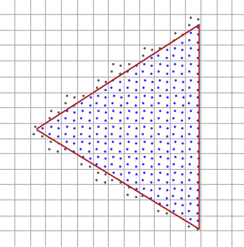
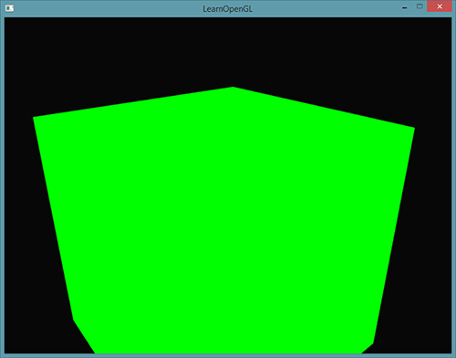

# 抗锯齿

| 原文 | [Anti Aliasing](http://learnopengl.com/#!Advanced-OpenGL/Anti-Aliasing) |
| ---- | ------------------------------------------------------------ |
| 作者 | JoeyDeVries                                                  |
| 翻译 | Krasjet, [Django](http://bullteacher.com/)                   |
| 校对 | 暂未校对                                                     |

在学习渲染的旅途中，你可能会时不时遇到模型边缘有锯齿的情况。这些锯齿边缘(Jagged Edges)的产生和光栅器将顶点数据转化为片段的方式有关。在下面的例子中，你可以看到，我们只是绘制了一个简单的立方体，你就能注意到它存在锯齿边缘了：


可能不是非常明显，但如果你离近仔细观察立方体的边缘，你就应该能够看到锯齿状的图案。如果放大的话，你会看到下面的图案：


这很明显不是我们想要在最终程序中所实现的效果。你能够清楚看见形成边缘的像素。这种现象被称之为走样(Aliasing)。有很多种抗锯齿（Anti-aliasing，也被称为反走样）的技术能够帮助我们缓解这种现象，从而产生更**平滑**的边缘。

最开始我们有一种叫做超采样抗锯齿(Super Sample Anti-aliasing, SSAA)的技术，它会使用比正常分辨率更高的分辨率（即超采样）来渲染场景，当图像输出在帧缓冲中更新时，分辨率会被下采样(Downsample)至正常的分辨率。这些**额外的**分辨率会被用来防止锯齿边缘的产生。虽然它确实能够解决走样的问题，但是由于这样比平时要绘制更多的片段，它也会带来很大的性能开销。所以这项技术只拥有了短暂的辉煌。

然而，在这项技术的基础上也诞生了更为现代的技术，叫做多重采样抗锯齿(Multisample Anti-aliasing, MSAA)。它借鉴了SSAA背后的理念，但却以更加高效的方式实现了抗锯齿。我们在这一节中会深度讨论OpenGL中内建的MSAA技术。

## 多重采样

为了理解什么是多重采样(Multisampling)，以及它是如何解决锯齿问题的，我们有必要更加深入地了解OpenGL光栅器的工作方式。

光栅器是位于最终处理过的顶点之后到片段着色器之前所经过的所有的算法与过程的总和。光栅器会将一个图元的所有顶点作为输入，并将它转换为一系列的片段。顶点坐标理论上可以取任意值，但片段不行，因为它们受限于你窗口的分辨率。顶点坐标与片段之间几乎永远也不会有一对一的映射，所以光栅器必须以某种方式来决定每个顶点最终所在的片段/屏幕坐标。


这里我们可以看到一个屏幕像素的网格，每个像素的中心包含有一个采样点(Sample Point)，它会被用来决定这个三角形是否遮盖了某个像素。图中红色的采样点被三角形所遮盖，在每一个遮住的像素处都会生成一个片段。虽然三角形边缘的一些部分也遮住了某些屏幕像素，但是这些像素的采样点并没有被三角形**内部**所遮盖，所以它们不会受到片段着色器的影响。

你现在可能已经清楚走样的原因了。完整渲染后的三角形在屏幕上会是这样的：


由于屏幕像素总量的限制，有些边缘的像素能够被渲染出来，而有些则不会。结果就是我们使用了不光滑的边缘来渲染图元，导致之前讨论到的锯齿边缘。

多重采样所做的正是将单一的采样点变为多个采样点（这也是它名称的由来）。我们不再使用像素中心的单一采样点，取而代之的是以特定图案排列的4个子采样点(Subsample)。我们将用这些子采样点来决定像素的遮盖度。当然，这也意味着颜色缓冲的大小会随着子采样点的增加而增加。


上图的左侧展示了正常情况下判定三角形是否遮盖的方式。在例子中的这个像素上不会运行片段着色器（所以它会保持空白）。因为它的采样点并未被三角形所覆盖。上图的右侧展示的是实施多重采样之后的版本，每个像素包含有4个采样点。这里，只有两个采样点遮盖住了三角形。

采样点的数量可以是任意的，更多的采样点能带来更精确的遮盖率。

从这里开始多重采样就变得有趣起来了。我们知道三角形只遮盖了2个子采样点，所以下一步是决定这个像素的颜色。你的猜想可能是，我们对每个被遮盖住的子采样点运行一次片段着色器，最后将每个像素所有子采样点的颜色平均一下。在这个例子中，我们需要在两个子采样点上对被插值的顶点数据运行两次片段着色器，并将结果的颜色储存在这些采样点中。（幸运的是）这并**不是**它工作的方式，因为这本质上说还是需要运行更多次的片段着色器，会显著地降低性能。

MSAA真正的工作方式是，无论三角形遮盖了多少个子采样点，（每个图元中）每个像素只运行**一次**片段着色器。片段着色器所使用的顶点数据会插值到每个像素的**中心**，所得到的结果颜色会被储存在每个被遮盖住的子采样点中。当颜色缓冲的子样本被图元的所有颜色填满时，所有的这些颜色将会在每个像素内部平均化。因为上图的4个采样点中只有2个被遮盖住了，这个像素的颜色将会是三角形颜色与其他两个采样点的颜色（在这里是无色）的平均值，最终形成一种淡蓝色。

这样子做之后，颜色缓冲中所有的图元边缘将会产生一种更平滑的图形。让我们来看看前面三角形的多重采样会是什么样子：



这里，每个像素包含4个子采样点（不相关的采样点都没有标注），蓝色的采样点被三角形所遮盖，而灰色的则没有。对于三角形的内部的像素，片段着色器只会运行一次，颜色输出会被存储到全部的4个子样本中。而在三角形的边缘，并不是所有的子采样点都被遮盖，所以片段着色器的结果将只会储存到部分的子样本中。根据被遮盖的子样本的数量，最终的像素颜色将由三角形的颜色与其它子样本中所储存的颜色来决定。

简单来说，一个像素中如果有更多的采样点被三角形遮盖，那么这个像素的颜色就会更接近于三角形的颜色。如果我们给上面的三角形填充颜色，就能得到以下的效果：


对于每个像素来说，越少的子采样点被三角形所覆盖，那么它受到三角形的影响就越小。三角形的不平滑边缘被稍浅的颜色所包围后，从远处观察时就会显得更加平滑了。

不仅仅是颜色值会受到多重采样的影响，深度和模板测试也能够使用多个采样点。对深度测试来说，每个顶点的深度值会在运行深度测试之前被插值到各个子样本中。对模板测试来说，我们对每个子样本，而不是每个像素，存储一个模板值。当然，这也意味着深度和模板缓冲的大小会乘以子采样点的个数。

我们到目前为止讨论的都是多重采样抗锯齿的背后原理，光栅器背后的实际逻辑比目前讨论的要复杂，但你现在应该已经可以理解多重采样抗锯齿的大体概念和逻辑了。

(译者注： 如果看到这里还是对原理似懂非懂，可以简单看看知乎上[@文刀秋二](https://www.zhihu.com/people/edliu/answers)对抗锯齿技术的[精彩介绍](https://www.zhihu.com/question/20236638/answer/14438218))

## OpenGL中的MSAA

如果我们想要在OpenGL中使用MSAA，我们必须要使用一个能在每个像素中存储大于1个颜色值的颜色缓冲（因为多重采样需要我们为每个采样点都储存一个颜色）。所以，我们需要一个新的缓冲类型，来存储特定数量的多重采样样本，它叫做多重采样缓冲(Multisample Buffer)。

大多数的窗口系统都应该提供了一个多重采样缓冲，用以代替默认的颜色缓冲。GLFW同样给了我们这个功能，我们所要做的只是**提示**(Hint) GLFW，我们希望使用一个包含N个样本的多重采样缓冲。这可以在创建窗口之前调用glfwWindowHint来完成。

```
glfwWindowHint(GLFW_SAMPLES, 4);
```

现在再调用glfwCreateWindow创建渲染窗口时，每个屏幕坐标就会使用一个包含4个子采样点的颜色缓冲了。GLFW会自动创建一个每像素4个子采样点的深度和样本缓冲。这也意味着所有缓冲的大小都增长了4倍。

现在我们已经向GLFW请求了多重采样缓冲，我们还需要调用glEnable并启用GL_MULTISAMPLE，来启用多重采样。在大多数OpenGL的驱动上，多重采样都是默认启用的，所以这个调用可能会有点多余，但显式地调用一下会更保险一点。这样子不论是什么OpenGL的实现都能够正常启用多重采样了。

```
glEnable(GL_MULTISAMPLE);
```

只要默认的帧缓冲有了多重采样缓冲的附件，我们所要做的只是调用glEnable来启用多重采样。因为多重采样的算法都在OpenGL驱动的光栅器中实现了，我们不需要再多做什么。如果现在再来渲染本节一开始的那个绿色的立方体，我们应该能看到更平滑的边缘：



这个箱子看起来的确要平滑多了，如果在场景中有其它的物体，它们也会看起来平滑很多。你可以在[这里](https://learnopengl.com/code_viewer.php?code=advanced/anti_aliasing_multisampling)找到这个简单例子的源代码。

## 离屏MSAA

由于GLFW负责了创建多重采样缓冲，启用MSAA非常简单。然而，如果我们想要使用我们自己的帧缓冲来进行离屏渲染，那么我们就必须要自己动手生成多重采样缓冲了。

有两种方式可以创建多重采样缓冲，将其作为帧缓冲的附件：纹理附件和渲染缓冲附件，这和在[帧缓冲](https://learnopengl-cn.github.io/04%20Advanced%20OpenGL/05 Framebuffers/)教程中所讨论的普通附件很相似。

### 多重采样纹理附件

为了创建一个支持储存多个采样点的纹理，我们使用glTexImage2DMultisample来替代glTexImage2D，它的纹理目标是GL_TEXTURE_2D_MULTISAPLE。

```
glBindTexture(GL_TEXTURE_2D_MULTISAMPLE, tex);
glTexImage2DMultisample(GL_TEXTURE_2D_MULTISAMPLE, samples, GL_RGB, width, height, GL_TRUE);
glBindTexture(GL_TEXTURE_2D_MULTISAMPLE, 0);
```

它的第二个参数设置的是纹理所拥有的样本个数。如果最后一个参数为GL_TRUE，图像将会对每个纹素使用相同的样本位置以及相同数量的子采样点个数。

我们使用glFramebufferTexture2D将多重采样纹理附加到帧缓冲上，但这里纹理类型使用的是GL_TEXTURE_2D_MULTISAMPLE。

```
glFramebufferTexture2D(GL_FRAMEBUFFER, GL_COLOR_ATTACHMENT0, GL_TEXTURE_2D_MULTISAMPLE, tex, 0);
```

当前绑定的帧缓冲现在就有了一个纹理图像形式的多重采样颜色缓冲。

### 多重采样渲染缓冲对象

和纹理类似，创建一个多重采样渲染缓冲对象并不难。我们所要做的只是在指定（当前绑定的）渲染缓冲的内存存储时，将glRenderbufferStorage的调用改为glRenderbufferStorageMultisample就可以了。

```
glRenderbufferStorageMultisample(GL_RENDERBUFFER, 4, GL_DEPTH24_STENCIL8, width, height);
```

函数中，渲染缓冲对象后的参数我们将设定为样本的数量，在当前的例子中是4。

### 渲染到多重采样帧缓冲

渲染到多重采样帧缓冲对象的过程都是自动的。只要我们在帧缓冲绑定时绘制任何东西，光栅器就会负责所有的多重采样运算。我们最终会得到一个多重采样颜色缓冲以及/或深度和模板缓冲。因为多重采样缓冲有一点特别，我们不能直接将它们的缓冲图像用于其他运算，比如在着色器中对它们进行采样。

一个多重采样的图像包含比普通图像更多的信息，我们所要做的是缩小或者还原(Resolve)图像。多重采样帧缓冲的还原通常是通过glBlitFramebuffer来完成，它能够将一个帧缓冲中的某个区域复制到另一个帧缓冲中，并且将多重采样缓冲还原。

glBlitFramebuffer会将一个用4个屏幕空间坐标所定义的源区域复制到一个同样用4个屏幕空间坐标所定义的目标区域中。你可能记得在[帧缓冲](https://learnopengl-cn.github.io/04%20Advanced%20OpenGL/05 Framebuffers/)教程中，当我们绑定到GL_FRAMEBUFFER时，我们是同时绑定了读取和绘制的帧缓冲目标。我们也可以将帧缓冲分开绑定至GL_READ_FRAMEBUFFER与GL_DRAW_FRAMEBUFFER。glBlitFramebuffer函数会根据这两个目标，决定哪个是源帧缓冲，哪个是目标帧缓冲。接下来，我们可以将图像位块传送(Blit)到默认的帧缓冲中，将多重采样的帧缓冲传送到屏幕上。

```
glBindFramebuffer(GL_READ_FRAMEBUFFER, multisampledFBO);
glBindFramebuffer(GL_DRAW_FRAMEBUFFER, 0);
glBlitFramebuffer(0, 0, width, height, 0, 0, width, height, GL_COLOR_BUFFER_BIT, GL_NEAREST);
```

如果现在再来渲染这个程序，我们会得到与之前完全一样的结果：一个使用MSAA显示出来的橄榄绿色的立方体，而且锯齿边缘明显减少了：


你可以在[这里](https://learnopengl.com/code_viewer_gh.php?code=src/4.advanced_opengl/11.anti_aliasing_offscreen/anti_aliasing_offscreen.cpp)找到源代码。

但如果我们想要使用多重采样帧缓冲的纹理输出来做像是后期处理这样的事情呢？我们不能直接在片段着色器中使用多重采样的纹理。但我们能做的是将多重采样缓冲位块传送到一个没有使用多重采样纹理附件的FBO中。然后用这个普通的颜色附件来做后期处理，从而达到我们的目的。然而，这也意味着我们需要生成一个新的FBO，作为中介帧缓冲对象，将多重采样缓冲还原为一个能在着色器中使用的普通2D纹理。这个过程的伪代码是这样的：

```
unsigned int msFBO = CreateFBOWithMultiSampledAttachments();
// 使用普通的纹理颜色附件创建一个新的FBO
...
glFramebufferTexture2D(GL_FRAMEBUFFER, GL_COLOR_ATTACHMENT0, GL_TEXTURE_2D, screenTexture, 0);
...
while(!glfwWindowShouldClose(window))
{
    ...

    glBindFramebuffer(msFBO);
    ClearFrameBuffer();
    DrawScene();
    // 将多重采样缓冲还原到中介FBO上
    glBindFramebuffer(GL_READ_FRAMEBUFFER, msFBO);
    glBindFramebuffer(GL_DRAW_FRAMEBUFFER, intermediateFBO);
    glBlitFramebuffer(0, 0, width, height, 0, 0, width, height, GL_COLOR_BUFFER_BIT, GL_NEAREST);
    // 现在场景是一个2D纹理缓冲，可以将这个图像用来后期处理
    glBindFramebuffer(GL_FRAMEBUFFER, 0);
    ClearFramebuffer();
    glBindTexture(GL_TEXTURE_2D, screenTexture);
    DrawPostProcessingQuad();  

    ... 
}
```

如果现在再实现[帧缓冲](https://learnopengl-cn.github.io/04%20Advanced%20OpenGL/05 Framebuffers/)教程中的后期处理效果，我们就能够在一个几乎没有锯齿的场景纹理上进行后期处理了。如果施加模糊的核滤镜，看起来将会是这样：


因为屏幕纹理又变回了一个只有单一采样点的普通纹理，像是**边缘检测**这样的后期处理滤镜会重新导致锯齿。为了补偿这一问题，你可以之后对纹理进行模糊处理，或者想出你自己的抗锯齿算法。

你可以看到，如果将多重采样与离屏渲染结合起来，我们需要自己负责一些额外的细节。但所有的这些细节都是值得额外的努力的，因为多重采样能够显著提升场景的视觉质量。当然，要注意，如果使用的采样点非常多，启用多重采样会显著降低程序的性能。在本节写作时，通常采用的是4采样点的MSAA。

## 自定义抗锯齿算法

将一个多重采样的纹理图像不进行还原直接传入着色器也是可行的。GLSL提供了这样的选项，让我们能够对纹理图像的每个子样本进行采样，所以我们可以创建我们自己的抗锯齿算法。在大型的图形应用中通常都会这么做。

要想获取每个子样本的颜色值，你需要将纹理uniform采样器设置为sampler2DMS，而不是平常使用的sampler2D：

```
uniform sampler2DMS screenTextureMS;
```

使用texelFetch函数就能够获取每个子样本的颜色值了：

```
vec4 colorSample = texelFetch(screenTextureMS, TexCoords, 3);  // 第4个子样本
```

我们不会深入探究自定义抗锯齿技术的细节，这里仅仅是给你一点启发。