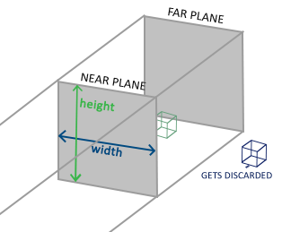
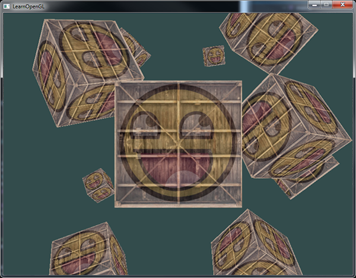

# 坐标系统

| 原文 | [Coordinate Systems](http://learnopengl.com/#!Getting-started/Coordinate-Systems) |
| ---- | ------------------------------------------------------------ |
| 作者 | JoeyDeVries                                                  |
| 翻译 | linkoln, Geequlim, Krasjet, [BLumia](https://github.com/blumia/) |
| 校对 | 暂未校对                                                     |

在上一个教程中，我们学习了如何有效地利用矩阵的变换来对所有顶点进行变换。OpenGL希望在每次顶点着色器运行后，我们可见的所有顶点都为标准化设备坐标(Normalized Device Coordinate, NDC)。也就是说，每个顶点的**x**，**y**，**z**坐标都应该在**-1.0**到**1.0**之间，超出这个坐标范围的顶点都将不可见。我们通常会自己设定一个坐标的范围，之后再在顶点着色器中将这些坐标变换为标准化设备坐标。然后将这些标准化设备坐标传入光栅器(Rasterizer)，将它们变换为屏幕上的二维坐标或像素。

将坐标变换为标准化设备坐标，接着再转化为屏幕坐标的过程通常是分步进行的，也就是类似于流水线那样子。在流水线中，物体的顶点在最终转化为屏幕坐标之前还会被变换到多个坐标系统(Coordinate System)。将物体的坐标变换到几个**过渡**坐标系(Intermediate Coordinate System)的优点在于，在这些特定的坐标系统中，一些操作或运算更加方便和容易，这一点很快就会变得很明显。对我们来说比较重要的总共有5个不同的坐标系统：

- 局部空间(Local Space，或者称为物体空间(Object Space))
- 世界空间(World Space)
- 观察空间(View Space，或者称为视觉空间(Eye Space))
- 裁剪空间(Clip Space)
- 屏幕空间(Screen Space)

这就是一个顶点在最终被转化为片段之前需要经历的所有不同状态。

你现在可能会对什么是坐标空间，什么是坐标系统感到非常困惑，所以我们将用一种更加通俗的方式来解释它们。下面，我们将显示一个整体的图片，之后我们会讲解每个空间的具体功能。

## 概述

为了将坐标从一个坐标系变换到另一个坐标系，我们需要用到几个变换矩阵，最重要的几个分别是模型(Model)、观察(View)、投影(Projection)三个矩阵。我们的顶点坐标起始于局部空间(Local Space)，在这里它称为局部坐标(Local Coordinate)，它在之后会变为世界坐标(World Coordinate)，观察坐标(View Coordinate)，裁剪坐标(Clip Coordinate)，并最后以屏幕坐标(Screen Coordinate)的形式结束。下面的这张图展示了整个流程以及各个变换过程做了什么：


1. 局部坐标是对象相对于局部原点的坐标，也是物体起始的坐标。
2. 下一步是将局部坐标变换为世界空间坐标，世界空间坐标是处于一个更大的空间范围的。这些坐标相对于世界的全局原点，它们会和其它物体一起相对于世界的原点进行摆放。
3. 接下来我们将世界坐标变换为观察空间坐标，使得每个坐标都是从摄像机或者说观察者的角度进行观察的。
4. 坐标到达观察空间之后，我们需要将其投影到裁剪坐标。裁剪坐标会被处理至-1.0到1.0的范围内，并判断哪些顶点将会出现在屏幕上。
5. 最后，我们将裁剪坐标变换为屏幕坐标，我们将使用一个叫做视口变换(Viewport Transform)的过程。视口变换将位于-1.0到1.0范围的坐标变换到由glViewport函数所定义的坐标范围内。最后变换出来的坐标将会送到光栅器，将其转化为片段。

你可能已经大致了解了每个坐标空间的作用。我们之所以将顶点变换到各个不同的空间的原因是有些操作在特定的坐标系统中才有意义且更方便。例如，当需要对物体进行修改的时候，在局部空间中来操作会更说得通；如果要对一个物体做出一个相对于其它物体位置的操作时，在世界坐标系中来做这个才更说得通，等等。如果我们愿意，我们也可以定义一个直接从局部空间变换到裁剪空间的变换矩阵，但那样会失去很多灵活性。

接下来我们将要更仔细地讨论各个坐标系统。

## 局部空间

局部空间是指物体所在的坐标空间，即对象最开始所在的地方。想象你在一个建模软件（比如说Blender）中创建了一个立方体。你创建的立方体的原点有可能位于(0,  0, 0)，即便它有可能最后在程序中处于完全不同的位置。甚至有可能你创建的所有模型都以(0, 0,  0)为初始位置（译注：然而它们会最终出现在世界的不同位置）。所以，你的模型的所有顶点都是在**局部**空间中：它们相对于你的物体来说都是局部的。

我们一直使用的那个箱子的顶点是被设定在-0.5到0.5的坐标范围中，(0, 0)是它的原点。这些都是局部坐标。

## 世界空间

如果我们将我们所有的物体导入到程序当中，它们有可能会全挤在世界的原点(0, 0,  0)上，这并不是我们想要的结果。我们想为每一个物体定义一个位置，从而能在更大的世界当中放置它们。世界空间中的坐标正如其名：是指顶点相对于（游戏）世界的坐标。如果你希望将物体分散在世界上摆放（特别是非常真实的那样），这就是你希望物体变换到的空间。物体的坐标将会从局部变换到世界空间；该变换是由模型矩阵(Model Matrix)实现的。

模型矩阵是一种变换矩阵，它能通过对物体进行位移、缩放、旋转来将它置于它本应该在的位置或朝向。你可以将它想像为变换一个房子，你需要先将它缩小（它在局部空间中太大了），并将其位移至郊区的一个小镇，然后在y轴上往左旋转一点以搭配附近的房子。你也可以把上一节将箱子到处摆放在场景中用的那个矩阵大致看作一个模型矩阵；我们将箱子的局部坐标变换到场景/世界中的不同位置。

## 观察空间

观察空间经常被人们称之OpenGL的摄像机(Camera)（所以有时也称为摄像机空间(Camera Space)或视觉空间(Eye   Space)）。观察空间是将世界空间坐标转化为用户视野前方的坐标而产生的结果。因此观察空间就是从摄像机的视角所观察到的空间。而这通常是由一系列的位移和旋转的组合来完成，平移/旋转场景从而使得特定的对象被变换到摄像机的前方。这些组合在一起的变换通常存储在一个观察矩阵(View Matrix)里，它被用来将世界坐标变换到观察空间。在下一节中我们将深入讨论如何创建一个这样的观察矩阵来模拟一个摄像机。

## 裁剪空间

在一个顶点着色器运行的最后，OpenGL期望所有的坐标都能落在一个特定的范围内，且任何在这个范围之外的点都应该被裁剪掉(Clipped)。被裁剪掉的坐标就会被忽略，所以剩下的坐标就将变为屏幕上可见的片段。这也就是裁剪空间(Clip Space)名字的由来。

因为将所有可见的坐标都指定在-1.0到1.0的范围内不是很直观，所以我们会指定自己的坐标集(Coordinate Set)并将它变换回标准化设备坐标系，就像OpenGL期望的那样。

为了将顶点坐标从观察变换到裁剪空间，我们需要定义一个投影矩阵(Projection  Matrix)，它指定了一个范围的坐标，比如在每个维度上的-1000到1000。投影矩阵接着会将在这个指定的范围内的坐标变换为标准化设备坐标的范围(-1.0,  1.0)。所有在范围外的坐标不会被映射到在-1.0到1.0的范围之间，所以会被裁剪掉。在上面这个投影矩阵所指定的范围内，坐标(1250,  500, 750)将是不可见的，这是由于它的x坐标超出了范围，它被转化为一个大于1.0的标准化设备坐标，所以被裁剪掉了。

如果只是图元(Primitive)，例如三角形，的一部分超出了裁剪体积(Clipping Volume)，则OpenGL会重新构建这个三角形为一个或多个三角形让其能够适合这个裁剪范围。

由投影矩阵创建的**观察箱**(Viewing Box)被称为平截头体(Frustum)，每个出现在平截头体范围内的坐标都会最终出现在用户的屏幕上。将特定范围内的坐标转化到标准化设备坐标系的过程（而且它很容易被映射到2D观察空间坐标）被称之为投影(Projection)，因为使用投影矩阵能将3D坐标投影(Project)到很容易映射到2D的标准化设备坐标系中。

一旦所有顶点被变换到裁剪空间，最终的操作——透视除法(Perspective Division)将会执行，在这个过程中我们将位置向量的x，y，z分量分别除以向量的齐次w分量；透视除法是将4D裁剪空间坐标变换为3D标准化设备坐标的过程。这一步会在每一个顶点着色器运行的最后被自动执行。

在这一阶段之后，最终的坐标将会被映射到屏幕空间中（使用glViewport中的设定），并被变换成片段。

将观察坐标变换为裁剪坐标的投影矩阵可以为两种不同的形式，每种形式都定义了不同的平截头体。我们可以选择创建一个正射投影矩阵(Orthographic Projection Matrix)或一个透视投影矩阵(Perspective Projection Matrix)。

### 正射投影

正射投影矩阵定义了一个类似立方体的平截头箱，它定义了一个裁剪空间，在这空间之外的顶点都会被裁剪掉。创建一个正射投影矩阵需要指定可见平截头体的宽、高和长度。在使用正射投影矩阵变换至裁剪空间之后处于这个平截头体内的所有坐标将不会被裁剪掉。它的平截头体看起来像一个容器：



上面的平截头体定义了可见的坐标，它由由宽、高、近(Near)平面和远(Far)平面所指定。任何出现在近平面之前或远平面之后的坐标都会被裁剪掉。正射平截头体直接将平截头体内部的所有坐标映射为标准化设备坐标，因为每个向量的w分量都没有进行改变；如果w分量等于1.0，透视除法则不会改变这个坐标。

要创建一个正射投影矩阵，我们可以使用GLM的内置函数`glm::ortho`：

```
glm::ortho(0.0f, 800.0f, 0.0f, 600.0f, 0.1f, 100.0f);
```

前两个参数指定了平截头体的左右坐标，第三和第四参数指定了平截头体的底部和顶部。通过这四个参数我们定义了近平面和远平面的大小，然后第五和第六个参数则定义了近平面和远平面的距离。这个投影矩阵会将处于这些x，y，z值范围内的坐标变换为标准化设备坐标。

正射投影矩阵直接将坐标映射到2D平面中，即你的屏幕，但实际上一个直接的投影矩阵会产生不真实的结果，因为这个投影没有将透视(Perspective)考虑进去。所以我们需要透视投影矩阵来解决这个问题。

### 透视投影

如果你曾经体验过**实际生活**给你带来的景象，你就会注意到离你越远的东西看起来更小。这个奇怪的效果称之为透视(Perspective)。透视的效果在我们看一条无限长的高速公路或铁路时尤其明显，正如下面图片显示的那样：


正如你看到的那样，由于透视，这两条线在很远的地方看起来会相交。这正是透视投影想要模仿的效果，它是使用透视投影矩阵来完成的。这个投影矩阵将给定的平截头体范围映射到裁剪空间，除此之外还修改了每个顶点坐标的w值，从而使得离观察者越远的顶点坐标w分量越大。被变换到裁剪空间的坐标都会在-w到w的范围之间（任何大于这个范围的坐标都会被裁剪掉）。OpenGL要求所有可见的坐标都落在-1.0到1.0范围内，作为顶点着色器最后的输出，因此，一旦坐标在裁剪空间内之后，透视除法就会被应用到裁剪空间坐标上：

 

*o**u**t*=⎛⎝⎜*x*/*w**y*/*w**z*/*w*⎞⎠⎟


 

顶点坐标的每个分量都会除以它的w分量，距离观察者越远顶点坐标就会越小。这是也是w分量非常重要的另一个原因，它能够帮助我们进行透视投影。最后的结果坐标就是处于标准化设备空间中的。如果你对正射投影矩阵和透视投影矩阵是如何计算的很感兴趣（且不会对数学感到恐惧的话）我推荐这篇由Songho写的[文章](http://www.songho.ca/opengl/gl_projectionmatrix.html)。

在GLM中可以这样创建一个透视投影矩阵：

```
glm::mat4 proj = glm::perspective(glm::radians(45.0f), (float)width/(float)height, 0.1f, 100.0f);
```

同样，`glm::perspective`所做的其实就是创建了一个定义了可视空间的大**平截头体**，任何在这个平截头体以外的东西最后都不会出现在裁剪空间体积内，并且将会受到裁剪。一个透视平截头体可以被看作一个不均匀形状的箱子，在这个箱子内部的每个坐标都会被映射到裁剪空间上的一个点。下面是一张透视平截头体的图片：


它的第一个参数定义了fov的值，它表示的是视野(Field of View)，并且设置了观察空间的大小。如果想要一个真实的观察效果，它的值通常设置为45.0f，但想要一个末日风格的结果你可以将其设置一个更大的值。第二个参数设置了宽高比，由视口的宽除以高所得。第三和第四个参数设置了平截头体的**近**和**远**平面。我们通常设置近距离为0.1f，而远距离设为100.0f。所有在近平面和远平面内且处于平截头体内的顶点都会被渲染。

当你把透视矩阵的 *near* 值设置太大时（如10.0f），OpenGL会将靠近摄像机的坐标（在0.0f和10.0f之间）都裁剪掉，这会导致一个你在游戏中很熟悉的视觉效果：在太过靠近一个物体的时候你的视线会直接穿过去。

当使用正射投影时，每一个顶点坐标都会直接映射到裁剪空间中而不经过任何精细的透视除法（它仍然会进行透视除法，只是w分量没有被改变（它保持为1），因此没有起作用）。因为正射投影没有使用透视，远处的物体不会显得更小，所以产生奇怪的视觉效果。由于这个原因，正射投影主要用于二维渲染以及一些建筑或工程的程序，在这些场景中我们更希望顶点不会被透视所干扰。某些如  *Blender* 等进行三维建模的软件有时在建模时也会使用正射投影，因为它在各个维度下都更准确地描绘了每个物体。下面你能够看到在Blender里面使用两种投影方式的对比：


你可以看到，使用透视投影的话，远处的顶点看起来比较小，而在正射投影中每个顶点距离观察者的距离都是一样的。

## 把它们都组合到一起

我们为上述的每一个步骤都创建了一个变换矩阵：模型矩阵、观察矩阵和投影矩阵。一个顶点坐标将会根据以下过程被变换到裁剪坐标：

 

*V**c**l**i**p*=*M**p**r**o**j**e**c**t**i**o**n*⋅*M**v**i**e**w*⋅*M**m**o**d**e**l*⋅*V**l**o**c**a**l*


 

注意矩阵运算的顺序是相反的（记住我们需要从右往左阅读矩阵的乘法）。最后的顶点应该被赋值到顶点着色器中的gl_Position，OpenGL将会自动进行透视除法和裁剪。

**然后呢？**

顶点着色器的输出要求所有的顶点都在裁剪空间内，这正是我们刚才使用变换矩阵所做的。OpenGL然后对**裁剪坐标**执行**透视除法**从而将它们变换到**标准化设备坐标**。OpenGL会使用glViewPort内部的参数来将标准化设备坐标映射到**屏幕坐标**，每个坐标都关联了一个屏幕上的点（在我们的例子中是一个800x600的屏幕）。这个过程称为视口变换。

这一章的主题可能会比较难理解，如果你仍然不确定每个空间的作用的话，你也不必太担心。接下来你会看到我们是怎样运用这些坐标空间的，而且之后也会有足够多的例子。

# 进入3D

既然我们知道了如何将3D坐标变换为2D坐标，我们可以开始使用真正的3D物体，而不是枯燥的2D平面了。

在开始进行3D绘图时，我们首先创建一个模型矩阵。这个模型矩阵包含了位移、缩放与旋转操作，它们会被应用到所有物体的顶点上，以**变换**它们到全局的世界空间。让我们变换一下我们的平面，将其绕着x轴旋转，使它看起来像放在地上一样。这个模型矩阵看起来是这样的：

```
glm::mat4 model;
model = glm::rotate(model, glm::radians(-55.0f), glm::vec3(1.0f, 0.0f, 0.0f));
```

通过将顶点坐标乘以这个模型矩阵，我们将该顶点坐标变换到世界坐标。我们的平面看起来就是在地板上，代表全局世界里的平面。

接下来我们需要创建一个观察矩阵。我们想要在场景里面稍微往后移动，以使得物体变成可见的（当在世界空间时，我们位于原点(0,0,0)）。要想在场景里面移动，先仔细想一想下面这个句子：

- 将摄像机向后移动，和将整个场景向前移动是一样的。

这正是观察矩阵所做的，我们以相反于摄像机移动的方向移动整个场景。因为我们想要往后移动，并且OpenGL是一个右手坐标系(Right-handed  System)，所以我们需要沿着z轴的正方向移动。我们会通过将场景沿着z轴负方向平移来实现。它会给我们一种我们在往后移动的感觉。

**右手坐标系(Right-handed System)**

按照惯例，OpenGL是一个右手坐标系。简单来说，就是正x轴在你的右手边，正y轴朝上，而正z轴是朝向后方的。想象你的屏幕处于三个轴的中心，则正z轴穿过你的屏幕朝向你。坐标系画起来如下：


为了理解为什么被称为右手坐标系，按如下的步骤做：

- 沿着正y轴方向伸出你的右臂，手指着上方。
- 大拇指指向右方。
- 食指指向上方。
- 中指向下弯曲90度。 

如果你的动作正确，那么你的大拇指指向正x轴方向，食指指向正y轴方向，中指指向正z轴方向。如果你用左臂来做这些动作，你会发现z轴的方向是相反的。这个叫做左手坐标系，它被DirectX广泛地使用。注意在标准化设备坐标系中OpenGL实际上使用的是左手坐标系（投影矩阵交换了左右手）。

在下一个教程中我们将会详细讨论如何在场景中移动。就目前来说，观察矩阵是这样的：

```
glm::mat4 view;
// 注意，我们将矩阵向我们要进行移动场景的反方向移动。
view = glm::translate(view, glm::vec3(0.0f, 0.0f, -3.0f));
```

最后我们需要做的是定义一个投影矩阵。我们希望在场景中使用透视投影，所以像这样声明一个投影矩阵：

```
glm::mat4 projection;
projection = glm::perspective(glm::radians(45.0f), screenWidth / screenHeight, 0.1f, 100.0f);
```

既然我们已经创建了变换矩阵，我们应该将它们传入着色器。首先，让我们在顶点着色器中声明一个uniform变换矩阵然后将它乘以顶点坐标：

```
#version 330 core
layout (location = 0) in vec3 aPos;
...
uniform mat4 model;
uniform mat4 view;
uniform mat4 projection;

void main()
{
    // 注意乘法要从右向左读
    gl_Position = projection * view * model * vec4(aPos, 1.0);
    ...
}
```

我们还应该将矩阵传入着色器（这通常在每次的渲染迭代中进行，因为变换矩阵会经常变动）：

```
int modelLoc = glGetUniformLocation(ourShader.ID, "model"));
glUniformMatrix4fv(modelLoc, 1, GL_FALSE, glm::value_ptr(model));
... // 观察矩阵和投影矩阵与之类似
```

我们的顶点坐标已经使用模型、观察和投影矩阵进行变换了，最终的物体应该会：

- 稍微向后倾斜至地板方向。
- 离我们有一些距离。
- 有透视效果（顶点越远，变得越小）。

让我们检查一下结果是否满足这些要求：


它看起来就像是一个3D的平面，静止在一个虚构的地板上。如果你得到的不是相同的结果，请检查下完整的[源代码](https://learnopengl.com/code_viewer_gh.php?code=src/1.getting_started/6.1.coordinate_systems/coordinate_systems.cpp)。

## 更多的3D

到目前为止，我们一直都在使用一个2D平面，而且甚至是在3D空间里！所以，让我们大胆地拓展我们的2D平面为一个3D立方体。要想渲染一个立方体，我们一共需要36个顶点（6个面 x 每个面有2个三角形组成 x 每个三角形有3个顶点），这36个顶点的位置你可以从[这里](https://learnopengl.com/code_viewer.php?code=getting-started/cube_vertices)获取。

为了有趣一点，我们将让立方体随着时间旋转：

```
model = glm::rotate(model, (float)glfwGetTime() * glm::radians(50.0f), glm::vec3(0.5f, 1.0f, 0.0f));
```

然后我们使用glDrawArrays来绘制立方体，但这一次总共有36个顶点。

```
glDrawArrays(GL_TRIANGLES, 0, 36);
```

如果一切顺利的话你应该能得到下面这样的效果：

<video src="https://learnopengl-cn.github.io/img/01/08/coordinate_system_no_depth.mp4" controls="controls"></video>

这的确有点像是一个立方体，但又有种说不出的奇怪。立方体的某些本应被遮挡住的面被绘制在了这个立方体其他面之上。之所以这样是因为OpenGL是一个三角形一个三角形地来绘制你的立方体的，所以即便之前那里有东西它也会覆盖之前的像素。因为这个原因，有些三角形会被绘制在其它三角形上面，虽然它们本不应该是被覆盖的。

幸运的是，OpenGL存储深度信息在一个叫做Z缓冲(Z-buffer)的缓冲中，它允许OpenGL决定何时覆盖一个像素而何时不覆盖。通过使用Z缓冲，我们可以配置OpenGL来进行深度测试。

### Z缓冲

OpenGL存储它的所有深度信息于一个Z缓冲(Z-buffer)中，也被称为深度缓冲(Depth Buffer)。GLFW会自动为你生成这样一个缓冲（就像它也有一个颜色缓冲来存储输出图像的颜色）。深度值存储在每个片段里面（作为片段的**z**值），当片段想要输出它的颜色时，OpenGL会将它的深度值和z缓冲进行比较，如果当前的片段在其它片段之后，它将会被丢弃，否则将会覆盖。这个过程称为深度测试(Depth Testing)，它是由OpenGL自动完成的。

然而，如果我们想要确定OpenGL真的执行了深度测试，首先我们要告诉OpenGL我们想要启用深度测试；它默认是关闭的。我们可以通过glEnable函数来开启深度测试。glEnable和glDisable函数允许我们启用或禁用某个OpenGL功能。这个功能会一直保持启用/禁用状态，直到另一个调用来禁用/启用它。现在我们想启用深度测试，需要开启GL_DEPTH_TEST：

```
glEnable(GL_DEPTH_TEST);
```

因为我们使用了深度测试，我们也想要在每次渲染迭代之前清除深度缓冲（否则前一帧的深度信息仍然保存在缓冲中）。就像清除颜色缓冲一样，我们可以通过在glClear函数中指定DEPTH_BUFFER_BIT位来清除深度缓冲：

```
glClear(GL_COLOR_BUFFER_BIT | GL_DEPTH_BUFFER_BIT);
```

我们来重新运行下程序看看OpenGL是否执行了深度测试：

<video src="https://learnopengl-cn.github.io/img/01/08/coordinate_system_depth.mp4" controls="controls"></video>

就是这样！一个开启了深度测试，各个面都是纹理，并且还在旋转的立方体！如果你的程序有问题可以到[这里](https://learnopengl.com/code_viewer_gh.php?code=src/1.getting_started/6.2.coordinate_systems_depth/coordinate_systems_depth.cpp)下载源码进行比对。

### 更多的立方体！

现在我们想在屏幕上显示10个立方体。每个立方体看起来都是一样的，区别在于它们在世界的位置及旋转角度不同。立方体的图形布局已经定义好了，所以当渲染更多物体的时候我们不需要改变我们的缓冲数组和属性数组，我们唯一需要做的只是改变每个对象的模型矩阵来将立方体变换到世界坐标系中。

首先，让我们为每个立方体定义一个位移向量来指定它在世界空间的位置。我们将在一个`glm::vec3`数组中定义10个立方体位置：

```
glm::vec3 cubePositions[] = {
  glm::vec3( 0.0f,  0.0f,  0.0f), 
  glm::vec3( 2.0f,  5.0f, -15.0f), 
  glm::vec3(-1.5f, -2.2f, -2.5f),  
  glm::vec3(-3.8f, -2.0f, -12.3f),  
  glm::vec3( 2.4f, -0.4f, -3.5f),  
  glm::vec3(-1.7f,  3.0f, -7.5f),  
  glm::vec3( 1.3f, -2.0f, -2.5f),  
  glm::vec3( 1.5f,  2.0f, -2.5f), 
  glm::vec3( 1.5f,  0.2f, -1.5f), 
  glm::vec3(-1.3f,  1.0f, -1.5f)  
};
```

现在，在游戏循环中，我们调用glDrawArrays 10次，但这次在我们渲染之前每次传入一个不同的模型矩阵到顶点着色器中。我们将会在游戏循环中创建一个小的循环用不同的模型矩阵渲染我们的物体10次。注意我们也对每个箱子加了一点旋转：

```
glBindVertexArray(VAO);
for(unsigned int i = 0; i < 10; i++)
{
  glm::mat4 model;
  model = glm::translate(model, cubePositions[i]);
  float angle = 20.0f * i; 
  model = glm::rotate(model, glm::radians(angle), glm::vec3(1.0f, 0.3f, 0.5f));
  ourShader.setMat4("model", model);

  glDrawArrays(GL_TRIANGLES, 0, 36);
}
```

这段代码将会在每次新立方体绘制出来的时候更新模型矩阵，如此总共重复10次。然后我们应该就能看到一个拥有10个正在奇葩地旋转着的立方体的世界。



完美！看起来我们的箱子已经找到志同道合的小伙伴了。如果你在这里卡住了，你可以对照一下[源代码](https://learnopengl.com/code_viewer_gh.php?code=src/1.getting_started/6.3.coordinate_systems_multiple/coordinate_systems_multiple.cpp) 。

## 练习

- 对GLM的`projection`函数中的`FoV`和`aspect-ratio`参数进行实验。看能否搞懂它们是如何影响透视平截头体的。
- 将观察矩阵在各个方向上进行位移，来看看场景是如何改变的。注意把观察矩阵当成摄像机对象。
- 使用模型矩阵只让是3倍数的箱子旋转（以及第1个箱子），而让剩下的箱子保持静止。[参考解答](https://learnopengl.com/code_viewer.php?code=getting-started/coordinate_systems-exercise3)。