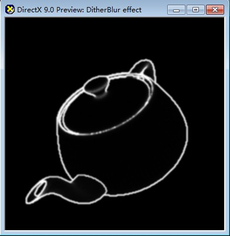
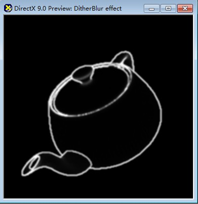
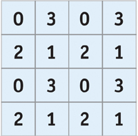
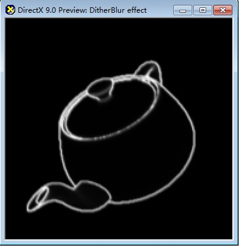

# 基于屏幕像素抖动的PCF

​                                                   2009年12月16日 21:46:00           [xoyojank](https://me.csdn.net/xoyojank)           阅读数：4226                                                                  

​                   

​                      版权声明：本文为博主原创，转载请注明来源          https://blog.csdn.net/xoyojank/article/details/5021381        

PCF无非就是把周围的像素加吧加吧, 然后取个平均值. 结果的平滑程度, 跟Kernel的大小有直接关系.

下面来对这个描过边的锯齿茶壶PCF一把:

2x2:

3x3:

4x4:

当然, Kernel越大, 效果越好. 但大到一定程度效果就不明显了, 而且还要考虑性能问题, 毕竟多次的纹理采样很慢. 其实呢, 通过抖动也可以使用少量的采样达到近似比较大Kernel的效果. 这里用4次采样来模拟4x4PCF的效果, 采样模板如下:

正好PS3.0中的增加了一个寄存器VPOS, 用于直接取当前像素的屏幕坐标, 根据坐标的奇偶性来决定取样的位置:

sampler2D Texture0; float2 fInverseViewportDimensions;  struct PS_INPUT {    float2 texCoord : TEXCOORD0;    float2 screenPos : VPOS; };  float4 ps_main(PS_INPUT input) : COLOR0    {    float2 offset = fmod(input.screenPos, 2.0);        float4 color = 0;    color += tex2D(Texture0, input.texCoord + (float2(-1.5,-1.5) + offset) * fInverseViewportDimensions);    color += tex2D(Texture0, input.texCoord + (float2(-0.5, 0.5) + offset) * fInverseViewportDimensions);    color += tex2D(Texture0, input.texCoord + (float2(-1.5, 0.5) + offset) * fInverseViewportDimensions);    color += tex2D(Texture0, input.texCoord + (float2(-0.5, 1.5) + offset) * fInverseViewportDimensions);    color *= 0.25;           return color;    }   

最终效果, 用在阴影模糊中会很一种效率很高的解决方案:

