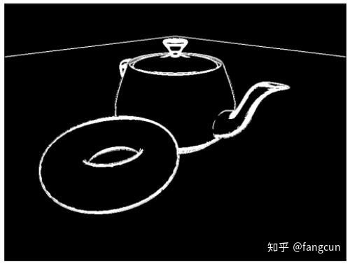

# 边缘检测技术的GLSL实现

本文是OpenGL 4.0 Shading Language Cookbook的学习笔记

## 边缘检测技术

边缘检测是用来识别图像明暗变化形成的区域的技术。它可以用来检测物体的边界和表面的拓扑变化。在计算机视觉，图像处理，图像分析和图像模式识别领域都有使用这项技术。关于这个技术的更多信息，可以参考D.  Ziou and S. Tabbone' book (1998), Edge detection techniques:An overview  International Journal of Computer Vision, Vol 24, Issue 3。

使用边缘检测可以实现很多有趣的视觉效果。比如，它可以让三维场景渲染得看起来像二维铅笔绘制的图画。下图就是这种效果的一个例子。我们首先正常地绘制了一个含有茶壶和圆环的场景到纹理中，然后对生成的纹理使用边缘检测技术。




边缘检测技术使用了卷积过滤或卷积核(也别叫做过滤核)。卷积过滤器是一个定义了一个像素如何被它周围的像素以预定义的权重进行求和的矩阵。下面是一个卷积过滤器的例子：


左边是一个3x3的过滤器，右边是一个假设的3x3像素数据。像素数据的值可能表示灰度或是RGB的一个颜色成分。对右边的像素数据使用过滤器，计算结果将取代中心像素(29)。在这个例子，计算结果为(25+27+2*29+31+33)=174。

使用卷积过滤，我们不仅需要访问原始像素数据，还需要一个独立的缓冲区来存储过滤后的结果。这里，我们使用两次渲染来完成它，在第一次渲染时，我们将图像渲染到纹理中，在第二次渲染时，我们对纹理使用过滤器，并将过滤后的结果输出到屏幕上。

Sobel算子是基于卷积的最简单的边缘检测技术之一。Sobel算子利用图像像素亮度的差分进行工作。它使用了两个3x3过滤器。使用这个两个过滤器的结果是垂直成分和水平成分的亮度差分。我们可以使用这些差分数据发现物体的边缘。当差分数据大于某个值时，我们认为这个像素位于物体边缘上。

Sobel算子使用的3x3过滤核如下所示：


假设使用  后的结果为  ，使用  后的结果为  ，我们使用下面的公式得到差分大小指标：

 

如果  的值大于某个设定的值，我们就认为这个像素处于边缘上，将它在生成的图像中高亮。

在本例中，我们将在第二遍处理时使用这个过滤器。在第一遍处理时，我们使用一个光照模型绘制场景到纹理中。在第二遍处理时，我们使用过滤器对纹理进行处理，绘制出识别出的物体边缘。

创建和窗口大小相同的帧缓冲对象。绑定帧缓冲对象的第一颜色附着点到0号纹理单元。在第一遍处理时，我们将场景渲染到纹理中。在这里，我们将纹理的缩放过滤都设置为GL_NEAREST，来避免OpenGL进行插值处理。

设置顶点位置location为0，法线location为1，纹理坐标location为2。

下面的Uniform变量需要我们在OpenGL程序中进行设置：

- Width：以像素为单位的窗口宽度。
- Height：以像素为单位的窗口高度。
- EdgeThreshold：差分大小大于这个值的像素被认为处在边缘上。
- RenderTex：和帧缓冲对象绑定的纹理。

我们使用以下步骤实现边缘检测：

\1. 使用下面的代码作为顶点着色器：

```glsl
#version 400
layout (location = 0) in vec3 VertexPosition;
layout (location = 1) in vec3 VertexNormal;
layout (location = 2) in vec2 VertexTexCoord;
out vec3 Position;
out vec3 Normal;
out vec2 TexCoord;
uniform mat4 ModelViewMatrix;
uniform mat3 NormalMatrix;
uniform mat4 ProjectionMatrix;
uniform mat4 MVP;
void main()
{
	TexCoord = VertexTexCoord;
	Normal = normalize( NormalMatrix *
			VertexNormal);
	Position = vec3( ModelViewMatrix *
		vec4(VertexPosition,1.0) );
	gl_Position = MVP *
			vec4(VertexPosition,1.0);
}
```

\2. 使用下面的代码作为片段着色器：

```glsl
#version 400
in vec3 Position;
in vec3 Normal;
in vec2 TexCoord;
// The texture containing the results of the first pass
uniform sampler2D RenderTex;
uniform float EdgeThreshold; // The squared threshold value
uniform int Width; // The pixel width
uniform int Height; // The pixel height
// This subroutine is used for selecting the functionality
// of pass1 and pass2.
subroutine vec4 RenderPassType();
subroutine uniform RenderPassType RenderPass;
// Other uniform variables for the Phong reflection model can
// be placed here…
layout( location = 0 ) out vec4 FragColor;
vec3 phongModel( vec3 pos, vec3 norm )
{
// The code for the basic ADS shading model goes here…
}
// Approximates the brightness of a RGB value.
float luma( vec3 color ) {
return 0.2126 * color.r + 0.7152 * color.g +
0.0722 * color.b;
}
// Pass #1
subroutine (RenderPassType)
vec4 pass1()
{
return vec4(phongModel( Position, Normal ),1.0);
}
// Pass #2
subroutine( RenderPassType )
vec4 pass2()
{
float dx = 1.0 / float(Width);
float dy = 1.0 / float(Height);
float s00 = luma(texture( RenderTex,
TexCoord + vec2(-dx,dy) ).rgb);
float s10 = luma(texture( RenderTex,
TexCoord + vec2(-dx,0.0) ).rgb);
float s20 = luma(texture( RenderTex,
TexCoord + vec2(-dx,-dy) ).rgb);
float s01 = luma(texture( RenderTex,
TexCoord + vec2(0.0,dy) ).rgb);
float s21 = luma(texture( RenderTex,
TexCoord + vec2(0.0,-dy) ).rgb);
float s02 = luma(texture( RenderTex,
TexCoord + vec2(dx, dy) ).rgb);
float s12 = luma(texture( RenderTex,
TexCoord + vec2(dx, 0.0) ).rgb);
float s22 = luma(texture( RenderTex,
TexCoord + vec2(dx, -dy) ).rgb);
	float sx = s00 + 2 * s10 + s20 - (s02 + 2 * s12 + s22);
	float sy = s00 + 2 * s01 + s02 - (s20 + 2 * s21 + s22);
	float dist = sx * sx + sy * sy;
	if( dist>EdgeThreshold )
		return vec4(1.0);
	else
		return vec4(0.0,0.0,0.0,1.0);
}
void main()
{
	// This will call either pass1() or pass2()
	FragColor = RenderPass();
}
```

对于第一遍处理，我们对OpenGL程序需要作以下处理：

\1. 绑定要使用的帧缓冲对象，并清除颜色/深度缓冲中的内容。

\2. 绑定pass1子程序(参考第二章，使用子程序选择着色器功能)。

\3. 设置模型，视图，投影矩阵，然后绘制场景。

对于第二遍处理，需要采取下列步骤：

\1. 取消绑定帧缓冲对象(绑定默认的帧缓冲)，然后清除颜色/深度缓冲。

\2. 绑定pass2子程序。

\3. 设置模型，视图，投影矩阵为单位矩阵。

\4. 在屏幕上绘制过滤后的纹理。

## 原理

第一遍处理我们将场景中的几何结构绘制到纹理中。我们绑定pass1子程序，使用Phong反射模式绘制场景。

第二遍处理，我们绑定pass2子程序，渲染过滤器生成的图像。在pass2函数，我们调用luma函数进行过滤计算。水平和垂直过滤的结果被我们存储在sx和sy中。

luma函数通过计算光强的加权和来确定亮度。这里使用的权重参考了ITU-R Recommendation Rec. 709，更多信息参考维基百科luma条目。

最后，我们计算出差分的平方g。如果g的值大于EdgeThreshold，我们认为当前像素处于一条边上，我们输出一个白色像素。否则，我们输出一个黑色像素。

Sobel算子只是一个粗糙的算法，它对于光强的高频变化非常敏感。维基百科上还有其它一些更加精确的边缘检测算法。我们也可以通过对第一遍产生的纹理进行模糊处理来减小高频变化的问题。模糊处理可以使高频变化变得平滑，从而提高了边缘检测结果的质量。

## 优化技巧

在这里使用的技术，对于每个像素需要访问8个纹理数据，效率很低，减少访问的纹理数据数目可以提升一定的效率。GPU  Gems: Programming Techniques, Tips and Tricks for RealTime Graphics,  edited by Randima Fernando (Addison-Wesley Professional  2004}的第24章给出了通过辅助纹理来减少纹理数据使用的方法。
