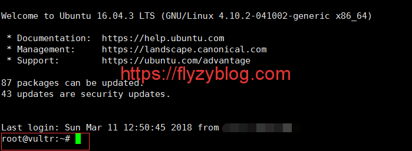
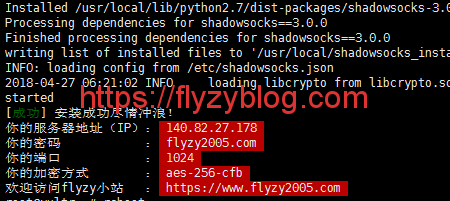
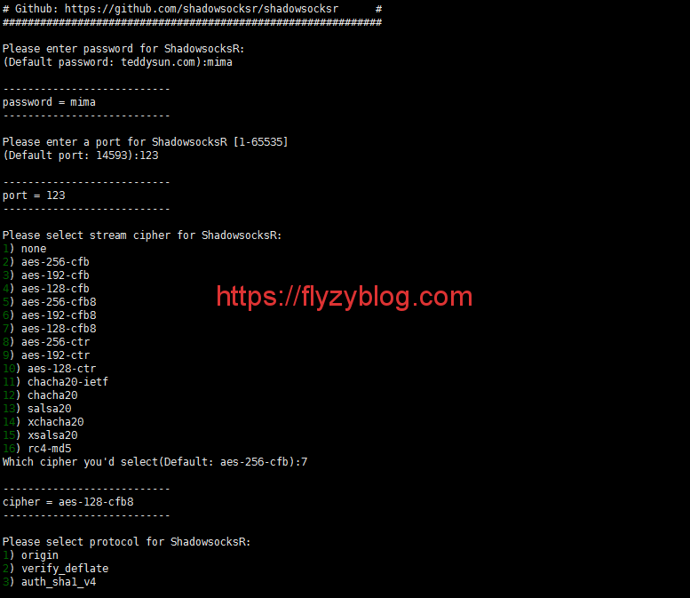
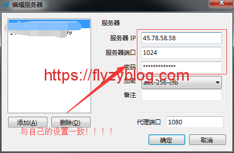
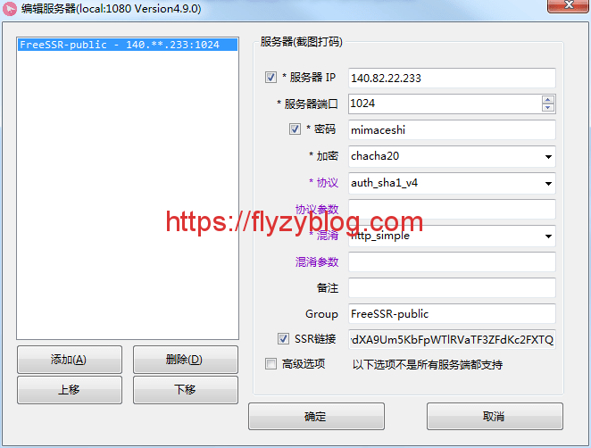

# 个人搭建虚拟专用网络

版权声明：本文为博主原创文章，遵循[ CC 4.0 BY-SA ](http://creativecommons.org/licenses/by-sa/4.0/)版权协议，转载请附上原文出处链接和本声明。                                                 本文链接：https://blog.csdn.net/qq_33729889/article/details/101872636                              

自己写的一键搭建shadowsocks/shadowsocksR的shell脚本，一键脚本适用Vultr的和搬瓦工所有机型（CentOS、Ubuntu、Debian），搭建的ss服务器支持所有**客户端类型**，本机你是iOS，Android，Windows，Mac，或者是Linux，ss/ssr脚本都适用。一键脚本搭建SS/SSR服务器，**绝对没有任何问题**，任何问题欢迎留言。一键脚本内容包括一键搭建shadowsocks/一键搭建shadowsocksR+一键开启bbr加速，适合新手小白。

**纯新手**也可以搭建ss/ssr，录了个**视频教程**，不想看文字的可以看视频，或者结合起来一起看：[搭建ss视频教程](https://flyzyblog.com/install-ss-ssr-bbr-in-one-command/#vultrss)。

 

## **什么是shadowsocks**

shadowsocks可以指一种SOCKS5的加密传输协议，也可以指基于这种加密协议的各种数据传输包。

**shadowsocks实现科学上网原理？**shadowsocks正常工作需要服务器端和客户端两端合作实现，首先，客户端（本机）通过ss（shadowsocks）对正常的访问请求进行SOCK5加密，将加密后的访问请求传输给ss服务器端，服务器端接收到客户端的加密请求后，解密得到原始的访问请求，根据请求内容访问指定的网站（例如Google，YouTube，Facebook，instagram等），得到网站的返回结果后，再利用SOCKS5加密并返回给客户端，客户端通过ss解密后得到正常的访问结果，于是就可以实现你直接访问该网站的“假象”。

**为什么选择shadowsocks？**不限终端（安卓，苹果，Windows，Mac都可用），流量便宜（服务器500G只要15元），方便（一键脚本，不需要专业知识）。

**为什么要自己搭建ss/ssr？**你也许会觉得买ss服务也很方便，但是你得要考虑以下几个问题。首先，买的ss服务，限制很多，终端可能只能同时在线2个，每个月就一点点流量可能价格却不便宜，有时候还被别人做手脚，流量跑的贼快；其次，别人收钱跑路怎么办？很多这种情况的；更重要的是，如第一个问题中描述的shadowsocks原理，如果有心人做了一点手脚，是可以得到你的访问记录的；而自己搭建ss/ssr服务，一键脚本也就10来分钟就可以搞定。

 

## **一键脚本搭建ss/ssr支持系统版本**

脚本系统支持：CentOS 6+，Debian 7+，Ubuntu 12+

注：这个脚本支持的系统版本是指ss服务器的版本（都没看过也没关系，不影响搭建），你本机是Windows、Mac、Linux，或者你想用手机端搭建ss/ssr服务器，安卓和苹果，都是可以的。

 

## **代理服务器购买**

作为跳板的代理服务器推荐Vultr和搬瓦工，一是因为本脚本在这两家的所有VPS都做了测试，二是因为都是老牌VPS服务商，不怕跑路。

Vultr和搬瓦工比较：

1. Vultr月付，3.5美元/月起步，搬瓦工年付，年付46.87美元起步；
2. 搬瓦工线路好，提供CN2 GT/CN2 GIA多条线路，并且保证开到的IP绝对可用；

如果你是长期使用，那么推荐你使用搬瓦工，线路比Vultr要好的，尤其是联通和电信用户，所谓线路好就是速度快的意思。

搬瓦工提供CN2和CN2 GIA多种优化线路：

1. 速度自然是CN2 GIA > CN2 > KVM，相应的价格最贵的是CN2 GIA（包括CN2 GIA-E），但是CN2和KVM的价格却一样，所以如果不买CN2 GIA，则买CN2，不要考虑KVM；
2. CN2 GIA的意思是三网CN2直连的意思，优势就是晚高峰也快，价格是最便宜的119.99美元/年，贵但是值。

对于搬瓦工的推荐：

1. 不是很在乎120美元/年和50美元/年之间的差距，一年也就差500元其实，那么直接选择CN2 GIA-E，用过的都说好；
2. 如果不是很宽裕，则选择50美元/年的搬瓦工CN2。

搬瓦工购买与优惠码使用：[2019年搬瓦工购买教程：优惠码使用，支持支付宝/微信/银联支付](https://flyzyblog.com/go/?url=https://www.flyzy2005.cn/vps/2019-bandwagonhost-buy-tutorial/)。

当然你也可以直接用[Vultr](https://flyzyblog.com/go/?url=https://www.vultryhw.cn/vultr-deploy-new/)，Vultr支持月付，最低月付3.5美元，但是线路没有搬瓦工好（速度可能没有搬瓦工快），搬瓦工暂时不支持月付，购买图文教程可以参考[Vultr购买图解步骤（支持支付宝）](https://flyzyblog.com/go/?url=https://www.vultryhw.cn/vultr-deploy-new/)。

Vultr和搬瓦工上的所有机型是绝对可以一键脚本搭建shadowsocks/搭建shadowsocksR+开启bbr加速成功的，任何问题**欢迎留言**~

 

## **连接远程Linux服务器**

购买完成后根据[Mac/Windows如何SSH远程搬瓦工vps](https://flyzyblog.com/go/?url=https://www.bwgyhw.cn/bandwagonhost-ssh-login/)或者[Mac/Windows如何SSH远程VULTR vps](https://flyzyblog.com/go/?url=https://www.vultryhw.cn/vultr-ssh-login/)即可。

你如果身边没有电脑，一定要搞什么手机搭建ss服务器，也是可以的，毕竟一键脚本只需要复制几行脚本命令就行了。iOS用户可以使用Termius这个工具，直接在App Store下载就行。Android没有用过，反正能ssh连接的软件就行。

 

## **一键搭建SS/搭建SSR服务**

注意，shadowsocks/shadowsocksR这两个**只需要搭建一个**就可以了！！！！SS与SSR之间的比较一直是各有各的说法，王婆卖瓜自卖自夸。我用的是SS，因为SS的iOS版本比较容易下载，并且被没有觉得ss容易被探查到~

### **一键搭建shadowsocks**

连上购买的VPS后（以Xshell为例），你将看到如下图所示的界面：

如红框中所示，root@vult（root@ubuntu）说明已经连接成功了，之后你只需要**在绿色光标处直接复制以下代码并回车**就可以了（直接复制即可，如每段代码下方截图中所示）。

1.下载一键搭建ss脚本文件（直接在绿色光标处复制该行命令回车即可，**只需要执行一次**，卸载ss后也不需要重新下载）

 

| 1    | git clone -b master https://github.com/flyzy2005/ss-fly |
| ---- | ------------------------------------------------------- |
|      |                                                         |

如果提示`bash: git: command not found`，则先安装git（你如果不知道自己是哪个系统，那就全部执行一次，然后再执行上面的那个下载命令）：

 

| 1  			2 | Centos系统执行这个： yum -y install git  			Ubuntu/Debian系统执行这个： apt-get -y install git |
| ---------------- | ------------------------------------------------------------ |
|                  |                                                              |

2.运行搭建ss脚本代码

 

| 1    | ss-fly/ss-fly.sh -i flyzy2005.com 1024 |
| ---- | -------------------------------------- |
|      |                                        |

其中**flyzy2005.com**换成你要设置的shadowsocks的密码即可（这个**flyzy2005.com**就是你ss的密码了，是需要填在客户端的密码那一栏的），密码随便设置，最好**只包含字母+数字**，一些特殊字符可能会导致冲突。而第二个参数**1024**是**端口号**，也可以不加，不加默认是1024~（**举个例子**，脚本命令可以是ss-fly/ss-fly.sh -i qwerasd，也可以是ss-fly/ss-fly.sh -i qwerasd 8585，后者指定了服务器端口为8585，前者则是默认的端口号1024，两个命令设置的ss密码都是qwerasd）：

界面如下就表示一键搭建ss成功了：

注：如果需要改密码或者改端口，只需要重新**再执行一次搭建ss脚本代码**就可以了，或者修改`/etc/shadowsocks.json`这个配置文件（如何修改在公众号回复**vim编辑器使用**）。

3.相关ss操作

 

| 1  			2  			3  			4 | 修改配置文件：vim /etc/shadowsocks.json  			停止ss服务：ssserver -c /etc/shadowsocks.json -d stop  			启动ss服务：ssserver -c /etc/shadowsocks.json -d start  			重启ss服务：ssserver -c /etc/shadowsocks.json -d restart |
| ---------------------------------------------- | ------------------------------------------------------------ |
|                                                |                                                              |

4.卸载ss服务

 

| 1    | ss-fly/ss-fly.sh -uninstall |
| ---- | --------------------------- |
|      |                             |

 

### **一键搭建shadowsocksR**

**再次提醒**，如果安装了SS，就不需要再安装SSR了，如果要改装SSR，请按照上一部分内容的教程先卸载SS！！！

1.下载一键搭建ssr脚本（**只需要执行一次**，卸载ssr后也不需要重新执行）

`git clone -b master https://github.com/flyzy2005/ss-fly`，此步骤与一键搭建ss一致，就是clone一键脚本代码。

2.运行搭建ssr脚本代码

 

| 1    | ss-fly/ss-fly.sh -ssr |
| ---- | --------------------- |
|      |                       |

3.输入对应的参数

执行完上述的脚本代码后，会进入到输入参数的界面，包括服务器端口，密码，加密方式，协议，混淆。可以直接输入回车选择默认值，也可以输入相应的值选择对应的选项：

全部选择结束后，会看到如下界面，就说明搭建ssr成功了：

 

| 1  			2  			3  			4  			5  			6  			7  			8  			9  			10 | Congratulations, ShadowsocksR server install completed!  			Your Server IP        :你的服务器ip  			Your Server Port      :你的端口  			Your Password         :你的密码  			Your Protocol         :你的协议  			Your obfs             :你的混淆  			Your Encryption Method:your_encryption_method  			   			Welcome to visit:https://shadowsocks.be/9.html  			Enjoy it! |
| ------------------------------------------------------------ | ------------------------------------------------------------ |
|                                                              |                                                              |

4.相关操作ssr命令

 

| 1  			2  			3  			4  			5  			6  			7  			8 | 启动：/etc/init.d/shadowsocks start  			停止：/etc/init.d/shadowsocks stop  			重启：/etc/init.d/shadowsocks restart  			状态：/etc/init.d/shadowsocks status  			   			配置文件路径：/etc/shadowsocks.json  			日志文件路径：/var/log/shadowsocks.log  			代码安装目录：/usr/local/shadowsocks |
| ------------------------------------------------------------ | ------------------------------------------------------------ |
|                                                              |                                                              |

5.卸载ssr服务

 

| 1    | ./shadowsocksR.sh uninstall |
| ---- | --------------------------- |
|      |                             |

 

## **一键开启BBR加速**

BBR是Google开源的一套内核加速算法，可以让你搭建的shadowsocks/shadowsocksR速度上一个台阶，本一键搭建ss/ssr脚本支持一键升级最新版本的内核并开启BBR加速。

BBR支持4.9以上的，如果低于这个版本则会自动下载最新内容版本的内核后开启BBR加速并重启，如果高于4.9以上则自动开启BBR加速，执行如下脚本命令即可自动开启BBR加速：

 

| 1    | ss-fly/ss-fly.sh -bbr |
| ---- | --------------------- |
|      |                       |

装完后需要重启系统，输入y即可立即重启，或者之后输入`reboot`命令重启。

判断BBR加速有没有开启成功。输入以下命令：

 

| 1    | sysctl net.ipv4.tcp_available_congestion_control |
| ---- | ------------------------------------------------ |
|      |                                                  |

如果返回值为：

 

| 1    | net.ipv4.tcp_available_congestion_control = bbr cubic reno |
| ---- | ---------------------------------------------------------- |
|      |                                                            |

只要后面有bbr，则说明已经开启成功了。

 

## **客户端搭建shadowsocks/shadowsockR**

### **客户端搭建ss代理**

各种客户端版本下载地址：[各版本shadowsocks客户端下载地址](https://flyzyblog.com/go/?url=https://www.flyzy2005.com/fan-qiang/shadowsocks/ss-clients-download/) (打不开参考[flyzy小站最新镜像网站地址](https://flyzyblog.com/way-to-flyzy2005/)或者访问[https://files.flyzy2005.cn](https://flyzyblog.com/go/?url=https://files.flyzy2005.cn)）

以Windows为例（[shadowsocks电脑版（windows）客户端配置教程](https://flyzyblog.com/go/?url=https://www.flyzy2005.com/fan-qiang/shadowsocks/shadowsocks-pc-windows-config/)）：

在状态栏右击shadowsocks，勾选**开机启动**和**启动系统代理**，在**系统代理模式**中选择**PAC模式**，**服务器**->**编辑服务器**，一键安装shadowsocks的脚本默认服务器端口是1024，加密方式是aes-256-cfb，密码是你设置的密码，ip是你自己的VPS ip，保存即可~

**PAC模式**是指国内可以访问的站点直接访问，不能直接访问的再走shadowsocks代理~

OK！一键脚本搭建shadowsocks完毕！享受科学冲浪吧！

 

### **客户端搭建ssr代理**

各种客户端版本下载地址：[各版本SS客户端&SSR客户端官方下载地址](https://flyzyblog.com/go/?url=https://www.flyzy2005.com/fan-qiang/shadowsocksr/ss-ssr-clients/) (打不开参考[flyzy小站最新镜像网站地址](https://flyzyblog.com/way-to-flyzy2005/)或者访问[https://files.flyzy2005.cn](https://flyzyblog.com/go/?url=https://files.flyzy2005.cn)）

以Windows为例：

在状态栏右击shadowsocksR，在**系统代理模式**中选择**PAC模式**，再左击两次状态栏的图标打开编辑服务器界面，如上图所示，按照自己的服务器配置填充内容**，**保存即可~

**PAC模式**是指国内可以访问的站点直接访问，不能直接访问的再走shadowsocksR代理~

OK！一键脚本搭建shadowsocksR完毕！享受科学冲浪吧！

 

## **vultr搭建ss视频教程**

应读者要求录了个视频教程，如果你觉得这些文字还不够生动，不够清楚的话，可以看一下视频教程。

视频获取方式：关注微信公众号**flyzy小站**，发送**视频**即可获得。

 

 

## **一键脚本更新日志**

一键脚本源码：[一键搭建shadowoscks/搭建shadowsocksR并开启bbr内核加速](https://flyzyblog.com/go/?url=https://github.com/flyzy2005/ss-fly)

2018年1月20日，上传一键安装shadowsocks脚本

2018年1月24日，添加升级内核并开启BBR加速功能

2018年3月28日，将升级内核&&开启BBR加速集成在一个命令中

2018年4月4日，添加一键安装shadowsocksR功能（调用的teddysun大大的[一键搭建SSR脚本](https://flyzyblog.com/go/?url=https://shadowsocks.be/9.html) ）

2018年4月27日，支持Ubuntu/CentOS/Debian

2018年5月29日，支持[一键安装V2Ray](https://flyzyblog.com/go/?url=https://www.flyzy2005.com/v2ray/how-to-build-v2ray/)

2018年10月14日，增加显示ss链接（默认安装完直接显示，后期调用则通过命令`ss-fly/ss-fly.sh -sslink查看`）

 

关注公众号**flyzy小站**，上面有一些搭建shadowsocks**常见问题**的总结~如果还是不行，欢迎在公众号留言~

 

**声明**：本文只作为技术分享，请遵守相关法律，严禁做违法乱纪的事情！