# 视觉SLAM漫谈

## 1.    前言

　　开始做SLAM（机器人同时定位与建图）研究已经近一年了。从一年级开始对这个方向产生兴趣，到现在为止，也算是对这个领域有了大致的了解。然而越了解，越觉得这个方向难度很大。总体来讲有以下几个原因：

- 入门资料很少。虽然国内也有不少人在做，但这方面现在没有太好的入门教程。《SLAM for dummies》可以算是一篇。中文资料几乎没有。
- SLAM研究已进行了三十多年，从上世纪的九十年代开始。其中又有若干历史分枝和争论，要把握它的走向就很费工夫。
- 难以实现。SLAM是一个完整的系统，由许多个分支模块组成。现在经典的方案是“图像前端，优化后端，闭环检测”的三部曲，很多文献看完了自己实现不出来。
- 自己动手编程需要学习大量的先决知识。首先你要会C和C++，网上很多代码还用了11标准的C++。第二要会用Linux。第三要会cmake，vim/emacs及一些编程工具。第四要会用openCV,  PCL, Eigen等第三方库。只有学会了这些东西之后，你才能真正上手编一个SLAM系统。如果你要跑实际机器人，还要会ROS。

　　当然，困难多意味着收获也多，坎坷的道路才能锻炼人（比如说走着走着才发现Linux和C++才是我的真爱之类的。）鉴于目前网上关于视觉SLAM的资料极少，我于是想把自己这一年多的经验与大家分享一下。说的不对的地方请大家批评指正。

　　这篇文章关注视觉SLAM，专指用摄像机，Kinect等深度像机来做导航和探索，且主要关心室内部分。到目前为止，室内的视觉SLAM仍处于研究阶段，远未到实际应用的程度。一方面，编写和使用视觉SLAM需要大量的专业知识，算法的实时性未达到实用要求；另一方面，视觉SLAM生成的地图（多数是点云）还不能用来做机器人的路径规划，需要科研人员进一步的探索和研究。以下，我会介绍SLAM的**历史、理论以及实现的方式，且主要介绍视觉（****Kinect****）的实现方式。**

## 2.    SLAM问题

　　SLAM，全称叫做Simultaneous Localization and Mapping，中文叫做同时定位与建图。啊不行，这么讲下去，这篇文章肯定没有人读，所以我们换一个讲法。

## 3.    小萝卜的故事

　　从前，有一个机器人叫“小萝卜”。它长着一双乌黑发亮的大眼睛，叫做Kinect。有一天，它被邪恶的科学家关进了一间空屋子，里面放满了杂七杂八的东西。

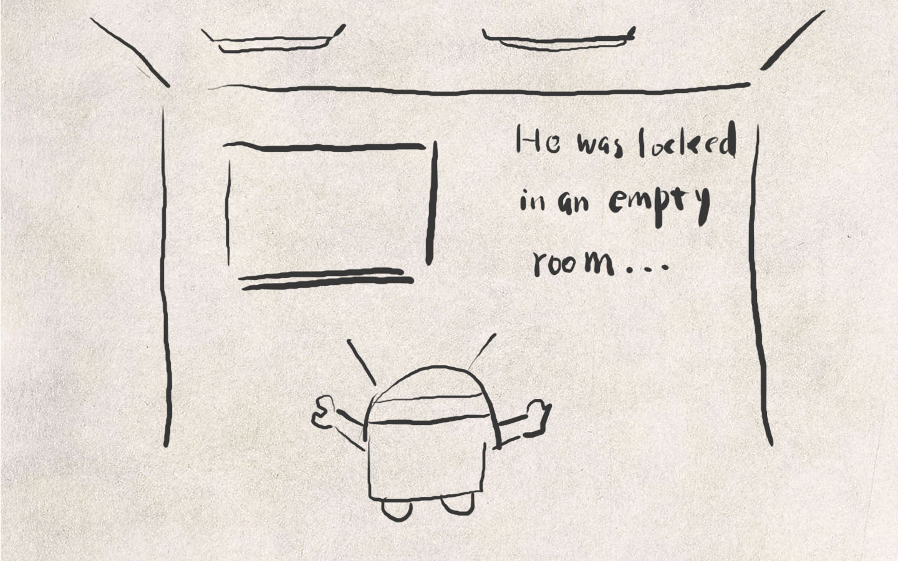 

　　小萝卜感到很害怕，因为这个地方他从来没来过，一点儿也不了解。让他感到害怕的主要是三个问题：

　　1.          自己在哪里？

　　2.          这是什么地方？

　　3.          怎么离开这个地方？

　　在SLAM理论中，第一个问题称为定位 (Localization)，第二个称为建图 (Mapping)，第三个则是随后的路径规划。我们希望借助Kinect工具，帮小萝卜解决这个难题。各位同学有什么思路呢？

## 4.    Kinect数据

　　要打败敌人，首先要了解你的武器。不错，我们先介绍一下Kinect。众所周知这是一款深度相机，你或许还听说过别的牌子，但Kinect的价格便宜，测量范围在3m-12m之间，精度约3cm，较适合于小萝卜这样的室内机器人。它采到的图像是这个样子的（从左往右依次为rgb图，深度图与点云图）：

 

　　Kinect的一大优势在于能比较廉价地获得每个像素的深度值，不管是从时间上还是从经济上来说。OK，有了这些信息，小萝卜事实上可以知道它采集到的图片中，每一个点的3d位置。只要我们事先标定了Kinect，或者采用出厂的标定值。

　　我们把坐标系设成这个样子，这也是openCV中采用的默认坐标系。

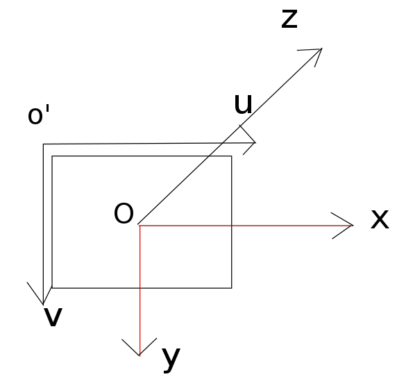 

　　o’-uv是图片坐标系，o-xyz是Kinect的坐标系。假设图片中的点为(u,v)，对应的三维点位置在(x,y,z)，那么它们之间的转换关系是这样的：

 

　　左侧的s为尺度因子，表示从相机光心出去的射线都会落在成像平面的同一个点上。如果我们不知道该点的距离，那么s就是一个自由变量。但在RGB-D相机中，我们在Depth图中知道了这个距离，它的读数dep(u,v)与真实距离相差一个倍数。如果也记作s，那么：　　

 

　　后一个公式给出了计算三维点的方法。先从深度图中读取深度数据（Kinect给的是16位无符号整数），除掉z方向的缩放因子，这样你就把一个整数变到了以米为单位的数据。然后，x,y用上面的公式算出。一点都不难，就是一个中心点位置和一个焦距而已。f代表焦距，c代表中心。如果你没有自己标定你的Kinect，也可以采用默认的值：s=5000,  cx = 320, cy=240, fx=fy=525。实际值会有一点偏差，但不会太大。

## 5.    定位问题

　　知道了Kinect中每个点的位置后，接下来我们要做的，就是根据两帧图像间的差别计算小萝卜的位移。比如下面两张图，后一张是在前一张之后1秒采集到的：

   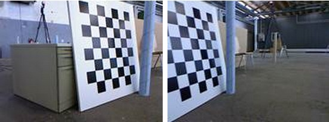

　　你肯定可以看出，小萝卜往右转过了一定的角度。但究竟转过多少度呢？这就要靠计算机来求解了。这个问题称为相机相对姿态估计，经典的算法是ICP（Iterative  Closest  Point，迭代最近点）。这个算法要求知道这两个图像间的一组匹配点，说的通俗点，就是左边图像哪些点和右边是一样的。你当然看见那块黑白相间的板子同时出现在两张图像中。在小萝卜看来，这里牵涉到两个简单的问题：特征点的提取和匹配。

　　如果你熟悉计算机视觉，那你应该听说过SIFT, SURF之类的特征。不错，要解决定位问题，首先要得到两张图像的一个匹配。匹配的基础是图像的特征，下图就是SIFT提取的关键点与匹配结果：

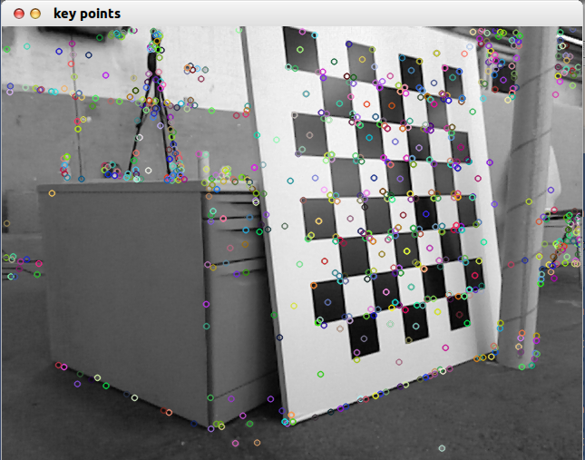  

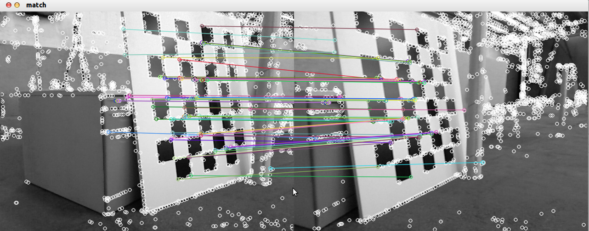

　　对实现代码感兴趣的同学请Google“opencv 匹配”即可，在openCV的教程上也有很明白的例子。上面的例子可以看出，我们找到了一些匹配，但其中有些是对的（基本平等的匹配线），有些是错的。这是由于图像中存在周期性出现的纹理（黑白块），所以容易搞错。但这并不是问题，在接下来的处理中我们会将这些影响消去。

　　得到了一组匹配点后，我们就可以计算两个图像间的转换关系，也叫PnP问题。它的模型是这样的：

[*u**v*]=*C*(*R**p*+*t*)(1)

 

　　R为相机的姿态，C为相机的标定矩阵。R是不断运动的，而C则是随着相机做死的。ICP的模型稍有不同，但原理上也是计算相机的姿态矩阵。原则上，只要有四组匹配点，就可以算这个矩阵。你可以调用openCV的SolvePnPRANSAC函数或者PCL的ICP算法来求解。openCV提供的算法是RANSAC（Random  Sample Consensus，随机采样一致性）架构，可以剔除错误匹配。所以代码实际运行时，可以很好地找到匹配点。以下是一个结果的示例。

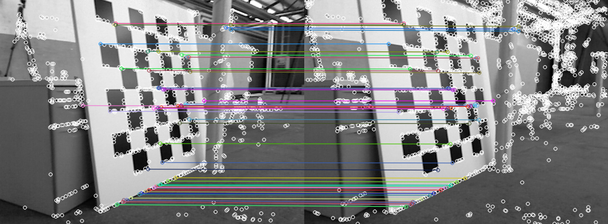 

　　上面两张图转过了16.63度，位移几乎没有。

　　有同学会说，那只要不断匹配下去，定位问题不就解决了吗？表面上看来，的确是这样的，只要我们引入一个关键帧的结构（发现位移超过一个固定值时，定义成一个关键帧）。然后，把新的图像与关键帧比较就行了。至于建图，就是把这些关键帧的点云拼起来，看着还有模有样，煞有介事的：

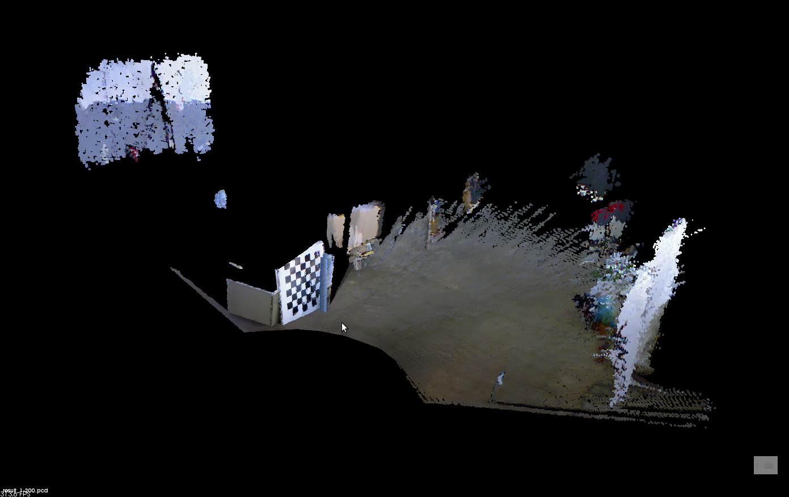 

1－200帧的匹配结果

　　然而，如果事情真这么简单，SLAM理论就不用那么多人研究三十多年了（它是从上世纪90年代开始研究的）（上面讲的那些东西简直随便哪里找个小硕士就能做出来……）。那么，问题难在什么地方呢？

## 6.    SLAM端优化理论

　　最麻烦的问题，就是“噪声”。这种渐近式的匹配方式，和那些惯性测量设备一样，存在着累积噪声。因为我们在不断地更新关键帧，把新图像与最近的关键帧比较，从而获得机器人的位移信息。但是你要想到，如果有一个关键帧出现了偏移，那么剩下的位移估计都会多出一个误差。这个误差还会累积，因为后面的估计都基于前面的机器人位置……哇！这后果简直不堪设想啊（例如，你的机器人往右转了30度，再往左转了30度回到原来的位置。然而由于误差，你算成了向右转29度，再向左转31度，这样你构建的地图中，会出现初始位置的两个“重影”）。我们能不能想办法消除这个该死的误差呢？

　　朋友们，这才是SLAM的研究，前面的可以说是“图像前端”的处理方法。我们的解决思路是：如果你和最近的关键帧相比，会导致累计误差。那么，我们最好是和更前面的关键帧相比，而且多比较几个帧，不要只比较一次。

　　我们用数学来描述这个问题。设：

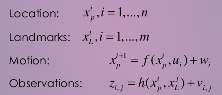 

　　不要怕，只有借助数学才能把这个问题讲清楚。上面的公式中，xp是机器人小萝卜的位置，我们假定由n个帧组成。xL则是路标，在我们的图像处理过程中就是指SIFT提出来的关键点。如果你做2D  SLAM，那么机器人位置就是x, y加一个转角theta。如果是3D  SLAM，就是x,y,z加一个四元数姿态（或者rpy姿态）。这个过程叫做参数化（Parameterization）。

　　不管你用哪种参数，后面两个方程你都需要知道。前一个叫运动方程，描述机器人怎样运动。u是机器人的输入，w是噪声。这个方程最简单的形式，就是你能通过什么方式（码盘等）获得两帧间的位移差，那么这个方程就直接是上一帧与u相加即得。另外，你也可以完全不用惯性测量设备，这样我们就只依靠图像设备来估计，这也是可以的。

　　后一个方程叫观测方程，描述那些路标是怎么来的。你在第i帧看到了第j个路标，产生了一个测量值，就是图像中的横纵坐标。最后一项是噪声。偷偷告诉你，这个方程形式上和上一页的那个方程是一模一样的。

　　在求解SLAM问题前，我们要看到，我们拥有的数据是什么？在上面的模型里，我们知道的是运动信息u以及观测z。用示意图表示出来是这样的：

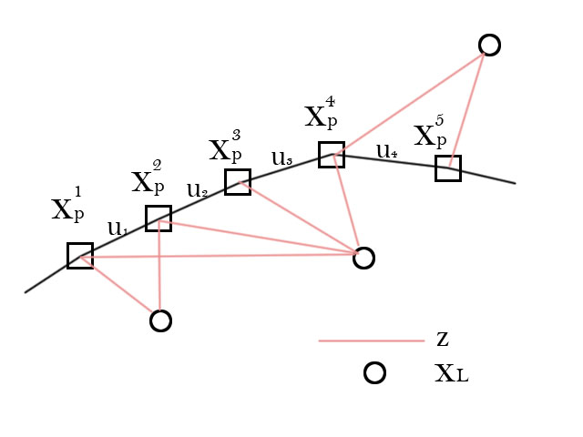 

　　我们要求解的，就是根据这些u和z，确定所有的xp和xL。这就是SLAM问题的理论。从SLAM诞生开始科学家们就一直在解决这个问题。最初，我们用Kalman滤波器，所以上面的模型（运动方程和观测方程）被建成这个样子。直到21世纪初，卡尔曼滤波器仍在SLAM系统占据最主要的地位，Davison经典的单目SLAM就是用EKF做的。但是后来，出现了基于图优化的SLAM方法，渐渐有取而代之的地位[1]。我们在这里不介绍卡尔曼滤波器，有兴趣的同学可以在wiki上找卡尔曼滤波器，另有一篇中文的《卡尔曼滤波器介绍》也很棒。由于滤波器方法存储n个路标要消耗n平方的空间，在计算量上有点对不住大家。尽管08年有人提出分治法的滤波器能把复杂度弄到O(n)  [2]，但实现手段比较复杂。我们要介绍那种新兴的方法: Graph-based SLAM。

　　图优化方法把SLAM问题做成了一个优化问题。学过运筹学的同学应该明白，优化问题对我们有多么重要。我们不是要求解机器人的位置和路标位置吗？我们可以先做一个猜测，猜想它们大概在什么地方。这其实是不难的。然后呢，将猜测值与运动模型／观测模型给出的值相比较，可以算出误差：

 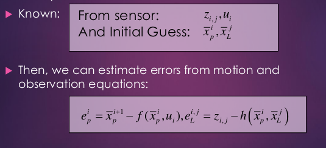

　　通俗一点地讲，例如，我猜机器人第一帧在(0,0,0)，第二帧在(0,0,1)。但是u1告诉我机器人往z方向（前方）走了0.9米，那么运动方程就出现了0.1m的误差。同时，第一帧中机器人发现了路标1，它在该机器人图像的正中间；第二帧却发现它在中间偏右的位置。这时我们猜测机器人只是往前走，也是存在误差的。至于这个误差是多少，可以根据观测方程算出来。

　　我们得到了一堆误差，把这些误差平方后加起来（因为单纯的误差有正有负，然而平方误差可以改成其他的范数，只是平方更常用），就得到了平方误差和。我们把这个和记作phi，就是我们优化问题的目标函数。而优化变量就是那些个xp, xL。

 

　　改变优化变量，误差平方和（目标函数）就会相应地变大或变小，我们可以用数值方法求它们的梯度和二阶梯度矩阵，然后用梯度下降法求最优值。这些东西学过优化的同学都懂的。

 

　　注意到，一次机器人SLAM过程中，往往会有成千上万帧。而每一帧我们都有几百个关键点，一乘就是几百万个优化变量。这个规模的优化问题放到小萝卜的机载小破本上可解吗？是的，过去的同学都以为，Graph-based   SLAM是无法计算的。但就在21世纪06，07年后，有些同学发现了，这个问题规模没有想象的那么大。上面的J和H两个矩阵是“稀疏矩阵”，于是呢，我们可以用稀疏代数的方法来解这个问题。“稀疏”的原因，在于每一个路标，往往不可能出现在所有运动过程中，通常只出现在一小部分图像里。正是这个稀疏性，使得优化思路成为了现实。

　　优化方法利用了所有可以用到的信息（称为full-SLAM, global SLAM），其精确度要比我们一开始讲的帧间匹配高很多。当然计算量也要高一些。

　　由于优化的稀疏性，人们喜欢用“图”来表达这个问题。所谓图，就是由节点和边组成的东西。我写成G={V,E}，大家就明白了。V是优化变量节点，E表示运动/观测方程的约束。什么，更糊涂了吗？那我就上一张图，来自[3]。

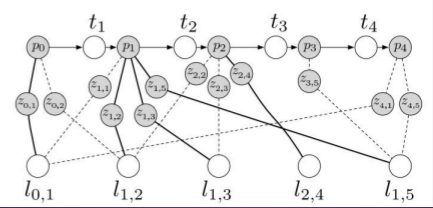 

　　图有点模糊，而且数学符号和我用的不太一样，我用它来给大家一个图优化的直观形象。上图中，p是机器人位置，l是路标，z是观测，t是位移。其中呢，p,   l是优化变量，而z,t是优化的约束。看起来是不是像一些弹簧连接了一些质点呢？因为每个路标不可能出现在每一帧中，所以这个图是蛮稀疏的。不过，“图”优化只是优化问题的一个表达形式，并不影响优化的含义。实际解起来时还是要用数值法找梯度的。这种思路在计算机视觉里，也叫做Bundle Adjustment。它的具体方法请参见一篇经典文章[4]。

　　不过，BA的实现方法太复杂，不太建议同学们拿C来写。好在2010年的ICRA上，其他的同学们提供了一个通用的开发包：g2o [5]。它是有图优化通用求解器，很好用，我改天再详细介绍这个软件包。总之，我们只要把观测和运动信息丢到求解器里就行。这个优化器会为我们求出机器人的轨迹和路标位置。如下图，红点是路标，蓝色箭头是机器人的位置和转角（2D SLAM）。细心的同学会发现它往右偏转了一些。：

 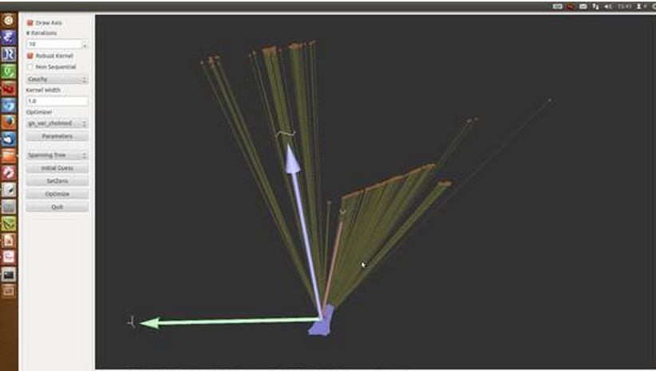

 

## 7.    闭环检测

　　上面提到，仅用帧间匹配最大的问题在于误差累积，图优化的方法可以有效地减少累计误差。然而，如果把所有测量都丢进g2o，计算量还是有点儿大的。根据我自己测试，约10000多条边，g2o跑起来就有些吃力了。这样，就有同学说，能把这个图构造地简洁一些吗？我们用不着所有的信息，只需要把有用的拿出来就行了。

　　事实上，小萝卜在探索房间时，经常会左转一下，右转一下。如果在某个时刻他回到了以前去过的地方，我们就直接与那时候采集的关键帧做比较，可以吗？我们说，可以，而且那是最好的方法。这个问题叫做闭环检测。

　　闭环检测是说，新来一张图像时，如何判断它以前是否在图像序列中出现过？有两种思路：一是根据我们估计的机器人位置，看是否与以前某个位置邻近；二是根据图像的外观，看它是否和以前关键帧相似。目前主流方法是后一种，因为很多科学家认为前一种依靠有噪声的位置来减少位置的噪声，有点循环论证的意思。后一种方法呢，本质上是个模式识别问题（非监督聚类，分类），常用的是Bag-of-Words  (BOW)。但是BOW需要事先对字典进行训练，因此SLAM研究者仍在探讨有没有更合适的方法。

　　在Kinect SLAM经典大作中[6]，作者采用了比较简单的闭环方法：在前面n个关键帧中随机采k个，与当前帧两两匹配。匹配上后认为出现闭环。这个真是相当的简单实用，效率也过得去。

　　高效的闭环检测是SLAM精确求解的基础。这方面还有很多工作可以做。

## 8.    小结

　　本文我们介绍了SLAM的基本概念，重点介绍了图优化解决SLAM问题的思路。我最近正在编写SLAM程序，它是一个Linux下基于cmake的工程。目前仍在开发当中。欢迎感兴趣的同学来交流研究心得，我的邮件是：gaoxiang12@mails.tsinghua.edu.cn。

### 参考文献

[1] Visual SLAM: Why filter? Strasdat et. al., Image and Vision Computing, 2012.

[2] Divide and Conquer: EKF SLAM in O(n), Paz Lina M et al., IEEE Transaction on Robotics, 2008

[3] Relative bundle adjustment, Sibley, Gabe, 2009

[4] Bundle adjustment - a Modern Synthesis. Triggs B et. el., Springer, 2000

[5] g2o: A General Framework for Graph Optimization, Kummerle Rainer, et. al., ICRA, 2011

[6] 3-D Mapping with an RGB-D Camera, IEEE Transaction on Robotics, Endres et al., 2014