# FXAA

Smoothing Pixels

- Calculate image luminance.
- Find high-contrast pixels.
- Identify contrast edges.
- Selectively blend.
- Search for the end points of edges.

This tutorial takes a look at how to create the FXAA post effect. It comes after the [Depth of Field](https://catlikecoding.com/unity/tutorials/advanced-rendering/depth-of-field/) tutorial. 				 				

This tutorial is made with Unity 2017.3.0p3.

 					
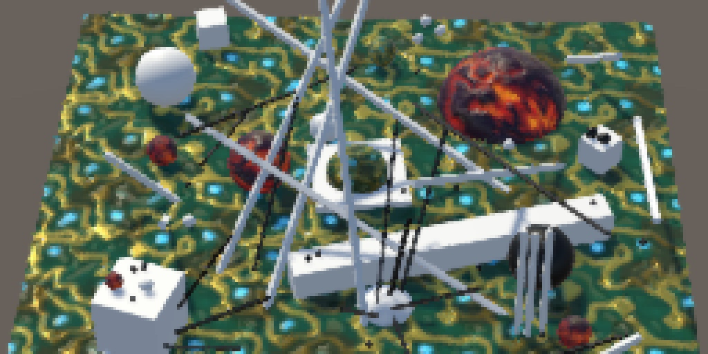 					Master the art of FXAA to combat jaggies and fireflies. 				

## Setting the Scene

Displays have a finite resolution. As a result, image features  that do not align with the pixel grid suffer from aliasing. Diagonal and  curved lines appear as staircases, commonly known as jaggies. Thin  lines can become disconnected and turn into dashed lines. High-contrast  features that are smaller than a pixel sometimes appear and sometimes  don't, leading to flickering when things move, commonly known as  fireflies. A collection of anti-aliasing techniques has been developed  to mitigate these issues. This tutorial covers the classical FXAA  solution.

 						 						 						Thin lines and their aliased rasterization. 					

### Test Scene

For this tutorial I've created a test scene similar to the one from [Depth of Field](https://catlikecoding.com/unity/tutorials/advanced-rendering/depth-of-field/).  It contains areas of both high and low contrast, brighter and darker  regions, multiple straight and curved edges, and small features. As  usual, we're using HDR and linear color space. All scene screenshots are  zoomed in to make individual pixels easier to distinguish.

 							
 							Test scene, zoomed in 4×, without any anti-aliasing. 						

### Supersampling

The most straightforward way to get rid of aliasing is to  render at a resolution higher than the display and downsample it. This  is a spatial anti-aliasing method that makes it possible to capture and  smooth out subpixel features that are too high-frequency for the  display.

 							 							 							Sampling at double resolution and averaging 2×2 blocks. 						

Supersampling anti-aliasing (SSAA) does exactly that. At  minimum, the scene is rendered to a buffer with double the final  resolution and blocks of four pixels are averaged to produce the final  image. Even higher resolutions and different sampling patterns can be  used to further improve the effect. This approach removes aliasing, but  also slightly blurs the entire image.

 							
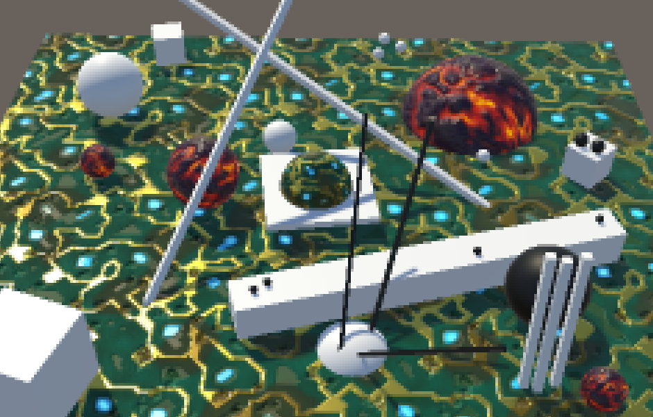 							SSAA 2×. 						

While SSAA works, it is a brute-force approach that is very  expensive. Doubling the resolution quadruples the amount of pixels that  both have to be stored in memory and shaded. Especially fill rate  becomes a bottleneck. To mitigate this, multisample anti-aliasing (MSAA)  was introduced. It also renders to a higher resolution and later  downsamples, but changes how fragments are rendered. Instead of simply  rendering all fragments of a higher-resolution block, it renders a  single fragment per triangle that covers that block, effectively copying  the result to the higher-resolution pixels. This keeps the fill rate  manageable. It also means that only the edges of triangles are affected,  everything else remains unchanged. That's why MSAA doesn't smooth the  transparent edges created via cutout materials.

 							 							 							MSAA 2× and 8×. 						

MSAA works quite well and is used often, but it still requires a  lot of memory and it doesn't combine with effects that depend on the  depth buffer, like deferred rendering. That's why many games opt for  different anti-aliasing techniques.

 							What about CSAA? 							 						

### Post Effect

A third way to perform anti-aliasing is via a post effect.  These are full-screen passes like any other effect, so they don't  require a higher resolution but might rely on temporary render textures.  These techniques have to work at the final resolution, so they have no  access to actual subpixel data. Instead, they have to analyse the image  and selectively blur based on that interpretation.

Multiple post-effect techniques have been developed. The first  one was morphological anti-aliasing (MLAA). In this tutorial, we'll  create our own version of fast approximate anti-aliasing (FXAA). It was  developed by Timothy Lottes at NVIDIA and does exactly what its name  suggests. Compared to MLAA, it trades quality for speed. While a common  complaint of FXAA is that it blurs too much, that varies depending on  which variant is used and how it is tuned. We'll create the latest  version—FXAA 3.11—specifically the high-quality variant for PCs.

We'll use the same setup for a new *FXAA* shader that we used for the *DepthOfField* shader. You can copy it and reduce it to a single pass that just performs a blit for now.

```
Shader "Hidden/FXAA" {
	Properties {
		_MainTex ("Texture", 2D) = "white" {}
	}

	CGINCLUDE
		#include "UnityCG.cginc"

		sampler2D _MainTex;
		float4 _MainTex_TexelSize;

		struct VertexData {
			float4 vertex : POSITION;
			float2 uv : TEXCOORD0;
		};

		struct Interpolators {
			float4 pos : SV_POSITION;
			float2 uv : TEXCOORD0;
		};

		Interpolators VertexProgram (VertexData v) {
			Interpolators i;
			i.pos = UnityObjectToClipPos(v.vertex);
			i.uv = v.uv;
			return i;
		}
	ENDCG

	SubShader {
		Cull Off
		ZTest Always
		ZWrite Off

		Pass { // 0 blitPass
			CGPROGRAM
				#pragma vertex VertexProgram
				#pragma fragment FragmentProgram

				float4 FragmentProgram (Interpolators i) : SV_Target {
					float4 sample = tex2D(_MainTex, i.uv);
					return sample;
				}
			ENDCG
		}
	}
}
```

Create a minimal `**FXAAEffect**` component, again using the same approach as for the depth-of-field effect.

```
using UnityEngine;
using System;

[ExecuteInEditMode, ImageEffectAllowedInSceneView]
public class FXAAEffect : MonoBehaviour {

	[HideInInspector]
	public Shader fxaaShader;

	[NonSerialized]
	Material fxaaMaterial;

	void OnRenderImage (RenderTexture source, RenderTexture destination) {
		if (fxaaMaterial == null) {
			fxaaMaterial = new Material(fxaaShader);
			fxaaMaterial.hideFlags = HideFlags.HideAndDontSave;
		}

		Graphics.Blit(source, destination, dofMaterial);
	}
}
```

Setup the default shader reference for the component script.

 							
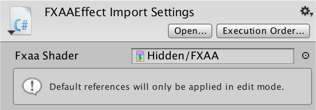 							Default shader reference. 						

Attach our new effect as the only one to the camera. Once  again, we assume that we're rendering in linear HDR space, so configure  the project and camera accordingly. Also, because we perform our own  anti-aliasing, make sure that MSAA is disabled.

 							
 							HDR camera without MSAA and with FXAA. 						

 							I'm still getting MSAA in the scene view? 							 						

unitypackage

## Luminance

FXAA works by selectively reducing the contrast of the image,  smoothing out visually obvious jaggies and isolated pixels. Contrast is  determined by comparing the light intensity of pixels. The exact colors  of pixels doesn't matter, it's their luminance that counts. Effectively,  FXAA works on a grayscale image containing only the pixel brightness.  This means that hard transitions between different colors won't be  smoothed out much when their luminance is similar. Only visually obvious  transitions are strongly affected.

### Calculating Luminance

Let's begin by checking out what this monochrome luminance  image looks like. As the green color component contributes most to a  pixel's luminance, a quick preview can be created by simply using that,  discarding the red and blue color data.

```
				float4 FragmentProgram (Interpolators i) : SV_Target {
					float4 sample = tex2D(_MainTex, i.uv);
					sample.rgb = sample.g;
					return sample;
				}
```

 							
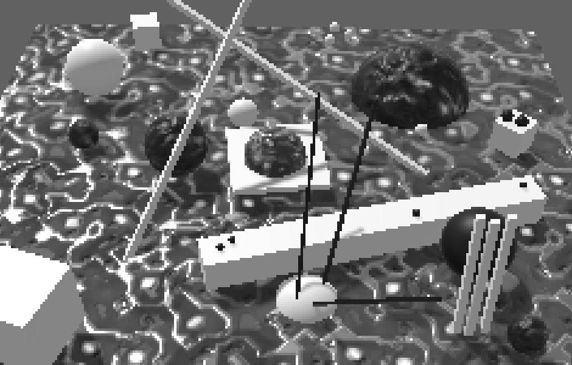 							Using the green channel as luminance. 						

This is a crude approximation of luminance. It's better to appropriately calculate luminance, for which we can use the `LinearRgbToLuminance` function from *UnityCG*.

```
					sample.rgb = LinearRgbToLuminance(sample.rgb);
```

FXAA expects luminance values to lie in the 0–1 range, but this  isn't guaranteed when working with HDR colors. Typically, anti-aliasing  is done after tonemapping and color grading, which should have gotten  rid of most if not all HDR colors. But we don't use those effects in  this tutorial, use the clamped color to calculate luminance.

```
					sample.rgb = LinearRgbToLuminance(saturate(sample.rgb));
```

 							
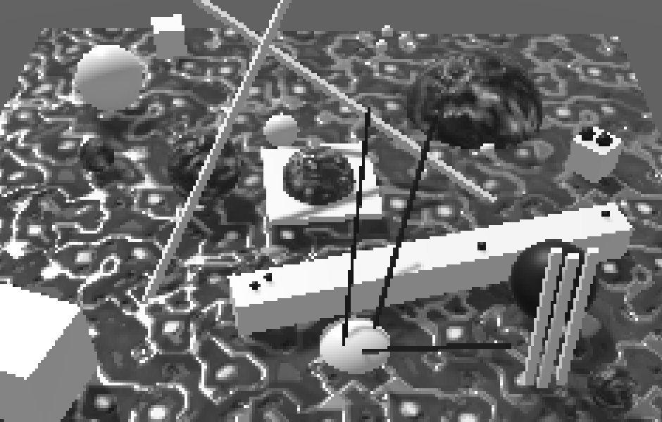 							Luminance. 						

 							What does `LinearRgbToLuminance` look like? 							 						

### Supplying Luminance Data

FXAA doesn't calculate luminance itself. That would be  expensive, because each pixel requires multiple luminance samples.  Instead, the luminance data has to be put in the alpha channel by an  earlier pass. Alternatively, FXAA can use green as luminance instead,  for example when the alpha channel cannot be used for some reason.  Unity's post effect stack v2 supports both approaches when FXAA is used.

Let's support both options too, but because we're not using a  post effect stack let's also support calculating luminance ourselves.  Add an enumeration field to `**FXAAEffect**` to control this and set it to *Calculate* in the inspector.

```
	public enum LuminanceMode { Alpha, Green, Calculate }

	public LuminanceMode luminanceSource;
```

 							
 							Luminance source, set to calculate. 						

When we have to calculate luminance ourselves, we'll do this  with a separate pass, storing the original RGB plus luminance data in a  temporary texture. The actual FXAA pass then uses that texture instead  of the original source. Furthermore, the FXAA pass needs to know whether  it should use the green or alpha channel for luminance. We'll indicate  this via the *LUMINANCE_GREEN* shader keyword.

```
	const int luminancePass = 0;
	const int fxaaPass = 1;
	
	…
	
	void OnRenderImage (RenderTexture source, RenderTexture destination) {
		if (fxaaMaterial == null) {
			fxaaMaterial = new Material(fxaaShader);
			fxaaMaterial.hideFlags = HideFlags.HideAndDontSave;
		}

		if (luminanceSource == LuminanceMode.Calculate) {
			fxaaMaterial.DisableKeyword("LUMINANCE_GREEN");
			RenderTexture luminanceTex = RenderTexture.GetTemporary(
				source.width, source.height, 0, source.format
			);
			Graphics.Blit(source, luminanceTex, fxaaMaterial, luminancePass);
			Graphics.Blit(luminanceTex, destination, fxaaMaterial, fxaaPass);
			RenderTexture.ReleaseTemporary(luminanceTex);
		}
		else {
			if (luminanceSource == LuminanceMode.Green) {
				fxaaMaterial.EnableKeyword("LUMINANCE_GREEN");
			}
			else {
				fxaaMaterial.DisableKeyword("LUMINANCE_GREEN");
			}
			Graphics.Blit(source, destination, fxaaMaterial, fxaaPass);
		}
	}
```

We can use our existing pass for the luminance pass. The only  change is that luminance should be stored in the alpha channel, keeping  the original RGB data. The new FXAA pass starts out as a simple blit  pass, with a multi-compile option for `LUMINANCE_GREEN`.

```
		Pass { // 0 luminancePass
			CGPROGRAM
				#pragma vertex VertexProgram
				#pragma fragment FragmentProgram

				half4 FragmentProgram (Interpolators i) : SV_Target {
					half4 sample = tex2D(_MainTex, i.uv);
					sample.a = LinearRgbToLuminance(saturate(sample.rgb));
					return sample;
				}
			ENDCG
		}
		
		Pass { // 1 fxaaPass
			CGPROGRAM
				#pragma vertex VertexProgram
				#pragma fragment FragmentProgram

				#pragma multi_compile _ LUMINANCE_GREEN

				float4 FragmentProgram (Interpolators i) : SV_Target {
					return tex2D(_MainTex, i.uv);
				}
			ENDCG
		}
```

### Sampling Luminance

To apply the FXAA effect, we have to sample luminance data.  This is done by sampling the main texture and selecting either its green  or alpha channel. We'll create some convenient functions for this,  putting them all in a `CGINCLUDE` block at the top of the shader file.

```
	CGINCLUDE
		…
		
		float4 Sample (float2 uv) {
			return tex2D(_MainTex, uv);
		}

		float SampleLuminance (float2 uv) {
			#if defined(LUMINANCE_GREEN)
				return Sample(uv).g;
			#else
				return Sample(uv).a;
			#endif
		}
		
		float4 ApplyFXAA (float2 uv) {
			return SampleLuminance(uv);
		}
	ENDCG
```

Now our FXAA pass can simply invoke the `ApplyFXAA` function with only the fragment's texture coordinates as arguments.

```
				float4 FragmentProgram (Interpolators i) : SV_Target {
					return ApplyFXAA(i.uv);
				}
```

unitypackage

## Blending High-contrast Pixels

FXAA works by blending high-contrast pixels. This is not a  straightforward blurring of the image. First, the local contrast has to  be calculated. Second—if there is enough contrast—a blend factor has to  be chosen based on the contrast. Third, the local contrast gradient has  to be investigated to determine a blend direction. Finally, a blend is  performed between the original pixel and one of its neighbors.

### Determining Contrast With Adjacent Pixels

The local contrast is found by comparing the luminance of the  current pixel and the luminance of its neighbors. To make it easy to  sample the neighbors, add a `SampleLuminance` function  variant that has offset parameters for the U and V coordinates, in  texels. These should be scaled by the texel size and added to `uv` before sampling.

```
		float SampleLuminance (float2 uv) {
			…
		}

		float SampleLuminance (float2 uv, float uOffset, float vOffset) {
			uv += _MainTex_TexelSize * float2(uOffset, vOffset);
			return SampleLuminance(uv);
		}
```

FXAA uses the direct horizontal and vertical neighbors—and the  middle pixel itself—to determine the contrast. Because we'll use this  luminance data multiple times, let's put it in a `**LuminanceData**`  structure. We'll use compass directions to refer to the neighbor data,  using north for positive V, east for position U, south for negative V,  and west for negative U. Sample these pixels and initialize the  luminance data in a separate function, and invoke it in `ApplyFXAA`.

 							
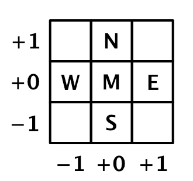 							NESW cross plus middle pixel. 						

```
		struct LuminanceData {
			float m, n, e, s, w;
		};

		LuminanceData SampleLuminanceNeighborhood (float2 uv) {
			LuminanceData l;
			l.m = SampleLuminance(uv);
			l.n = SampleLuminance(uv, 0,  1);
			l.e = SampleLuminance(uv, 1,  0);
			l.s = SampleLuminance(uv, 0, -1);
			l.w = SampleLuminance(uv,-1,  0);
			return l;
		}
		
		float4 ApplyFXAA (float2 uv) {
			LuminanceData l = SampleLuminanceNeighborhood(uv);
			return l.m;
		}
```

 							Shouldn't north and south be swapped? 							 						

The local contrast between these pixels is simply the  difference between their highest and lowest luminance values. As  luminance is defined in the 0–1 range, so is the contrast. We calculate  the lowest, highest, and contrast values immediately after sampling the  cross. Add them to the structure so we can access them later in `ApplyFXAA`. The contrast is most important, so let's see what that looks like.

```
		struct LuminanceData {
			float m, n, e, s, w;
			float highest, lowest, contrast;
		};

		LuminanceData SampleLuminanceNeighborhood (float2 uv) {
			LuminanceData l;
			…

			l.highest = max(max(max(max(l.n, l.e), l.s), l.w), l.m);
			l.lowest = min(min(min(min(l.n, l.e), l.s), l.w), l.m);
			l.contrast = l.highest - l.lowest;
			return l;
		}

		float4 ApplyFXAA (float2 uv) {
			LuminanceData l = SampleLuminanceNeighborhood(uv);
			return l.contrast;
		}
```

 							
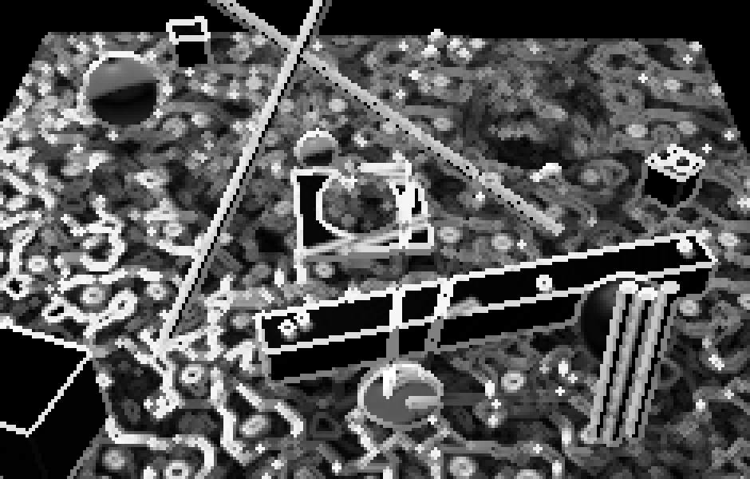 							Local contrast. 						

The result is like a crude edge-detection filter. Because  contrast doesn't care about direction, pixels on both sides of a  contrast different end up with the same value. So we get edges that are  at least two pixels thick, formed by north–south or east–west pixel  pairs.

### Skipping Low-contrast Pixels

We don't need to bother anti-aliasing those areas. Let's make  this configurable via a contrast threshold slider. The original FXAA  algorithm has this threshold as well, with the following code  documentation:

```
	// Trims the algorithm from processing darks.
	//   0.0833 - upper limit (default, the start of visible unfiltered edges)
	//   0.0625 - high quality (faster)
	//   0.0312 - visible limit (slower)
```

Although the documentation mentions that it trims dark areas,  it actually trims based on contrast—not luminance—so regardless whether  it's bright or dark. We will use the same range as indicated by the  documentation, but with the low threshold as default.

```
	[Range(0.0312f, 0.0833f)]
	public float contrastThreshold = 0.0312f;
	
	…
	
	void OnRenderImage (RenderTexture source, RenderTexture destination) {
		if (fxaaMaterial == null) {
			fxaaMaterial = new Material(fxaaShader);
			fxaaMaterial.hideFlags = HideFlags.HideAndDontSave;
		}

		fxaaMaterial.SetFloat("_ContrastThreshold", contrastThreshold);

		…
	}
```

 							
 							Contrast threshold. 						

Inside the shader, simply return after sampling the  neighborhood, if the contrast is below the threshold. To make it  visually obvious which pixels are skipped, I made them red.

```
		float _ContrastThreshold;

		…

		float4 ApplyFXAA (float2 uv) {
			LuminanceData l = SampleLuminanceNeighborhood(uv);
			if (l.contrast < _ContrastThreshold) {
				return float4(1, 0, 0, 0);
			}
			return l.contrast;
		}
```

 							
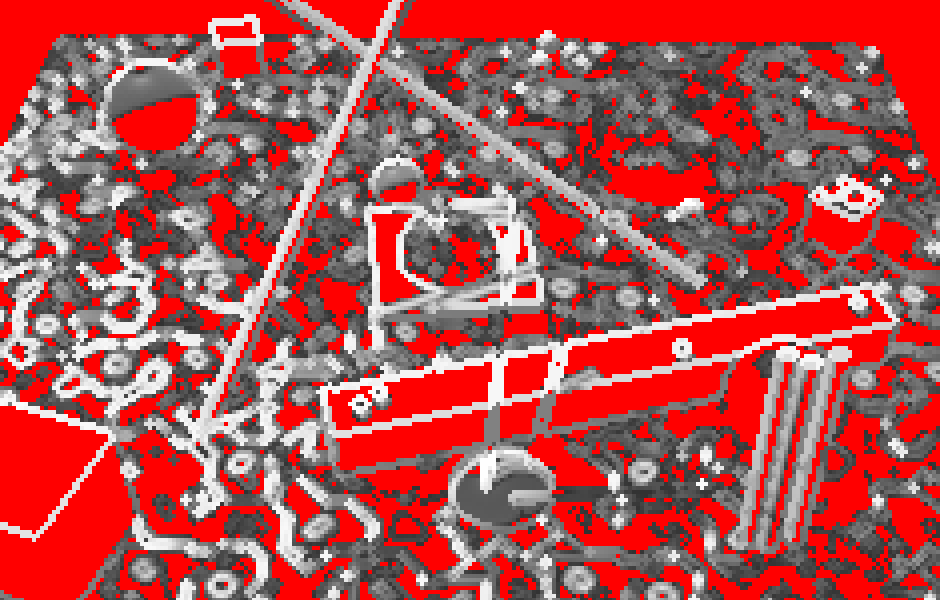 							Red pixels are skipped. 						

Besides an absolute contrast threshold, FXAA also has a relative threshold. Here is the code documentation for it:

```
	// The minimum amount of local contrast required to apply algorithm.
	//   0.333 - too little (faster)
	//   0.250 - low quality
	//   0.166 - default
	//   0.125 - high quality 
	//   0.063 - overkill (slower)
```

This sounds like the threshold that we just introduced, but in  this case it's based on the maximum luminance of the neighborhood. The  brighter the neighborhood, the higher the contrast must be to matter.  We'll add a configuration slider for this relative threshold as well,  using the indicated range, again with the lowest value as the default.

```
	[Range(0.063f, 0.333f)]
	public float relativeThreshold = 0.063f;
	
	…
	
	void OnRenderImage (RenderTexture source, RenderTexture destination) {
		…

		fxaaMaterial.SetFloat("_ContrastThreshold", contrastThreshold);
		fxaaMaterial.SetFloat("_RelativeThreshold", relativeThreshold);

		…
	}
```

 							
 							Relative contrast threshold. 						

The threshold is relative because it's scaled by the contrast.  Use that instead of the previous threshold to see the difference. This  time, I've used green to indicate skipped pixels.

```
		float _ContrastThreshold, _RelativeThreshold;

		…

		float4 ApplyFXAA (float2 uv) {
			LuminanceData l = SampleLuminanceNeighborhood(uv);
			if (l.contrast < _RelativeThreshold * l.highest) {
				return float4(0, 1, 0, 0);
			}

			return l.contrast;
		}
```

 							
 							Green pixels are skipped. 						

Overall, the *Contrast Threshold* most aggressively skips pixels, but the *Relative Threshold*  can skip higher contrast pixels in brighter regions. For example, in  the below screenshot I've combined both colors with both threshold at  maximum. Yellow indicates pixels that are skipped using both criteria.  In this scene, only some white shadowed regions and the white spheres  are affected solely by the relative threshold.

 							
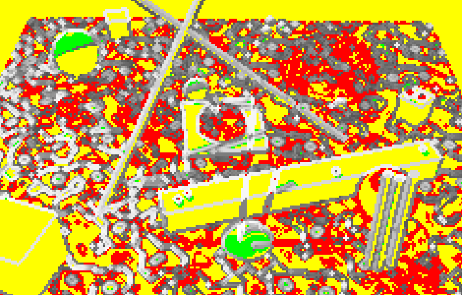 							Both thresholds, at maximum. 						

To apply both thresholds, simply compare the contrast with the  maximum of both. For clarity, put this comparison in a separate  function. For now, if a pixel is skipped, simply make it black by  returning zero.

```
		bool ShouldSkipPixel (LuminanceData l) {
			float threshold =
				max(_ContrastThreshold, _RelativeThreshold * l.highest);
			return l.contrast < threshold;
		}

		float4 ApplyFXAA (float2 uv) {
			LuminanceData l = SampleLuminanceNeighborhood(uv);
//			if (l.contrast < _RelativeThreshold * l.highest) {
//				return float4(0, 1, 0, 0);
//			}
			if (ShouldSkipPixel(l)) {
				return 0;
			}
			return l.contrast;
		}
```

 							
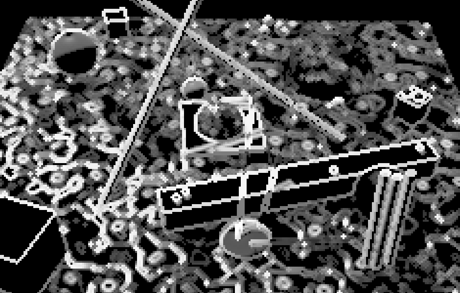 							Contrast, with skipped pixels at zero. 						

### Calculating Blend Factor

Now that we have the contrast value for pixels that we need, we  can move on to determining the blend factor. Create a separate function  for this, with the luminance data as parameter, and use that to  determine the final result.

```
		float DeterminePixelBlendFactor (LuminanceData l) {
			return 0;
		}

		float4 ApplyFXAA (float2 uv) {
			LuminanceData l = SampleLuminanceNeighborhood(uv);
			if (ShouldSkipPixel(l)) {
				return 0;
			}

			float pixelBlend = DeterminePixelBlendFactor(l);
			return pixelBlend;
		}
```

How much we should blend depends on the contrast between the  middle pixel and its entire neighborhood. Although we've used the NEWS  cross to determine the local contrast, this isn't a sufficient  representation of the neighborhood. We need the four diagonal neighbors  for that as well. So add them to the luminance data. We can sample them  directly in `SampleLuminanceNeighborhood` along with the  other neighbors, even though we might end up skipping the pixel. The  shader compiler takes care of optimizing our code so the extra sampling  only happens when needed.

 							
 							Entire neighborhood. 						

```
		struct LuminanceData {
			float m, n, e, s, w;
			float ne, nw, se, sw;
			float highest, lowest, contrast;
		};

		LuminanceData SampleLuminanceNeighborhood (float2 uv) {
			LuminanceData l;
			l.m = SampleLuminance(uv);
			l.n = SampleLuminance(uv,  0,  1);
			l.e = SampleLuminance(uv,  1,  0);
			l.s = SampleLuminance(uv,  0, -1);
			l.w = SampleLuminance(uv, -1,  0);

			l.ne = SampleLuminance(uv,  1,  1);
			l.nw = SampleLuminance(uv, -1,  1);
			l.se = SampleLuminance(uv,  1, -1);
			l.sw = SampleLuminance(uv, -1, -1);
			
			…
		}
```

Now we can determine the average luminance of all adjacent  neighbors. But because the diagonal neighbors are spatially further away  from the middle, they should matter less. We factor this into our  average by doubling the weights of the NESW neighbors, dividing the  total by twelve instead of eight. The result is akin to a tent filter  and acts as a low-pass filter.

 							
 							Neighbor weights. 						

```
		float DeterminePixelBlendFactor (LuminanceData l) {
			float filter = 2 * (l.n + l.e + l.s + l.w);
			filter += l.ne + l.nw + l.se + l.sw;
			filter *= 1.0 / 12;
			return filter;
		}
```

 							
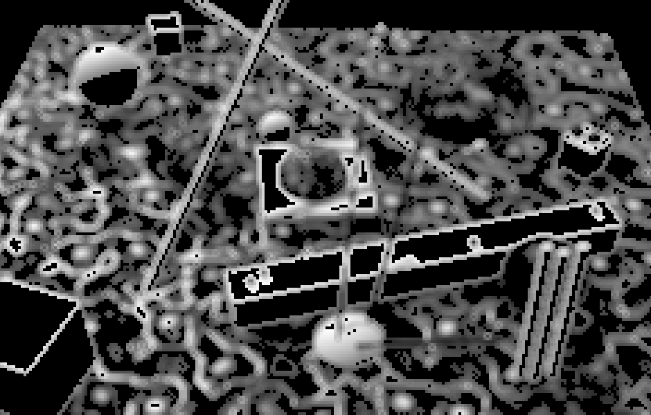 							Low-pass filter on high-contrast regions. 						

Next, find the contrast between the middle and this average,  via their absolute difference. The result has now become a high-pass  filter.

```
		float DeterminePixelBlendFactor (LuminanceData l) {
			float filter = 2 * (l.n + l.e + l.s + l.w);
			filter += l.ne + l.nw + l.se + l.sw;
			filter *= 1.0 / 12;
			filter = abs(filter - l.m);
			return filter;
		}
```

 							
 							High-pass filter. 						

Next, the filter is normalized relative to the contrast of the  NESW cross, via a division. Clamp the result to a maximum of 1, as we  might end up with larger values thanks to the filter covering more  pixels than the cross.

```
			filter = abs(filter - l.m);
			filter = saturate(filter / l.contrast);
			return filter;
```

 							
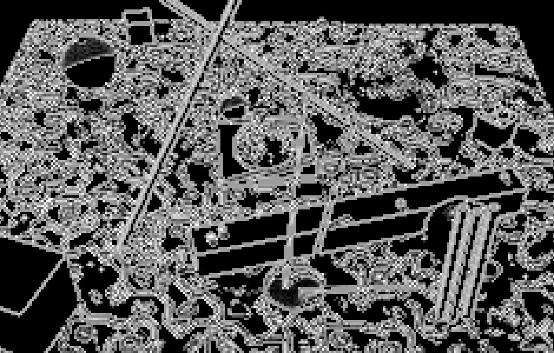 							Normalized filter. 						

The result is a rather harsh transition to use as a blend factor. Use the `smoothstep` function to smooth it out, then square the result of that to slow it down.

 							
 							Linear vs. squared smoothstep. 						

```
			filter = saturate(filter / l.contrast);

			float blendFactor = smoothstep(0, 1, filter);
			return blendFactor * blendFactor;
```

 							
 							Blend factor. 						

### Blend Direction

Now that we have a blend factor, the next step is to decide  which two pixels to blend. FXAA blends the middle pixel with one of its  neighbors from the NESW cross. Which of those four pixels is selected  depends on the direction of the contrast gradient. In the simplest case,  the middle pixel touches either a horizontal or a vertical edge between  two contrasting regions. In case of a horizontal edge, it should be  either the north or the south neighbor, depending on whether the middle  is below or above the edge. Otherwise, it should be either the east or  the west neighbor, depending on whether the middle is on the left or  right side of the edge.

 							
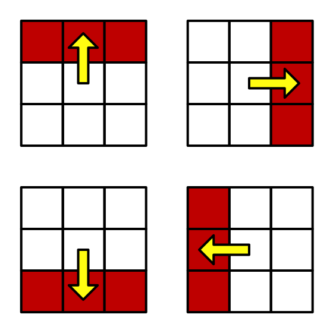 							Blend directions. Red represents brightness difference, either darker or lighter. 						

Edges often aren't perfectly horizontal or vertical, but we'll  pick the best approximation. To determine that, we compare the  horizontal and vertical contrast in the neighborhood. When there is a  horizontal edge, there is strong vertical contrast, either above or  below the middle. We measure this by adding north and south, subtracting  the middle twice, and taking the absolute of that, so |n+s−2m|

. The same logic is applies to vertical edges, but with east and west instead.

This only gives us an indication of the vertical contrast  inside the NESW cross. We can improve the quality of our edge  orientation detection by including the diagonal neighbors as well. For  the horizontal edge, we perform the same calculation for the three  pixels one step to the east and the three pixels one step to the west,  summing the results. Again, these additional values are further away  from the middle, so we halve their relative importance. This leads to  the final formula 2|n+s−2m|+|ne+se−2e|+|nw+sw−2w|

  for the horizontal edge contrast, and similar for the vertical edge  contrast. We don't need to normalize the results because we only care  about which one is larger and they both use the same scale.

If the horizontal edge contrast is greater or equal than the  vertical one, then we have a horizontal edge. Create a struct to hold  this edge data and put the calculation for it in a separate function.  Then have `ApplyFXAA` invoke it. This allows us to visualize the detected edge direction, for example by making horizontal edges red.

```
		struct EdgeData {
			bool isHorizontal;
		};

		EdgeData DetermineEdge (LuminanceData l) {
			EdgeData e;
			float horizontal =
				abs(l.n + l.s - 2 * l.m) * 2 +
				abs(l.ne + l.se - 2 * l.e) +
				abs(l.nw + l.sw - 2 * l.w);
			float vertical =
				abs(l.e + l.w - 2 * l.m) * 2 +
				abs(l.ne + l.nw - 2 * l.n) +
				abs(l.se + l.sw - 2 * l.s);
			e.isHorizontal = horizontal >= vertical;
			return e;
		}

		float4 ApplyFXAA (float2 uv) {
			LuminanceData l = SampleLuminanceNeighborhood(uv);
			if (ShouldSkipPixel(l)) {
				return 0;
			}
			float pixelBlend = DeterminePixelBlendFactor(l);
			EdgeData e = DetermineEdge(l);
			return e.isHorizontal ? float4(1, 0, 0, 0) : 1;
		}
```

 							
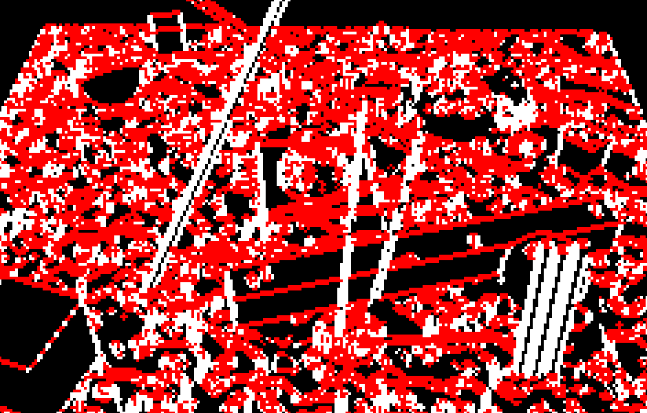 							Red pixels are on horizontal edges. 						

Knowing the edge orientation tells us in what dimension we have  to blend. If it's horizontal, then we'll blend vertically across the  edge. How far it is to the next pixel in UV space depends on the texel  size, and that depends on the blend direction. So let's add this step  size to the edge data as well.

```
		struct EdgeData {
			bool isHorizontal;
			float pixelStep;
		};

		EdgeData DetermineEdge (LuminanceData l) {
			…
			e.isHorizontal = horizontal >= vertical;

			e.pixelStep =
				e.isHorizontal ? _MainTex_TexelSize.y : _MainTex_TexelSize.x;

			return e;
		}
```

Next, we have to determine whether we should blend in the  positive or negative direction. We do this by comparing the contrast—the  luminance gradient—on either side of the middle in the appropriate  dimension. If we have a horizontal edge, then north is the positive  neighbor and south is the negative one. If we have a vertical edge  instead, then east is the positive neighbor and west is the negative  one.

```
			float pLuminance = e.isHorizontal ? l.n : l.e;
			float nLuminance = e.isHorizontal ? l.s : l.w;
			
			e.pixelStep =
				e.isHorizontal ? _MainTex_TexelSize.y : _MainTex_TexelSize.x;
```

Compare the gradients. If the positive side has the highest  contrast, then we can use the appropriate texel size unchanged.  Otherwise, we have to step in the opposite direction, so we have to  negate it.

```
			float pLuminance = e.isHorizontal ? l.n : l.e;
			float nLuminance = e.isHorizontal ? l.s : l.w;
			float pGradient = abs(pLuminance - l.m);
			float nGradient = abs(nLuminance - l.m);
			
			e.pixelStep =
				e.isHorizontal ? _MainTex_TexelSize.y : _MainTex_TexelSize.x;

			if (pGradient < nGradient) {
				e.pixelStep = -e.pixelStep;
			}
```

To visualize this, I made all pixels with a negative step red.  Because pixels should blend across the edge, this means that all pixels  on the right or top side of edges become red.

```
		float4 ApplyFXAA (float2 uv) {
			…
			return e.pixelStep < 0 ? float4(1, 0, 0, 0) : 1;
		}
```

 							
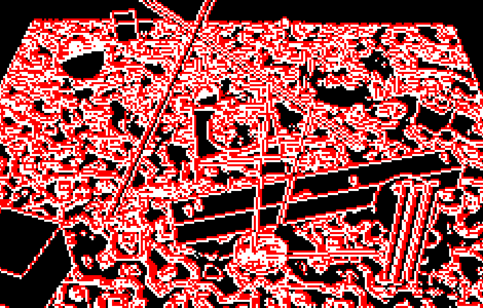 							Red pixels blend in negative direction. 						

### Blending

At this point we have both a blend factor and known in which  direction to blend. The final result is obtained by using the blend  factor to linearly interpolate between the middle pixel and its neighbor  in the appropriate direction. We can do this by simply sampling the  image with an offset equal to the pixel step scaled by the blend factor.  Also, make sure to return the original pixel if we decided not to blend  it. I kept the original luminance in the alpha channel, in case you  want to use it for something else, but that's not necessary.

```
		float4 ApplyFXAA (float2 uv) {
			LuminanceData l = SampleLuminanceNeighborhood(uv);
			if (ShouldSkipPixel(l)) {
				return Sample(uv);
			}
			float pixelBlend = DeterminePixelBlendFactor(l);
			EdgeData e = DetermineEdge(l);

			if (e.isHorizontal) {
				uv.y += e.pixelStep * pixelBlend;
			}
			else {
				uv.x += e.pixelStep * pixelBlend;
			}
			return float4(Sample(uv).rgb, l.m);
		}
```

Note that the final sample ends up with an offset in four  possible directions and a variable distance, which can wildly vary from  pixel to pixel. This confuses anisotropic texture filtering and mipmap  selection. While we don't use mipmaps for our temporary texture and  typically no other post-effect does this either, we haven't explicitly  disabled anisotropic filtering, so that might distort the final sample.  To guarantee that no amount of perspective filtering is applied, use `tex2Dlod` to access the texture without adjustment in `Sample`, instead of using `tex2D`.

```
		float4 Sample (float2 uv) {
			return tex2Dlod(_MainTex, float4(uv, 0, 0));
		}
```

 							 							
 							With and without blending. 						

The result is an anti-aliased image using FXAA subpixel  blending. It affects high-contrast edges, but also a lot of  lower-contrast details in our textures. While this helps mitigate  fireflies, the blurriness can be considered too much. The strength of  this effect can by tuned via a 0–1 range factor to modulate the final  offset. The original FXAA implementation allows this as well, with the  following code documentation:

```
	// Choose the amount of sub-pixel aliasing removal.
	// This can effect sharpness.
	//   1.00 - upper limit (softer)
	//   0.75 - default amount of filtering
	//   0.50 - lower limit (sharper, less sub-pixel aliasing removal)
	//   0.25 - almost off
	//   0.00 - completely off
```

Add a slider for the subpixel blending to our effect. We'll use  full-strength as the default, which Unity's post effect stack v2 does  as well, although it doesn't allow you to adjust it.

```
	[Range(0f, 1f)]
	public float subpixelBlending = 1f;

	…

	void OnRenderImage (RenderTexture source, RenderTexture destination) {
		…
		
		fxaaMaterial.SetFloat("_ContrastThreshold", contrastThreshold);
		fxaaMaterial.SetFloat("_RelativeThreshold", relativeThreshold);
		fxaaMaterial.SetFloat("_SubpixelBlending", subpixelBlending);

		…
	}
```

 							
 							Slider for subpixel blending. 						

Use `_SubpixelBlending` to modulate the blend factor before returning it in `DeterminePixelBlendFactor`. We can now control the strength of the FXAA effect.

```
		float _ContrastThreshold, _RelativeThreshold;
		float _SubpixelBlending;

		…

		float DeterminePixelBlendFactor (LuminanceData l) {
			…
			return blendFactor * blendFactor * _SubpixelBlending;
		}
```

<iframe src="https://gfycat.com/ifr/PalatableThankfulBufeo"></iframe>

Adjusting the amount of blending.

unitypackage

## Blending Along Edges

Because the pixel blend factor is determined inside a 3×3 block,  it can only smooth out features of that scale. But edges can be longer  than that. A pixel can end up somewhere on a long step of an angled edge  staircase. While locally the edge is either horizontal or vertical, the  true edge is at an angle. If we knew this true edge then we could  better match the blend factors of adjacent pixels, smoothing the edge  across its entire length.

 						
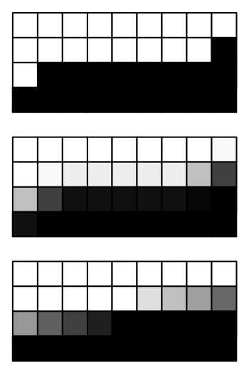 						No, current, and desired edge blending. 					

### Edge Luminance

To figure out what kind of edge we're dealing with, we have to  keep track of more information. We know that the middle pixel of the 3×3  block is on one side of the edge, and one of the other pixels is on the  other side. To further identify the edge, we need to know its  gradient—the contrast difference between the regions on either side of  it. We already figured this out in `DetermineEdge`. Let's keep track of this gradient and the luminance on the other side as well.

```
		struct EdgeData {
			bool isHorizontal;
			float pixelStep;
			float oppositeLuminance, gradient;
		};

		EdgeData DetermineEdge (LuminanceData l) {
			…
			
			if (pGradient < nGradient) {
				e.pixelStep = -e.pixelStep;
				e.oppositeLuminance = nLuminance;
				e.gradient = nGradient;
			}
			else {
				e.oppositeLuminance = pLuminance;
				e.gradient = pGradient;
			}

			return e;
		}
```

We'll use a separate function to determine a new blend factor  for edges. For now, immediately return it after we've determined the  edge, skipping the rest of the shader. Also set skipped pixels back to  zero. At first, we'll just output the edge gradient.

```
		float DetermineEdgeBlendFactor (LuminanceData l, EdgeData e, float2 uv) {
			return e.gradient;
		}

		float4 ApplyFXAA (float2 uv) {
			LuminanceData l = SampleLuminanceNeighborhood(uv);
			if (ShouldSkipPixel(l)) {
				return 0;
			}

			float pixelBlend = DeterminePixelBlendFactor(l);
			EdgeData e = DetermineEdge(l);
			return DetermineEdgeBlendFactor(l, e, uv);

			if (e.isHorizontal) {
				uv.y += e.pixelStep * pixelBlend;
			}
			else {
				uv.x += e.pixelStep * pixelBlend;
			}
```

 							
 							Edge gradients. 						

### Walking Along the Edge

We have to figure out the relative location of the pixel along  the horizontal or vertical edge segment. To do so, we'll walk along the  edge in both directions until we find its end points. We can do this by  sampling pixel pairs along the edge and check whether their contrast  gradient still matches that of the original edge.

 							
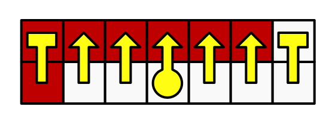 							Searching for the ends of an edge. 						

But we don't actually need to sample both pixels each step. We  can make do with a single sample in between them. That gives us the  average luminance exactly on the edge, which we can compare with the  fist edge crossing.

 							
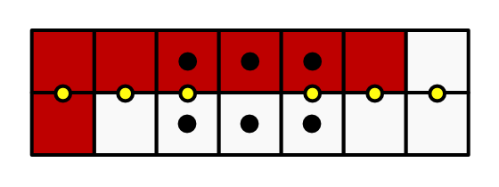							Texturesampleswhilesearching(yellow)and3×3samples(black). 						

So we begin by determining the UV coordinates on the edge, which is half a step away from the original UV coordinates.

```
		float DetermineEdgeBlendFactor (LuminanceData l, EdgeData e, float2 uv) {
			float2 uvEdge = uv;
			if (e.isHorizontal) {
				uvEdge.y += e.pixelStep * 0.5;
			}
			else {
				uvEdge.x += e.pixelStep * 0.5;
			}

			return e.gradient;
		}
```

Next, the UV offset for a single step along the edge depends on its orientation. It's either horizontal or vertical.

```
			float2 uvEdge = uv;
			float2 edgeStep;
			if (e.isHorizontal) {
				uvEdge.y += e.pixelStep * 0.5;
				edgeStep = float2(_MainTex_TexelSize.x, 0);
			}
			else {
				uvEdge.x += e.pixelStep * 0.5;
				edgeStep = float2(0, _MainTex_TexelSize.y);
			}
```

We'll find the end point by comparing the luminance we sample  while walking with the luminance at the original edge location, which is  the average of the luminance pair that we already have. If the found  luminance is similar enough to the original, then we're still on the  edge and have to keep going. If it differs too much, then we've reached  the end of the edge.

We'll perform this comparison by taking the luminance delta  along the edge—the sampled luminance minus the original edge  luminance—and checking whether it meets a threshold. As threshold FXAA  uses a quarter of the original gradient. Let's do this for one step in  the positive direction, explicitly keeping track of the luminance delta  and whether we've hit the end of the edge. I've shown which pixels are  adjacent to their positive edge end by making them white and everything  else black.

```
			float edgeLuminance = (l.m + e.oppositeLuminance) * 0.5;
			float gradientThreshold = e.gradient * 0.25;
			
			float2 puv = uvEdge + edgeStep;
			float pLuminanceDelta = SampleLuminance(puv) - edgeLuminance;
			bool pAtEnd = abs(pLuminanceDelta) >= gradientThreshold;
			
			return pAtEnd;
```

 							
 							One step to the positive end. 						

We can see that isolated pixels are now mostly white, but some  pixels along longer angled lines remain black. They are further than one  step away from the positive end point of the locally horizontal or  vertical edge. We have to keep walking along the edge for those pixels.  So add a loop after the first search step, performing it up to nine more  times, for a maximum of ten steps per pixel.

```
			float2 puv = uvEdge + edgeStep;
			float pLuminanceDelta = SampleLuminance(puv) - edgeLuminance;
			bool pAtEnd = abs(pLuminanceDelta) >= gradientThreshold;
			
			for (int i = 0; i < 9 && !pAtEnd; i++) {
				puv += edgeStep;
				pLuminanceDelta = SampleLuminance(puv) - edgeLuminance;
				pAtEnd = abs(pLuminanceDelta) >= gradientThreshold;
			}

			return pAtEnd;
```

 							
 							Up to ten steps. 						

We are now able to find positive end points up to ten pixels  away, and almost all pixels have become white in the example screenshot.  We can visualize the distance to the end point in UV space by taking  the relevant UV delta, and scaling it up by a factor of ten.

```
			float pDistance;
			if (e.isHorizontal) {
				pDistance = puv.x - uv.x;
			}
			else {
				pDistance = puv.y - uv.y;
			}

			return pDistance * 10;
```

 							
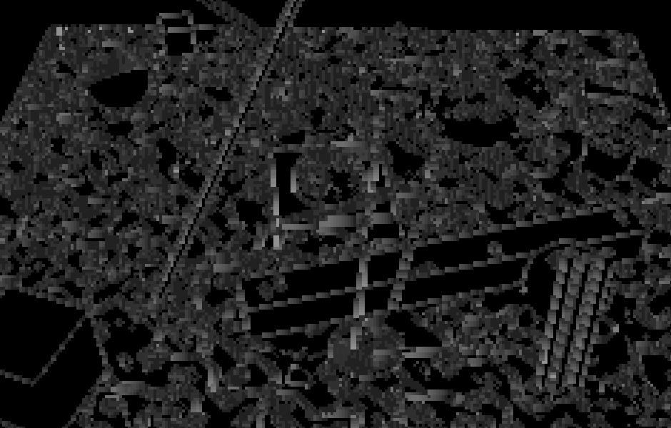 							Positive end distance, up to ten pixels. 						

### Walking in Both Directions

There is also an end point in the negative direction along the  edge, so search for that one as well, using the sample approach. The  final distance then becomes the shortest of the positive and negative  distances.

```
			for (int i = 0; i < 9 && !pAtEnd; i++) {
				…
			}
			
			float2 nuv = uvEdge - edgeStep;
			float nLuminanceDelta = SampleLuminance(nuv) - edgeLuminance;
			bool nAtEnd = abs(nLuminanceDelta) >= gradientThreshold;

			for (int i = 0; i < 9 && !nAtEnd; i++) {
				nuv -= edgeStep;
				nLuminanceDelta = SampleLuminance(nuv) - edgeLuminance;
				nAtEnd = abs(nLuminanceDelta) >= gradientThreshold;
			}

			float pDistance, nDistance;
			if (e.isHorizontal) {
				pDistance = puv.x - uv.x;
				nDistance = uv.x - nuv.x;
			}
			else {
				pDistance = puv.y - uv.y;
				nDistance = uv.y - nuv.y;
			}
			
			float shortestDistance;
			if (pDistance <= nDistance) {
				shortestDistance = pDistance;
			}
			else {
				shortestDistance = nDistance;
			}

			return shortestDistance * 10;
```

 							
 							Distance to nearest edge end. 						

### Determining Blend Factor

At this point we know the distance to the nearest end point of  the edge—if it is in range—which we can use to determine the blend  factor. We'll smooth out the staircases by blending more the closer we  are to an end point. But we'll only do that in the direction where the  edge is slanting towards the region that contains the middle pixel. We  can find this out by comparing the signs of the luminance delta along  the edge and the luminance delta across the edge.

 							
 							Choosing the correct side. 						

If the deltas go in opposite directions, then we're moving away  from the edge and should skip blending, by using a blend factor of  zero. This ensures that we only blend pixels on one side of the edge.

```
			float shortestDistance;
			bool deltaSign;
			if (pDistance <= nDistance) {
				shortestDistance = pDistance;
				deltaSign = pLuminanceDelta >= 0;
			}
			else {
				shortestDistance = nDistance;
				deltaSign = nLuminanceDelta >= 0;
			}

			if (deltaSign == (l.m - edgeLuminance >= 0)) {
				return 0;
			}
			return shortestDistance * 10;
```

 							
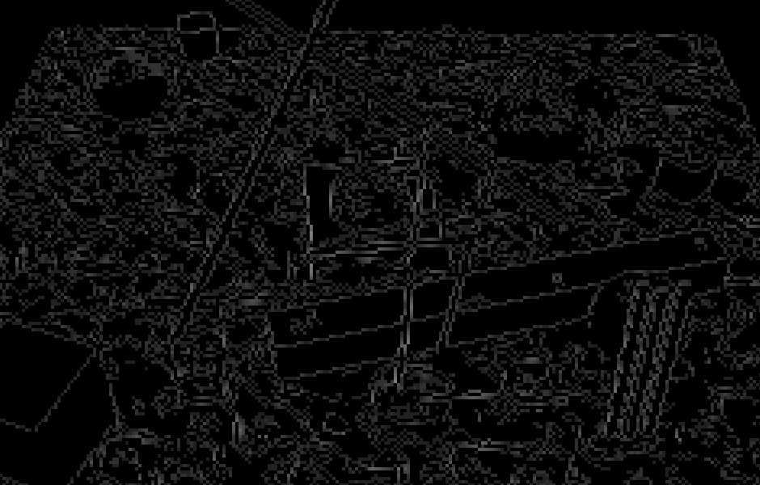 							Only pixels on the correct side of edges. 						

If we have a valid pixel for blending, then we blend by a  factor of 0.5 minus the relative distance to the nearest end point along  the edge. This means that we blend more the closer we are to the end  point and won't blend at all in the middle of the edge.

```
			return 0.5 - shortestDistance / (pDistance + nDistance);
```

 							
 							Edge blend factor. 						

To get an idea of which edges are found via this method that  are missed when just considering the 3×3 region, subtract the pixel  blend factor from the edge blend factor.

```
			return DetermineEdgeBlendFactor(l, e, uv) - pixelBlend;
```

 							
 							Blending added by edge factor. 						

The final blend factor of FXAA is simply the maximum of both  blend factors. So it always uses the edge blend factor and you can  control the strength of the pixel blend factor via the slider.

```
		float4 ApplyFXAA (float2 uv) {
			LuminanceData l = SampleLuminanceNeighborhood(uv);
			if (ShouldSkipPixel(l)) {
				return Sample(uv);
			}

			float pixelBlend = DeterminePixelBlendFactor(l);
			EdgeData e = DetermineEdge(l);
//			return DetermineEdgeBlendFactor(l, e, uv) - pixelBlend;
			float edgeBlend = DetermineEdgeBlendFactor(l, e, uv);
			float finalBlend = max(pixelBlend, edgeBlend);

			if (e.isHorizontal) {
				uv.y += e.pixelStep * finalBlend;
			}
			else {
				uv.x += e.pixelStep * finalBlend;
			}
			return float4(Sample(uv).rgb, l.m);
		}
```

 							 							
 							Only edge blending vs. original image. 						

 							 							 							With subpixel blending at 0 vs. 1. 						

### Quality

Right now we're always searching up to ten iterations to find  the end of an edge. This is sufficient for many cases, but not for those  edges that have staircase steps more than ten pixels wide. If we end up  not finding an edge, then we know that the end point must be further  away. Without taking more samples, the best we can do is guess how much  further away the end is. This must be at least one more step away, so we  can increase our UV offset one more time when that's the case. That  will always be more accurate.

```
			for (int i = 0; i < 9 && !pAtEnd; i++) {
				…
			}
			if (!pAtEnd) {
				puv += edgeStep;
			}

			…

			for (int i = 0; i < 9 && !nAtEnd; i++) {
				…
			}
			if (!nAtEnd) {
				nuv -= edgeStep;
			}
```

Besides that, we can vary how many steps we take. We can also  vary the step size, skipping pixels to detect longer edges at the cost  of precision. We don't need to use a constant step size either, we can  increase it as we go, by defining them in an array. Finally, we can  adjust the offset used to guess distances that are too large. Let's  define these settings with macros, to make shader variants possible.

```
		#define EDGE_STEP_COUNT 10
		#define EDGE_STEPS 1, 1, 1, 1, 1, 1, 1, 1, 1, 1
		#define EDGE_GUESS 1

		static const float edgeSteps[EDGE_STEP_COUNT] = { EDGE_STEPS };

		float DetermineEdgeBlendFactor (LuminanceData l, EdgeData e, float2 uv) {
			…
			
			float2 puv = uvEdge + edgeStep * edgeSteps[0];
			float pLuminanceDelta = SampleLuminance(puv) - edgeLuminance;
			bool pAtEnd = abs(pLuminanceDelta) >= gradientThreshold;

			for (int i = 1; i < EDGE_STEP_COUNT && !pAtEnd; i++) {
				puv += edgeStep * edgeSteps[i];
				pLuminanceDelta = SampleLuminance(puv) - edgeLuminance;
				pAtEnd = abs(pLuminanceDelta) >= gradientThreshold;
			}
			if (!pAtEnd) {
				puv += edgeStep * EDGE_GUESS;
			}

			float2 nuv = uvEdge - edgeStep * edgeSteps[0];
			float nLuminanceDelta = SampleLuminance(nuv) - edgeLuminance;
			bool nAtEnd = abs(nLuminanceDelta) >= gradientThreshold;

			for (int i = 1; i < EDGE_STEP_COUNT && !nAtEnd; i++) {
				nuv -= edgeStep * edgeSteps[i];
				nLuminanceDelta = SampleLuminance(nuv) - edgeLuminance;
				nAtEnd = abs(nLuminanceDelta) >= gradientThreshold;
			}
			if (!nAtEnd) {
				nuv -= edgeStep * EDGE_GUESS;
			}
			…
		}
```

The original FXAA algorithm contains a list of quality defines.  Unity's post effect stack v2 uses quality level 28 as the default. It  has a step count of ten, with the second step at 1.5 instead of 1, and  all following steps at 2, with the last one at 4. If that's not enough  the find the end point, the final guess adds another 8.

```
		#define EDGE_STEPS 1, 1.5, 2, 2, 2, 2, 2, 2, 2, 4
		#define EDGE_GUESS 8
```

By including a half-pixel offset once, we end up sampling in  between adjacent pixel pairs from then on, working on the average of  four pixels at once instead of two. This isn't as accurate, but makes it  possible to use step size 2 without skipping pixels.

 							 							
 							Edge blend factors for quality 28 vs. single-pixel steps. 						

Compared with using single-pixel search steps, the blend  factors can be blockier and the quality suffers a bit, but in return  fewer search iterations are needed for short edges, while much longer  edges can be detected.

 							 							 							Edge blend results for quality 28 vs. single-pixel steps. 						

Of course you can define your own search quality settings, for  example searching one pixel at a times a few step before transitioning  to bigger averaged steps, to keep the best quality for short edges.  Unity's post effect stack v2 has a single toggle for a lower-quality  version, which among other things uses the original default FXAA quality  level 12 for the edge search. Let's provide this option as well.

```
		#if defined(LOW_QUALITY)
			#define EDGE_STEP_COUNT 4
			#define EDGE_STEPS 1, 1.5, 2, 4
			#define EDGE_GUESS 12
		#else
			#define EDGE_STEP_COUNT 10
			#define EDGE_STEPS 1, 1.5, 2, 2, 2, 2, 2, 2, 2, 4
			#define EDGE_GUESS 8
		#endif
```

Add a multi-compile option to the FXAA pass.

```
				#pragma multi_compile _ LUMINANCE_GREEN
				#pragma multi_compile _ LOW_QUALITY
```

And a toggle to control it.

```
	public bool lowQuality;

	…

	void OnRenderImage (RenderTexture source, RenderTexture destination) {
		…
		fxaaMaterial.SetFloat("_SubpixelBlending", subpixelBlending);

		if (lowQuality) {
			fxaaMaterial.EnableKeyword("LOW_QUALITY");
		}
		else {
			fxaaMaterial.DisableKeyword("LOW_QUALITY");
		}

		…
	}
```

 							 							 							 							Low quality, edge blending only. 						

### Performance

Finally, let's consider performance. Loops aren't ideal. The  original FXAA code explicitly unrolled the loops, containing a long  sequence of nested if-statements. Fortunately, we don't need to do this.  We can simply tell the shader compiler to do this for us, via the `**UNITY_UNROLL**`  attribute. In my case, unrolling the loops provided a significant  performance boost, even though without that optimization FXAA is still  very fast.

```
			UNITY_UNROLL
			for (int i = 1; i < EDGE_STEP_COUNT && !pAtEnd; i++) {
				…
			}
			…

			UNITY_UNROLL
			for (int i = 1; i < EDGE_STEP_COUNT && !nAtEnd; i++) {
				…
			}
```

Besides that, the original FXAA code also combined both loops  in a single one, searching in both directions in lockstep. Each  iteration, only the directions that haven't finished yet advance and  sample again. This might be faster in some cases, but in my case the  separate loops perform better than the fused one.

If you inspect the original FXAA code—version 3.11— you'll find  that it is dominated by aggressive low-level optimizations. Besides  making the code hard to read, these optimizations might no longer make  sense today. In our case, the shader compiler takes care of practically  all such optimizations for us, better than we could do ourselves.  Aggressive manual optimization might make it worse. Unity's post effect  stack v2 uses the FXAA 3.11 code nearly verbatim, but in my case the  clearer version presented in this tutorial actually performs better.  Like always, if you want the absolute best performance, test it  yourself, per project, per target platform.

unitypackage

## Color Space

In this test scene, we're using HDR lighting in linear space and  feed the rendered image directly to FXAA without any color adjustments.  This might not produce the best results.

### LDR

Although we've clamped the color when calculating the luminance  used to determine the blend factor, we haven't actually clamped the RGB  channels used when blending. This means that we can end up blending HDR  colors. When HDR color components blend, we won't see a difference  because the result is still outside of the final displayed range. This  isn't a problem, because the alternative would be a blend between 1 and  1. However, it does become a problem when LDR and HDR data is blended.  If the HDR component is very bright, the result gets pulled into HDR as  well. This brings the otherwise LDR pixel into HDR range, potentially  increasing aliasing instead of decreasing it.

Providing LDR data is the responsibility of whoever provided  the input for the FXAA pass. In our case, we can ensure it when the  luminance pass is used.

```
				float4 FragmentProgram (Interpolators i) : SV_Target {
					float4 sample = tex2D(_MainTex, i.uv);
//					sample.a = LinearRgbToLuminance(saturate(sample.rgb));
					sample.rgb = saturate(sample.rgb);
					sample.a = LinearRgbToLuminance(sample.rgb);
					return sample;
				}
```

 							 							 							LDR vs. HDR blending. 						

### Gamma

Linear space is used when shading because that can produce  physically correct lighting. However, FXAA is about perception, not  physics. As noted in the original FXAA code, blending in linear space  can produce visually worse results compared to blending in gamma space.  Unity's post effect stack v2 simply blends in linear space, so the  results aren't that bad. But we can support both approaches.

As we assume linear-space rendering, add a toggle for gamma-space blending to our effect, which controls a shader keyword.

```
	public bool gammaBlending;
	
	…
	
	void OnRenderImage (RenderTexture source, RenderTexture destination) {
		…

		if (lowQuality) {
			fxaaMaterial.EnableKeyword("LOW_QUALITY");
		}
		else {
			fxaaMaterial.DisableKeyword("LOW_QUALITY");
		}

		if (gammaBlending) {
			fxaaMaterial.EnableKeyword("GAMMA_BLENDING");
		}
		else {
			fxaaMaterial.DisableKeyword("GAMMA_BLENDING");
		}

		…
	}
```

In the luminance pass, convert the color to gamma space before  outputting it, if desired. If this pass is skipped, it's up to whoever  provides the FXAA input to make sure the colors are in gamma space.

```
				#pragma multi_compile _ GAMMA_BLENDING

				float4 FragmentProgram (Interpolators i) : SV_Target {
					float4 sample = tex2D(_MainTex, i.uv);
					sample.rgb = saturate(sample.rgb);
					sample.a = LinearRgbToLuminance(sample.rgb);
					#if defined(GAMMA_BLENDING)
						sample.rgb = LinearToGammaSpace(sample.rgb);
					#endif
					return sample;
				}
```

At the end of the FXAA pass, once we have the final sample,  convert it back to linear space, if appropriate. We have to do this  because the rendering pipeline assumes that the output is in linear  space.

```
				#pragma multi_compile _ LUMINANCE_GREEN
				#pragma multi_compile _ LOW_QUALITY
				#pragma multi_compile _ GAMMA_BLENDING

				float4 FragmentProgram (Interpolators i) : SV_Target {
//					return ApplyFXAA(i.uv);
					float4 sample = ApplyFXAA(i.uv);
					#if defined(GAMMA_BLENDING)
						sample.rgb = GammaToLinearSpace(sample.rgb);
					#endif
					return sample;
				}
```

 							 							 							Gamma vs. linear blending. 						

Finally, we can reproduce the FXAA effect with its default settings, as designed. The settings are *Contrast Threshold* 0.0833, *Relative Threshold* 0.166, *Subpixel Blending* 0.75, and both *Low Quality* and *Gamma Blending* enabled.

 							 							
 							FXAA with original default settings vs. aliased image. 						

Of course this is just one of many ways to configure FXAA. You  can tune it as you see fit. You might decide that you don't need any  subpixel blending at all, relying solely on edge blending. In that case,  you can speed up the effect by removing the `DeterminePixelBlendFactor`  invocation, maybe as a shader variant. And when providing FXAA as an  option in your game, you could expose some of its settings to the  player, instead of only an FXAA on–off toggle.

unitypackage

PDF
