# Hex Map 4

Irregulatity

- Sample a noise texture.
- Perturb vertices.
- Keep cells flat.
- Subdivide cell edges.

This tutorial is the fourth part of a series about [hexagon maps](https://catlikecoding.com/unity/tutorials/hex-map/).  So far, our grid has been a strict honeycomb. In this installment,  we'll introduce irregularities to make our map look more natural.

 					
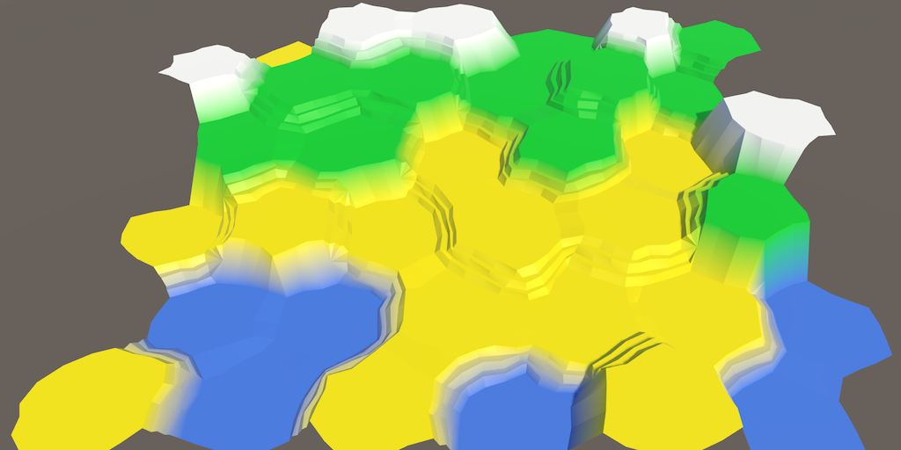 					No more regular hexagons. 				

## Noise

To add irregularities, we need randomization. But not true  randomness. We want things to stay consistent whenever we edit our map.  Otherwise, things would jump around each time we made a change. So we  need a form of reproducible pseudorandom noise.

Perlin noise is a good candidate. It is reproducible at any  point. When multiple frequences are combined, it also produces noise  that can vary a lot over large distances, but stays fairly similar at  small distances. This can produce relatively smooth distortions. Points  that lie close together tend to stick together, instead of being  distorted in opposite directions.

We could generate Perlin noise programmatically. The [Noise](https://catlikecoding.com/unity/tutorials/noise/)  tutorial explains how to do that. But we could also sample from a  pre-generated noise texture. The advantage of using a texture is that  it's easier and much faster than computing multi-frequency Perlin noise.  The downside is that the texture occupies more memory and only covers a  small region of noise. So it needs to be a tiling texture, and has to  be fairly large to make the tiling not that obvious.

### Noise Texture

We're going to use a texture, so you don't have to go through the [Noise](https://catlikecoding.com/unity/tutorials/noise/) tutorial right now. That means we need such a texture. Here's one.

 							
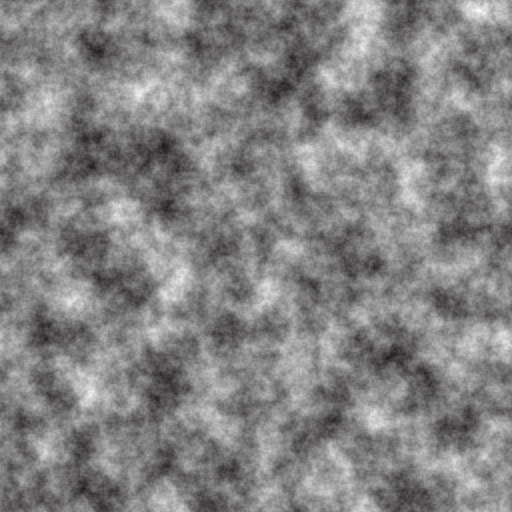 							Tiling fractal Perlin noise texture. 						

The above texture contains tiling multi-frequency Perlin noise.  It is a grayscale image with an average value of 0.5, with extreme  values approaching 0 and 1.

But wait, this is only a single value per point. If we want a  3D distortion, we need at least three pseudorandom samples! So we need  two additional textures, with different noise in each.

We could do that, or we could store a different noise value in  each of the color channels. That allows us to store up to four different  noise patterns in a single texture. Here is such a texture.

 							
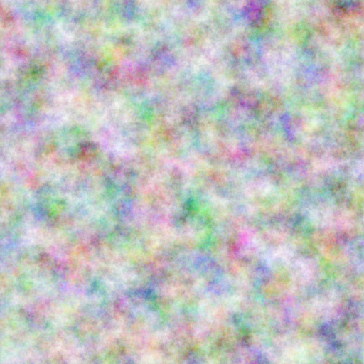 							Four in one. 						

 							How did you make that texture? 							 						

Grab this texture and import it into your Unity project.  Because we are going to sample the texture via code, it has to be  readable. Switch the *Texture Type* to *Advanced* and switch on *Read/Write Enabled*. This will keep the texture data in memory, accessible via C# code. Make sure to set the *Format* to *Automatic Truecolor*, otherwise this won't work. We wouldn't want to destroy our noise pattern via texture compression anyway.

We can disable *Generate Mip Maps*, because we don't need them. While we're at it, enable *Bypass sRGB Sampling* as well. We don't need this, but it is correct. It indicates that the texture does not contain color data in Gamma space.

 							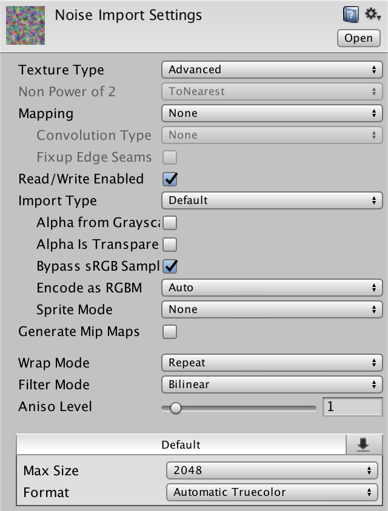 							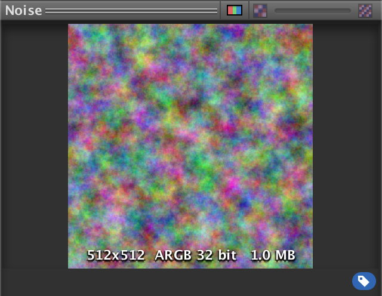 							Imported noise texture. 						

 							When does sRGB sampling matter? 							 						

 							My texture import settings look different? 							 						

### Sampling Noise

Let's add the noise sampling functionality to `**HexMetrics**`, so it can be used from anywhere. This means that `**HexMetrics**` much have a reference to the noise texture.

```
	public static Texture2D noiseSource;
```

Because it is not a component, we cannot assign our texture to it via the editor. We'll simply use `**HexGrid**` as an intermediary. As `**HexGrid**` is the first to act, it will be fine if we pass along the texture at the start of its `Awake` method.

```
	public Texture2D noiseSource;

	void Awake () {
		HexMetrics.noiseSource = noiseSource;

		…
	}
```

However, this approach will not survive recompiles while in  play mode. Static variables aren't serialized by Unity. To solve this,  reassign the texture in the `OnEnable` event method as well. This method will get invoked after a recompile.

```
	void OnEnable () {
		HexMetrics.noiseSource = noiseSource;
	}
```

 							
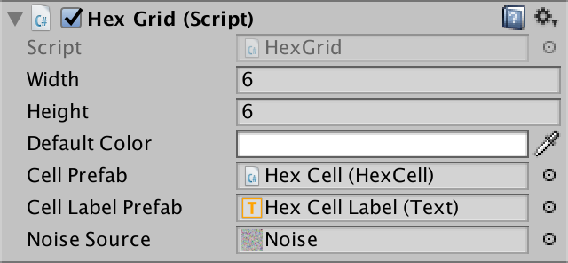 							Assigning the noise texture. 						

Now that `**HexMetrics**` can access  the texture, let's add a convenient noise sampling method to it. This  method takes a world position and produce a 4D vector containing four  noise samples.

```
	public static Vector4 SampleNoise (Vector3 position) {
	}
```

The samples are produced by sampling the texture using bilinear  filtering, using the X and Z world coordinates as UV coordinates. As  our noise source is 2D, we ignore the third wold coordinate. If our  noise source had been 3D, then we would've used the Y world coordinate  too.

We end up with a color, which can be cast to a 4D vector. This  cast can be implicit, meaning that we can directly return the color  without explicitly including `(Vector4)`.

```
	public static Vector4 SampleNoise (Vector3 position) {
		return noiseSource.GetPixelBilinear(position.x, position.z);
	}
```

 							How does bilinear filtering work? 							 						

unitypackage

## Perturbing Vertices

We distort our regular honeycomb grid by perturbing each vertex individually. So let's add a `Perturb` method to `**HexMesh**`  to do this. It takes an unperturbed point and returns a perturbed one.  To do so, it uses the unperturbed point to sample our noise.

```
	Vector3 Perturb (Vector3 position) {
		Vector4 sample = HexMetrics.SampleNoise(position);
	}
```

Let's simply add the X, Y, and Z noise samples directly to the  corresponding coordinates of the point and use that as the result.

```
	Vector3 Perturb (Vector3 position) {
		Vector4 sample = HexMetrics.SampleNoise(position);
		position.x += sample.x;
		position.y += sample.y;
		position.z += sample.z;
		return position;
	}
```

How could we quickly change `**HexMesh**` so all vertices are perturbed? By adjusting each vertex when it's added to the vertices list, in `AddTriangle` and `AddQuad`. So let's do that.

```
	void AddTriangle (Vector3 v1, Vector3 v2, Vector3 v3) {
		int vertexIndex = vertices.Count;
		vertices.Add(Perturb(v1));
		vertices.Add(Perturb(v2));
		vertices.Add(Perturb(v3));
		…
	}

	void AddQuad (Vector3 v1, Vector3 v2, Vector3 v3, Vector3 v4) {
		int vertexIndex = vertices.Count;
		vertices.Add(Perturb(v1));
		vertices.Add(Perturb(v2));
		vertices.Add(Perturb(v3));
		vertices.Add(Perturb(v4));
		…
	}
```

 						Are quads still flat after perturbing their vertices? 						 					

 						
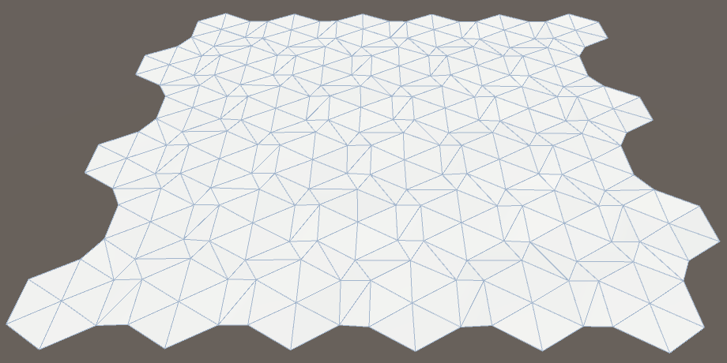 						Perturbed vertices, or not. 					

It doesn't look like much changed, except that the cell labels  appear to be missing. This happens because we're adding the noise  samples to our points, and they are always positive. So all triangles  end up above the labels, obscuring them. We have to center the  adjustments so they can go in either direction. Change the range of the  noise sample from 0–1 to −1–1.

```
	Vector3 Perturb (Vector3 position) {
		Vector4 sample = HexMetrics.SampleNoise(position);
		position.x += sample.x * 2f - 1f;
		position.y += sample.y * 2f - 1f;
		position.z += sample.z * 2f - 1f;
		return position;
	}
```

 						
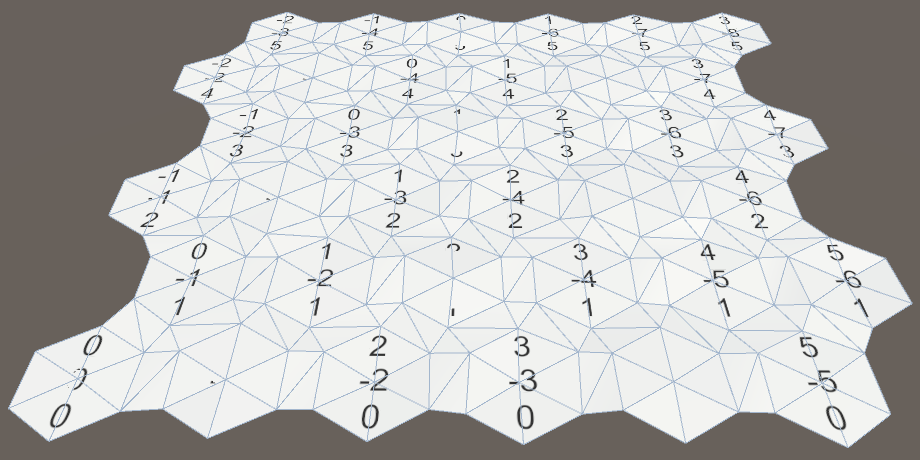 						Centered perturbation. 					

### Perturb Strength

It is now clear that we have distorted the grid, but the effect  is very subtle. There is at most a 1 unit adjustment in each dimension.  So the theoretical maximum displacement is √3 ≈ 1.73 units, which would  be extremely rare, if it happens at all. As our cells have an outer  radius of ten units, the perturbations are relatively small.

The solution is to add a strength setting to `**HexMetrics**`  so we can scale the perturbations. Let's try a strength of 5. This has a  theoretical maximum displacement of √75 ≈ 8.66 units, which should be  much more obvious.

```
	public const float cellPerturbStrength = 5f;
```

Apply the strength by multiplying it with the samples in `**HexMesh**.Perturb`.

```
	Vector3 Perturb (Vector3 position) {
		Vector4 sample = HexMetrics.SampleNoise(position);
		position.x += (sample.x * 2f - 1f) * HexMetrics.cellPerturbStrength;
		position.y += (sample.y * 2f - 1f) * HexMetrics.cellPerturbStrength;
		position.z += (sample.z * 2f - 1f) * HexMetrics.cellPerturbStrength;
		return position;
	}
```

 							
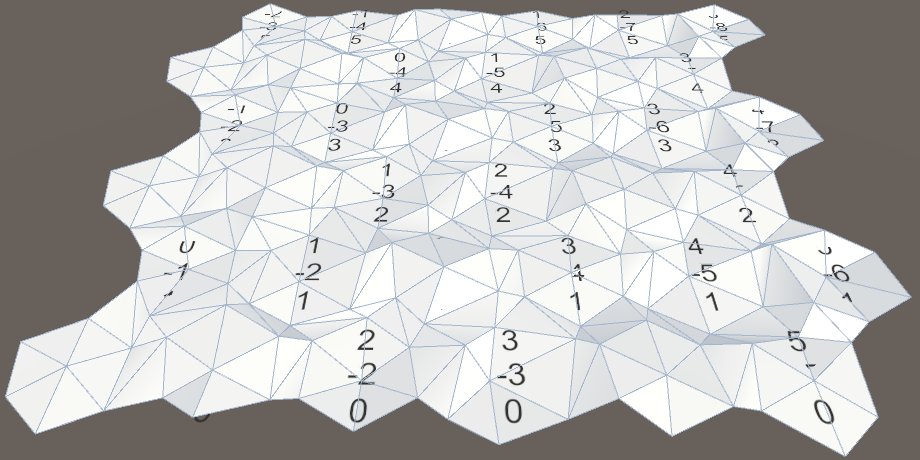							
 							Increased strength. 						

### Noise Scale

While the grid looks fine before editing, things go wrong once  terraces appear. Their vertices get distorted in wildly different  directions, leading to a mess. This should not happen when using Perlin  noise.

The problem happens because we're directly using the world  coordinates to sample the noise. This causes the texture to tile every  unit, while our cells are much larger than that. Effectively, the  texture gets sampled at arbitrary locations, destroying any coherence it  has.

 							
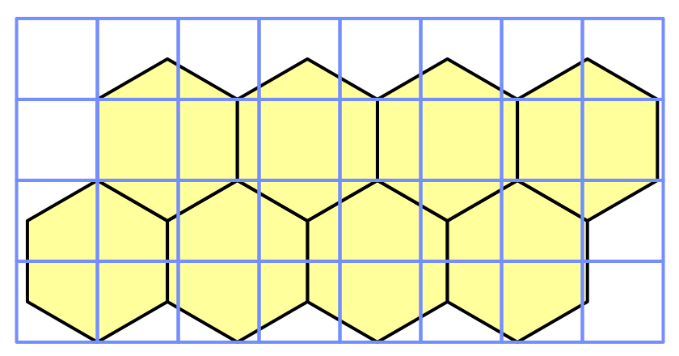 							10 by 10 grid lines overlapping the honeycomb. 						

We have to scale the noise sampling so the texture covers a much larger area. Let's add this scale to `**HexMetrics**` and set it to 0.003, then scale the sample coordinates by that factor.

```
	public const float noiseScale = 0.003f;

	public static Vector4 SampleNoise (Vector3 position) {
		return noiseSource.GetPixelBilinear(
			position.x * noiseScale,
			position.z * noiseScale
		);
	}
```

Suddenly, our texture covers 333⅓ square units and its local coherence becomes obvious.

 							
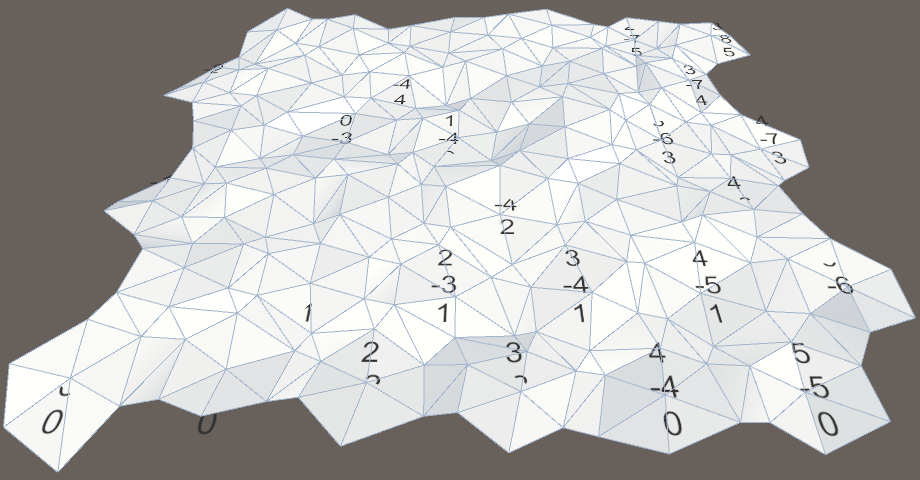							
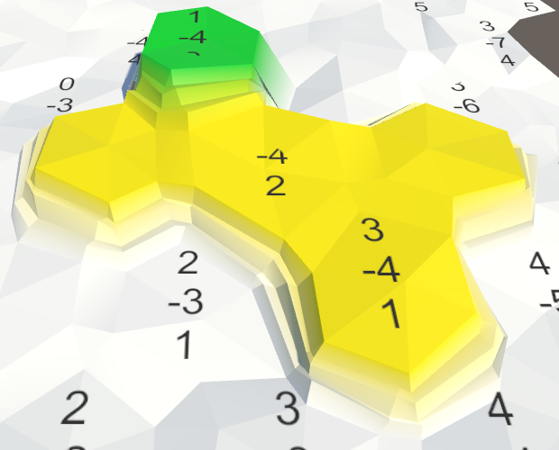 							Scaled noise. 						

Our new scale also makes sure that the noise will take a while  before it tiles. Actually, because the cells have an inner diameter of  10√3 units, it will effectively never exactly tile in the X dimension.  However, because of the noise's local coherence, you can still detect  repeating patterns at the larger scale, roughly every 20 cells, even if  the details don't match. But that's only really obvious for an otherwise  featureless map.

unitypackage

## Leveling Cell Centers

Perturbing all vertices gives our map a more natural appearance,  but there are some problems. Because the cells are now uneven, their  labels intersect the mesh. And cracks appear in the mesh where terraces  meet cliffs. We'll leave the cracks for later and focus on the cell  surfaces.

 						
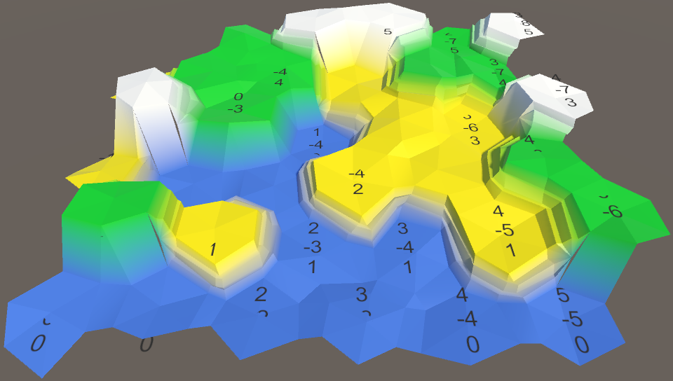 						Less rigid, more issues. 					


The simplest way to solve the intersection problem is to keep the cells centers flat. Just don't adjust the Y coordinate in `**HexMesh**.Perturb`.

```
	Vector3 Perturb (Vector3 position) {
		Vector4 sample = HexMetrics.SampleNoise(position);
		position.x += (sample.x * 2f - 1f) * HexMetrics.cellPerturbStrength;
//		position.y += (sample.y * 2f - 1f) * HexMetrics.cellPerturbStrength;
		position.z += (sample.z * 2f - 1f) * HexMetrics.cellPerturbStrength;
		return position;
	}
```

 						
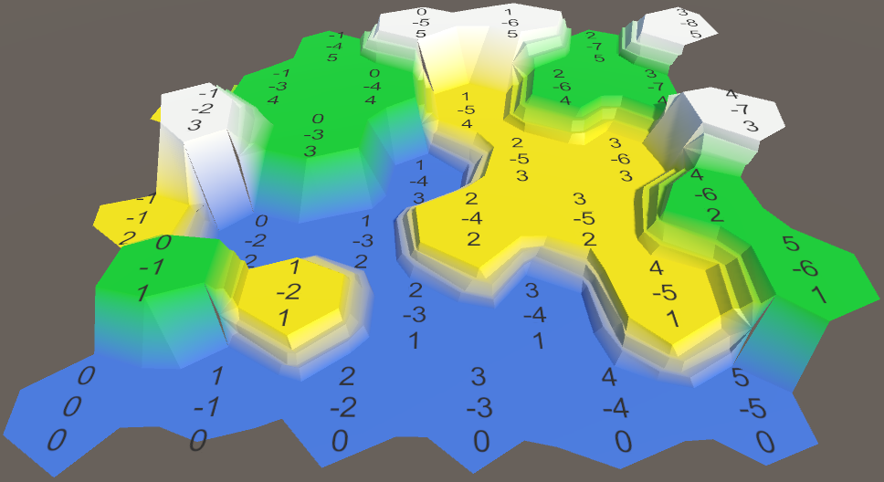 						Leveled cells. 					

This change leaves all vertical positions unchanged, both for  cell centers and for terrace steps. Note that this reduces the maximum  displacement to √50 ≈ 7.07, in the XZ plane only.

This is not a bad change, as it makes it a lot easier to  identify individual cells and prevents terraces from becoming too messy.  But some vertical perturbation would still be nice.

### Perturbing Cell Elevation

Instead of applying a vertical perturbation per vertex, we  could apply it per cell. That way each cell remains flat, but there is  still variation between cells. It also makes sense to use a different  scale for the elevation perturbation, so add one to `**HexMetrics**`. A strength of 1.5 units provides some subtle variation, which is roughly the height of a single terrace step.

```
	public const float elevationPerturbStrength = 1.5f;
```

Adjust the `**HexCell**.Elevation` property so that it applies this perturbation to the cell's vertical position.

```
	public int Elevation {
		get {
			return elevation;
		}
		set {
			elevation = value;
			Vector3 position = transform.localPosition;
			position.y = value * HexMetrics.elevationStep;
			position.y +=
				(HexMetrics.SampleNoise(position).y * 2f - 1f) *
				HexMetrics.elevationPerturbStrength;
			transform.localPosition = position;

			Vector3 uiPosition = uiRect.localPosition;
			uiPosition.z = -position.y;
			uiRect.localPosition = uiPosition;
		}
	}
```

To make sure that the perturbation is applied immediately, we have to explicitly set each cell's elevation in `**HexGrid**.CreateCell`. Otherwise the grid would start out flat. Do this at the end, after the UI has been created.

```
	void CreateCell (int x, int z, int i) {
		…

		cell.Elevation = 0;
	}
```

 							
 							Perturbed elevations, with cracks. 						

### Using the Same Heights

A lot of cracks have appeared in the mesh, because we're not  consistently using the same cell heights when triangulating the mesh.  Let's add a convenient property to `**HexCell**` to retrieve its position, so we can use it everywhere.

```
	public Vector3 Position {
		get {
			return transform.localPosition;
		}
	}
```

Now we can use that property in `**HexMesh**.Triangulate` to determine the cell's center.

```
	void Triangulate (HexDirection direction, HexCell cell) {
		Vector3 center = cell.Position;
		…
	}
```

And we can use it in `TriangulateConnection`, when determining the vertical positions of the neighboring cells.

```
	void TriangulateConnection (
		HexDirection direction, HexCell cell, Vector3 v1, Vector3 v2
	) {
		…

		Vector3 bridge = HexMetrics.GetBridge(direction);
		Vector3 v3 = v1 + bridge;
		Vector3 v4 = v2 + bridge;
		v3.y = v4.y = neighbor.Position.y;

		…

		HexCell nextNeighbor = cell.GetNeighbor(direction.Next());
		if (direction <= HexDirection.E && nextNeighbor != null) {
			Vector3 v5 = v2 + HexMetrics.GetBridge(direction.Next());
			v5.y = nextNeighbor.Position.y;

			…
		}
	}
```

 							
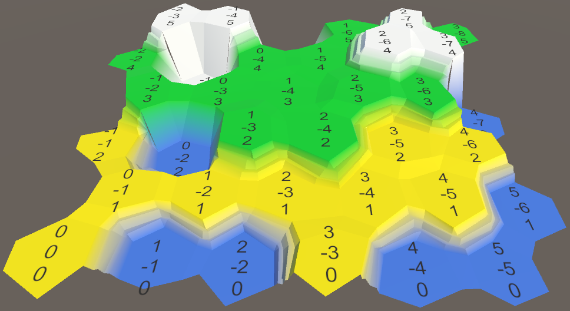 							Consistent use of cell elevation. 						

unitypackage

## Subdividing Cell Edges

While our cells are nicely varied, they are still obviously  hexagons. This is not a problem per se, but we can do better than that.

 						
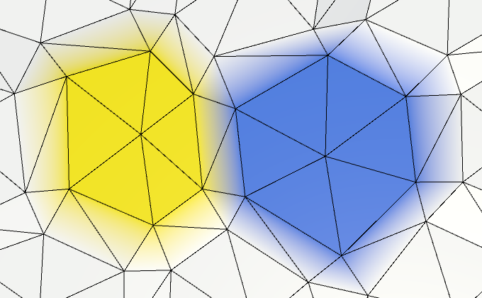 						Clearly hexagonal cells. 					

If we had more vertices, we would see more local variety. So  let's split each cell edge into two parts, by introducing an edge vertex  halfway between each pair of corners. This means that `**HexMesh**.Triangulate` has to add two instead of one triangle.

```
	void Triangulate (HexDirection direction, HexCell cell) {
		Vector3 center = cell.Position;
		Vector3 v1 = center + HexMetrics.GetFirstSolidCorner(direction);
		Vector3 v2 = center + HexMetrics.GetSecondSolidCorner(direction);

		Vector3 e1 = Vector3.Lerp(v1, v2, 0.5f);

		AddTriangle(center, v1, e1);
		AddTriangleColor(cell.color);
		AddTriangle(center, e1, v2);
		AddTriangleColor(cell.color);

		if (direction <= HexDirection.SE) {
			TriangulateConnection(direction, cell, v1, v2);
		}
	}
```

 						
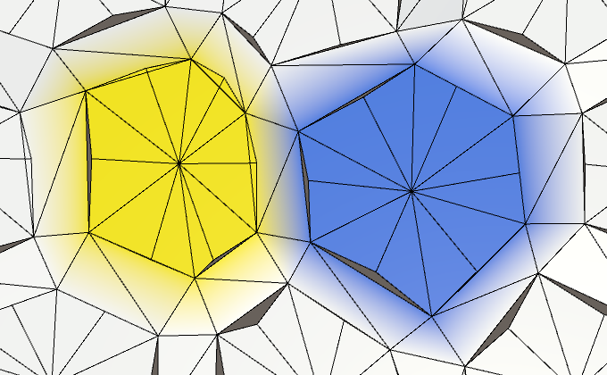 						Twelve sides instead of six. 					

Doubling the vertices and triangles adds a bit more variety to  our cell's edges. Let's make them even more rugged by tripling the  vertices.

```
		Vector3 e1 = Vector3.Lerp(v1, v2, 1f / 3f);
		Vector3 e2 = Vector3.Lerp(v1, v2, 2f / 3f);

		AddTriangle(center, v1, e1);
		AddTriangleColor(cell.color);
		AddTriangle(center, e1, e2);
		AddTriangleColor(cell.color);
		AddTriangle(center, e2, v2);
		AddTriangleColor(cell.color);
```

 						
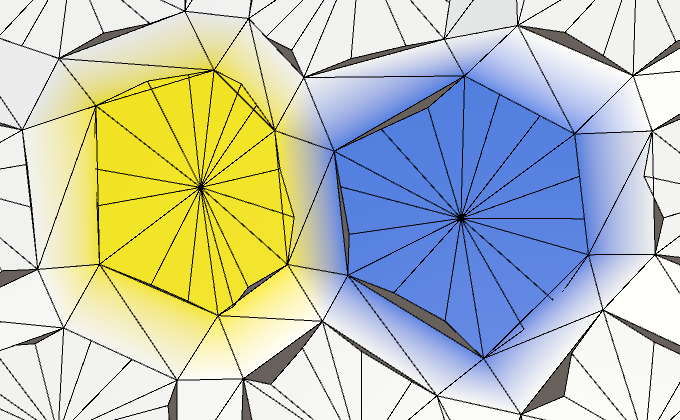 						18 Sides. 					

### Subdividing Edge Connections

Of course we also have to subdivide the edge connections. So pass the new edge vertices to `TriangulateConnection`.

```
		if (direction <= HexDirection.SE) {
			TriangulateConnection(direction, cell, v1, e1, e2, v2);
		}
```

Add matching parameters to `TriangulateConnection` so it can work with the extra vertices.

```
	void TriangulateConnection (
		HexDirection direction, HexCell cell,
		Vector3 v1, Vector3 e1, Vector3 e2, Vector3 v2
	) {
	…
}
```

We also need to compute extra edge vertices for the neighboring cell. We can compute those after bridging to the other side.

```
		Vector3 bridge = HexMetrics.GetBridge(direction);
		Vector3 v3 = v1 + bridge;
		Vector3 v4 = v2 + bridge;
		v3.y = v4.y = neighbor.Position.y;

		Vector3 e3 = Vector3.Lerp(v3, v4, 1f / 3f);
		Vector3 e4 = Vector3.Lerp(v3, v4, 2f / 3f);
```

Next, we have to adjust the triangulation of the edge. Ignoring terraced slopes for now, simply add three quads instead of one.

```
		if (cell.GetEdgeType(direction) == HexEdgeType.Slope) {
			TriangulateEdgeTerraces(v1, v2, cell, v3, v4, neighbor);
		}
		else {
			AddQuad(v1, e1, v3, e3);
			AddQuadColor(cell.color, neighbor.color);
			AddQuad(e1, e2, e3, e4);
			AddQuadColor(cell.color, neighbor.color);
			AddQuad(e2, v2, e4, v4);
			AddQuadColor(cell.color, neighbor.color);
		}
```

 							
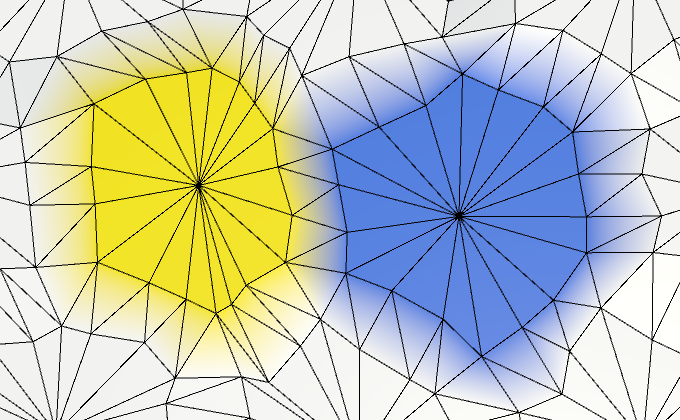 							Subdivided connections. 						

### Bundling Edge Vertices

As we now need four vertices to describe an edge, it makes  sense to bundle them. That's more convenient than dealing with four  individual vertices. Create a simple `**EdgeVertices**` structure for this. It should contain four vertices, ordered clockwise along a cell's edge.

```
using UnityEngine;

public struct EdgeVertices {

	public Vector3 v1, v2, v3, v4;
}
```

 							Doesn't it need to be serializable? 							 						

Give it a convenient constructor method, which takes care of computing the intermediary edge points.

```
	public EdgeVertices (Vector3 corner1, Vector3 corner2) {
		v1 = corner1;
		v2 = Vector3.Lerp(corner1, corner2, 1f / 3f);
		v3 = Vector3.Lerp(corner1, corner2, 2f / 3f);
		v4 = corner2;
	}
```

Now we can add a separate triangulate method to `**HexMesh**` for creating a triangle fan between a cell's center and one of its edges.

```
	void TriangulateEdgeFan (Vector3 center, EdgeVertices edge, Color color) {
		AddTriangle(center, edge.v1, edge.v2);
		AddTriangleColor(color);
		AddTriangle(center, edge.v2, edge.v3);
		AddTriangleColor(color);
		AddTriangle(center, edge.v3, edge.v4);
		AddTriangleColor(color);
	}
```

And a method for triangulating a strip of quads between two edges.

```
	void TriangulateEdgeStrip (
		EdgeVertices e1, Color c1,
		EdgeVertices e2, Color c2
	) {
		AddQuad(e1.v1, e1.v2, e2.v1, e2.v2);
		AddQuadColor(c1, c2);
		AddQuad(e1.v2, e1.v3, e2.v2, e2.v3);
		AddQuadColor(c1, c2);
		AddQuad(e1.v3, e1.v4, e2.v3, e2.v4);
		AddQuadColor(c1, c2);
	}
```

This allows us to simplify the `Triangulate` method.

```
	void Triangulate (HexDirection direction, HexCell cell) {
		Vector3 center = cell.Position;
		EdgeVertices e = new EdgeVertices(
			center + HexMetrics.GetFirstSolidCorner(direction),
			center + HexMetrics.GetSecondSolidCorner(direction)
		);

		TriangulateEdgeFan(center, e, cell.color);

		if (direction <= HexDirection.SE) {
			TriangulateConnection(direction, cell, e);
		}
	}
```

On to `TriangulateConnection`. We can now use `TriangulateEdgeStrip`, but some other substitutions have to be made too. Where we first used `v1`, we should use `e1.v1` instead. Likewise, `v2` becomes `e1.v4`, `v3` becomes `e2.v1`, and `v4` becomes `e2.v4`.

```
	void TriangulateConnection (
		HexDirection direction, HexCell cell, EdgeVertices e1
	) {
		HexCell neighbor = cell.GetNeighbor(direction);
		if (neighbor == null) {
			return;
		}

		Vector3 bridge = HexMetrics.GetBridge(direction);
		bridge.y = neighbor.Position.y - cell.Position.y;
		EdgeVertices e2 = new EdgeVertices(
			e1.v1 + bridge,
			e1.v4 + bridge
		);
		
		if (cell.GetEdgeType(direction) == HexEdgeType.Slope) {
			TriangulateEdgeTerraces(e1.v1, e1.v4, cell, e2.v1, e2.v4, neighbor);
		}
		else {
			TriangulateEdgeStrip(e1, cell.color, e2, neighbor.color);
		}
		
		HexCell nextNeighbor = cell.GetNeighbor(direction.Next());
		if (direction <= HexDirection.E && nextNeighbor != null) {
			Vector3 v5 = e1.v4 + HexMetrics.GetBridge(direction.Next());
			v5.y = nextNeighbor.Position.y;

			if (cell.Elevation <= neighbor.Elevation) {
				if (cell.Elevation <= nextNeighbor.Elevation) {
					TriangulateCorner(
						e1.v4, cell, e2.v4, neighbor, v5, nextNeighbor
					);
				}
				else {
					TriangulateCorner(
						v5, nextNeighbor, e1.v4, cell, e2.v4, neighbor
					);
				}
			}
			else if (neighbor.Elevation <= nextNeighbor.Elevation) {
				TriangulateCorner(
					e2.v4, neighbor, v5, nextNeighbor, e1.v4, cell
				);
			}
			else {
				TriangulateCorner(
					v5, nextNeighbor, e1.v4, cell, e2.v4, neighbor
				);
			}
		}
```

### Subdividing Terraces

We have to subdivide the terraces as well. So pass the edges to `TriangulateEdgeTerraces`.

```
		if (cell.GetEdgeType(direction) == HexEdgeType.Slope) {
			TriangulateEdgeTerraces(e1, cell, e2, neighbor);
		}
```

Now we have to adjust `TriangulateEdgeTerraces` so it interpolates between edges, instead of pairs of vertices. Let's assume that `**EdgeVertices**` has a convenient static interpolation method for that. This allows us to simplify `TriangulateEdgeTerraces`, instead of making it more complex.

```
	void TriangulateEdgeTerraces (
		EdgeVertices begin, HexCell beginCell,
		EdgeVertices end, HexCell endCell
	) {
		EdgeVertices e2 = EdgeVertices.TerraceLerp(begin, end, 1);
		Color c2 = HexMetrics.TerraceLerp(beginCell.color, endCell.color, 1);

		TriangulateEdgeStrip(begin, beginCell.color, e2, c2);

		for (int i = 2; i < HexMetrics.terraceSteps; i++) {
			EdgeVertices e1 = e2;
			Color c1 = c2;
			e2 = EdgeVertices.TerraceLerp(begin, end, i);
			c2 = HexMetrics.TerraceLerp(beginCell.color, endCell.color, i);
			TriangulateEdgeStrip(e1, c1, e2, c2);
		}

		TriangulateEdgeStrip(e2, c2, end, endCell.color);
	}
```

The `**EdgeVertices**.TerraceLerp` method simply performs the terrace interpolation between all four pairs of two edge vertices.

```
	public static EdgeVertices TerraceLerp (
		EdgeVertices a, EdgeVertices b, int step)
	{
		EdgeVertices result;
		result.v1 = HexMetrics.TerraceLerp(a.v1, b.v1, step);
		result.v2 = HexMetrics.TerraceLerp(a.v2, b.v2, step);
		result.v3 = HexMetrics.TerraceLerp(a.v3, b.v3, step);
		result.v4 = HexMetrics.TerraceLerp(a.v4, b.v4, step);
		return result;
	}
```

 							
 							Subdivided terraces. 						

unitypackage

## Reconnecting Cliffs and Terraces

So far, we have ignored those cracks where cliffs and terraces  meet. It is time to deal with that issue. Let's consider the  cliff-slope-slope (CSS) and slope-cliff-slope (SCS) cases first.

 						
 						Holes in the mesh. 					

The problem occurs because the boundary vertices get perturbed.  This means that they no longer lie exactly along the cliff's side, which  produces a crack. Sometimes these holes aren't noticeable, and  sometimes they are glaring.

The solution is to not perturb the boundary vertex. This means  that we need to control whether a point gets perturbed or not. The  simplest approach is to create an `AddTriangle` alternative which does not perturb the vertices at all.

```
	void AddTriangleUnperturbed (Vector3 v1, Vector3 v2, Vector3 v3) {
		int vertexIndex = vertices.Count;
		vertices.Add(v1);
		vertices.Add(v2);
		vertices.Add(v3);
		triangles.Add(vertexIndex);
		triangles.Add(vertexIndex + 1);
		triangles.Add(vertexIndex + 2);
	}
```

Adjust `TriangulateBoundaryTriangle` so it uses this method. This means that is has to explicitly perturb all vertices, except the boundary vertex.

```
	void TriangulateBoundaryTriangle (
		Vector3 begin, HexCell beginCell,
		Vector3 left, HexCell leftCell,
		Vector3 boundary, Color boundaryColor
	) {
		Vector3 v2 = HexMetrics.TerraceLerp(begin, left, 1);
		Color c2 = HexMetrics.TerraceLerp(beginCell.color, leftCell.color, 1);

		AddTriangleUnperturbed(Perturb(begin), Perturb(v2), boundary);
		AddTriangleColor(beginCell.color, c2, boundaryColor);

		for (int i = 2; i < HexMetrics.terraceSteps; i++) {
			Vector3 v1 = v2;
			Color c1 = c2;
			v2 = HexMetrics.TerraceLerp(begin, left, i);
			c2 = HexMetrics.TerraceLerp(beginCell.color, leftCell.color, i);
			AddTriangleUnperturbed(Perturb(v1), Perturb(v2), boundary);
			AddTriangleColor(c1, c2, boundaryColor);
		}

		AddTriangleUnperturbed(Perturb(v2), Perturb(left), boundary);
		AddTriangleColor(c2, leftCell.color, boundaryColor);
	}
```

Note that because we are not using `v2` to derive any  other point, it is possible to perturb it immediately. It is a simple  optimization to make and it reduces code, so let's do it.

```
	void TriangulateBoundaryTriangle (
		Vector3 begin, HexCell beginCell,
		Vector3 left, HexCell leftCell,
		Vector3 boundary, Color boundaryColor
	) {
		Vector3 v2 = Perturb(HexMetrics.TerraceLerp(begin, left, 1));
		Color c2 = HexMetrics.TerraceLerp(beginCell.color, leftCell.color, 1);

		AddTriangleUnperturbed(Perturb(begin), v2, boundary);
		AddTriangleColor(beginCell.color, c2, boundaryColor);

		for (int i = 2; i < HexMetrics.terraceSteps; i++) {
			Vector3 v1 = v2;
			Color c1 = c2;
			v2 = Perturb(HexMetrics.TerraceLerp(begin, left, i));
			c2 = HexMetrics.TerraceLerp(beginCell.color, leftCell.color, i);
			AddTriangleUnperturbed(v1, v2, boundary);
			AddTriangleColor(c1, c2, boundaryColor);
		}

		AddTriangleUnperturbed(v2, Perturb(left), boundary);
		AddTriangleColor(c2, leftCell.color, boundaryColor);
	}
```

 						
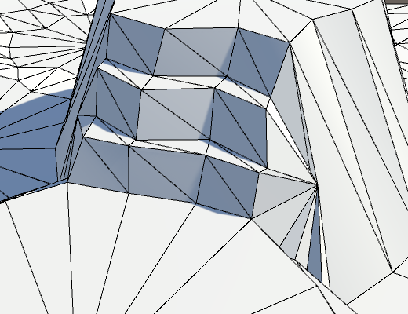 						Unperturbed boundaries. 					

This looks better, but we're not done yet. Inside the `TriangulateCornerTerracesCliff`  method, the boundary point is found by interpolating between the left  and right points. However, these points are not yet perturbed. To make  the boundary point match the final cliff, we have to interpolate between  the perturbed points.

```
		Vector3 boundary = Vector3.Lerp(Perturb(begin), Perturb(right), b);
```

The same is true for the `TriangulateCornerCliffTerraces` method.

```
		Vector3 boundary = Vector3.Lerp(Perturb(begin), Perturb(left), b);
```

 						
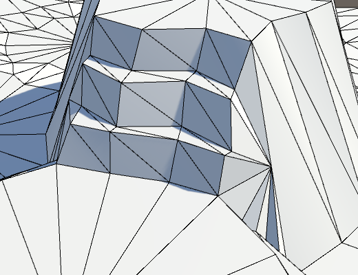 						No more holes. 					

### Double Cliffs and a Slope

The remaining problem cases are those that feature two cliffs and a slope.

 							
 							Big hole caused by a single triangle. 						

This problem is fixed by using manual perturbation for the single triangle in the `**else**` block at the end of `TriangulateCornerTerracesCliff`.

```
		else {
			AddTriangleUnperturbed(Perturb(left), Perturb(right), boundary);
			AddTriangleColor(leftCell.color, rightCell.color, boundaryColor);
		}
```

And the same goes for `TriangulateCornerCliffTerraces`.

```
		else {
			AddTriangleUnperturbed(Perturb(left), Perturb(right), boundary);
			AddTriangleColor(leftCell.color, rightCell.color, boundaryColor);
		}
```

 							
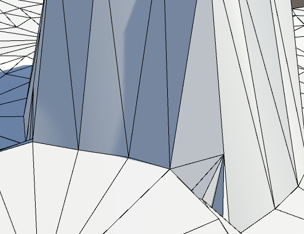 							The last cracks are gone. 						

unitypackage

## Tweaking

We now have a fully correct perturbed mesh. Its exact appearance  depends on the specific noise, its scale, and the perturbation  strengths. In our case, the perturbation might be a bit too strong.  While an irregular appearance is nice, we don't want the cells to  deviate too much from the regular grid. After all, we still use that to  determine which cell we're editing. And if the size of cells varies too  much, it will be harder to fit content inside them later.

 						 						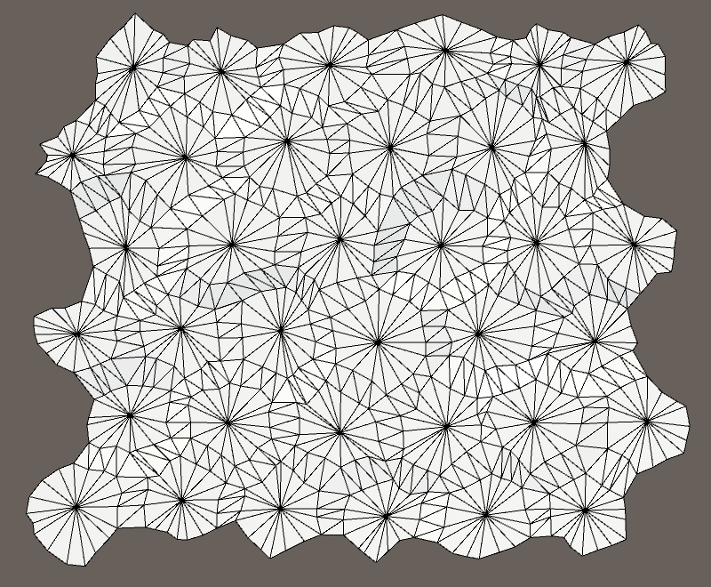 						Unperturbed vs. perturbed. 					

A cell perturbation strength of 5 just seems a tad too much.

<iframe src="https://gfycat.com/ifr/HarmlessEnormousDeer"></iframe>

Cell perturbation from 0 to 5.

Let's reduce it to 4, to make it a bit more manageable without  becoming too regular. That guarantees a maximum XZ displacement of √32 ≈  5.66.

```
	public const float cellPerturbStrength = 4f;
```

 						
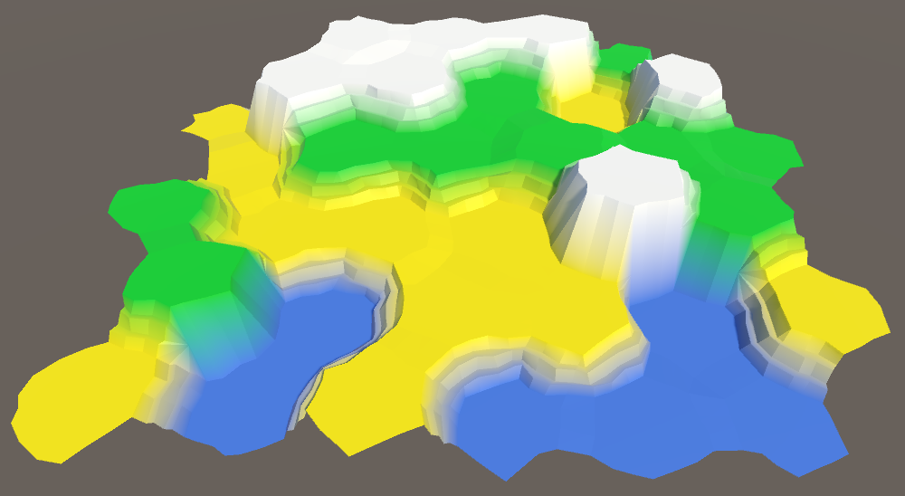 						Cell perturbation 4. 					

Another value that we can tweak is the solid factor. If we  increase it, the flat cell centers will become larger. This leaves more  room for future content. Of course, they will also become more  hexagonal.

<iframe src="https://gfycat.com/ifr/BackFewAplomadofalcon"></iframe>

Solid factor from 0.75 to 0.95.

A slight increase of the solid factor to 0.8 will make life a little easier for us later.

```
	public const float solidFactor = 0.8f;
```

 						
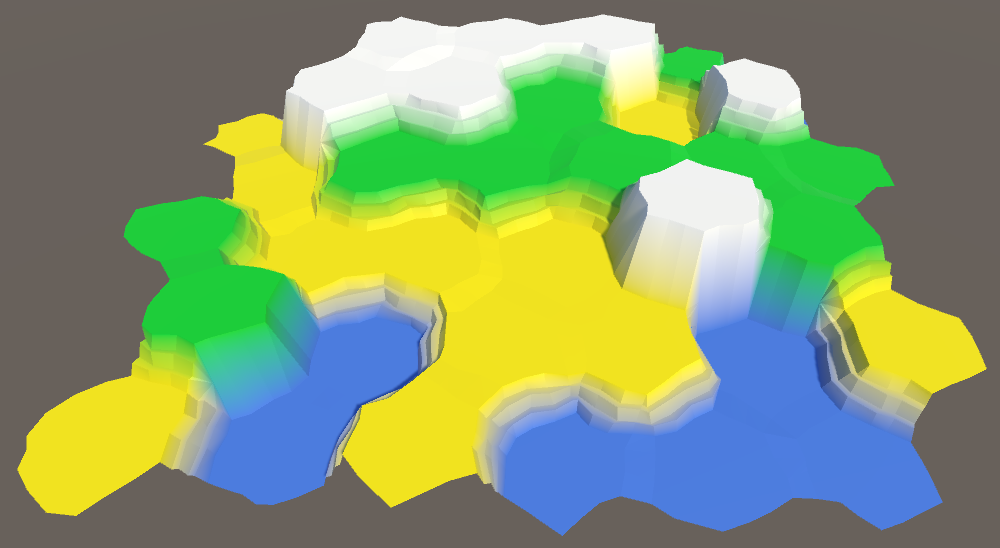 						Solid factor 0.8. 					

Finally, the differences between elevation levels are a bit  steep. That's handy when checking whether the mesh is generated  correctly, but we're done with that. Let's reduce it to one unit per  terrace step, so 3.

```
	public const float elevationStep = 3f;
```

 						
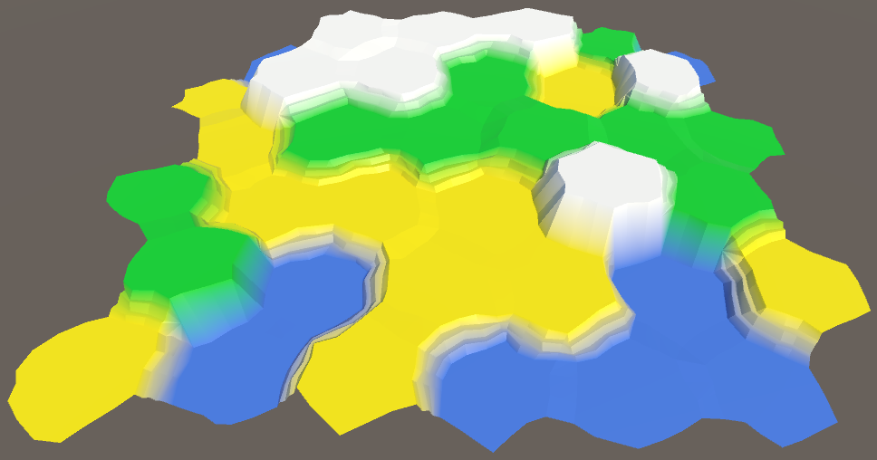 						Elevation step reduced to 3. 					

We could also adjust the elevation perturb strength. But it's  current set to 1.5, which is now equal to half an elevation step, which  is fine.

A smaller elevation step also makes it more practical to use all  seven of our elevation levels. This allows us to add even more variety  to our map.

 						
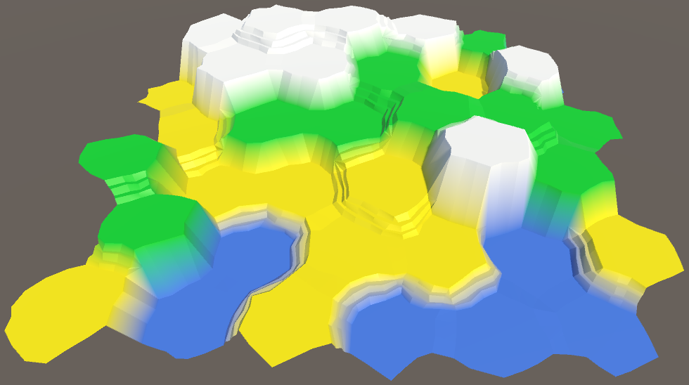 						Using seven elevation levels. 					

The next tutorial is [Larger Maps](https://catlikecoding.com/unity/tutorials/hex-map/part-5/).

unitypackage

PDF
