# Unity3D Shader编程】之七 静谧之秋篇: 表面着色器的写法(二)—— 自定义光照模式

> ​	文章链接：[ http://blog.csdn.net/poem_qianmo/article/details/42611531](http://blog.csdn.net/poem_qianmo/article/details/42611531)
>
> 
>
> ​	**作者：毛星云（浅墨）**    微博：http://weibo.com/u/1723155442
>
> ​	**邮箱：** **happylifemxy@163.com**
>
>  
>
>  
>
> 本文主要讲解了Unity中SurfaceShader的自定义光照模式的写法。
>
>  
>
> 上篇文章中我们已经说到，表面着色器将分为两次讲解，上一篇文章中介绍了表面着色器的基本概念和一些写法，用内置的兰伯特光照模式来进行Surface Shader的书写，而本文将介绍Surface Shader+自定义的光照模式的写法。
>
>  
>
> OK，言归正传，依然是先来看看本文配套的游戏场景截图。
>
>  
>
> 运行游戏，音乐响起，金黄色的丰收之秋映入眼帘：
>
>  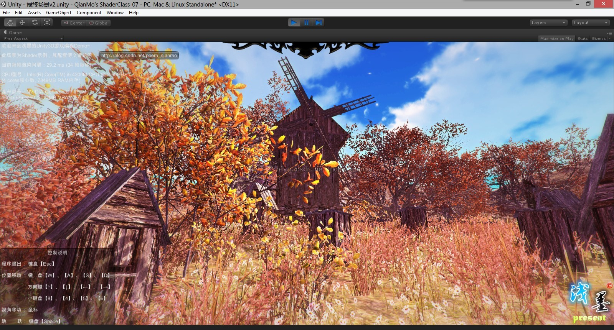
>
> 
>
> 远方：
>
> 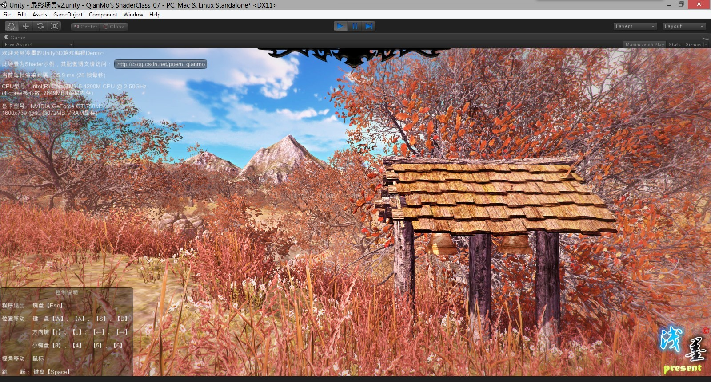
>
> 
>
>  
>
>  
>
> 池塘：
>
> 
>
> 
>
> 
>
>  
>
> 参天大树：
>
>  
>
> 
>
>  
>
>  
>
> 小型村落：
>
> 
>
>  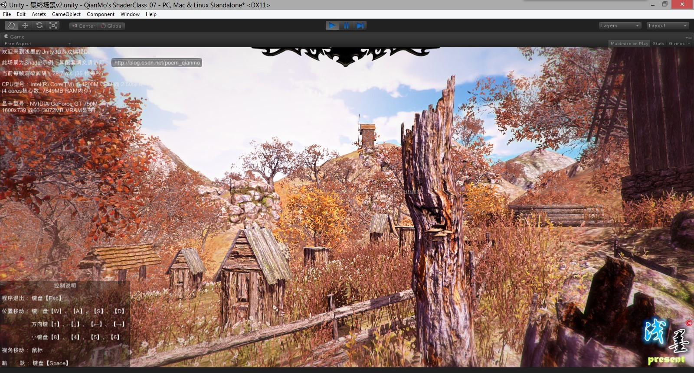
>
>  
>
>  
>
> 风车：
>
> 
>
>  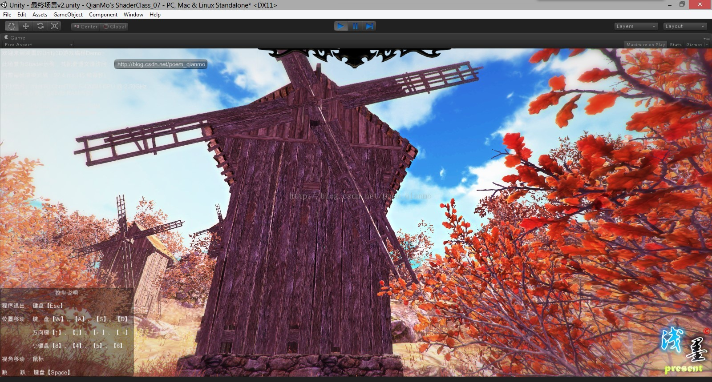
>
>  
>
>  
>
> 池塘边：
>
> 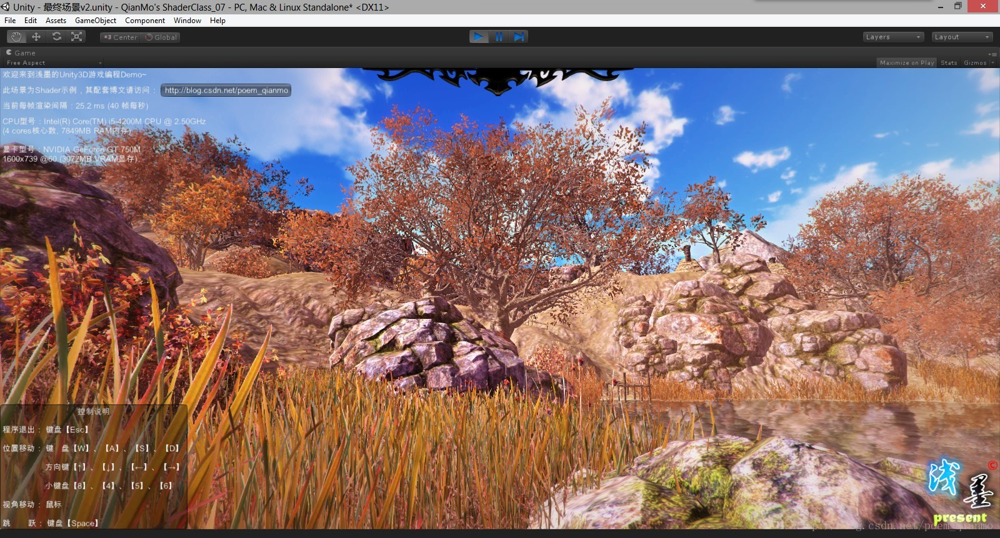
>
>  
>
> 
>
> OK，图先就上这么多。文章末尾有更多的运行截图，并提供了源工程的下载。可运行的exe下载在这里：
>
>  
>
> [**【可运行的exe游戏场景请点击这里下载试玩】**](http://pan.baidu.com/s/1c07zvsG)
>
>  
>
>  
>
>  好的，我们正式开始。
>
>  
>
>  
>
> 
>
> 
>
> 
>
> ## 一、一些光照模型的概念讲解
>
> 
>
> 
>
> 
>
> 我们知道，光照模型是真实感图形渲染的基础，从 1967 年 Wylie 等人第一次在显示物体的时候加进光照效果后，该领域迅速的发展。而这一节，我们主要看看最常见的漫反射、Lambert和镜面反射、Phong、Blinn-Phong这五种光照模型。
>
>  
>
>  
>
> 　
>
> ## 1.1 漫反射
>
> 
>
> 环境光是对光照现像的最简单抽象，因而局限性很大。它仅能描述光线在空间中无方向并均匀散布时的状态。很多情况下，入射光是带有方向的，比如典型的阳光。
>
> 如果光照射到比较粗糙的物体表面，如粉笔，由于这些表面从各个方向等强度地反射光，因而从各个视角出发，物体表面呈现相同的亮度，所看到的物体表面某点的明暗程度不随观测者的位置变化的，这种等同地向各个方向散射的现象称为光的漫反射（diffuse  reflection）。
>
> 简单光照模型模拟物体表面对光的反射作用。光源被假定为点光源，其几何形状为一个点，向周围所有方向上辐射等强度的光，在物体表面产生反射作用。
>
> 如图：
>
> ​							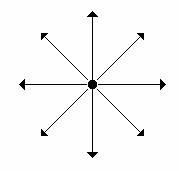
>
> 
>
> 
>
> 
>
> 　
>
> ## 1.2 Lambert模型
>
> 
>
> 
>
> 漫反射光的强度近似地服从于Lambert定律，即漫反射光的光强仅与入射光的方向和反射点处表面法向夹角的余弦成正比。
>
> 　
>
> 由此可以构造出Lambert漫反射模型：
>
> Idiffuse =Id Kd cosθ
>
> Idiffuse表示物体表面某点的漫反射光强
>
> Id为点光源，Kd(0<Kd<1)表示物体表面该点对漫反射光的反射属性
>
> 　
>
> θ是入射光线的方向与物体表面该点处法线N的夹角，或称为入射角(0≤θ≤90°)
>
> 入射角为零时，说明光线垂直于物体表面，漫反射光强最大；
>
> 90°时光线与物体表面平行，物体接收不到任何光线。
>
> 如图：
>
> ​							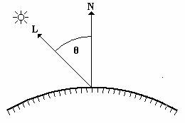
>
> 　
>
> 把环境光模型添加进来，最后，Lambert光照模型可写为：
>
> I= IaKa + Id Kdcosθ= IaKa + Id Kd(L·N)
>
> 该模型包含环境光和漫反射光。
>
> 
>
> 
>
> 　
>
> ## 1.3 镜面反射
>
> 
>
> Lambert模型较好地表现了粗糙表面上的光照现象，如石灰粉刷的墙壁、纸张等
>
> 但在用于诸如金属材质制成的物体时，则会显得呆板，表现不出光泽，主要原因是该模型没有考虑这些表面的镜面反射效果。
>
> 如果光照射到相当光滑的表面，就产生镜面反射（specular reflection），镜面反射的特点是在光滑表面会产生一块称之为高光（high light）的特亮区域 。
>
> 镜面反射遵循光的反射定律：反射光与入射光位于表面法向两侧，对理想反射面（如镜面），入射角等于反射角，观察者只能在表面法向的反射方向一侧才能看到反射。
>
> 
>
>  
>
> 
>
> 
>
> 
>
>  
>
> ## 1.4 Phong光照模型 
>
> 
>
> 
>
> 
>
> 
>
> Lambert模型能很好的表示粗糙表面的光照，但不能表现出镜面反射高光。1975年Phong Bui Tong发明的Phong模型，提出了计算镜面高光的经验模型，镜面反射光强与反射光线和视线的夹角a相关：
>
>  
>
>    								 **Ispecular = Ks\*Is\*(cos a) n**
>
>  
>
> ​    其中Ks为物体表面的高光系数，Is为光强，a是反射光与视线的夹角，n为高光指数，n越大，则表面越光滑，反射光越集中，高光范围越小。如果V表示顶点到视点的单位向量，R表示反射光反向，则cos a可表示为V和R的点积。模型可表示为：
>
> 
>
> ​								 **Ispecular = Ks\*Is\*(V●R) n**
>
>  
>
> ​    反射光放向R可由入射光放向L（顶点指向光源）和物体法向量N求出。
>
>  
>
>    									 **R = (2N●L)N – L**
>
>  
>
> 我们重新来看Phong光照的另一种表现形式：
>
> 
>
> ​								**Ispec = IsKscosns α(α∈(0,90º))** 
>
> Ks为物体表面某点的高亮光系数
>
> ns为物体表面的镜面反射指数，反映了物体表面的光泽程度， ns越大，表示物体越接近于镜面。
>
> 只有视线与光源在物体表面的反射光线非常接近时才能看到镜面反射光，此时，镜面反射光将会在反射方向附近形成很亮的光斑，称为高光现象。ns越小，表示物体越粗糙；当ns为零时，镜面反射光便退化为与视点、光源均无关的环境光。 
>
> 另外，将镜面反射光与环境光、漫反射光叠加起来形成单一光源照射下更为真实的Phong光照模型：

> > > > > > > > **I = Ia Ka+IdKdcosθ+IsKscosns α** 
>
> > > > > > > > θ ：入射角
>
> > > > > > > > α ：视线与镜面反射方向的夹角

>  
>
> ## 1.5 Blinn-Phong光照模型
>
> ​    
>
> 
>
>  图形学界大牛Jim   Blinn对Phong模型进行了改进，提出了Blinn-Phong模型。Blinn-Phong模型与Phong模型的区别是，把dot(V,R)换成了dot(N,H)，其中H为半角向量，位于法线N和光线L的角平分线方向。Blinn-Phong模型可表示为：
>
>  
>
> ​      							 **Ispecular = Ks\*Is\* pow(( dot(N,H), n )**
>
>  
>
> 其中H = (L + V) / | L+V |，计算H比计算反射向量R更快速。
>
>  
>
> Unity中，Phong实际上指的就是Blinn-Phong，两者指的同一种内置光照模型。
>
>  
>
> PS:光照模型部分的内容主要参考为：http://cg.sjtu.edu.cn/
>
>  
>
>  
>
>  
>
>  
>
>  
>
> 
>
> 
>
> ## 二、关于自定义光照模式(custom lighting model)
>
>  
>
> 
>
> 
>
> 
>
> 在编写表面着色器的时候，我们通常要描述一个表面的属性(反射率颜色，法线，…)、并通过光照模式来计算灯光的相互作用。
>
> 通过上篇文章的学习，我们已经知道，Unity中的内置的光照模式有两种， 分别是Lambert (漫反射光diffuse lighting) 和 Blinn-Phong （也就是镜面反射光(高光)，specular lighting)模式。
>
>  
>
> 然而，内置的光照模式自然有其局限性。想要自己做主的话，我们可以自定义光照模式。
>
> 也就是使用自定义光照模式( custom lighting model)。
>
> 其实说白了，光照模式(lighting model)无外乎是几个Cg/HLSL函数的组合。
>
>  
>
> 内置的 Lambert 和 Blinn-Phong定义在 Lighting.cginc文件中。我们不妨先来人肉一下他们的实现源代码。
>
>  
>
> windows系统下位于：
>
> …Unity\Editor\Data\CGIncludes\
>
>  
>
> Mac系统下位于： 
>
> /Applications/Unity/Unity.app/Contents/CGIncludes/Lighting.cginc)
>
>  
>
>  
>
>  
>
> Unity内置的 Lambert 和 Blinn-Phong模型的Shader源代码在这里贴出来：
>
> 
>
> ```
> #ifndef LIGHTING_INCLUDED#define LIGHTING_INCLUDED struct SurfaceOutput {	fixed3 Albedo;	fixed3 Normal;	fixed3 Emission;	half Specular;	fixed Gloss;	fixed Alpha;}; #ifndef USING_DIRECTIONAL_LIGHT#if defined (DIRECTIONAL_COOKIE) || defined (DIRECTIONAL)#define USING_DIRECTIONAL_LIGHT#endif#endif  // NOTE: you would think using half is fine here, but that would make// Cg apply some precision emulation, making the constants in the shader// much different; and do some other stupidity that actually increases ALU// count on d3d9 at least. So we use float.//// Also, the numbers in many components should be the same, but are changed// very slightly in the last digit, to prevent Cg from mis-optimizing// the shader (it tried to be super clever at saving one shader constant// at expense of gazillion extra scalar moves). Saves about 6 ALU instructions// on d3d9 SM2.#define UNITY_DIRBASIS \const float3x3 unity_DirBasis = float3x3( \  float3( 0.81649658,  0.0,        0.57735028), \  float3(-0.40824830,  0.70710679, 0.57735027), \  float3(-0.40824829, -0.70710678, 0.57735026) \);  inline half3 DirLightmapDiffuse(in half3x3 dirBasis, fixed4 color, fixed4 scale, half3 normal, bool surfFuncWritesNormal, out half3 scalePerBasisVector){	half3 lm = DecodeLightmap (color);		// will be compiled out (and so will the texture sample providing the value)	// if it's not used in the lighting function, like in LightingLambert	scalePerBasisVector = DecodeLightmap (scale); 	// will be compiled out when surface function does not write into o.Normal	if (surfFuncWritesNormal)	{		half3 normalInRnmBasis = saturate (mul (dirBasis, normal));		lm *= dot (normalInRnmBasis, scalePerBasisVector);	} 	return lm;}  fixed4 _LightColor0;fixed4 _SpecColor; inline fixed4 LightingLambert (SurfaceOutput s, fixed3 lightDir, fixed atten){	fixed diff = max (0, dot (s.Normal, lightDir));		fixed4 c;	c.rgb = s.Albedo * _LightColor0.rgb * (diff * atten * 2);	c.a = s.Alpha;	return c;}  inline fixed4 LightingLambert_PrePass (SurfaceOutput s, half4 light){	fixed4 c;	c.rgb = s.Albedo * light.rgb;	c.a = s.Alpha;	return c;} inline half4 LightingLambert_DirLightmap (SurfaceOutput s, fixed4 color, fixed4 scale, bool surfFuncWritesNormal){	UNITY_DIRBASIS	half3 scalePerBasisVector;		half3 lm = DirLightmapDiffuse (unity_DirBasis, color, scale, s.Normal, surfFuncWritesNormal, scalePerBasisVector);		return half4(lm, 0);}  // NOTE: some intricacy in shader compiler on some GLES2.0 platforms (iOS) needs 'viewDir' & 'h'// to be mediump instead of lowp, otherwise specular highlight becomes too bright.inline fixed4 LightingBlinnPhong (SurfaceOutput s, fixed3 lightDir, half3 viewDir, fixed atten){	half3 h = normalize (lightDir + viewDir);		fixed diff = max (0, dot (s.Normal, lightDir));		float nh = max (0, dot (s.Normal, h));	float spec = pow (nh, s.Specular*128.0) * s.Gloss;		fixed4 c;	c.rgb = (s.Albedo * _LightColor0.rgb * diff + _LightColor0.rgb * _SpecColor.rgb * spec) * (atten * 2);	c.a = s.Alpha + _LightColor0.a * _SpecColor.a * spec * atten;	return c;} inline fixed4 LightingBlinnPhong_PrePass (SurfaceOutput s, half4 light){	fixed spec = light.a * s.Gloss;		fixed4 c;	c.rgb = (s.Albedo * light.rgb + light.rgb * _SpecColor.rgb * spec);	c.a = s.Alpha + spec * _SpecColor.a;	return c;} inline half4 LightingBlinnPhong_DirLightmap (SurfaceOutput s, fixed4 color, fixed4 scale, half3 viewDir, bool surfFuncWritesNormal, out half3 specColor){	UNITY_DIRBASIS	half3 scalePerBasisVector;		half3 lm = DirLightmapDiffuse (unity_DirBasis, color, scale, s.Normal, surfFuncWritesNormal, scalePerBasisVector);		half3 lightDir = normalize (scalePerBasisVector.x * unity_DirBasis[0] + scalePerBasisVector.y * unity_DirBasis[1] + scalePerBasisVector.z * unity_DirBasis[2]);	half3 h = normalize (lightDir + viewDir); 	float nh = max (0, dot (s.Normal, h));	float spec = pow (nh, s.Specular * 128.0);		// specColor used outside in the forward path, compiled out in prepass	specColor = lm * _SpecColor.rgb * s.Gloss * spec;		// spec from the alpha component is used to calculate specular	// in the Lighting*_Prepass function, it's not used in forward	return half4(lm, spec);}   #ifdef UNITY_CAN_COMPILE_TESSELLATIONstruct UnityTessellationFactors {    float edge[3] : SV_TessFactor;    float inside : SV_InsideTessFactor;};#endif // UNITY_CAN_COMPILE_TESSELLATION #endif
> ```
>
> 
>
> 
>
> OK，下面让我们一起来看看光照模式应该怎样声明和定义。
>
>  
>
>  
>
>  
>
> 
>
> 
>
> # 三、光照模式的声明方式
>
>  
>
>  
>
> 
>
> 在Unity Shaderlab和CG语言中，光照模式是一个以Lighting开头+自定义文字组合在一起的函数。
>
> 即，函数名为：
>
> Lighting+ [自定义部分]
>
> 比如，一个可行的函数名为：LightingQianMoLightingMode
>
>  
>
> 我们可以在着色器文件(shader file)或导入文件(included files)中的任何一个地方声明此函数。一般情况下，此函数有五种原型可供选择，具体如下。
>
> 一般情况下，于以下五种函数原型中选一种，进行实现就行了。
>
>  
>
>  
>
> 【形式一】
>
> **half4 LightingName (SurfaceOutput s, half3 lightDir, half atten);**
>
> 此种形式的函数可以表示在正向渲染路径(forward rendering path)中的光照模式，且此函数不取决于视图方向(view direction)。例如：漫反射(diffuse)。
>
>  
>
> 【形式二】
>
> **half4 LightingName (SurfaceOutput s, half3 lightDir, half3 viewDir, half atten);**
>
> 此种形式的函数可以表示在正向渲染路径(forward rendering path)中使用的光照模式，且此函数包含了视图方向(view direction)。
>
> 
>
> 【形式三】
>
> **half4 LightingName_PrePass (SurfaceOutput s, half4 light);** 
>
> 此种形式的函数可以在延时光照路径(deferred lighting path)中使用的。
>
>  
>
> 【形式四】
>
> **half4 LightingName_DirLightmap(SurfaceOutput s, fixed4 color, fixed4 scale, bool surfFuncWritesNormal);**
>
> 这种形式也是不依赖于视图方向(view direction)的光照模式。例如：漫反射(diffuse)。
>
>  
>
> 【形式五】
>
> **half4  LightingName_DirLightmap(SurfaceOutput s, fixed4 color, fixed4 scale,  half3 viewDir, bool surfFuncWritesNormal,out half3 specColor);**
>
> 这是使用的依赖于视图方向(view direction)的光照模式(light model)。
>
>  
>
>  
>
> 比如，一个光照模式(lighting  model)要么使用视图方向(view  direction)要么不使用。同样的，如果光照模式(lightingmodel)在延时光照(deferred  lighting)中不工作,只要不声明成 _PrePass(第三种形式)，就是行的。
>
> 另外，对于形式四和形式五的选择，主要取决于我们的光照模式(light  model)是否依赖视图方向(view direction)。需要注意的是，这两个函数将自动处理正向和延时光照路径(forwardand  deferred lighting rendering paths)。
>
> **PS: Unity在移动平台中暂时不支持延迟光照渲染。**
>
>  
>
> 
>
> 做个总结，在自定义自己的光照模型函数时，根据需要在五种函数原型中选择一种，且：
>
> 
>
> **光照模式的函数名为：Lighting+ [自定义函数名]**
>
> **pragma声明为： #pragmasurface surf  [自定义函数名]**
>
>  
>
> 然后就是需要，仿照着其他的光照模式来填充函数体了。
>
>  
>
>  
>
> 我们举个例子：
>
> 
>
> 
>
> ```
> #pragma surface surf QianMoLigtingModehalf4 LightingQianMoLigtingMode (SurfaceOutputs, half3 lightDir, half3 viewDir, half atten);
> ```
>
> 
>
>  
>
> OK，光照模式的声明就是这样。光照模式的函数体是其最核心的部分，需要根据具体的光照模式数学公式进行书写，我们将在接下来的写Shader实战中进行学习。
>
> PS:估计这节的概念有些难懂，大家肯定在第一时间不能完全理解，没事，让我们依旧在Shader实战中把状态找回来。
>
>  
>
>  
>
>  
>
> 
>
> 
>
> 
>
> ## 四、写Shader实战
>
>  
>
>  
>
> 
>
> 上文已经提到过了，:  Unity在移动平台中暂时不支持延迟光照(Deferred lighting)渲染。因为延时光照不能与一些自定义per-material  光照模式很好的共同运行，所以在下面的例子中我们只在着色器正向渲染(ForwardRendering)中进行实现。
>
>  
>
>  
>
> 
>
> 
>
> ### 0.内置的漫反射光照
>
> 
>
> 首先，我们根据上一节所学，写一个依靠内置的兰伯特光照模式的漫反射光的Surface Shader：
>
> 
>
> ```
> Shader "浅墨Shader编程/Volume7/33.内置的漫反射" {	//--------------------------------【属性】----------------------------------     Properties 	{		_MainTex ("【主纹理】Texture", 2D) = "white" {}    }	 //--------------------------------【子着色器】----------------------------------     SubShader 	{		//-----------子着色器标签----------  		Tags { "RenderType" = "Opaque" } 		//-------------------开始CG着色器编程语言段-----------------   		CGPROGRAM 		//【1】光照模式声明：使用兰伯特光照模式		 #pragma surface surf Lambert 		//【2】输入结构   		struct Input 		{		    float2 uv_MainTex;		}; 		//变量声明 		sampler2D _MainTex; 		//【3】表面着色函数的编写 		void surf (Input IN, inout SurfaceOutput o) 		{			//从主纹理获取rgb颜色值 		   o.Albedo = tex2D (_MainTex, IN.uv_MainTex).rgb;		} 		//-------------------结束CG着色器编程语言段------------------		ENDCG    }     Fallback "Diffuse"  }
> ```
>
> 
>
> 实现效果：
>
> 
>
> 
>
>  
>
> 
>
>  
>
> 
>
> ### 1.简单的高光光照模型
>
>  
>
> 下面是一个简单的高光光照模式(specular lighting model)Shader。实际上他就是Unity内置的Blinn-Phong光照模型，实际上做起来并不困难。这边我们将它单独拿出来实现一下：
>
>  
>
> ```
> Shader "浅墨Shader编程/Volume7/34.自定义高光" { 	//--------------------------------【属性】---------------------------------- 	Properties 	{		_MainTex ("【主纹理】Texture", 2D) = "white" {}	} 	//--------------------------------【子着色器】----------------------------------	SubShader 	{		//-----------子着色器标签----------  		Tags { "RenderType" = "Opaque" } 		//-------------------开始CG着色器编程语言段-----------------   		CGPROGRAM 		//【1】光照模式声明：使用自定义的光照模式		#pragma surface surf SimpleSpecular 		//【2】实现自定义的光照模式SimpleSpecular		half4 LightingSimpleSpecular (SurfaceOutput s, half3 lightDir, half3 viewDir, half atten) 		{			half3 h = normalize (lightDir + viewDir); 			half diff = max (0, dot (s.Normal, lightDir)); 			float nh = max (0, dot (s.Normal, h));			float spec = pow (nh, 48.0); 			half4 c;			c.rgb = (s.Albedo * _LightColor0.rgb * diff + _LightColor0.rgb * spec) * (atten * 2);			c.a = s.Alpha;			return c;		} 		//【3】输入结构		struct Input 		{			float2 uv_MainTex;		};        		//变量声明       		sampler2D _MainTex; 		//【4】表面着色函数的编写  		void surf (Input IN, inout SurfaceOutput o) 		{			//从主纹理获取rgb颜色值 			o.Albedo = tex2D (_MainTex, IN.uv_MainTex).rgb;		} 		//-------------------结束CG着色器编程语言段------------------  		ENDCG    } 	//“备胎”为普通漫反射    Fallback "Diffuse"  }
> ```
>
> 
>
> 实现效果：
>
> 
>
> 
>
> 
>
>  
>
>  
>
> 
>
> ### 2.自制简单的Lambert光照
>
>  
>
> 
>
> 对应于Unity内建的Lambert光照，我们可以自定义原理类似的光照模式，实现自己Lambert光照：
>
>  
>
> ```
> Shader "浅墨Shader编程/Volume7/35.自制简单的Lambert光照" {	//--------------------------------【属性】----------------------------------------  	Properties 	{      _MainTex ("【主纹理】Texture", 2D) = "white" {}    } 	//--------------------------------【子着色器】----------------------------------      SubShader 	{		//-----------子着色器标签----------  		Tags { "RenderType" = "Opaque" }		//-------------------开始CG着色器编程语言段-----------------   		CGPROGRAM 		//【1】光照模式声明：使用自制的兰伯特光照模式		#pragma surface surf QianMoLambert 		//【2】实现自定义的兰伯特光照模式		half4 LightingQianMoLambert (SurfaceOutput s, half3 lightDir, half atten) 		{			half NdotL =max(0, dot (s.Normal, lightDir));			half4 color;			color.rgb = s.Albedo * _LightColor0.rgb * (NdotL * atten * 2);			color.a = s.Alpha;			return color;		} 		//【3】输入结构  		struct Input 		{			float2 uv_MainTex;		}; 		//变量声明		sampler2D _MainTex; 		//【4】表面着色函数的编写		void surf (Input IN, inout SurfaceOutput o) 		{			//从主纹理获取rgb颜色值 			o.Albedo = tex2D (_MainTex, IN.uv_MainTex).rgb;		} 		//-------------------结束CG着色器编程语言段------------------		ENDCG    }    Fallback "Diffuse"  }
> ```
>
> 
>
> 实现效果如下：
>
> 
>
>  
>
> 
>
>  
>
>  
>
> 
>
> 
>
> 
>
> ## 3.自定义的半Lambert光照
>
> 
>
> 
>
> 接下来，让我们自制一个半Lambert光照。
>
> Lambert定律认为，在平面某点漫反射光的光强与该反射点的法向量和入射光角度的余弦值成正比（即我们之前使用dot函数得到的结果）。Half Lambert最初是由Valve（大V社）提出来的，用于提高物体在一些光线无法照射到的区域的亮度的。
>
> 简单说来，半Lambert光照提高了漫反射光照的亮度，使得漫反射光线可以看起来照射到一个物体的各个表面。
>
> 而半Lambert最初也是被用于《半条命2》的画面渲染，为了防止某个物体的背光面丢失形状并且显得太过平面化。这个技术是完全没有基于任何物理原理的，而仅仅是一种感性的视觉增强。
>
> 遮蔽的漫反射-漫反射光照的一种改进。照明"环绕(wraps around)"在物体的边缘。它对于假冒子表面(subsurface)散射效果(scattering effect)非常有用。
>
>  
>
> 半Lambert光照Shader的代码如下：
>
>  
>
> ```
>   Shader "浅墨Shader编程/Volume7/36.自制半Lambert光照"   {		//--------------------------------【属性】----------------------------------------  		Properties 		{			_MainTex ("【主纹理】Texture", 2D) = "white" {}		} 		//--------------------------------【子着色器】----------------------------------  		SubShader 		{			//-----------子着色器标签----------  			Tags { "RenderType" = "Opaque" }			//-------------------开始CG着色器编程语言段-----------------  			CGPROGRAM 			//【1】光照模式声明：使用自制的半兰伯特光照模式			#pragma surface surf QianMoHalfLambert 			//【2】实现自定义的半兰伯特光照模式			half4 LightingQianMoHalfLambert (SurfaceOutput s, half3 lightDir, half atten) 			{				half NdotL =max(0, dot (s.Normal, lightDir)); 				//在兰伯特光照的基础上加上这句，增加光强				float hLambert = NdotL * 0.5 + 0.5;  				half4 color; 				//修改这句中的相关参数				color.rgb = s.Albedo * _LightColor0.rgb * (hLambert * atten * 2);				color.a = s.Alpha;				return color;			} 			//【3】输入结构  			struct Input 			{				float2 uv_MainTex;			}; 			//变量声明			sampler2D _MainTex; 			//【4】表面着色函数的编写			void surf (Input IN, inout SurfaceOutput o) 			{				//从主纹理获取rgb颜色值 				o.Albedo = tex2D (_MainTex, IN.uv_MainTex).rgb;			} 			//-------------------结束CG着色器编程语言段------------------			ENDCG		} 		Fallback "Diffuse"  }
> ```
>
> 
>
> 
>
> 实现效果如下：
>
> 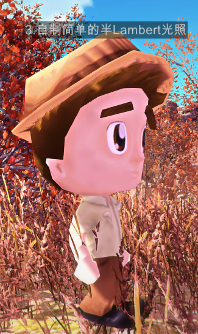
>
> 
>
> 
>
> 
>
>  
>
> 
>
> 
>
> 
>
>  
>
> 
>
> ### 4.自定义卡通渐变光照
>
> 
>
>  
>
> 下面，我们一起实现一个自定义卡通渐变光照，通过一个不同的渐变纹理（渐变纹理可由PS制作），实现各种不同的渐变效果。
>
> 自定义卡通渐变光照Shader代码如下：
>
> 
>
> ```
> Shader "浅墨Shader编程/Volume7/37.自定义卡通渐变光照" {	//--------------------------------【属性】----------------------------------------  	Properties 	{		_MainTex ("【主纹理】Texture", 2D) = "white" {}		_Ramp ("【渐变纹理】Shading Ramp", 2D) = "gray" {}	} 	//--------------------------------【子着色器】----------------------------------    SubShader 	{		//-----------子着色器标签----------  		Tags { "RenderType" = "Opaque" }		//-------------------开始CG着色器编程语言段-----------------  		CGPROGRAM 		//【1】光照模式声明：使用自制的卡通渐变光照模式		#pragma surface surf Ramp 		//变量声明		sampler2D _Ramp; 		//【2】实现自制的卡通渐变光照模式		half4 LightingRamp (SurfaceOutput s, half3 lightDir, half atten)		{			//点乘反射光线法线和光线方向            		half NdotL = dot (s.Normal, lightDir); 			//增强光强            		half diff = NdotL * 0.5 + 0.5;			//从纹理中定义渐变效果			half3 ramp = tex2D (_Ramp, float2(diff,diff)).rgb;			//计算出最终结果            		half4 color;			color.rgb = s.Albedo * _LightColor0.rgb * ramp * (atten * 2);			color.a = s.Alpha; 			return color;		} 		//【3】输入结构  		struct Input 		{			float2 uv_MainTex;		}; 		//变量声明		sampler2D _MainTex; 		//【4】表面着色函数的编写		void surf (Input IN, inout SurfaceOutput o) 		{			//从主纹理获取rgb颜色值 			o.Albedo = tex2D (_MainTex, IN.uv_MainTex).rgb;		} 		//-------------------结束CG着色器编程语言段------------------		ENDCG     }    Fallback "Diffuse"  }
> ```
>
> 
>
> 
>
> 
>
> 我们取不同的渐变纹理，可得到不同的效果。以下是五种不同渐变纹理和对应的效果图。
>
> 第一组：
>
> 
>
> 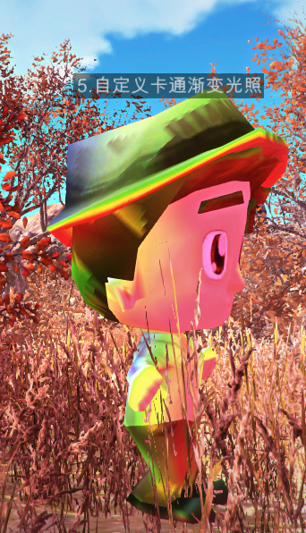
>
> 
>
>  第二组：
>
> 
>
> 
>
> 
>
> 第三组：
>
> 
>
> 
>
> 
>
> 第四组：
>
> 
>
> 
>
>  
>
> 第五组：
>
> 
>
> 
>
>  
>
> 
>
> 
>
>  
>
>  
>
> 
>
> 
>
> 
>
> ### 5.自定义卡通渐变光照v2
>
> 
>
> 
>
> 让我们在上面这个Shader的基础上，加入更多可选的属性，成为一个功能完备的渐变光照Shader：
>
> 
>
> ```
> Shader "浅墨Shader编程/Volume7/38.自定义卡通渐变光照v2" {  	//--------------------------------【属性】---------------------------------------- 	Properties       {          _MainTex ("【主纹理】Texture", 2D) = "white" {}  		_Ramp ("【渐变纹理】Ramp Texture", 2D) = "white"{}          _BumpMap ("【凹凸纹理】Bumpmap", 2D) = "bump" {}          _Detail ("【细节纹理】Detail", 2D) = "gray" {}          _RimColor ("【边缘颜色】Rim Color", Color) = (0.26,0.19,0.16,0.0)          _RimPower ("【边缘颜色强度】Rim Power", Range(0.5,8.0)) = 3.0      }   	//--------------------------------【子着色器】----------------------------------    SubShader 	{  		//-----------子着色器标签----------          Tags { "RenderType"="Opaque" }          LOD 200           //-------------------开始CG着色器编程语言段-----------------          CGPROGRAM   		//【1】光照模式声明：使用自制的卡通渐变光照模式        #pragma surface surf QianMoCartoonShader          				//变量声明          sampler2D _MainTex;  		sampler2D _Ramp;          sampler2D _BumpMap;          sampler2D _Detail;          float4 _RimColor;          float _RimPower;   		//【2】实现自制的卡通渐变光照模式        inline float4 LightingQianMoCartoonShader(SurfaceOutput s, fixed3 lightDir, fixed atten)          {  			//点乘反射光线法线和光线方向            half NdotL = dot (s.Normal, lightDir); 			//增强光强            half diff = NdotL * 0.5 + 0.5;			//从纹理中定义渐变效果			half3 ramp = tex2D (_Ramp, float2(diff,diff)).rgb;			//计算出最终结果            half4 color;			color.rgb = s.Albedo * _LightColor0.rgb * ramp * (atten * 2);			color.a = s.Alpha; 			return color;        }           //【3】输入结构            struct Input           {              //主纹理的uv值              float2 uv_MainTex;              //凹凸纹理的uv值              float2 uv_BumpMap;              //细节纹理的uv值              float2 uv_Detail;               //当前坐标的视角方向              float3 viewDir;          };   				//【4】表面着色函数的编写        void surf (Input IN, inout SurfaceOutput o)          {  			 //先从主纹理获取rgb颜色值              o.Albedo = tex2D (_MainTex, IN.uv_MainTex).rgb;                 //设置细节纹理              o.Albedo *= tex2D (_Detail, IN.uv_Detail).rgb * 2;               //从凹凸纹理获取法线值              o.Normal = UnpackNormal (tex2D (_BumpMap, IN.uv_BumpMap));              //从_RimColor参数获取自发光颜色              half rim = 1.0 - saturate(dot (normalize(IN.viewDir), o.Normal));              o.Emission = _RimColor.rgb * pow (rim, _RimPower);           }           //-------------------结束CG着色器编程语言段------------------        ENDCG      }       FallBack "Diffuse"  }  
> ```
>
> 
>
> 我们将此Shader编译后赋给材质，得到如下效果：
>
> 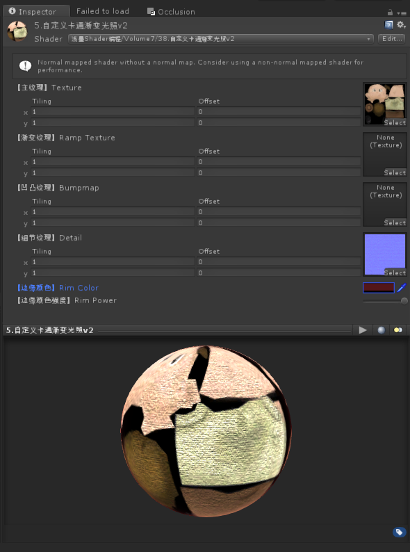
>
> 
>
> 
>
> 可供调节的属性非常多，稍微放几张效果图，剩下的大家可以下载工程源代码，或者拷贝Shader代码，自己回去调着玩吧~
>
>  
>
> 布料细节纹理+灰白渐变纹理+红色边缘光：
>
> 
>
> 
>
> 
>
>  
>
> 布料细节纹理+灰白渐变纹理+浅绿色边缘光：
>
> 
>
> 
>
>  
>
>  
>
> 布料细节纹理+灰白渐变纹理+白色边缘光：
>
> 
>
> 
>
>  
>
>  
>
> 布料细节纹理+灰白渐变纹理+无边缘光（黑色）：
>
> 
>
> 
>
>  
>
>  
>
>  
>
> ## 五、场景搭建
>
>  
>
>  
>
> 以大师级美工鬼斧神工的场景作品为基础，浅墨调整了场景布局，加入了音乐，并加入了更多高级特效，于是便得到了如此这次比较唯美的静谧之秋场景。
>
>  
>
> 运行游戏，树影摇曳，我们来到金黄色的丰收之秋。
>
> 
>
> 
>
> 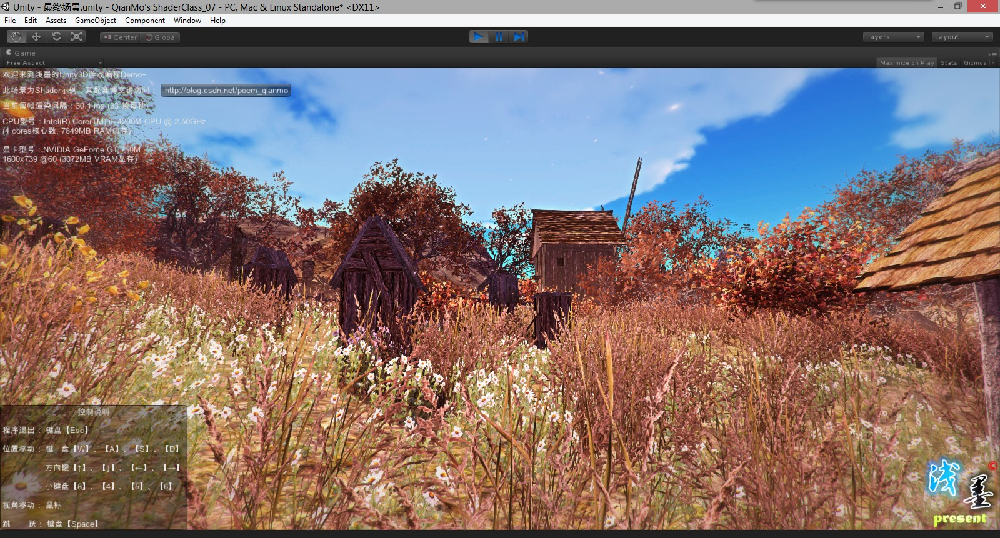
>
> 
>
> 
>
> 
>
> 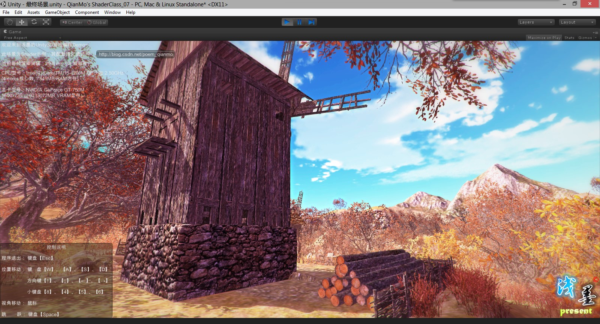
>
> 
>
> 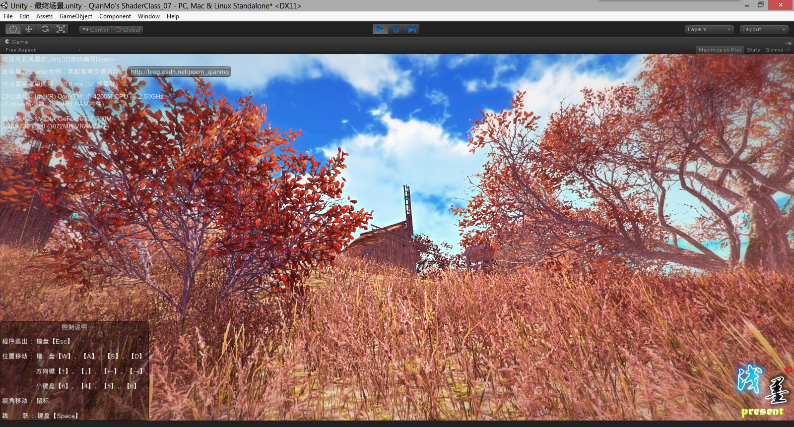
>
> 
>
> 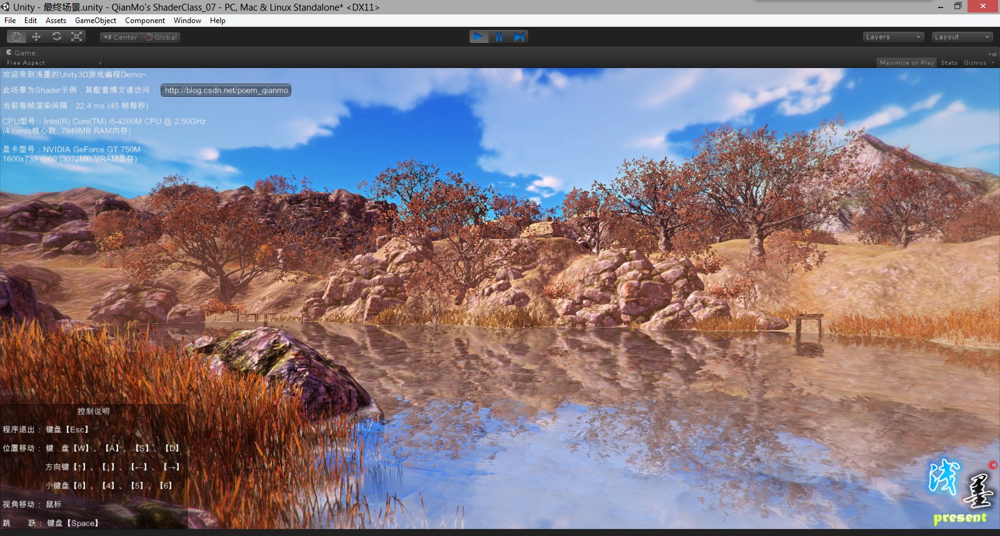
>
> 
>
> 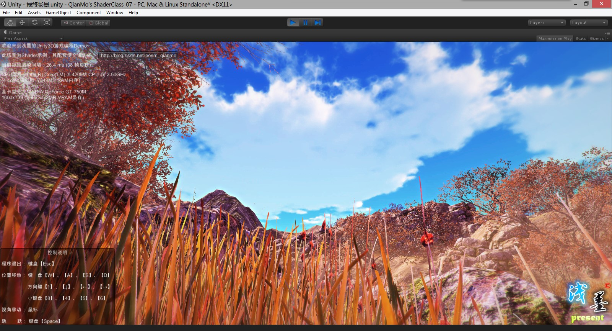
>
> 
>
> 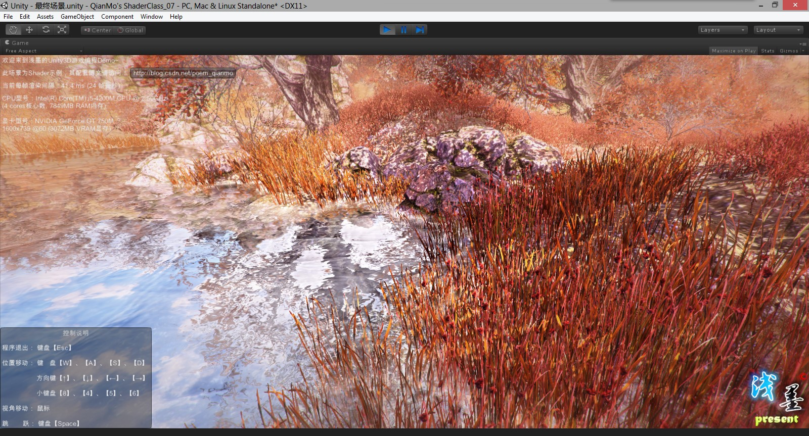
>
> 
>
> 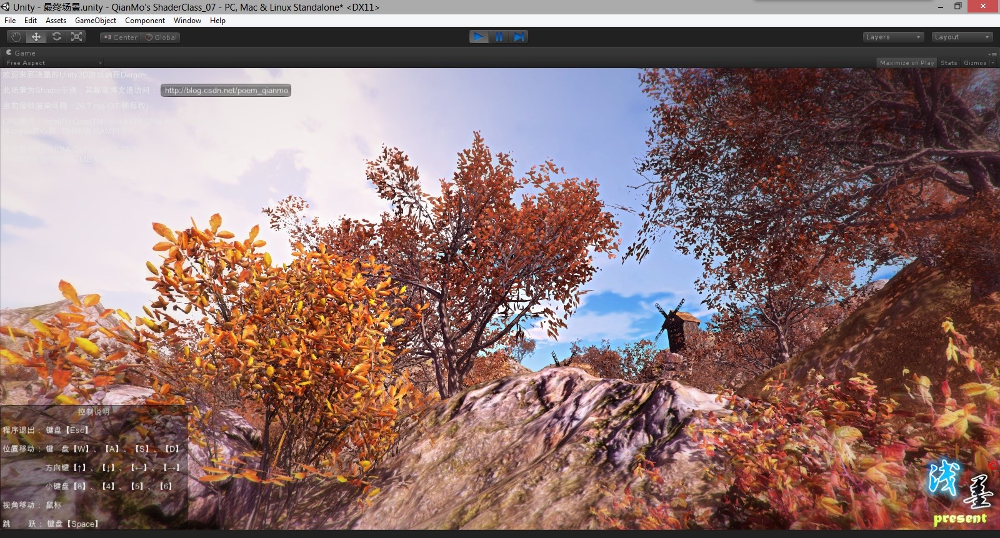
>
> 
>
> 
>
> 最后，放一张本篇文章中实现的Shader全家福：
>
> 
>
> 
>
>  
>
>  
>
>  
>
> OK，美图就放这么多。游戏场景可运行的exe可以在文章开头中提供的链接下载。而以下是源工程的下载链接。
>
>  
>
> ​	本篇文章的示例程序源工程请点击此处下载：
>
>  
>
> ​     **【浅墨Unity3D Shader编程】之七 静谧之秋篇配套Unity工程下载**
>
> 
>
>  
>
> 
>
> 
>
> Unity   Shader系列文章到目前已经更新了7篇，一共实现了38个详细注释、循序渐进、功能各异的Shader，对Unity中的固定功能Shader、Surface   Shader都已经有了比较详细、系统的讲解和实现。而可编程Shader按学习计划来说是以后的计划，目前还是未涉及，有机会在以后的文章中一起和大家一起探讨。
>
> 而大家如果仔细参考和阅读这七篇文章，会发现Unity中Shader的书写其实是非常容易和有章可循的。这大概就是浅墨写这个系列文章的初衷吧。
>
> 
>
> 
>
> 天下没有不散的宴席。
>
> 浅墨接下来的一段时间有一些大的游戏项目要接触，所以，Unity Shader系列文章每周周一的固定更新只能改为不定期的更新了。以后浅墨有了空余时间，会继续写博文来与大家交流分享。
>
> OK，于未来某天更新的下篇文章中，我们后会有期。：）
>
> 