# **HOW UNREAL RENDERS A FRAME PART** **2** 

*This is part 2 of the “How Unreal Renders a Frame” series, you can access part 1 and part 3 as well.* 

We continue the exploration of how Unreal renders a frame by looking into light grid generation, g-prepass and lighting.

**Light assignment** 

Next, the renderer switches to a compute shader to assign lights to a 3D grid (**ComputeLightGrid**  pass), in a way similar to clustered shading. This light grid can be  used to quickly retrieve the lights that affect a surface based on its  position.

As the pass name indicates, the view space light grid is of  dimensions 29x16x32. Unreal uses a screen space tile of 64×64 pixels and  32 z-partitions. This means that the actual number of X-Y dimensions of  the light grid will depend on the screen resolution. Also according to  the name we are assigning 9 lights and 2 reflection probes. A reflection  probe is an “entity” with position and radius which captures the  environment around it and it is used for reflections on props.

According to the compute shader source (LightGridInjection.usf), the  partitioning is exponential, meaning that the z-dimension of each grid  cell in view space becomes larger with distance. Also it uses the axis  aligned box of each cell to perform light bounding volume intersections.  To store the light indices, a linked list is used which is then  converted to a contiguous array during the “Compact” pass.

This Light grid will later be used during the Volumetric Fog pass to  add light scattering to the fog, the environment reflections pass and  the translucency rendering pass.

Another interesting thing I noticed is that the CullLights pass  begins by clearing the Unordered Access Views for light data, but it  uses ClearUnorderedAccessViewUint only for the 2 of the 3 UAVs. For the  other one it uses a compute shader that sets the value manually (the  first Dispatch in the above list). Apparently the source code, for  buffer sizes above 1024 bytes, favours clearing with a compute shader  instead of a “clear” API call.

**Volumetric Fog** 

Next up is volumetric fog calculations, again using compute shaders.

This pass calculates and stores transmittance and light scattering in  a volume texture, allowing easy fog calculation using only the surface  position. Like in the Light assignment pass above, the volume is  “fitted” to the view frustum, using tiles of 8×8 pixels and 128 depth  slices. The depth slices are distributed exponentially, pushing the near  plane further a bit to avoid many small cells close to the camera  (similar to Avalanche’s [clustered shading system](http://www.humus.name/Articles/PracticalClusteredShading.pdf)).

Similar to [Assassin’s Creed IV](http://advances.realtimerendering.com/s2014/index.html) and [Frostbite’s](https://www.ea.com/frostbite/news/physically-based-unified-volumetric-rendering-in-frostbite) volumetric fog tech (LINK), the fog is calculated in 3 passes: the first one (**InitializeVolumeAttributes**)  calculates and stores fog parameters (scattering and absorption) into  the volume texture and also stores a global emissive value into a second  volume texture. The second pass (**LightScattering**)  calculates the light scattering and extinction for each cell combining  the shadowed directional light, sky light and local lights, assigned to  the Light volume texture during the ComputeLightGrid pass above. It also  uses temporal antialiasing on the compute shader output (Light  Scattering, Extinction) using a history buffer, which is itself a 3D  texture, improve scattered light quality per grid cell. The final pass, (**FinalIntegration**)  simply raymarches the 3D texture in the Z dimension and accumulates  scattered light and transmittance, storing the result, as it goes, to  the corresponding cell grid.

The final volume buffer with light scattering looks as follows. In  it, we can see the lightshafts due to the directional lights and the  local lights scattering through the fog.

**G-Prepass** 

What follows is Unreal’s version of the G-Prepass, typically used in  deferred rendering architectures. The purpose of this pass is to cache  material properties in a set of rendertargets with the aim to reduce  overdraw during expensive lighting and shading calculations.

[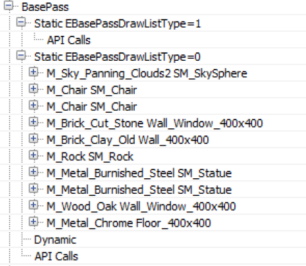](https://interplayoflight.files.wordpress.com/2017/10/image22.png)

During this pass, all solid props (static, movable etc) are typically  rendered. In the case of Unreal, it also renders the skydome, first! In  most cases this is bad practice since the skydome will later be  overwritten by other, closer to the camera, props and it is wasted work.  In this case though it is ok because the Z-prepass the renderer  performed earlier eliminates any skydome overdraw (and most overdraw in  general, at least for solid props).

Here is the list of rendertargets the g-prepass is writing to.

The depth buffer is bound for z-testing purposes only, it was already  filled during the z-prepass and the renderer does not write to it now.  The renderer does write to the stencil buffer though, to mark the pixels  that belong to the solid geometry it renders.

The contents of the g-buffer might change depending on the render  settings. For example if the renderer is to write velocity in the  gbuffer, this will occupy GBufferD and data will be moved around. For  the current scene and rendering path the gbuffer layout is as follows.

| [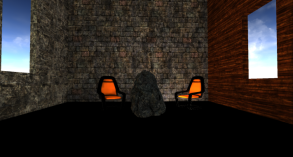](https://interplayoflight.files.wordpress.com/2017/10/image24.png) | [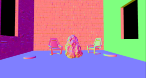](https://interplayoflight.files.wordpress.com/2017/10/image25.png) |
| ------------------------------------------------------------ | ------------------------------------------------------------ |
| **SceneColorDeferred**: Contains Indirect lighting           | **GBufferA**: World space normals, stored as RGB10A2_UNORM. Doesn’t seem to use a particular encoding |
| [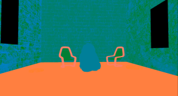](https://interplayoflight.files.wordpress.com/2017/10/image26.png) |  |
| **Distortion**: Various material properties (metalness, roughness, specular intensity and shading model) | **GBufferC**: Albedo in RGB, AO in Alpha                     |
|  |  |
| **GBufferE**: Custom Data based on the shading model (eg subsurface colour, or a tangent vector). | **GBufferD**: Pre baked shadowing factors                    |
|  |                                                              |
| **Stencil** to mark solid props                              |                                                              |

Worth noting is that all solid props in the scene (apart from the  “movable” Rock and the skydome), sample lighting information from 3  mipmapped atlases that appear to cache irradiance, shadows and surface  normals:

**Particle Simulation, revisited** 

Particle simulation was the first thing that happened in the frame,  it was a pass that wrote out world positions and velocities for the  particle sprites. Since it took place so early in the frame, the  renderer did not have access to the depth and normal buffers to perform  collision on the GPU so now that it does, it is time to rerun the  simulation for particles that need it.

[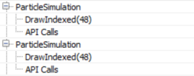](https://interplayoflight.files.wordpress.com/2017/10/image34.png)

 

**Velocity rendering** 

By default Unreal writes out the velocity of moving props to a  separate buffer, an R16G16 one. The velocity will be used for motion  blurring and any effect that require reprojection later (such as  temporal antialiasing). In the current scene only the Rock has been  marked as “movable” so it is the only thing rendered in the velocity  buffer.

**Ambient Occlusion** 

With all material information at hand,  the renderer prepares to enter the lighting phase. Before that, it must  first calculate screen space ambient occlusion.

[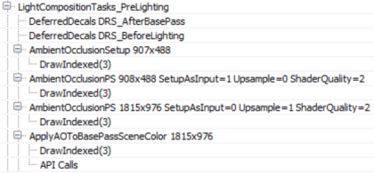](https://interplayoflight.files.wordpress.com/2017/10/image36.png)

We have no deferred decals in the scene, I would assume that the  empty “DeferredDecals” passes about would modify some material  properties in the g-buffer if we did. Screen space ambient occlusion is  calculated in two passes, a quarter resolution one and a full screen  one. The **AmbientOcclusionPS 908×488** pass calculates the AO using the quarter res normal buffer, produced by the **AmbientOcclusionSetup**  pass, the Hi-Z buffer the renderer produced earlier and a texture of  random vectors to sample the depth/normal buffers with. Also, the shader  applies a jitter every frame when sampling the random vector texture to  emulate “supersampling” and improve AO quality over time.

[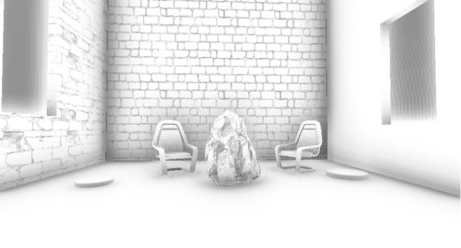](https://interplayoflight.files.wordpress.com/2017/10/image37.png)

 

Then, the **AmbientOcclusionPS 1815×976** pass  calculates the full screen, higher resolution, AO and combines it with  the quarter resolution one. The results are pretty good, without the  need for a blurring pass.

[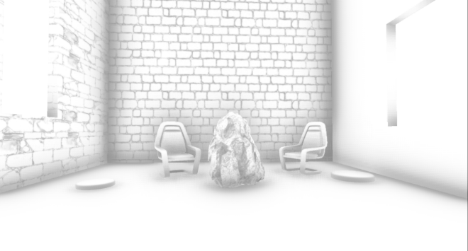](https://interplayoflight.files.wordpress.com/2017/10/image38.png)

 

Finally, the full resolution AO buffer is applied to the  SceneColourDeferred buffer (part of the G-Buffer above) which so far  contains the indirect (ambient) scene lighting.

**Lighting** 

Before we start talking about lighting, it is worth sidetracking a  bit to talk briefly about how Unreal lights translucencies since we will  come across this system a lot soon. Unreal’s approach to lighting  translucent surfaces comprises of injecting light into 2x 64x64x64,  RGBA16_FLOAT volume textures. The two textures store a spherical  harmonics representation of the light (shadowed+attenuated) that reaches  each volume cell (texture TranslucentVolumeX) and an approximate light  direction of each light source (texture TranslucentVolumeDirX). The  renderer maintains 2 sets of such textures one for close to the camera  props, that require higher resolution lighting, and one for more distant  objects where high resolution lighting is not that important. It uses a  similar approach, that is, to a cascaded shadowmap which allocates more  texels closer to the camera than further away.

For example this is the volume textures for close to the camera translucency light with the (shadowed) directional light only.

[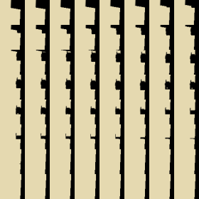](https://interplayoflight.files.wordpress.com/2017/10/image40.png)[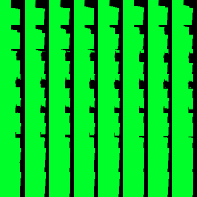](https://interplayoflight.files.wordpress.com/2017/10/image41.png)

These translucency lighting volumes do  not affect solid props, they will be used later to light translucent  props and effects (particles etc). They will be filled in during the  lighting pass though.

Back to direct lighting of solid props,  the renderer can now calculate and apply lighting to the scene.  Depending on the number of light sources, this drawcall list can be  fairly long; I have expanded the most relevant bits.

[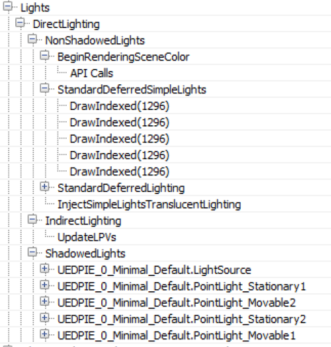](https://interplayoflight.files.wordpress.com/2017/10/image42.png)

The lights are processed in two groups, **NonShadowedLights** and **ShadowedLights**.  NonShadowedLights include simple lights, such as those used with  particle effects, and non shadowed, normal scene lights. A difference  between the two is that normal scene lights use a depth bounds test when  rendering, to avoid lighting pixels outside an approximate light  volume. This is activated through [driver specific extensions](https://github.com/GPUOpen-LibrariesAndSDKs/DepthBoundsTest11).  The lighting is accumulated to the SceneColourDeferred buffer mentioned  earlier. Another difference is that the simple lights do not appear to  write to the translucency lighting volumes at all (although there  appears to be provision for that in the renderer code, so there probably  is a setting somewhere exposed about that).

Interestingly, in case the number of non-shadowcasting (and  non-static) visible lights in the scene is greater than 80, the renderer  switches from classic deferred shading to tiled deferred lighting.

In such a case it uses a compute shader to calculate lighting (for  those lights) passing the light data down to the shader through constant  buffers (Thanks to [wand de](https://twitter.com/w0xd_)  for pointing this out). Additionally, the switch to tiled deferred and  using a compute shader to apply all lights in one pass appears to affect  the direct lighting only. The **InjectNonShadowedTranscluscentLighting** pass still injects all lights to the translucency lighting volumes individually (a separate drawcall each):

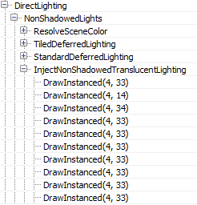

The ShadowedLights pass processes all shadowcasting lights,  stationary and movable. By default, Unreal processes each shadowcasting  light in 3 stages:

[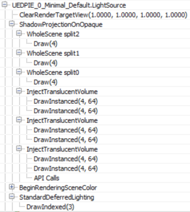](https://interplayoflight.files.wordpress.com/2017/10/image43.png)

 

First, it calculates screen space shadows (**ShadowProjectionOnOpaque**), then it injects the light contribution to the translucency lighting volume (**InjectTranslucentVolume**) and finally calculates the scene lighting (**StandardDeferredLighting**).

In the case of a Directional Light only Split0 contains any shadow  information, as discussed earlier, for this scene. The result of the  shadow calculations are written to a screen-sized RGBA8 buffer.

[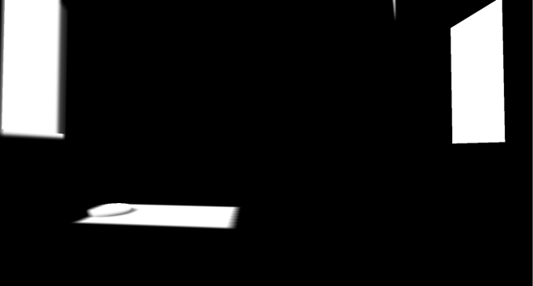](https://interplayoflight.files.wordpress.com/2017/10/image44.png)

The next step (**InjectTranslucentVolume**) writes the  directional light’s contribution to the translucency lighting volume we  described earlier for both cascades (two drawcalls per **InjectTranslucentVolume** pass). Finally, the **StandardDeferredLighting** pass calculates and applies lighting, masked by the screen space shadow buffer, to the SceneColorDeferred buffer.

Local lights seem to follow the same pattern of projecting shadows to  a screen space buffer, injecting light into the translucency lighting  volumes and calculating lighting into the **SceneColorDeferred** buffer.

Both types are handled pretty similarly, a difference between  movable/stationary local lights is that the movable ones inject shadowed  lighting into the translucency lighting volume and, of course, movable  shadowed lights use a cubemap instead of the per object atlas for  shadowing.

All lights use the same screenspace shadow buffer rendertarget,  clearing the relevant parts for each light shadowing, to save some  memory I presume.

At the end of the lighting pass, SceneColorDeferred contains all the direct light accumulation for the scene.

[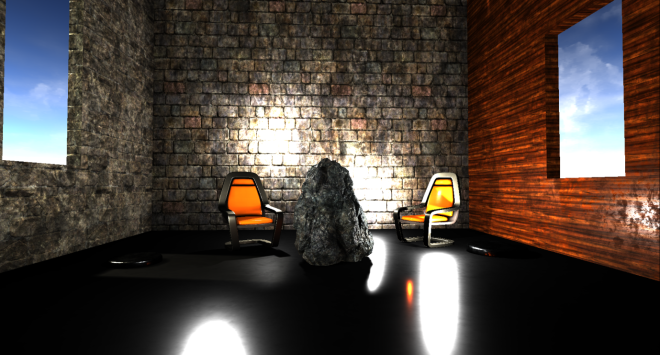](https://interplayoflight.files.wordpress.com/2017/10/image46.png)

It is worth noting that although the renderer has produced a light  binning/clustering data structure earlier (Light Assignment pass), it is  not being used at all during the solid geometry lighting pass,  favouring instead a more traditional deferred shading approach,  rendering each light individually.

As a final step the translucency lighting volumes (for both cascades)  are filtered to suppress aliasing when lighting translucent  props/effects.

In the [final blog post](https://interplayoflight.wordpress.com/2017/10/25/how-unreal-renders-a-frame-part-3/) we are wrapping up the exploration of Unreal’s renderer with image space lighting, transparency rendering and post processing.